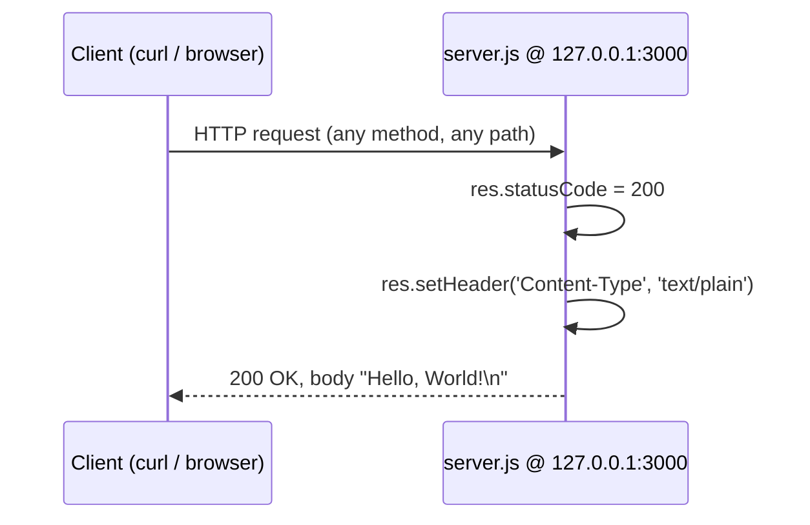

# hello_world

> A minimal, zero-dependency Node.js HTTP server that answers every request with a fixed `Hello, World!` plain-text response.

`hello_world` is a single-file HTTP server built entirely on the Node.js core [`http`](https://nodejs.org/api/http.html) module (`server.js:L17`). It has no third-party dependencies, no request routing, and no runtime configuration — it exists to demonstrate the smallest useful Node.js HTTP server.

## Table of Contents

- [Overview](#overview)
- [Prerequisites](#prerequisites)
- [Installation and Setup](#installation-and-setup)
- [Running the Server](#running-the-server)
- [API Documentation](#api-documentation)
- [Code Walkthrough](#code-walkthrough)
- [Deployment Guide](#deployment-guide)
- [Troubleshooting](#troubleshooting)
- [Project Notes](#project-notes)
- [License](#license)

## Overview

`hello_world` — described in the package manifest as *"Hello world in Node.js"* (`package.json:L2-L4`) — is a minimal Node.js HTTP server built **solely** on the Node.js core `http` module (`server.js:L17`). No web framework (Express, Fastify, Koa, etc.) is involved.

Its behavior is deliberately simple:

- It answers **every** inbound request with an identical response: HTTP status `200` (`server.js:L44`), `Content-Type: text/plain` (`server.js:L45`), and the body `Hello, World!\n` (`server.js:L46`).
- It performs **no routing** — the HTTP method and URL path are ignored, so `GET /`, `POST /anything`, and `DELETE /foo/bar` all return the same result (`server.js:L43-L47`).
- It has **no configuration** — the host and port are hard-coded constants (`server.js:L24`, `server.js:L29`); there are no environment variables and no config files.

The server binds to the loopback address `127.0.0.1` on port `3000` and, once listening, logs `Server running at http://127.0.0.1:3000/` (`server.js:L57-L59`).

## Prerequisites

- **Node.js runtime.** Node.js **22.x LTS** is recommended. The program uses only the core `http` module (`server.js:L17`) and a template literal for its startup log (`server.js:L58`), so any modern Node.js LTS release works equally well — no runtime-specific APIs are required.
- **No third-party dependencies.** The project declares zero dependencies. `package.json` lists no `dependencies` or `devDependencies` (`package.json:L1-L11`), and `package-lock.json` (lockfileVersion `3`) contains no package tree beyond the project root itself (`package-lock.json:L1-L13`).

You can confirm your Node.js version with:

```bash
node --version
```

## Installation and Setup

Because the project has **zero dependencies**, setup is limited to obtaining the source. **`npm install` is not required** — there is nothing to install (`package.json:L1-L11`, `package-lock.json:L1-L13`).

Clone the repository and change into its directory:

```bash
# Clone the repository into a local "hello_world" directory.
# Replace the example URL below with your actual HTTPS remote for this repo
# (use a credential-free URL; never embed usernames, tokens, or passwords).
git clone https://example.com/hello_world.git hello_world

# Enter the project directory. The trailing "hello_world" argument above
# guarantees this is the clone target regardless of the remote name.
cd hello_world
```

That's it — no dependency installation step is needed. Proceed directly to [Running the Server](#running-the-server).

## Running the Server

Start the server directly with Node.js, pointing at the real entry point, `server.js` (see [Project Notes](#project-notes) for why it is not `index.js`):

```bash
node server.js
```

Once the server is listening, it prints the following line exactly (`server.js:L58`):

```text
Server running at http://127.0.0.1:3000/
```

The process then stays in the foreground, serving requests until you stop it with `Ctrl+C`.

### Startup flow

The sequence from launching the process to the confirmation log (`server.js:L17,L43,L57-L59`):


## API Documentation

The server exposes a **single implicit, catch-all endpoint**. There is **no REST routing**: the HTTP method and URL path are ignored, so every request — regardless of method or path — receives the identical response (`server.js:L43-L47`).

### Endpoint contract

| Attribute | Value |
|-----------|-------|
| Method | Any (ignored — no routing) |
| Path | Any (ignored — no routing) |
| Base URL | `http://127.0.0.1:3000/` |
| Status code | `200` |
| Response `Content-Type` | `text/plain` |
| Response body | `Hello, World!\n` |

The response contract is fixed in the request handler: the status code is set to `200` (`server.js:L44`), the `Content-Type` header is set to `text/plain` (`server.js:L45`), and the body is `Hello, World!\n` — including the trailing newline (`server.js:L46`). The base URL is derived from the hard-coded host and port constants (`server.js:L24`, `server.js:L29`).

### Request/response flow



### Smoke test

With the server running (see [Running the Server](#running-the-server)), issue a request in another terminal:

```bash
curl http://127.0.0.1:3000/
```

Expected output (the trailing newline from `Hello, World!\n` places the shell prompt on the next line):

```text
Hello, World!
```

To also inspect the status line and headers, use `curl -i`:

```bash
curl -i http://127.0.0.1:3000/
```

This shows the `HTTP/1.1 200 OK` status (`server.js:L44`) and the `Content-Type: text/plain` header (`server.js:L45`) alongside the `Hello, World!` body (`server.js:L46`).

## Code Walkthrough

The entire runtime lives in `server.js` (`server.js:L1-L59`). The source now also carries JSDoc annotations — a module `@file` overview, `@constant` blocks on the host/port constants, a `@param`-annotated block on the request handler (documenting its `req` and `res` parameters), and a `@callback` block on the startup callback annotated with `@returns {void}` (it takes no parameters) — that describe the same units explained below. The runtime logic itself is unchanged; the JSDoc additions are comments only.

The runtime code is:

```javascript
const http = require('http');

const hostname = '127.0.0.1';
const port = 3000;

const server = http.createServer((req, res) => {
  res.statusCode = 200;
  res.setHeader('Content-Type', 'text/plain');
  res.end('Hello, World!\n');
});

server.listen(port, hostname, () => {
  console.log(`Server running at http://${hostname}:${port}/`);
});
```

Line by line:

- **`require('http')` (`server.js:L17`)** — Loads the Node.js core `http` module. This is the only import in the file and the sole dependency of the whole program.
- **`hostname` and `port` constants (`server.js:L24`, `server.js:L29`)** — `hostname` is the loopback address `'127.0.0.1'` (`server.js:L24`) and `port` is `3000` (`server.js:L29`). Both are hard-coded; there is no environment-variable or config-file override.
- **Request handler (`server.js:L43-L47`)** — The callback passed to `http.createServer((req, res) => { ... })` runs for every request. It performs exactly three statements:
  1. `res.statusCode = 200;` — sets the HTTP status to `200` (`server.js:L44`).
  2. `res.setHeader('Content-Type', 'text/plain');` — declares a plain-text body (`server.js:L45`).
  3. `res.end('Hello, World!\n');` — writes the body `Hello, World!\n` (with the trailing newline) and ends the response (`server.js:L46`).

  The `req` argument is never read: the method, URL, headers, and body of the request are all ignored, which is why there is no routing.
- **Startup callback (`server.js:L57-L59`)** — `server.listen(port, hostname, () => { ... })` binds the server to `127.0.0.1:3000` and, once it is ready to accept connections, invokes the callback whose only side effect is logging `Server running at http://127.0.0.1:3000/` via a template literal (`server.js:L58`).

## Deployment Guide

This server is intended for local development and demonstration. Its runtime characteristics are fixed in code:

- **Loopback binding.** The server binds to the loopback interface `127.0.0.1` (`server.js:L24`, `server.js:L57`). As a result, it is reachable **only from the local machine** and is **unreachable from other hosts** on the network.
- **Fixed port.** It listens on port `3000` (`server.js:L29`). Because both host and port are hard-coded constants, **changing either requires a code edit** — there is no environment variable or CLI flag to override them.
- **No TLS.** Traffic is plain HTTP; the server is built on the core `http` module (`server.js:L17`) and created with `http.createServer` (`server.js:L43`) — there is no `https` module or TLS termination anywhere in the code.
- **No authentication or authorization.** The request handler ignores the inbound request and serves the same response to everyone (`server.js:L43-L47`); there are no access controls.

### Starting, backgrounding, and stopping

Run in the foreground (stop with `Ctrl+C`):

```bash
node server.js
```

Run in the background and **immediately capture the server's PID** so you can stop exactly that process later. When you launch with `&`, `$!` holds the PID of the process just started:

```bash
# Start in the background and capture the exact PID of this server.
node server.js &
server_pid=$!
```

Stop that specific backgrounded instance by its captured PID, then wait for it to fully exit — this targets only the process you started, never an unrelated shell job or workload:

```bash
kill "$server_pid"
wait "$server_pid"
```

### Exposing the server externally (conceptual)

Because the server binds to loopback only (`server.js:L24`, `server.js:L57`), external exposure is not possible without additional steps. Conceptually, there are two approaches:

1. **Front it with a reverse proxy.** Place a reverse proxy such as **nginx** on a public interface and forward traffic to `127.0.0.1:3000`. This is the recommended pattern because the proxy can add TLS, authentication, rate limiting, and logging without changing the application.
2. **Change the bind address.** Binding to `0.0.0.0` (all interfaces) would make the server reachable from other hosts, but because the host is a hard-coded constant (`server.js:L24`), this would require **editing the source** — it is not configurable at runtime.

## Troubleshooting

- **`Error: listen EADDRINUSE: address already in use 127.0.0.1:3000`** — Another process is already bound to port `3000` (`server.js:L29`). The port is hard-coded, so you must free it before starting again. If the conflicting process is a `hello_world` instance you started in the background, stop it using the PID you captured at launch — `kill "$server_pid"` (see [Starting, backgrounding, and stopping](#starting-backgrounding-and-stopping)). If you do not know what is holding the port, **inspect before you kill**: identify the owning process with a port-inspection tool available on your platform (for example `lsof -i:3000`, `ss -ltnp 'sport = :3000'`, or `netstat -tlnp | grep :3000` — install one if none is present), confirm the reported PID belongs to a process you intend to stop, and only then stop that single PID with `kill <pid>`. Never issue a blind, port-wide kill. Once the port is free, start the server again with `node server.js`.
- **`curl` from another machine fails / connection refused** — This is expected. The server binds to the loopback interface `127.0.0.1` (`server.js:L24`, `server.js:L57`), so it only accepts connections originating from the same machine. Requests from other hosts cannot reach it. See the [Deployment Guide](#deployment-guide) for how external exposure would be approached.
- **`Cannot find module '.../index.js'`** — This happens if you try to start the project via its declared `main` entry (`package.json:L5`) rather than the real file. Start it with `node server.js` instead; see [Project Notes](#project-notes).

## Project Notes

- **Entry-point discrepancy (documented, not fixed).** `package.json` declares `"main": "index.js"` (`package.json:L5`), but **no `index.js` file exists** in the project. The real entry point is `server.js`, so always start the server with `node server.js`. This note documents the discrepancy intentionally; the source is left unchanged.
- **Placeholder test script.** The `scripts.test` entry in `package.json` is the default placeholder (`echo "Error: no test specified" && exit 1`) (`package.json:L7`). There is no test suite, and this placeholder is left unchanged.

## License

This project is licensed under the **MIT License** (`package.json:L10`).

Author: `hxu` (`package.json:L9`).
