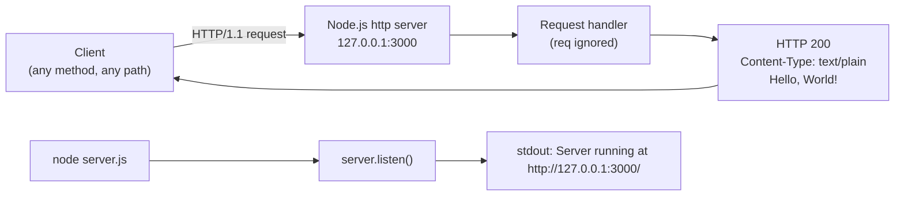

# hello_world

> Hello world in Node.js (Source: package.json:L4)

A minimal, **zero-dependency** HTTP server built entirely on the Node.js
built-in `http` module. It answers **every** request — any HTTP method, on any
path — with the identical plain-text greeting `Hello, World!`. There is no
routing, no framework, and no third-party code.
(Source: server.js; package.json)

## Table of Contents

- [Overview](#overview)
- [Architecture](#architecture)
- [Prerequisites](#prerequisites)
- [Installation and Setup](#installation-and-setup)
- [Running the Server](#running-the-server)
- [API Documentation](#api-documentation)
- [Configuration](#configuration)
- [Inline Code Explanation](#inline-code-explanation)
- [Deployment Guide](#deployment-guide)
- [Troubleshooting](#troubleshooting)
- [Project Structure](#project-structure)
- [Limitations](#limitations)
- [License](#license)

## Overview

`hello_world` is a single-module Node.js HTTP server whose only job is to
return `Hello, World!` to any client that connects. It uses nothing beyond the
Node.js standard library: the sole `require` is the built-in `http` module
(Source: server.js:L22). The project declares **zero** `dependencies` and
**zero** `devDependencies`, and has no build step (Source: package.json).

Because the request handler never inspects the incoming request, the server
behaves as a catch-all: the same `HTTP 200` `text/plain` response is returned
for `GET`, `POST`, `PUT`, `DELETE`, `PATCH`, and every other method, on every
path (Source: server.js:L52-L56).

> **Project identity.** The authoritative project name is **`hello_world`**, as
> declared in `package.json` (Source: package.json:L2). Two other names appear
> in the checkout and should be treated as stale: the previous `README.md`
> placeholder read `600K_ChildRepo`, and an existing technical specification
> referred to `hao-backprop-test`. Wherever those names conflict with
> `hello_world`, `hello_world` wins.

## Architecture

The server follows Node.js's single-threaded, event-driven **reactor** model.
A single call to `http.createServer(...)` registers one request handler, and
`server.listen(...)` binds a listening socket on the loopback interface and
hands control to the event loop. Each inbound connection surfaces as a
`request` event; the event loop invokes the handler, which writes a fixed
response and returns. There is exactly **one** response path — the handler does
not branch on method, path, headers, or body (Source: server.js:L52-L56).

At startup the `listen` callback prints a single readiness line to `stdout`
(Source: server.js:L67-L69). No other logging occurs.



## Prerequisites

- **Node.js** — a current [LTS release](https://nodejs.org/en/about/previous-releases)
  is recommended. `package.json` does **not** pin a version (there is no
  `engines` field), so any modern Node.js will run this server
  (Source: package.json). The reference environment for this documentation was
  Node.js **v22.23.1**.
- **npm** — ships with Node.js; used only for the (optional) `npm` script
  aliases described below.
- **Git** — optional, needed only if you clone the repository rather than
  copying the files.

## Installation and Setup

Obtain the source (for example, by cloning the repository):

```bash
git clone <repository-url>
cd <repository-directory>
```

Installing dependencies is effectively a **no-op** — `package.json` declares no
`dependencies` or `devDependencies`, so there is nothing to download
(Source: package.json). You may still run it for completeness:

```bash
npm install
```

There is **no build/compile/transpile step**; `server.js` runs as-is.

## Running the Server

Start the server directly with Node.js:

```bash
node server.js
```

On success it prints exactly the following line to `stdout` and then keeps
running in the foreground (Source: server.js:L67-L69):

```text
Server running at http://127.0.0.1:3000/
```

Stop the server with `Ctrl+C`.

> **Entry point note.** Use `node server.js`. The `main` field in `package.json`
> points at `index.js` (Source: package.json:L5), but **no `index.js` exists**
> in the repository — that entry is stale/dangling. `server.js` is the real and
> only entry point.

### npm scripts

- **`npm test`** — a placeholder that prints `Error: no test specified` and
  exits with code `1`; there is no real test suite (Source: package.json:L7).
- **`npm start`** — `package.json` defines **no explicit `start` script**
  (Source: package.json:L6-L8). However, running `npm start` still launches the
  server, because npm falls back to its built-in default of `node server.js`
  whenever a `server.js` file exists at the package root. Both `node server.js`
  and `npm start` therefore produce the same `Server running at
  http://127.0.0.1:3000/` line (verified at runtime).

## API Documentation

The server exposes a single, implicit **catch-all** endpoint at
`http://127.0.0.1:3000`. Because the handler ignores the request entirely, the
method and path are irrelevant — every request receives the same response
(Source: server.js:L52-L56).

| Method | Path | Status | Content-Type | Body |
| --- | --- | --- | --- | --- |
| Any (`GET`, `POST`, `PUT`, `DELETE`, `PATCH`, …) | Any (`/`, `/anything`, `/a/b/c?q=1`, …) | `200 OK` | `text/plain` | `Hello, World!\n` |

Response body citation: `res.statusCode = 200` (Source: server.js:L53),
`Content-Type: text/plain` (Source: server.js:L54), body `Hello, World!\n`
(Source: server.js:L55).

### Response headers

Only `Content-Type` is set by the application; the remaining headers are
appended automatically by Node's `http` layer.

| Header | Example value | Origin |
| --- | --- | --- |
| `Content-Type` | `text/plain` | Set by the application (Source: server.js:L54) |
| `Content-Length` | `14` | Computed by Node from the 14-byte body `Hello, World!\n` |
| `Date` | `Wed, 22 Jul 2026 10:08:19 GMT` | Appended by Node (value varies per request) |
| `Connection` | `keep-alive` | Appended by Node |
| `Keep-Alive` | `timeout=5` | Appended by Node |

### Example: `GET /`

```bash
curl -i http://127.0.0.1:3000/
```

Expected response:

```text
HTTP/1.1 200 OK
Content-Type: text/plain
Date: Wed, 22 Jul 2026 10:08:19 GMT
Connection: keep-alive
Keep-Alive: timeout=5
Content-Length: 14

Hello, World!
```

### Example: any other method / path

The catch-all behavior means a `POST` to an arbitrary path returns the very
same response (Source: server.js:L52-L56):

```bash
curl -i -X POST http://127.0.0.1:3000/anything
```

```text
HTTP/1.1 200 OK
Content-Type: text/plain
Date: Wed, 22 Jul 2026 10:08:19 GMT
Connection: keep-alive
Keep-Alive: timeout=5
Content-Length: 14

Hello, World!
```

### Protocol notes

- A `HEAD` request (`curl -I http://127.0.0.1:3000/`) returns the same `200`
  status line and headers, but Node suppresses the response body per the HTTP
  specification — this is Node's transport-layer behavior, not application logic
  (Source: server.js:L52-L56).
- A `CONNECT` request is never delivered to this handler because no `'connect'`
  listener is registered on the server (Source: server.js:L52-L56).

## Configuration

There are no environment variables and no command-line flags. The two settings
below are **hard-coded compile-time constants**; changing either one requires
editing `server.js` directly and restarting the process.

| Setting | Value | Meaning | Source |
| --- | --- | --- | --- |
| `hostname` | `127.0.0.1` | Network interface the server binds to (loopback only) | server.js:L29 |
| `port` | `3000` | TCP port the server listens on | server.js:L35 |

## Inline Code Explanation

> Line references below correspond to the current, JSDoc-annotated `server.js`.
> The executable statements are unchanged; only documentation comments were
> added, which shifts the line numbers of the code relative to a bare 15-line
> version.

1. **Load the HTTP module** — `const http = require('http');` imports Node's
   built-in `http` module. No third-party packages are involved
   (Source: server.js:L22).
2. **Bind address** — `const hostname = '127.0.0.1';` pins the server to the
   loopback interface, so it is reachable only from the local host
   (Source: server.js:L29).
3. **Port** — `const port = 3000;` sets the TCP port the server listens on
   (Source: server.js:L35).
4. **Create the server and define the request handler** —
   `http.createServer((req, res) => { … })` registers the one handler for every
   request. It sets the status code to `200` (Source: server.js:L53), sets the
   `Content-Type: text/plain` header (Source: server.js:L54), and ends the
   response with the body `Hello, World!\n` (Source: server.js:L55). The `req`
   argument is never read, which is why the server is a catch-all
   (Source: server.js:L52-L56).
5. **Start listening** — `server.listen(port, hostname, () => { … })` binds the
   socket and begins accepting connections; its callback logs
   `Server running at http://127.0.0.1:3000/`. No `'error'` listener is
   registered on the server (Source: server.js:L67-L69).

## Deployment Guide

This section is **documentation only** — it describes patterns for running the
server; it does not add any infrastructure, CI, or container files to the
repository.

**Run the process.** In its simplest form deployment is just `node server.js`
on the target host.

**Loopback-only binding.** The server binds to `127.0.0.1`
(Source: server.js:L29), so it is reachable **only from the same host**. It is
not accessible from other machines as-is. To expose it you must either edit the
`hostname` constant in `server.js` (for example to `0.0.0.0`) and restart, or
place a reverse proxy on the same host (see below).

**Port availability.** Ensure TCP port `3000` (Source: server.js:L35) is free
on the host before starting; see [Troubleshooting](#troubleshooting) for the
`EADDRINUSE` case.

**Process manager (example — pm2).** Keep the process alive and restart it on
crash or reboot:

```bash
pm2 start server.js --name hello_world
pm2 save
```

**Process manager (example — systemd).** A minimal unit file:

```ini
[Unit]
Description=hello_world Node.js server
After=network.target

[Service]
ExecStart=/usr/bin/node /opt/hello_world/server.js
Restart=on-failure

[Install]
WantedBy=multi-user.target
```

**Reverse proxy (example — nginx).** Front the loopback server to serve public
traffic on port 80/443 and terminate TLS at the proxy:

```nginx
server {
  listen 80;
  server_name example.com;

  location / {
    proxy_pass http://127.0.0.1:3000;
    proxy_set_header Host $host;
  }
}
```

**Deployment limitations.** The application itself provides no clustering /
multi-process scaling, no graceful shutdown, and no HTTPS/TLS
(Source: server.js). Those concerns must be handled externally (for example, a
process manager for restarts and an nginx reverse proxy for TLS).

## Troubleshooting

**`EADDRINUSE` — port already in use.** Because no `'error'` listener is
registered on the server (Source: server.js:L67-L69), a bind failure is fatal:
the process throws an unhandled `'error'` event and exits with code `1`. The
observed output is:

```text
Error: listen EADDRINUSE: address already in use 127.0.0.1:3000
    at Server.setupListenHandle [as _listen2] (node:net:...)
  code: 'EADDRINUSE'
```

Remedy: free port `3000` (stop whatever process is holding it), or change the
`port` constant in `server.js` and restart (Source: server.js:L35).

**Remote "connection refused".** Connections from other machines are refused
because the server binds to the loopback interface `127.0.0.1`
(Source: server.js:L29). Remedy: access it from the same host, front it with a
reverse proxy (see [Deployment Guide](#deployment-guide)), or change the
`hostname` constant in `server.js` and restart.

## Project Structure

This project consists of just three files:

```text
.
├── server.js      # The HTTP server — the runtime entry point (Source: server.js)
├── package.json   # Project metadata: name, version, license (Source: package.json)
└── README.md      # This documentation
```

The checkout may contain many additional, unrelated files (it is a large
synthetic repository), but the `hello_world` server comprises only the three
files listed above.

## Limitations

The server is intentionally minimal. It does **not** provide:

- **Routing** — every path is handled identically (Source: server.js:L52-L56).
- **Request parsing / body handling** — `req` is never read
  (Source: server.js:L52-L56).
- **Persistence** — no database or file storage.
- **Authentication / authorization** — all requests are treated the same.
- **TLS / HTTPS** — plain HTTP only.
- **Logging** — nothing beyond the single startup line
  (Source: server.js:L67-L69).
- **Graceful shutdown or clustering.**

## License

Released under the **MIT** license. Author: **`hxu`**
(Source: package.json:L9-L10).
