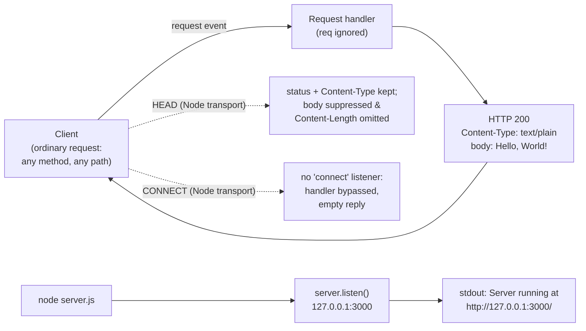

# hello_world

> Hello world in Node.js (Source: package.json:L4)

A minimal, **zero-dependency** HTTP server built entirely on the Node.js
built-in `http` module. It answers every **ordinary** HTTP request — any
method, on any path — with the identical plain-text greeting `Hello, World!`.
There is no routing, no framework, and no third-party code. Two methods receive
protocol-level handling from Node rather than from the handler (`HEAD` and
`CONNECT`); see [API Documentation](#api-documentation).
(Source: server.js:L17-L66; package.json:L1-L11)

> **How to read the citations in this document.** Facts about the repository
> cite an exact locator, e.g. `Source: server.js:L49` or `Source: package.json:L4`
> (line numbers refer to the current, JSDoc-annotated `server.js`). Values that
> depend on the runtime — such as Node-generated response headers, `HEAD`/`CONNECT`
> handling, and the exact `EADDRINUSE` output — are labeled as **runtime
> observations** made on **Node.js v22.23.1**, the environment observed by the
> AAP on **July 20, 2026**; they may vary by Node.js version and request.
> Node's documented protocol behavior links to the
> [Node.js `http` documentation](https://nodejs.org/api/http.html).

## Table of Contents

- [Overview](#overview)
- [Architecture](#architecture)
- [Prerequisites](#prerequisites)
- [Installation and Setup](#installation-and-setup)
- [Running the Server](#running-the-server)
- [API Documentation](#api-documentation)
- [Configuration](#configuration)
- [Inline Code Explanation](#inline-code-explanation)
- [Deployment Guide](#deployment-guide)
- [Troubleshooting](#troubleshooting)
- [Project Structure](#project-structure)
- [Limitations](#limitations)
- [License](#license)

## Overview

`hello_world` is a single-module Node.js HTTP server whose only job is to
return `Hello, World!` to any client that connects. It uses nothing beyond the
Node.js standard library: the sole `require` is the built-in `http` module
(Source: server.js:L17). The project declares **zero** `dependencies` and
**zero** `devDependencies`, and has no build step (Source: package.json:L1-L11).

Because the request handler never inspects the incoming request, it returns the
same `HTTP 200` `text/plain` response to every **ordinary** request it
receives — regardless of method (`GET`, `POST`, `PUT`, `DELETE`, `PATCH`, …) or
path (Source: server.js:L49-L53). Two methods are handled specially by Node's
transport layer rather than by the handler — `HEAD` (response body suppressed)
and `CONNECT` (handler bypassed); both are documented under
[API Documentation](#api-documentation).

> **Project identity.** The authoritative project name is **`hello_world`**, as
> declared in `package.json` (Source: package.json:L2). Two other names appear
> in the checkout and should be treated as stale: the previous `README.md`
> placeholder read `600K_ChildRepo`, and an existing technical specification
> referred to `hao-backprop-test`. Wherever those names conflict with
> `hello_world`, `hello_world` wins.

## Architecture

The server follows Node.js's single-threaded, **event-driven** concurrency
model: network I/O is serviced asynchronously by the event loop rather than by
one thread per connection (see the
[Node.js `http` documentation](https://nodejs.org/api/http.html)). A single
call to `http.createServer(...)` registers exactly one request handler
(Source: server.js:L49-L53), and `server.listen(...)` binds a listening socket
on the loopback interface and begins accepting connections
(Source: server.js:L64-L66).

Each **ordinary** inbound HTTP request is delivered to that handler through
Node's `request` event; because the handler does not branch on method, path,
headers, or body, there is exactly **one** application response path
(Source: server.js:L49-L53). A single keep-alive TCP connection may carry
multiple such requests. The `HEAD` and `CONNECT` methods are handled by Node's
transport layer as described under [API Documentation](#api-documentation). At
startup the `listen` callback prints a single readiness line to `stdout`
(Source: server.js:L64-L66); no other logging occurs.

<!-- markdownlint-disable MD013 -->



<!-- markdownlint-enable MD013 -->

## Prerequisites

- **Node.js** — the project does **not** pin a version: `package.json` contains
  no `engines` field (Source: package.json:L1-L11). Use a currently supported
  [Node.js LTS release](https://nodejs.org/en/about/previous-releases). This
  documentation's runnable examples were produced on **Node.js v22.23.1**, the
  environment observed by the AAP on **July 20, 2026**; that specific version
  records the observed environment and is **not** a compatibility guarantee.
- **npm** — ships with Node.js; used only for the `npm` script alias described
  below.
- **Git** — optional, needed only if you clone the repository rather than
  copying the files.

## Installation and Setup

Obtain the source by cloning the repository. Replace the example URL below with
the repository's actual clone URL (do not embed credentials in the URL):

```bash
# Set REPO_URL to your repository's clone URL, then clone and enter it.
REPO_URL="https://example.com/your-org/hello_world.git"
git clone "$REPO_URL"
cd "$(basename "$REPO_URL" .git)"
```

Installing dependencies is effectively a **no-op** — `package.json` declares no
`dependencies` or `devDependencies`, so there is nothing to download
(Source: package.json:L1-L11). You may still run it for completeness:

```bash
npm install
```

There is **no build/compile/transpile step**; `server.js` runs as-is.

## Running the Server

Start the server directly with Node.js:

```bash
node server.js
```

On success it prints exactly the following line to `stdout` and then keeps
running in the foreground (Source: server.js:L64-L66):

```text
Server running at http://127.0.0.1:3000/
```

Stop the server with `Ctrl+C`.

> **Entry point note.** Use `node server.js`. The `main` field in `package.json`
> points at `index.js` (Source: package.json:L5), but **no `index.js` exists**
> in the repository — that entry is stale/dangling. `server.js` is the real and
> only entry point.

### npm scripts

- **`npm test`** — a placeholder script that prints `Error: no test specified`
  and exits with code `1`; there is no real test suite (Source: package.json:L7).
- **Start command** — `package.json` defines **no explicit `start` script**;
  its `scripts` block contains only `test` (Source: package.json:L6-L8). Start
  the server with the supported command **`node server.js`** (see
  [Running the Server](#running-the-server)).

## API Documentation

The server exposes a single, implicit **catch-all** endpoint at
`http://127.0.0.1:3000`. Because the handler never inspects the request, every
**ordinary** request receives the same response regardless of method or path
(Source: server.js:L49-L53). The `HEAD` and `CONNECT` methods are subject to
protocol-level handling by Node and are covered in
[Protocol notes](#protocol-notes) below.

<!-- markdownlint-disable MD013 -->

| Method | Path | Status | Content-Type | Body |
| --- | --- | --- | --- | --- |
| Any ordinary method (`GET`, `POST`, `PUT`, `DELETE`, `PATCH`, …) | Any (`/`, `/anything`, `/a/b/c?q=1`, …) | `200 OK` | `text/plain` | `Hello, World!\n` |

<!-- markdownlint-enable MD013 -->

The stable, application-defined contract is: status `200`
(Source: server.js:L50), `Content-Type: text/plain` (Source: server.js:L51),
and body `Hello, World!\n` (Source: server.js:L52). `HEAD` and `CONNECT` differ
as described in [Protocol notes](#protocol-notes).

### Response headers

Only `Content-Type` is set by the application (Source: server.js:L51). The
remaining headers are generated automatically by Node's `http` layer; their
presence and exact values depend on the Node.js version, the request method,
and connection state. The values in the table below are **illustrative runtime
observations** (Node.js v22.23.1, July 20, 2026), not part of the guaranteed
contract.

<!-- markdownlint-disable MD013 -->

| Header | Example value | Origin |
| --- | --- | --- |
| `Content-Type` | `text/plain` | Set by the application (Source: server.js:L51) |
| `Content-Length` | `14` | Generated by Node for responses that carry a body (the body is 14 bytes); **omitted for `HEAD`** — runtime observation |
| `Date` | `Mon, 20 Jul 2026 10:08:19 GMT` | Generated by Node; value varies per request — runtime observation |
| `Connection` | `keep-alive` | Generated by Node; depends on connection handling — runtime observation |
| `Keep-Alive` | `timeout=5` | Generated by Node; depends on connection handling — runtime observation |

<!-- markdownlint-enable MD013 -->

### Example: `GET /`

```bash
curl -i http://127.0.0.1:3000/
```

Expected response. The status line, `Content-Type`, and body are the stable,
application-defined contract (Source: server.js:L50-L52); the `Date`,
`Connection`, `Keep-Alive`, and `Content-Length` lines are Node-generated and
are **illustrative and environment-dependent** (observed on Node.js v22.23.1,
July 20, 2026):

```text
HTTP/1.1 200 OK
Content-Type: text/plain
Date: Mon, 20 Jul 2026 10:08:19 GMT
Connection: keep-alive
Keep-Alive: timeout=5
Content-Length: 14

Hello, World!
```

### Example: any other method / path

The catch-all behavior means a `POST` to an arbitrary path returns the very
same application response (Source: server.js:L49-L53). The Node-generated
headers below are illustrative and environment-dependent, as above:

```bash
curl -i -X POST http://127.0.0.1:3000/anything
```

```text
HTTP/1.1 200 OK
Content-Type: text/plain
Date: Mon, 20 Jul 2026 10:08:19 GMT
Connection: keep-alive
Keep-Alive: timeout=5
Content-Length: 14

Hello, World!
```

### Example: `HEAD /`

A `HEAD` request returns the same status line and `Content-Type` but **no
response body**, and Node **omits the `Content-Length` header** (runtime
observation, Node.js v22.23.1, July 20, 2026):

```bash
curl -i -I http://127.0.0.1:3000/
```

```text
HTTP/1.1 200 OK
Content-Type: text/plain
Date: Mon, 20 Jul 2026 10:08:19 GMT
Connection: keep-alive
Keep-Alive: timeout=5

```

### Protocol notes

- **`HEAD`** — Node preserves the application-set status (`200`) and the
  `Content-Type` header, but **suppresses the response body** and **omits the
  body-framing `Content-Length` header**, per the HTTP specification. This is
  Node's transport-layer behavior, not application logic; the handler itself is
  unchanged (Source: server.js:L49-L53). Behavior confirmed as a runtime
  observation (Node.js v22.23.1, July 20, 2026); see the
  [Node.js `http` documentation](https://nodejs.org/api/http.html).
- **`CONNECT`** — is never delivered to this handler because no `'connect'`
  listener is registered on the server (Source: server.js:L17-L66); the client
  receives an empty (zero-byte) reply (runtime observation, Node.js v22.23.1,
  July 20, 2026).

## Configuration

There are no environment variables and no command-line flags. The two settings
below are **hard-coded compile-time constants**; changing either one requires
editing `server.js` directly and restarting the process.

<!-- markdownlint-disable MD013 -->

| Setting | Value | Meaning | Source |
| --- | --- | --- | --- |
| `hostname` | `127.0.0.1` | Network interface the server binds to (loopback only) | Source: server.js:L23 |
| `port` | `3000` | TCP port the server listens on | Source: server.js:L28 |

<!-- markdownlint-enable MD013 -->

## Inline Code Explanation

> Line references below correspond to the current, JSDoc-annotated `server.js`.
> The executable statements are unchanged from the original; only documentation
> comments were added, which shifts the line numbers of the code relative to a
> bare, uncommented version.

1. **Load the HTTP module** — `const http = require('http');` imports Node's
   built-in `http` module. No third-party packages are involved
   (Source: server.js:L17).
2. **Bind address** — `const hostname = '127.0.0.1';` pins the server to the
   loopback interface, so it is reachable only from the local host
   (Source: server.js:L23).
3. **Port** — `const port = 3000;` sets the TCP port the server listens on
   (Source: server.js:L28).
4. **Create the server and define the request handler** —
   `http.createServer((req, res) => { … })` registers the one handler for every
   ordinary request. It sets the status code to `200` (Source: server.js:L50),
   sets the `Content-Type: text/plain` header (Source: server.js:L51), and ends
   the response with the body `Hello, World!\n` (Source: server.js:L52). The
   `req` argument is never read, which is why the server is a catch-all for
   ordinary requests (Source: server.js:L49-L53).
5. **Start listening** — `server.listen(port, hostname, () => { … })` binds the
   socket and begins accepting connections; its callback logs
   `Server running at http://127.0.0.1:3000/` (Source: server.js:L64-L66).
   No `'error'` listener is registered anywhere in the module, so a bind
   failure is unhandled (Source: server.js:L17-L66).

## Deployment Guide

This section is **documentation only** — it describes patterns for running the
server; it does not add any infrastructure, CI, or container files to the
repository.

> **External tools & host-specific values.** The process-manager and
> reverse-proxy examples below use **pm2**, **systemd**, and **nginx** —
> third-party tools that are **not part of this project** and are **not
> installed by it**. Each must be installed and configured separately. All
> paths, user and group names, domain names, and ports shown are **host-specific
> example values** that you must adapt to your environment.

**Run the process.** In its simplest form deployment is just `node server.js`
on the target host.

**Loopback-only binding.** The server binds to `127.0.0.1`
(Source: server.js:L23), so it is reachable **only from the same host**. It is
not accessible from other machines as-is.

> ⚠️ **Security warning — do not expose this server directly to a public
> network.** This application provides **no authentication, authorization, TLS,
> input validation, rate limiting, or other production hardening** (see
> [Limitations](#limitations)). Do **not** simply change `hostname` to
> `0.0.0.0` on a public or untrusted network. To expose it, bind only to a
> private/loopback or firewalled internal interface, and place a **hardened
> reverse proxy that terminates TLS and enforces access controls** in front of
> it before any public exposure.

Within a trusted, private, or firewalled network you may either edit the
`hostname` constant in `server.js` (for example to a specific private interface
address) and restart, or — preferably — keep the loopback binding and front it
with a reverse proxy on the same host (see below).

**Port availability.** Ensure TCP port `3000` (Source: server.js:L28) is free
on the host before starting; see [Troubleshooting](#troubleshooting) for the
`EADDRINUSE` case. Port `3000` is a non-privileged port (> 1024), so it can be
bound by an unprivileged user — no root is required.

**Process manager (example — pm2).** pm2 is an external tool you install
separately (e.g. `npm install -g pm2`). Keep the process alive and restart it
on crash or reboot (the app name is a host-specific example):

```bash
pm2 start server.js --name hello_world
pm2 save
```

**Process manager (example — systemd).** A minimal unit file. Run the service
as a **dedicated, unprivileged account** (not root) and adjust the example
paths to your host:

```ini
[Unit]
Description=hello_world Node.js server
After=network.target

[Service]
# Create a dedicated, unprivileged account first, for example:
#   sudo useradd --system --no-create-home --shell /usr/sbin/nologin hello_world
# Run the service as that account (never as root); port 3000 is non-privileged.
User=hello_world
Group=hello_world
# Host-specific example paths — adjust the node binary and app paths to match
# your host (e.g. output of `command -v node`).
ExecStart=/usr/bin/node /opt/hello_world/server.js
Restart=on-failure

[Install]
WantedBy=multi-user.target
```

**Reverse proxy (example — nginx, HTTP only).** The snippet below proxies
**plaintext HTTP on port 80** to the loopback server. It does **not** configure
TLS; `example.com` and the paths are host-specific examples:

```nginx
# HTTP only — no TLS is configured here.
server {
  listen 80;
  server_name example.com;

  location / {
    proxy_pass http://127.0.0.1:3000;
    proxy_set_header Host $host;
  }
}
```

To serve **encrypted** public traffic you must add a separate TLS listener on
port 443 using a certificate you obtain and manage externally (for example via
Let's Encrypt / certbot). The following illustrative block enables TLS —
**certificate paths, keys, and domain are host-specific and must be provisioned
separately**:

```nginx
# HTTPS/TLS — certificate paths and domain are host-specific examples that you
# must provide; nginx does not generate certificates for you.
server {
  listen 443 ssl;
  server_name example.com;

  ssl_certificate     /etc/ssl/certs/example.com.crt;      # provide your own
  ssl_certificate_key /etc/ssl/private/example.com.key;    # provide your own

  location / {
    proxy_pass http://127.0.0.1:3000;
    proxy_set_header Host $host;
    proxy_set_header X-Forwarded-Proto https;
  }
}
```

Encryption is provided by terminating TLS at the proxy — **not** by this
application, which has no TLS of its own (Source: server.js:L17-L66).
Provisioning the certificate and configuring access controls are your
responsibility.

**Deployment limitations.** The application itself provides no clustering /
multi-process scaling, no graceful shutdown, and no HTTPS/TLS
(Source: server.js:L17-L66). Those concerns must be handled externally
(for example, a process manager for restarts and an nginx reverse proxy for
TLS).

## Troubleshooting

**`EADDRINUSE` — port already in use.** Because no `'error'` listener is
registered on the server (Source: server.js:L17-L66), a bind failure is fatal:
Node emits an unhandled `'error'` event and the process exits with code `1`. A
representative runtime observation (Node.js v22.23.1, July 20, 2026) is:

```text
Error: listen EADDRINUSE: address already in use 127.0.0.1:3000
    at Server.setupListenHandle [as _listen2] (node:net:...)
  code: 'EADDRINUSE'
```

Remedy: free port `3000` (stop whatever process is holding it), or change the
`port` constant in `server.js` and restart (Source: server.js:L28).

**Remote "connection refused".** Connections from other machines are refused
because the server binds to the loopback interface `127.0.0.1`
(Source: server.js:L23). Remedy: access it from the same host, front it with a
reverse proxy (see [Deployment Guide](#deployment-guide)), or change the
`hostname` constant in `server.js` and restart.

## Project Structure

This project consists of just three files:

```text
.
├── server.js      # Runtime entry point (Source: server.js:L17-L66)
├── package.json   # Project metadata (Source: package.json:L2-L10)
└── README.md      # This documentation
```

The checkout may contain many additional, unrelated files (it is a large
synthetic repository), but the `hello_world` server comprises only the three
files listed above.

## Limitations

The server is intentionally minimal. It does **not** provide:

- **Routing** — every path is handled identically (Source: server.js:L49-L53).
- **Request parsing / body handling** — `req` is never read
  (Source: server.js:L49-L53).
- **Persistence** — no database or file storage (Source: server.js:L17-L66).
- **Authentication / authorization** — all requests are treated the same
  (Source: server.js:L49-L53).
- **TLS / HTTPS** — plain HTTP only (Source: server.js:L17-L66).
- **Logging** — nothing beyond the single startup line
  (Source: server.js:L17-L66).
- **Graceful shutdown or clustering** — not implemented
  (Source: server.js:L17-L66).

These are intentional design choices for a minimal example, not defects. Any
public or production deployment must supply these controls externally (see the
[Deployment Guide](#deployment-guide)).

## License

Released under the **MIT** license. Author: **`hxu`**
(Source: package.json:L9-L10).
