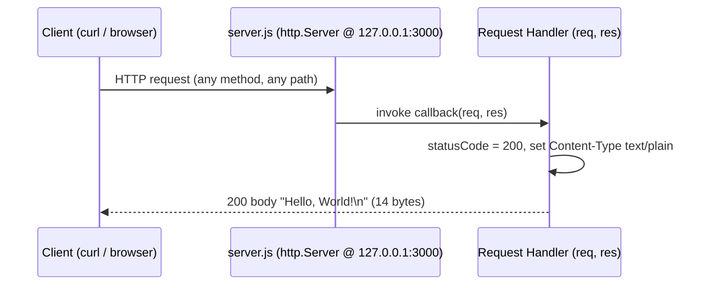
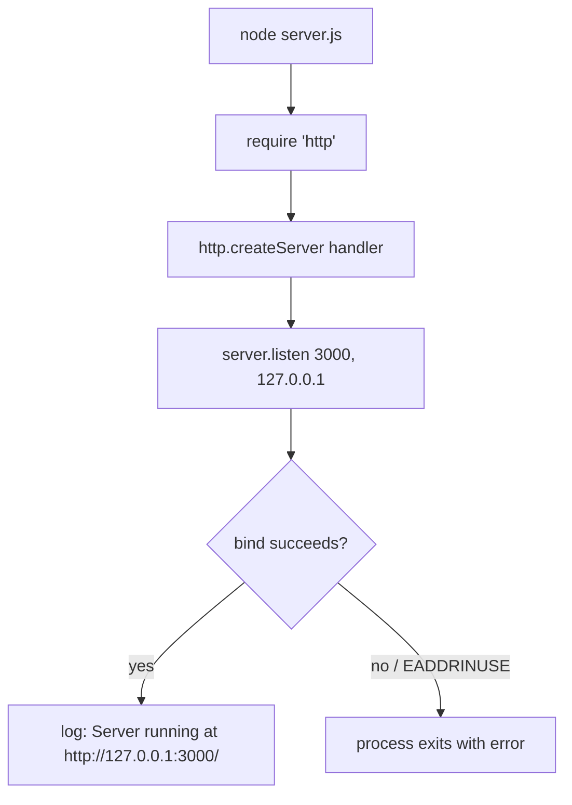

# hello_world

A minimal, dependency-free Node.js HTTP server that answers every request with a plain-text `Hello, World!`. `Source: server.js:1-14`, `Source: package.json:1-3`

> **Citations.** Every technical claim below is annotated with an inline `Source: <file>:<lines>` reference pointing to the exact code it describes, so the documentation stays traceable to (and verifiable against) the source.

## Table of contents

- [Overview](#overview)
- [Prerequisites](#prerequisites)
- [Installation](#installation)
- [Usage](#usage)
- [API documentation](#api-documentation)
- [Configuration](#configuration)
- [Deployment guide](#deployment-guide)
- [Inline code explanation](#inline-code-explanation)
- [Project structure](#project-structure)
- [Troubleshooting](#troubleshooting)
- [License](#license)

## Overview

This project is a self-starting HTTP server built entirely on the Node.js core `http` module — there are no web frameworks and no external npm packages. `Source: server.js:1-14`

- **Single fixed response.** Every inbound request receives the same reply: HTTP status `200`, `Content-Type: text/plain`, and the body `Hello, World!\n`. The request is never inspected, so the HTTP method and URL path are ignored. `Source: server.js:6-10`
- **Self-starting.** Running the file immediately binds the socket and begins listening; there is no separate build or bootstrap step. `Source: server.js:12-14`
- **Loopback by default.** The server binds the loopback interface `127.0.0.1` on port `3000`, so out of the box it is reachable only from the local machine. `Source: server.js:3-4`

## Prerequisites

- **Node.js 18+ LTS** (verified on v22.23.1). The server relies only on the built-in `http` module, which ships with every supported Node.js release. `Source: server.js:1`
- **npm** (verified 11.18.0). Used to run `npm install`, although this project declares no dependencies for it to fetch. `Source: package.json:1-11`

## Installation

Clone the repository and run the install step. Because the project declares **zero external dependencies**, `npm install` fetches nothing — it simply validates the manifest and lockfile. `Source: package.json:1-11`, `Source: package-lock.json:1-13`

```bash
git clone <repository-url>
cd <repository-directory>
npm install
```

## Usage

Start the server with Node.js. On a successful bind it prints its listening URL to stdout. `Source: server.js:12-14`

```bash
node server.js
# → Server running at http://127.0.0.1:3000/
```

Leave the process running to keep serving requests; press `Ctrl+C` to stop it.

## API documentation

The server exposes a **single implicit endpoint**. There is no routing table and no request parsing: the request handler responds identically to every request regardless of HTTP method or URL path. `Source: server.js:6-10`

| Property | Value |
|----------|-------|
| Methods | Any (GET, POST, …) |
| Path | Any (`/`, `/anything`, …) |
| Status | `200 OK` `Source: server.js:7` |
| Content-Type | `text/plain` `Source: server.js:8` |
| Body | `Hello, World!\n` (14 bytes) `Source: server.js:9` |

### Worked example

Send any request to the running server and inspect the full response with `curl -i`:

```bash
curl -i http://127.0.0.1:3000/
```

```text
HTTP/1.1 200 OK
Content-Type: text/plain
Content-Length: 14

Hello, World!
```

### Request/response sequence



## Configuration

The server has two configuration constants. There is **no environment-variable override** — changing either value requires editing `server.js` directly and restarting the process. `Source: server.js:3-4`

| Constant | Value | Meaning | How to change |
|----------|-------|---------|---------------|
| `hostname` | `'127.0.0.1'` | The network interface the server binds to. `127.0.0.1` is the loopback address, so the server accepts connections only from the local machine. `Source: server.js:3` | Edit the `hostname` assignment in `server.js` (e.g. to `'0.0.0.0'`) and restart. `Source: server.js:3` |
| `port` | `3000` | The TCP port the server listens on. The value is hardcoded. `Source: server.js:4` | Edit the `port` assignment in `server.js` and restart. `Source: server.js:4` |

## Deployment guide

- **Loopback caveat.** Binding `127.0.0.1` means the server is reachable only from the machine it runs on. To accept connections from other hosts, change `hostname` to `'0.0.0.0'` (all interfaces) or place the server behind a reverse proxy such as nginx. `Source: server.js:3`
- **Hardcoded port.** The listening port is fixed at `3000` in source with no environment-variable configuration, so port selection is a source edit rather than a deploy-time setting. `Source: server.js:4`
- **Process managers.** For long-running deployments, keep the process alive and restart it on failure with a process manager. For example, with [PM2](https://pm2.keymetrics.io/): `pm2 start server.js --name hello-world`. Alternatively, run it under a `systemd` service unit whose `ExecStart` invokes `node server.js`. `Source: server.js:12-14`
- **Containerization (optional).** There is **no build step**, so a container image only needs a Node.js base image and the single source file:

  ```dockerfile
  FROM node:22-alpine
  WORKDIR /app
  COPY server.js ./
  EXPOSE 3000
  CMD ["node", "server.js"]
  ```

  Build and run it with:

  ```bash
  docker build -t hello-world .
  docker run -p 3000:3000 hello-world
  ```

  Note: because the server binds the loopback interface by default, a containerized instance is not reachable from the host until `hostname` is changed to `'0.0.0.0'`. `Source: server.js:3`

### Startup flow



## Inline code explanation

An annotated walkthrough of `server.js`, lines 1–14. The terminology below ("request handler", "startup callback", "loopback") mirrors the JSDoc in the source file. `Source: server.js:1-14`

- **Import the core `http` module** — the server's only dependency; no external npm packages are required. `Source: server.js:1`
- **Declare the configuration constants** — `hostname` is set to the loopback address `'127.0.0.1'` and `port` is set to `3000`. `Source: server.js:3-4`
- **Create the server with a request handler** — `http.createServer` receives the request handler callback `(req, res)`. On each request the handler sets `res.statusCode = 200`, sets the `Content-Type` header to `text/plain`, and ends the response with the body `Hello, World!\n`. The request object is never read. `Source: server.js:6-10`
- **Listen and run the startup callback** — `server.listen(port, hostname, …)` binds the socket, and its startup callback logs `Server running at http://127.0.0.1:3000/` to stdout once the server is listening. `Source: server.js:12-14`

## Project structure

- **`server.js`** — the entire HTTP server (14 lines); this is the file you run. `Source: server.js:1-14`
- **`package.json`** — the project manifest: name `hello_world`, version `1.0.0`, license MIT, and no declared dependencies. `Source: package.json:1-11`
- **`package-lock.json`** — the dependency lockfile (lockfileVersion 3) containing only the root package entry, confirming there are no external dependencies. `Source: package-lock.json:1-13`
- **`CONTRIBUTING.md`** — repository contribution guidelines (see [CONTRIBUTING.md](CONTRIBUTING.md)).
- **`SECURITY.md`** — security-issue reporting guidance (see [SECURITY.md](SECURITY.md)).

**Entrypoint note.** `package.json` declares `"main": "index.js"`, but no `index.js` exists in this repository. The actual, verified entrypoint is `server.js`; run the server with `node server.js`. `Source: package.json:4`, `Source: server.js:1-14`

## Troubleshooting

- **`EADDRINUSE` (port already in use).** Startup fails when another process is already listening on port `3000`. Stop the conflicting process, or change the `port` constant in `server.js` and restart. `Source: server.js:4`
- **Cannot reach the server from another host.** By default the server binds the loopback address `127.0.0.1`, so it only accepts connections from the local machine. Change `hostname` to `'0.0.0.0'` (or put the server behind a reverse proxy) to expose it externally. `Source: server.js:3`

## License

This project is licensed under the **MIT** license, as declared in the project manifest. `Source: package.json:1-11`
