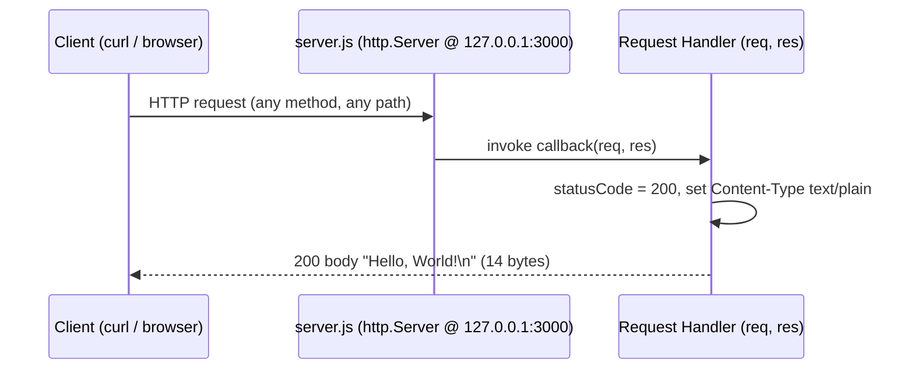
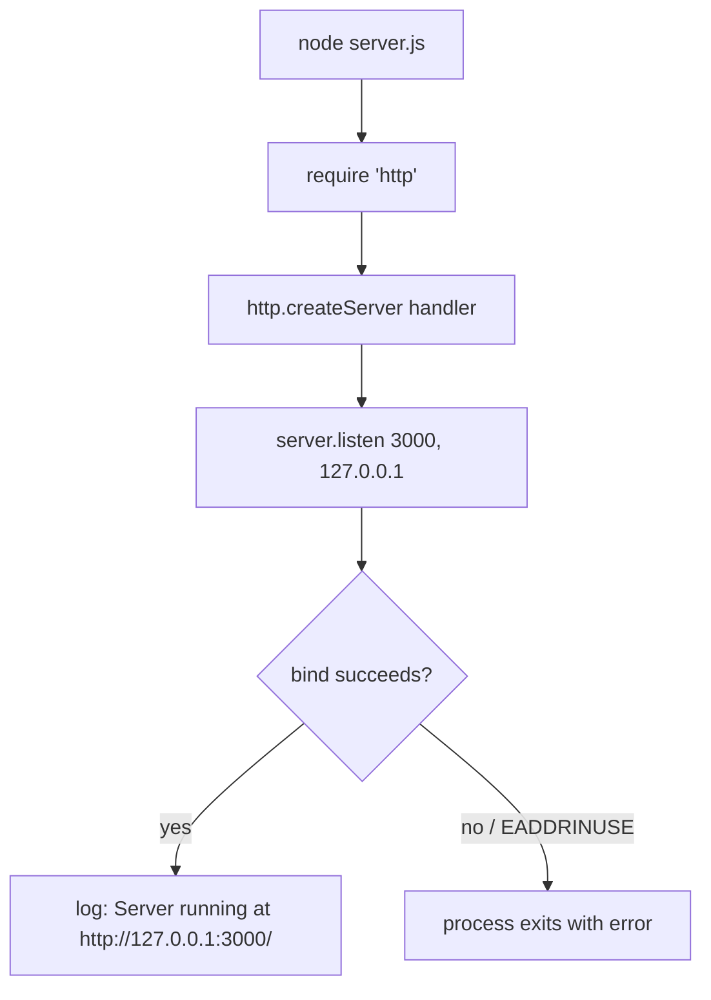

# hello_world

A minimal, dependency-free Node.js HTTP server that answers normal HTTP requests with a plain-text `Hello, World!`. `Repository inspection: package.json:1-11`, `Source: server.js:71-75`

## Table of contents

- [Documentation conventions](#documentation-conventions)
- [Overview](#overview)
- [Prerequisites](#prerequisites)
- [Installation](#installation)
- [Usage](#usage)
- [API documentation](#api-documentation)
  - [Worked example](#worked-example)
  - [Request/response sequence](#requestresponse-sequence)
  - [Protocol behavior notes](#protocol-behavior-notes)
- [Configuration](#configuration)
- [Deployment guide](#deployment-guide)
  - [Startup flow](#startup-flow)
- [Inline code explanation](#inline-code-explanation)
- [Project structure](#project-structure)
- [Troubleshooting](#troubleshooting)
- [License](#license)

## Documentation conventions

Every technical claim below is annotated with its **provenance** so the documentation stays verifiable against the thing that actually establishes it:

- **`Source: <file>:<lines>`** — the claim is encoded directly in that source line (for example, a value assigned in `server.js`).
- **`Runtime verification`** — the claim was observed by running the server and probing it (for example, tool versions, the Node-computed `Content-Length`, transport headers, and HEAD/HTTP-1.0 behavior).
- **`Repository inspection`** — the claim was established by inspecting repository files (for example, the absence of an `index.js`, or the zero-dependency manifest and lockfile).
- **`Node default behavior`** — the behavior is provided by the Node.js core `http` module, not by this application's code (for example, parser-generated `400`/`431` responses, or the default unhandled `EADDRINUSE` error).
- **`Recommendation`** — operational advice, not a property of the current code (for example, process managers, reverse proxies, or containers).

Runtime facts in this document were captured on Node.js v22.23.1 and npm 11.18.0. `Runtime verification`

## Overview

This project is a self-starting HTTP server built entirely on the Node.js core `http` module — there are no web frameworks and no external npm packages. `Source: server.js:21`, `Repository inspection: package.json:1-11`

- **Single fixed response.** Every normal request (each Node `request` event) receives the same reply: HTTP status `200`, `Content-Type: text/plain`, and the body `Hello, World!\n`. The request is never inspected, so for normal requests the HTTP method and URL path are ignored. A few transport- and parser-level cases behave differently — see [Protocol behavior notes](#protocol-behavior-notes). `Source: server.js:71-75`
- **Self-starting.** Running the file immediately binds the socket and begins listening; there is no separate build or bootstrap step. `Source: server.js:98-100`
- **Loopback by default.** The server binds the loopback interface `127.0.0.1` on port `3000`, so out of the box it is reachable only from the local machine. `Source: server.js:36`, `Source: server.js:41`

## Prerequisites

- **Node.js 18+ LTS** (verified on v22.23.1). The server relies only on the built-in `http` module, which ships with every supported Node.js release. `Runtime verification`, `Source: server.js:21`
- **npm** (verified 11.18.0). Used to run `npm install`, although this project declares no dependencies for it to resolve. `Runtime verification`, `Repository inspection: package.json:1-11`

## Installation

Clone the repository and run the install step. Because the project declares **zero external dependencies**, `npm install` installs no external packages — it simply resolves the manifest against the lockfile. `Repository inspection: package.json:1-11`, `Repository inspection: package-lock.json:1-13`

```bash
git clone <repository-url>
cd <repository-directory>
npm install
```

## Usage

Start the server with Node.js. On a successful bind it prints its listening URL to stdout. `Source: server.js:98-100`

```bash
node server.js
# → Server running at http://127.0.0.1:3000/
```

Leave the process running to keep serving requests; press `Ctrl+C` to stop it.

## API documentation

The server exposes a **single implicit endpoint**. There is no routing table and no request parsing: for every normal request delivered to the handler as a Node `request` event, the handler responds identically regardless of HTTP method or URL path. `Source: server.js:71-75`

| Property | Value |
|----------|-------|
| Methods | Any normal request (GET, POST, …) — see [Protocol behavior notes](#protocol-behavior-notes) |
| Path | Any (`/`, `/anything`, …) |
| Status | `200 OK` `Source: server.js:72` |
| Content-Type | `text/plain` `Source: server.js:73` |
| Body | `Hello, World!\n` `Source: server.js:74`; length 14 bytes computed by Node `Runtime verification` |

### Worked example

Send a request to the running server and inspect the response with `curl -i`:

```bash
curl -i http://127.0.0.1:3000/
```

An **observed** response looks like the following. The application controls only the status line, the `Content-Type` header, and the body; the remaining headers are added and managed by Node:

```text
HTTP/1.1 200 OK
Content-Type: text/plain
Date: Wed, 22 Jul 2026 15:05:18 GMT
Connection: keep-alive
Keep-Alive: timeout=5
Content-Length: 14

Hello, World!
```

This is a representative capture, not a byte-exact constant: the `Date` header changes on every request, and `Connection`/`Keep-Alive` depend on the client and HTTP version (an HTTP/1.0 client instead receives `Connection: close` and no `Content-Length`, with the body delimited by the connection closing). The stable, application-relevant fields are the `200` status, `Content-Type: text/plain`, and the 14-byte body `Hello, World!\n`; `Content-Length: 14` is computed by Node from that body. `Runtime verification`, `Source: server.js:71-75`

### Request/response sequence

The sequence below shows the normal `request`-event path (see [Protocol behavior notes](#protocol-behavior-notes) for the transport/parser cases it does not cover):



### Protocol behavior notes

The endpoint table and the sequence diagram describe the **normal application-level request path** — traffic delivered to the handler as Node `request` events (typical GET/POST/PUT/DELETE requests). Several cases are handled by Node's core HTTP transport/parser layer before or instead of the handler, so they behave differently and are **not** application logic — `server.js` only sets the status, content type, and body for normal requests. `Source: server.js:71-75`

- **HEAD** — replies with the same status and headers but no message body and no `Content-Length`. `Runtime verification`, `Node default behavior`
- **HTTP/1.0 clients** — receive `Connection: close` framing with no `Content-Length`; the body is delimited by the connection closing. `Runtime verification`, `Node default behavior`
- **Malformed request line or method** — rejected by the parser with `400 Bad Request` before the handler runs. `Runtime verification`, `Node default behavior`
- **Oversized headers** (beyond Node's default header-size limit) — rejected with `431 Request Header Fields Too Large`. `Runtime verification`, `Node default behavior`
- **CONNECT** — surfaced by Node as a separate `connect` event rather than a `request`, so the handler never runs and the client sees an empty reply. `Runtime verification`, `Node default behavior`

## Configuration

The server has two configuration constants. There is **no environment-variable override** — changing either value requires editing `server.js` directly and restarting the process. `Source: server.js:36`, `Source: server.js:41`

| Constant | Value | Meaning | How to change |
|----------|-------|---------|---------------|
| `hostname` | `'127.0.0.1'` | The network interface the server binds to. `127.0.0.1` is the loopback address, so the server accepts connections only from the local machine. `Source: server.js:36` | Edit the `hostname` assignment in `server.js` (e.g. to `'0.0.0.0'`) and restart. **Security warning:** `'0.0.0.0'` exposes this unauthenticated, plain-HTTP demo on all interfaces and is not a security control — read the [Deployment guide](#deployment-guide) security notice first. `Source: server.js:36`, `Recommendation` |
| `port` | `3000` | The TCP port the server listens on. The value is hardcoded. `Source: server.js:41` | Edit the `port` assignment in `server.js` and restart. `Source: server.js:41` |

## Deployment guide

> **Security notice.** This server has no authentication, authorization, TLS, rate limiting, or security headers, and it ignores request input entirely. Do **not** expose it directly to the public Internet. Keep it on loopback or a private network behind a firewall, and place TLS termination plus authentication/authorization at a trusted reverse proxy before any external exposure. Changing the bind address, adding a process manager, or running it in a container does **not** add any of these protections. `Source: server.js:71-75`, `Recommendation`

- **Loopback caveat.** Binding `127.0.0.1` means the server is reachable only from the machine it runs on. To accept connections from other hosts, change `hostname` to `'0.0.0.0'` (all interfaces) or place the server behind a reverse proxy such as nginx. Because the server provides no TLS or authentication of its own, restrict access with a firewall or private networking and terminate TLS and enforce authentication/authorization at the proxy first. `Source: server.js:36`, `Recommendation`
- **Hardcoded port.** The listening port is fixed at `3000` in source with no environment-variable configuration, so port selection is a source edit rather than a deploy-time setting. `Source: server.js:41`
- **Process managers.** For long-running deployments, keep the process alive and restart it on failure with a process manager. For example, with [PM2](https://pm2.keymetrics.io/): `pm2 start server.js --name hello-world`. Alternatively, run it under a `systemd` service unit whose `ExecStart` invokes `node server.js`. A process manager keeps the process up but adds no authentication, TLS, or other security controls. `Recommendation`
- **Containerization (optional).** There is **no build step**, so a container image only needs a Node.js base image and the single source file: `Recommendation`

  ```dockerfile
  FROM node:22-alpine
  WORKDIR /app
  COPY server.js ./
  EXPOSE 3000
  CMD ["node", "server.js"]
  ```

  Build and run it with:

  ```bash
  docker build -t hello-world .
  docker run -p 3000:3000 hello-world
  ```

  Note: because the server binds the loopback interface by default, a containerized instance is not reachable from the host until `hostname` is changed to `'0.0.0.0'`. Publishing the port with `-p 3000:3000` then exposes the unauthenticated, plain-HTTP demo to your host and any network it can reach; the container adds no security controls, so apply the firewall/private-network and TLS/authentication precautions from the security notice above. `Source: server.js:36`, `Recommendation`

### Startup flow



## Inline code explanation

An annotated walkthrough of `server.js`. The file is 100 lines including its JSDoc comment blocks; the executable logic is the same set of statements as the original 14-line server. The terminology below ("request handler", "startup callback", "loopback") mirrors the JSDoc in the source file. `Source: server.js:1-100`

- **Import the core `http` module** — the server's only dependency; no external npm packages are required. `Source: server.js:21`
- **Declare the configuration constants** — `hostname` is set to the loopback address `'127.0.0.1'` and `port` is set to `3000`. `Source: server.js:36`, `Source: server.js:41`
- **Create the server with a request handler** — `http.createServer` receives the request handler callback `(req, res)`. On each normal request the handler sets `res.statusCode = 200`, sets the `Content-Type` header to `text/plain`, and ends the response with the body `Hello, World!\n`. The request object is never read. `Source: server.js:71-75`
- **Listen and run the startup callback** — `server.listen(port, hostname, …)` binds the socket, and its startup callback logs `Server running at http://127.0.0.1:3000/` to stdout once the server is listening. `Source: server.js:98-100`

## Project structure

- **`server.js`** — the entire HTTP server (100 lines including JSDoc; the executable logic mirrors the original 14-line server). This is the file you run. `Source: server.js:1-100`
- **`package.json`** — the project manifest: name `hello_world`, version `1.0.0`, license MIT, and no declared dependencies. `Source: package.json:1-11`
- **`package-lock.json`** — the dependency lockfile (lockfileVersion 3) containing only the root package entry, confirming there are no external dependencies. `Source: package-lock.json:1-13`
- **`CONTRIBUTING.md`** — repository contribution guidelines (see [CONTRIBUTING.md](CONTRIBUTING.md)).
- **`SECURITY.md`** — present in the repository, but it is an unrelated placeholder describing React's vulnerability-reporting process and pointing to Facebook's whitehat page. It is **not** an applicable security-reporting policy for this project, so it is intentionally not linked here as guidance. `Repository inspection: SECURITY.md:1-7`

**Entrypoint note.** `package.json` declares `"main": "index.js"`, but no `index.js` exists in this repository. `Repository inspection: package.json:5` The actual, verified entrypoint is `server.js`; run the server with `node server.js`. `Source: server.js:1-100`

## Troubleshooting

- **`EADDRINUSE` (port already in use).** Startup fails when another process is already listening on port `3000`. The server installs no custom error handling, so Node prints the unhandled error and the process exits. Stop the conflicting process, or change the `port` constant in `server.js` and restart. `Source: server.js:41`, `Node default behavior`
- **Cannot reach the server from another host.** By default the server binds the loopback address `127.0.0.1`, so it only accepts connections from the local machine. Change `hostname` to `'0.0.0.0'` (or put the server behind a reverse proxy) to expose it externally — but review the [Deployment guide](#deployment-guide) security notice first, because the demo has no TLS or authentication of its own. `Source: server.js:36`, `Recommendation`

## License

This project is licensed under the **MIT** license, as declared in the project manifest. `Repository inspection: package.json:10`
