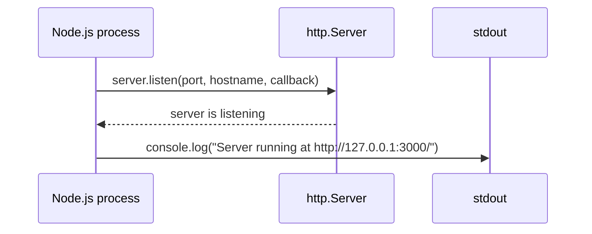

# hello_world

A minimal, zero-dependency HTTP server built on the Node.js core `http` module. `Source: server.js:L17` / `Source: package-lock.json:L1-L13`

Every request — regardless of HTTP method or URL path — receives the same plain-text `Hello, World!` response. The project is intended as a learning/demonstration server, not a production service. `Source: server.js:L36-L50`

## Table of Contents

- [Overview](#overview)
- [Prerequisites](#prerequisites)
- [Installation](#installation)
- [Running the Server](#running-the-server)
- [API Documentation](#api-documentation)
  - [Response contract](#response-contract)
  - [Example request/response](#example-requestresponse)
- [Configuration](#configuration)
- [Code Walkthrough](#code-walkthrough)
  - [Request lifecycle](#request-lifecycle)
  - [Startup sequence](#startup-sequence)
- [Deployment](#deployment)
  - [Bind address (loopback)](#bind-address-loopback)
  - [Port](#port)
  - [Process management](#process-management)
  - [Containerization (Docker)](#containerization-docker)
  - [Reverse proxy / TLS](#reverse-proxy--tls)
- [Troubleshooting](#troubleshooting)
- [Project Name Note](#project-name-note)
- [License](#license)

## Overview

`hello_world` is a single-file HTTP server that listens on the loopback interface and answers every inbound request with the fixed plain-text body `Hello, World!\n`. It is built exclusively on the Node.js core `http` module — there are no web frameworks, no routers, and no third-party dependencies. Because it contains no routing logic, it behaves as a **catch-all**: the request method and URL are ignored, so every request yields an identical response. It is intended as a learning/demonstration server rather than a production service. `Source: server.js:L1-L15` / `Source: package-lock.json:L1-L13`

## Prerequisites

- **Node.js 18+** — the documentation baseline for running this server.
- **npm** — ships with Node.js; only needed for the optional install step below.

> **Verified environment.** The server was verified against the AAP on Node.js **v22.23.1**, which is the only version with recorded empirical runtime evidence. `Source: server.js:L12` The **Node.js 18+** figure is the documentation baseline, not a tested compatibility guarantee for any particular release.
>
> **No version pin.** The repository does **not** pin a Node.js version: `package.json` declares no `engines` field, and no `.nvmrc` file exists in the repository (repository-inventory observation). `Source: package.json:L1-L11`

## Installation

Clone the repository and change into its directory:

```bash
git clone <repository-url>
cd <repository-directory>
```

Optionally install dependencies:

```bash
npm install
```

> This step is a **no-op**. The project declares zero dependencies, and `package-lock.json` records an empty dependency tree — you can skip it entirely. `Source: package-lock.json:L1-L13`

## Running the Server

Start the server with Node.js directly:

```bash
node server.js
```

> Use `node server.js` — the documented entry point. `npm start` **also works**: because `package.json` defines no `start` script, npm's built-in default runs `node server.js` and prints the same startup banner. `node index.js` will **not** work, however — although `package.json` declares `main: "index.js"`, there is no `index.js` file in the repository, so the real entry point is `server.js`. `Source: package.json:L5` / `Source: server.js:L1-L15`

On startup the server prints exactly:

```text
Server running at http://127.0.0.1:3000/
```

`Source: server.js:L52-L63`

Verify it is responding (from a second terminal):

```bash
curl http://127.0.0.1:3000/
```

Expected output (note the trailing newline):

```text
Hello, World!
```

`Source: server.js:L45-L49`

## API Documentation

The server exposes a single **catch-all** endpoint. Every HTTP method (GET, POST, PUT, PATCH, DELETE, OPTIONS, …) against every URL path invokes the same handler and returns status `200` with `Content-Type: text/plain`. There is deliberately **no** routing, **no** application status codes other than `200`, **no** query-string or request-body parsing, **no** authentication, and **no** TLS. Response-bearing methods also receive the 14-byte body `Hello, World!\n`; per HTTP semantics a `HEAD` request returns the same status and headers but no message body (see the note below the contract table). `Source: server.js:L36-L50`

### Response contract

| Property         | Value                                          |
| ---------------- | ---------------------------------------------- |
| Method           | Any (GET, POST, PUT, DELETE, …)                |
| Path             | Any (`/`, `/anything/else`, `/foo?bar=baz`, …) |
| Status           | `200 OK`                                       |
| `Content-Type`   | `text/plain`                                   |
| `Content-Length` | `14` for response-bearing methods; omitted for `HEAD` |
| Body             | `Hello, World!\n` (14 bytes) for response-bearing methods; empty for `HEAD` |

`Source: server.js:L45-L49`

> **`HEAD` requests.** Per HTTP semantics, a `HEAD` response carries the same status line and headers as the equivalent `GET` but transmits **no message body**. The request handler still runs identically — it calls `res.end('Hello, World!\n')` — but Node's `http` layer suppresses the body for `HEAD` and omits the `Content-Length` header. So a `HEAD` request returns `200` and `Content-Type: text/plain` with **no body and no `Content-Length`**, whereas the `Content-Length: 14` and 14-byte body above apply to response-bearing methods (GET, POST, PUT, PATCH, DELETE, OPTIONS, …). `Source: server.js:L45-L49`

### Example request/response

Request:

```bash
curl -i http://127.0.0.1:3000/
```

Response — one observed HTTP/1.1 sample. Transport and runtime headers (for example `Date`, `Connection`, `Keep-Alive`, and message framing) may vary between requests, clients, and HTTP versions:

```text
HTTP/1.1 200 OK
Content-Type: text/plain
Date: <current date, RFC 1123 format>
Connection: keep-alive
Keep-Alive: timeout=5
Content-Length: 14

Hello, World!
```

Only the **application response** is a stable contract: status `200`, `Content-Type: text/plain`, and — for response-bearing methods — the exact 14-byte body `Hello, World!\n`. Those application facts hold for every method and path — for example `curl -i -X POST http://127.0.0.1:3000/anything/else` or `curl -i -X DELETE "http://127.0.0.1:3000/foo?bar=baz"` — while the transport/runtime headers shown above may differ. The one protocol-level exception is `HEAD`: the handler runs identically, but HTTP requires the response to carry no body, so a `HEAD` request returns `200` / `Content-Type: text/plain` with no body (and Node omits `Content-Length`). `Source: server.js:L36-L50`

## Configuration

All configuration is hard-coded as module constants in `server.js`. There are **no** environment-variable overrides; to change a value you must edit the source constant and restart the server.

| Constant   | Value       | Location        | Purpose                                       |
| ---------- | ----------- | --------------- | --------------------------------------------- |
| `hostname` | `127.0.0.1` | `server.js:L24` | Interface the server binds to (loopback only) |
| `port`     | `3000`      | `server.js:L30` | TCP port the server listens on                |

`Source: server.js:L24-L30`

## Code Walkthrough

`server.js` reads top-to-bottom as described below. These inline explanations mirror the JSDoc/inline comments in the source.

- **Import the HTTP module** — `const http = require('http')` loads the Node.js core `http` module; no third-party packages are used. `Source: server.js:L17`
- **Declare configuration constants** — `hostname = '127.0.0.1'` and `port = 3000` fix the bind address and listening port. `Source: server.js:L24-L30`
- **Create the server / request handler** — `http.createServer((req, res) => { … })` registers the catch-all request handler. Inside it: `res.statusCode = 200` sets the status, `res.setHeader('Content-Type', 'text/plain')` sets the content type, and `res.end('Hello, World!\n')` writes the 14-byte body and ends the response. The `req` argument is never inspected, which is why the server responds identically to every request. `Source: server.js:L36-L50`
- **Start listening** — `server.listen(port, hostname, () => { … })` binds the server; once it is listening, the ready callback logs `Server running at http://127.0.0.1:3000/`. `Source: server.js:L52-L63`

### Request lifecycle

The following diagram traces a single request from the client through the handler and back:


### Startup sequence

At boot, `server.listen` binds the socket and invokes the ready callback, which prints the startup banner:



`Source: server.js:L52-L63`

## Deployment

This is a dependency-free, single-file server. The guidance below reflects only what the code actually does — it has **no** built-in clustering, health checks, or graceful shutdown.

### Bind address (loopback)

By default the server binds to `127.0.0.1`, so it is reachable **only from the local machine**. To accept external/network traffic you must change the `hostname` constant in the source — for example to `0.0.0.0` to listen on all interfaces — and restart the server. `Source: server.js:L24`

> ⚠️ **Security warning.** Binding to `0.0.0.0` exposes the server on every network interface. This application has **no authentication, no authorization, and no TLS** — it answers every request with the same plaintext body. Before binding beyond `127.0.0.1`, restrict ingress with a firewall or private networking, and place a properly configured reverse proxy that terminates TLS and adds an authentication/access-control layer in front of it (see [Reverse proxy / TLS](#reverse-proxy--tls)).

### Port

The server listens on the fixed port `3000`. To serve on a different port, edit the `port` constant in the source and restart. `Source: server.js:L30`

### Process management

For anything beyond a foreground/dev run, keep the process alive and restart it on failure with a process manager such as **systemd** or **pm2** (e.g. `pm2 start server.js`). A process manager supervises the same `node server.js` process; it adds no code to the application and does not change its behavior.

### Containerization (Docker)

A minimal container image needs only a Node base image, the source file, and the start command:

```dockerfile
FROM node:22-alpine
WORKDIR /app
COPY server.js ./
EXPOSE 3000
CMD ["node", "server.js"]
```

> Because the server binds to `127.0.0.1` by default, inside a container it will only accept connections originating **within** that container. To reach it from outside the container, change `hostname` to `0.0.0.0` in the source (see [Bind address](#bind-address-loopback)) before building the image. `Source: server.js:L24`
>
> ⚠️ **Security warning.** Publishing this container with a `0.0.0.0` bind exposes an **unauthenticated, plaintext** service (no authentication, no authorization, no TLS). Keep it on a private network, restrict ingress with firewall rules or a container-network policy, and front it with a reverse proxy that terminates TLS and enforces authentication/access control before any public exposure.

### Reverse proxy / TLS

The server speaks plain HTTP only — it has **no TLS support** and **no authentication or authorization**. For any public deployment, terminate TLS at a reverse proxy (for example nginx, Caddy, or a cloud load balancer) and forward the decrypted traffic to the server's host and port. In addition, keep the origin on a private network (or bound to `127.0.0.1` behind the proxy), restrict ingress with firewall rules, and enforce authentication/access control at the proxy layer — the application performs none of these checks itself. `Source: server.js:L24-L30`

## Troubleshooting

| Symptom                                               | Cause                                                                                                                                                                            | Resolution                                                                                               |
| ----------------------------------------------------- | -------------------------------------------------------------------------------------------------------------------------------------------------------------------------------- | -------------------------------------------------------------------------------------------------------- |
| `Error: listen EADDRINUSE ... :3000` on startup       | Another process is already using port `3000`.                                                                                                                                    | Stop the other process, or change the `port` constant in the source and restart. `Source: server.js:L30` |
| `npm test` exits with an error                        | The `test` script is a placeholder — `echo "Error: no test specified" && exit 1` — that fails by design and exits non-zero. No Node.js/npm tests are configured for this server. | Expected behavior; no action needed. `Source: package.json:L7`                                           |
| `node index.js` → `Cannot find module '.../index.js'` | `package.json` declares `main: "index.js"`, but no `index.js` file exists.                                                                                                       | Run `node server.js` instead — that is the real entry point. `Source: package.json:L5`                   |

## Project Name Note

The authoritative project identity is **`hello_world`**, taken from the `name` field in `package.json`. `Source: package.json:L2` The previous README stub instead read `# 600K_ChildRepo`. `Source: Pre-change README at 77a1a46^:README.md:L1` This README adopts the package identity `hello_world`; the earlier stub title is mentioned only to explain the discrepancy, and no meaning is attributed to it.

## License

Released under the **MIT** License. Author: `hxu`. `Source: package.json:L9-L10`
