# Technical Specification

# 1. Introduction

## 1.1 Executive Summary

The `hao-backprop-test` repository is a deliberately minimal Node.js web service. Its `README.md` describes the project in a single line as a "test project for backprop integration." The sole executable artifact, `server.js`, is a 14-line CommonJS program that starts an HTTP server on the loopback interface `127.0.0.1:3000` and returns the fixed plain-text response `Hello, World!` to every incoming request, regardless of method or path. The repository declares no external dependencies, build tooling, package manifest, or configuration files.

This Executive Summary — and this Introduction as a whole — documents only what is present in the repository. Because the repository is intentionally small and contains no business, product, or planning documentation beyond the one-line README, several framing dimensions that a typical Introduction would draw from formal artifacts (market positioning, service-level agreements, key performance indicators, and roadmap) are not defined in the codebase; where that is the case, this document states so explicitly rather than inferring values that the repository does not establish.

**Project Overview.** The system is a single-process, single-endpoint HTTP "Hello, World!" server built exclusively on the Node.js built-in `http` module. The following table summarizes the project's verifiable identity as established by the repository files.

| Attribute | Detail (as evidenced in the repository) |
| --- | --- |
| Project name | `hao-backprop-test` (declared in `README.md` and the repository directory name) |
| Stated purpose | "test project for backprop integration" (`README.md`) |
| Runtime implementation | `server.js` — a Node.js HTTP server (14 lines) |
| Endpoint behavior | Every request returns HTTP `200`, `Content-Type: text/plain`, body `Hello, World!\n` |
| Network binding | `127.0.0.1:3000` (loopback interface only) |
| External dependencies | None — uses only the Node.js core `http` module |

**Core Business Problem Being Solved.** Interpreted strictly from the evidence, the project exists to provide a minimal, deterministic, dependency-free HTTP target that can be stood up quickly to exercise "backprop integration," as named in `README.md`. A trivial always-on endpoint that returns a fixed response offers an integrating or testing party a predictable, low-variability fixture: there is no routing logic, request parsing, state, or external I/O that could introduce nondeterminism into an integration exercise. The repository does not further define what "backprop" is, so no product- or vendor-specific problem statement is asserted here beyond the README's own wording.

**Key Stakeholders and Users.** The repository does not explicitly name any stakeholders, owners, or user personas. Based solely on the artifacts present, the implied audience is the developer/integrator who runs `server.js` locally (via a Node.js runtime) and connects to it on `127.0.0.1:3000` in the course of validating "backprop integration." Because the server binds to the loopback interface, its accessible audience is confined to the local host by default.

**Expected Business Impact and Value Proposition.** The value proposition evidenced by the code is simplicity and reproducibility rather than commercial or operational scale. The project requires no dependency installation (it relies only on Node.js core), presents a minimal attack/behavior surface (one deterministic response), and can be launched with a single command. These properties make it a low-friction, reproducible test fixture. The repository contains no revenue, adoption, or operational impact statements, and its git history (three commits, all dated 2026-07-20) indicates an early-stage scaffold rather than a production system; accordingly, no production business impact is claimed.

## 1.2 System Overview

This System Overview characterizes `hao-backprop-test` from three perspectives: the context in which it sits, a high-level description of what it does and how, and the criteria by which its correct operation can be verified. All statements are grounded in the three files that constitute the repository (`server.js`, `README.md`, and `app.py`) and the absence of any other artifacts.

### 1.2.1 Project Context

**Business Context and Market Positioning.** The repository presents itself, via `README.md`, as a "test project for backprop integration." There is no product literature, licensing, versioning manifest, or commercial framing anywhere in the repository, and therefore no market positioning is defined. The project is best understood as an engineering test fixture / scaffold rather than a marketed product or service. Its git history consists of three commits (`Initial commit`, `Add files via upload`, `Create app.py`), all dated 2026-07-20, consistent with an early-stage, non-evolving test artifact.

**Current System Limitations.** The repository contains no evidence that it replaces or upgrades a pre-existing system; no prior system, migration note, or deprecation is referenced. Rather than legacy-system limitations, the relevant constraints are the intrinsic characteristics of the current implementation, which bound it to its test-fixture role:

- The server binds only to the loopback address `127.0.0.1`, so it is not reachable from other hosts by default.
- Configuration (host `127.0.0.1`, port `3000`) is hard-coded as `const` values in `server.js`; there is no environment-variable or file-based configuration.
- The request handler ignores the request entirely and returns one fixed response; there is no routing, input validation, or content negotiation.
- There is no error handling, structured logging, graceful shutdown, authentication, or transport security (HTTP only, no TLS).

**Integration with the Existing Enterprise Landscape.** No integration artifacts exist in the repository: there are no database drivers, HTTP clients, message brokers, cloud SDKs, environment/secrets files, or container/orchestration descriptors. `server.js` performs no outbound network calls and depends on no external services. The only integration context named anywhere is the phrase "backprop integration" in `README.md`; the repository provides no code, endpoints, credentials, or configuration implementing such an integration. Consequently, from an enterprise-landscape standpoint the system is self-contained and isolated to the local host.

### 1.2.2 High-Level Description

**Primary System Capabilities.** The system provides exactly one capability set, implemented entirely in `server.js`:

- Start an HTTP listener on `127.0.0.1:3000`.
- Accept any inbound HTTP request (any method, any path) and respond with HTTP status `200`, header `Content-Type: text/plain`, and body `Hello, World!\n`.
- Emit a single startup log line, `Server running at http://127.0.0.1:3000/`, once the listener is ready.

**Major System Components.** The repository comprises three files, only one of which is executable runtime code. The table below records each component and its operational status as verified from file contents.

| Component | File | Role | Operational status |
| --- | --- | --- | --- |
| HTTP server | `server.js` | Creates and starts the HTTP listener and defines the fixed-response handler | Functional runtime code |
| Project documentation | `README.md` | Declares the project name and its one-line stated purpose | Functional (documentation only) |
| Prose note | `app.py` | A single descriptive sentence about a Node.js hello-world tutorial | Non-functional (not executable Python) |

The `app.py` file, present only on the current branch, is a malformed prose note that begins with a stray curly quotation mark and contains no Python statements; it would raise a syntax error if executed and contributes no runtime behavior. The single external building block used by `server.js` is the Node.js standard-library `http` module; no third-party packages are involved.

**Core Technical Approach.** The implementation is a straightforward, synchronous CommonJS program. It imports the core `http` module, defines immutable host and port constants, creates a server with an inline arrow-function handler, and begins listening. The entire response logic is three statements:

```javascript
res.statusCode = 200;
res.setHeader('Content-Type', 'text/plain');
res.end('Hello, World!\n');
```

Because the handler does not inspect `req`, every request follows an identical path to the same response. The request/response flow is illustrated below.

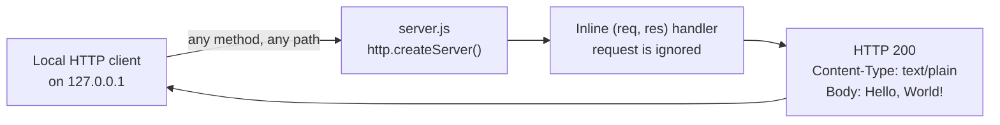
```mermaid
flowchart LR
    Client["Local HTTP client<br/>on 127.0.0.1"] -->|"any method, any path"| Server["server.js<br/>http.createServer()"]
    Server --> Handler["Inline (req, res) handler<br/>request is ignored"]
    Handler --> Response["HTTP 200<br/>Content-Type: text/plain<br/>Body: Hello, World!"]
    Response --> Client
```

### 1.2.3 Success Criteria

**Measurable Objectives.** The repository does not state objectives in prose, so the only objective, verifiable criteria are the observable behaviors defined by `server.js`. Each can be confirmed by running `node server.js` and issuing a request to the endpoint.

| Objective | Verifiable signal (source) |
| --- | --- |
| Server starts and listens | Process listens on `127.0.0.1:3000` and logs `Server running at http://127.0.0.1:3000/` (`server.js` lines 12-14) |
| Correct status code | Every response has HTTP status `200` (`server.js` line 7) |
| Correct content type | Every response sets `Content-Type: text/plain` (`server.js` line 8) |
| Correct body | Every response body is exactly `Hello, World!\n` (`server.js` line 9) |

**Critical Success Factors.** Successful operation depends on a small number of environmental preconditions, all inferable from the code and its runtime requirements: a Node.js runtime must be available to execute `server.js` (the module uses only Node core, so no dependency installation is required — verified against Node.js v22.23.1 in the inspection environment); and TCP port `3000` on the loopback interface must be free for binding. There is no build or packaging step.

**Key Performance Indicators (KPIs).** No KPIs, service-level agreements, latency/throughput targets, availability goals, or other quantitative performance metrics are defined anywhere in the repository. There is likewise no instrumentation, metrics emission, or monitoring code. In the absence of such definitions, the functional acceptance signals in the Measurable Objectives table above constitute the only success measures the repository establishes, and no numeric performance targets are asserted by this document.

## 1.3 Scope

This section delineates what the `hao-backprop-test` repository does and does not deliver. The boundaries below are drawn strictly from the files present (`server.js`, `README.md`, `app.py`) and the confirmed absence of any additional code, configuration, or documentation.

### 1.3.1 In-Scope

**Core Features and Functionalities.** The must-have capabilities delivered by the repository are limited to the behavior implemented in `server.js`.

| # | In-scope capability | Evidence |
| --- | --- | --- |
| 1 | HTTP listener bound to `127.0.0.1:3000` | `server.js` lines 3-4, 12 |
| 2 | Fixed response to every request: HTTP `200`, `text/plain`, body `Hello, World!\n` | `server.js` lines 6-10 |
| 3 | Startup confirmation log line to stdout | `server.js` lines 12-14 |

*Primary user workflow.* The single supported workflow is: an operator starts the process (for example, `node server.js`) on a host with a Node.js runtime; the server binds to the loopback interface and logs its URL; a local HTTP client then sends any request to `http://127.0.0.1:3000/` and receives the fixed `Hello, World!` response. No other user journeys are defined.

*Essential integrations.* The only integration in scope is the program's use of the Node.js core `http` module. No third-party libraries, services, or APIs are integrated.

*Key technical requirements.* Running the system in scope requires a Node.js runtime capable of executing the CommonJS `server.js`, and a free TCP port `3000` on the loopback interface. No build, install, or packaging step is required because there are no external dependencies.

**Implementation Boundaries.** The following table defines the boundaries of the system as evidenced by the repository.

| Boundary dimension | In-scope definition (per repository) |
| --- | --- |
| System boundary | A single Node.js process exposing one HTTP listener on the loopback interface; no other processes, services, or modules |
| User groups covered | Local developers/integrators operating on the same host (loopback-only reachability) |
| Geographic / market coverage | Not applicable — the server is reachable only on `127.0.0.1`; no deployment target or geographic footprint is defined |
| Data domains included | None — no persistence and no request processing; the only datum is the static in-code string `Hello, World!\n` |

### 1.3.2 Out-of-Scope

**Explicitly Excluded Features and Capabilities.** The repository contains no implementation of the following; each is therefore out of scope. The "Status in repository" column reflects direct inspection of `server.js` and the file inventory.

| Excluded area | Status in repository |
| --- | --- |
| Multiple endpoints, routing, method/path handling | Not present — the handler ignores `req` and returns one response |
| Request parsing (query string, body, headers) | Not present |
| Authentication and authorization | Not present |
| Transport security (TLS/HTTPS) | Not present — plain HTTP only |
| Persistence, databases, or external storage | Not present |
| Remote/external exposure (binding beyond loopback) | Not present — binds `127.0.0.1` only |
| Configuration management (environment variables, config files) | Not present — host/port are hard-coded constants |
| Dependency management (`package.json`, lockfiles, `node_modules`) | Not present |
| Automated tests and continuous integration | Not present |
| Containerization and deployment manifests | Not present |
| Logging, monitoring, or metrics frameworks | Not present — only a single `console.log` startup line |
| Error handling and graceful shutdown | Not present |
| A functional Python application | `app.py` is non-executable prose, not a working program |

**Future Phase Considerations.** No roadmap, backlog, `TODO`s, issues, or planning notes exist in the repository. Consequently, no future phases are defined, and this document does not speculate on any.

**Integration Points Not Covered.** Although `README.md` names "backprop integration" as the project's purpose, the repository provides no implementing code, endpoints, credentials, protocols, or configuration for such an integration. The actual mechanics of integrating with "backprop" are therefore out of scope for what the repository delivers.

**Unsupported Use Cases.** Given the implementation, the following use cases are not supported: production deployment; access from remote hosts or over a network beyond the local loopback; serving dynamic, request-dependent, or non-text content; guarantees around concurrency, scaling, throughput, or availability; and any form of secure or authenticated access. The system supports only the single local, fixed-response "Hello, World!" behavior described in the In-Scope subsection.

## 1.4 References

The following repository artifacts were examined directly and cited as evidence for this Introduction section.

**Files**

- `README.md` - Established the project name (`hao-backprop-test`) and its sole stated purpose, "test project for backprop integration."
- `server.js` - Established the complete runtime behavior: loopback binding to `127.0.0.1:3000`, the fixed HTTP `200` / `text/plain` / `Hello, World!\n` response, the startup log line, sole reliance on the Node.js core `http` module, and the absence of routing, configuration, error handling, and exports.
- `app.py` - Established that this file is a single, non-functional prose note (not executable Python) contributing no runtime behavior.

**Folders**

- `` (repository root) - Confirmed the complete file inventory (exactly three files and no subfolders) and the absence of any manifests, configuration, tests, CI, containerization, or documentation beyond `README.md`.

**Repository metadata**

- Git history and branch inspection - Confirmed three commits dated 2026-07-20 (`Initial commit`, `Add files via upload`, `Create app.py`) and that `app.py` is present only on the current working branch, indicating an early-stage test scaffold with no feature evolution.
- Runtime verification - Confirmed the presence of a Node.js runtime (v22.23.1) in the inspection environment, supporting the finding that `server.js` runs with no dependency-installation step because it uses only Node.js core modules.

No external or web sources were used; all findings derive from direct inspection of the repository.

# 2. Product Requirements

## 2.1 Feature Catalog

This Product Requirements section decomposes the `hao-backprop-test` system into discrete, testable features. Because the repository is intentionally minimal — a single 14-line runtime file (`server.js`), a two-line `README.md`, and a non-functional prose note (`app.py`) — the feature set is small and is derived **entirely** from behavior that is directly observable in the code. Each feature below maps one-to-one onto an in-scope capability already established in Section 1.3 (In-Scope), ensuring consistency across the specification. No features are asserted beyond those the repository demonstrably implements.

**Feature identification method.** Every feature traces to specific lines of `server.js`. The three capabilities that constitute the entire runtime behavior are: (1) starting and binding the HTTP listener, (2) producing the fixed response, and (3) emitting the startup log. These correspond to the three in-scope capabilities enumerated in Section 1.3.1.

**Requirements baseline and versioning.** All requirements in this section are baselined at **v1.0** against the current repository state (git history consists of three commits dated 2026-07-20, per Section 1.4). Because there is no roadmap, backlog, issue tracker, or `TODO` anywhere in the repository, there are no superseded or in-flight requirement versions to track; the baseline reflects code as-implemented. Feature **Status** is recorded as *Completed* for all three features because each is fully implemented and functional in `server.js` (as opposed to *Proposed*, *Approved*, or *In Development*).

**Assumptions and constraints (catalog-wide).** The following assumptions apply to every feature and are not repeated in each entry:

- A Node.js runtime is available to execute the CommonJS `server.js`; no dependency-installation or build step is required because the program uses only the Node.js core `http` module (verified: `require('http')` is the sole `require`, and there is no `package.json`).
- TCP port `3000` on the loopback interface is free for binding.
- Configuration is compile-time only — the host (`127.0.0.1`) and port (`3000`) are immutable `const` values; there is no environment-variable or file-based configuration (verified: no `process.env` usage, no `.env`).
- The system runs as a single process with a single listener; there is no clustering, persistence, authentication, transport security, error handling, or graceful shutdown anywhere in the code.

**Feature register.** The following table lists all cataloged features. All three share the category grouping *Core HTTP Service* and carry **Status: Completed**; per-feature detail follows in the subsections.

| Feature ID | Feature Name | Category | Priority |
| --- | --- | --- | --- |
| F-001 | HTTP Server Lifecycle & Loopback Listener | Server Runtime & Networking | Critical |
| F-002 | Fixed Plain-Text Response Handler | Request Handling & Response Generation | Critical |
| F-003 | Startup Confirmation Logging | Observability & Operational Logging | Medium |

The end-to-end request/response behavior these features implement is illustrated by the process flowchart in Section 1.2 (High-Level Description → Core Technical Approach); the feature dependency map is provided in Section 2.3.

### 2.1.1 F-001 — HTTP Server Lifecycle & Loopback Listener

**Feature Metadata**

| Attribute | Value |
| --- | --- |
| Unique ID | F-001 |
| Feature Name | HTTP Server Lifecycle & Loopback Listener |
| Feature Category | Server Runtime & Networking |
| Priority Level | Critical |
| Status | Completed |

**Description**

- **Overview.** F-001 creates an HTTP server using the Node.js core `http` module and starts it listening on the loopback interface `127.0.0.1`, TCP port `3000`. It is the process's lifecycle anchor: `http.createServer(...)` constructs the server (`server.js` line 6) and `server.listen(port, hostname, ...)` begins accepting connections (`server.js` line 12).
- **Business Value.** A running, always-on listener is the precondition for every interaction with the fixture. It provides the deterministic, dependency-free local endpoint that the project's stated purpose — a "test project for backprop integration" (`README.md`) — can target, consistent with the simplicity/reproducibility value proposition documented in Section 1.1.
- **User Benefits.** A developer or integrator can bring the endpoint up with a single command (e.g., `node server.js`) and immediately have a reachable local HTTP target, with no dependency installation, configuration, or build step.
- **Technical Context.** The implementation is synchronous CommonJS. Host and port are defined as immutable `const` values on lines 3-4, and the server binds to the loopback address only — it is therefore not reachable from other hosts by default (see Section 1.2.1). A single process exposes a single listener; there is no clustering or multi-port logic.

**Dependencies**

| Dependency Type | Detail |
| --- | --- |
| Prerequisite Features | None — F-001 is foundational; F-002 and F-003 depend on it |
| System Dependencies | Node.js runtime; the core `http` module; a free TCP port `3000` on the loopback interface |
| External Dependencies | None — no third-party/npm packages; no `package.json`, lockfile, or `node_modules` |
| Integration Requirements | Exposes a single inbound loopback TCP socket at `127.0.0.1:3000`; performs no outbound network calls or external-service integration |

### 2.1.2 F-002 — Fixed Plain-Text Response Handler

**Feature Metadata**

| Attribute | Value |
| --- | --- |
| Unique ID | F-002 |
| Feature Name | Fixed Plain-Text Response Handler |
| Feature Category | Request Handling & Response Generation |
| Priority Level | Critical |
| Status | Completed |

**Description**

- **Overview.** F-002 is the inline `(req, res)` request handler passed to `http.createServer` (`server.js` lines 6-10). For **any** inbound request — regardless of HTTP method, path, headers, or body — it sets the response status to `200`, sets header `Content-Type: text/plain`, and writes the exact body `Hello, World!\n`. The `req` argument is never inspected.
- **Business Value.** This is the core deliverable of the system: a deterministic, low-variability response that makes the fixture predictable for integration or testing. With no routing logic, request parsing, state, or external I/O, there is no source of nondeterminism (consistent with Section 1.1's "core business problem" framing).
- **User Benefits.** Callers receive an identical, predictable response no matter how they call the endpoint; there are no edge cases, error paths, authentication challenges, or content-negotiation variations to account for.
- **Technical Context.** The handler comprises exactly three statements (`res.statusCode = 200;`, `res.setHeader('Content-Type', 'text/plain');`, `res.end('Hello, World!\n');`). Because it ignores `req`, every request follows an identical code path to the same response, as depicted in the Section 1.2 request/response flowchart.

**Dependencies**

| Dependency Type | Detail |
| --- | --- |
| Prerequisite Features | F-001 — the handler executes only within the server created and started by F-001 |
| System Dependencies | Node.js `http` `ServerResponse` API: `res.statusCode`, `res.setHeader`, `res.end` |
| External Dependencies | None |
| Integration Requirements | Consumes inbound HTTP requests arriving on the F-001 loopback socket and returns HTTP responses on the same connection; no external integration |

### 2.1.3 F-003 — Startup Confirmation Logging

**Feature Metadata**

| Attribute | Value |
| --- | --- |
| Unique ID | F-003 |
| Feature Name | Startup Confirmation Logging |
| Feature Category | Observability & Operational Logging |
| Priority Level | Medium |
| Status | Completed |

**Description**

- **Overview.** F-003 emits a single startup confirmation line to standard output once the listener is ready. It is implemented as the callback passed to `server.listen(...)`, which invokes `console.log` with a template literal (`server.js` lines 12-14), producing the literal line `Server running at http://127.0.0.1:3000/`.
- **Business Value.** This log line is the **sole** operational readiness signal the system provides. It confirms that binding succeeded and communicates the exact URL at which the endpoint is reachable (consistent with the success criteria in Section 1.2.3).
- **User Benefits.** The operator gets immediate visual confirmation that the server has started and the precise address to connect to, without needing external tooling.
- **Technical Context.** The message is produced with a template literal that interpolates the same `hostname`/`port` constants used for binding, guaranteeing the logged URL matches the actual bind target. It fires exactly once, in the listen callback; there is no request-level logging, error logging, log level, or structured/log-aggregation framework anywhere in the code.

**Dependencies**

| Dependency Type | Detail |
| --- | --- |
| Prerequisite Features | F-001 — the log fires only from within F-001's `listen` callback after binding succeeds |
| System Dependencies | Node.js `console` (writes to process `stdout`) |
| External Dependencies | None |
| Integration Requirements | Writes a single line to `stdout`; no log shipping, metrics emission, or monitoring integration |

## 2.2 Functional Requirements

This subsection specifies the functional requirements for each cataloged feature. Requirement IDs follow the format `F-XXX-RQ-YYY`, where `F-XXX` is the parent feature. Every requirement is expressed so that it is **testable**: each acceptance criterion can be verified by starting the server (`node server.js`) and inspecting the process output or issuing an HTTP request to `http://127.0.0.1:3000/`, consistent with the measurable objectives in Section 1.2.3.

**Scale conventions used below:**

- **Priority** — *Must-Have* (required for the system to fulfill its stated purpose), *Should-Have* (valuable, non-blocking), *Could-Have* (optional).
- **Complexity** — *High / Medium / Low*, reflecting implementation effort and logical intricacy. Given that the entire runtime is a 14-line synchronous program with no branching, dependencies, or I/O, all requirements are assessed as **Low** complexity; this is reported as an observed fact, not a target.
- **Performance Criteria** — Section 1.2.3 confirms the repository defines **no** KPIs, SLAs, latency, throughput, or availability targets and includes no instrumentation. Each technical-specification table therefore records performance criteria as "None defined in repository" rather than inventing figures.

### 2.2.1 F-001 — HTTP Server Lifecycle & Loopback Listener

**Requirement Details**

| Requirement ID | Description | Priority | Complexity |
| --- | --- | --- | --- |
| F-001-RQ-001 | Create an HTTP server instance using the Node.js core `http` module | Must-Have | Low |
| F-001-RQ-002 | Bind the listener to hostname `127.0.0.1` and TCP port `3000` | Must-Have | Low |
| F-001-RQ-003 | Define host and port as immutable compile-time constants with no runtime/environment configuration | Must-Have | Low |

**Acceptance Criteria**

| Requirement ID | Acceptance Criteria (testable) |
| --- | --- |
| F-001-RQ-001 | `require('http')` is present (`server.js` L1) and `http.createServer(...)` is invoked (L6); running `node server.js` produces a live listening process |
| F-001-RQ-002 | After start, a TCP/HTTP connection to `127.0.0.1:3000` is accepted; `server.listen(port, hostname, ...)` uses the L3-4 constants (L12) |
| F-001-RQ-003 | `hostname` and `port` are declared with `const` (L3-4); there is no `process.env` read and no `.env`/config file; changing the bind target requires editing source |

**Technical Specifications**

| Specification | Detail |
| --- | --- |
| Input Parameters | None at runtime (no CLI arguments, no environment variables); compile-time constants `hostname = '127.0.0.1'`, `port = 3000` |
| Output/Response | A bound, listening HTTP server accepting TCP connections on `127.0.0.1:3000`; the `listen` callback triggers F-003 |
| Performance Criteria | None defined in repository (single Node.js event loop; no latency/throughput/availability targets) |
| Data Requirements | None — no persistence and no state beyond the in-memory `server` object |

**Validation Rules**

| Rule Category | Detail |
| --- | --- |
| Business Rules | The server must be listening before any request can be served; binding always uses the fixed loopback host/port |
| Data Validation | Not applicable — no external input is accepted at startup |
| Security Requirements | Loopback-only binding confines reachability to the local host (no remote exposure); plain HTTP (no TLS); no authentication. Reported as the observed posture, not an asserted control |
| Compliance Requirements | None defined in repository |

### 2.2.2 F-002 — Fixed Plain-Text Response Handler

**Requirement Details**

| Requirement ID | Description | Priority | Complexity |
| --- | --- | --- | --- |
| F-002-RQ-001 | For any inbound request (any method, any path), respond with HTTP status code `200` | Must-Have | Low |
| F-002-RQ-002 | Set response header `Content-Type: text/plain` | Must-Have | Low |
| F-002-RQ-003 | Return the exact response body `Hello, World!\n` | Must-Have | Low |
| F-002-RQ-004 | Ignore all request content — no routing, parsing, or method/path branching | Must-Have | Low |

**Acceptance Criteria**

| Requirement ID | Acceptance Criteria (testable) |
| --- | --- |
| F-002-RQ-001 | Requests using GET, POST, PUT, DELETE, or any method to any path each return `statusCode = 200` (`server.js` L7) |
| F-002-RQ-002 | The response headers include `Content-Type: text/plain` (L8) |
| F-002-RQ-003 | The response body equals the string `Hello, World!` followed by a newline (L9) |
| F-002-RQ-004 | Status, headers, and body are identical regardless of method, path, query string, headers, or body; `req` is never referenced in the handler (L6-10) |

**Technical Specifications**

| Specification | Detail |
| --- | --- |
| Input Parameters | The handler receives Node's `req` (`IncomingMessage`) and `res` (`ServerResponse`); `req` is not read, so no request input is consumed |
| Output/Response | HTTP `200` response, header `Content-Type: text/plain`, body `Hello, World!\n` |
| Performance Criteria | None defined in repository (constant-string response; no I/O or computation in the handler) |
| Data Requirements | The only datum is the static in-code string `Hello, World!\n`; no external or persisted data |

**Validation Rules**

| Rule Category | Detail |
| --- | --- |
| Business Rules | Exactly one response shape is produced for all requests; the response is deterministic and stateless |
| Data Validation | None — the request is neither parsed nor validated (request is ignored by design) |
| Security Requirements | Ignoring request input yields a minimal injection surface, but there is no authentication, authorization, or rate limiting, and transport is plain HTTP |
| Compliance Requirements | None defined in repository |

### 2.2.3 F-003 — Startup Confirmation Logging

**Requirement Details**

| Requirement ID | Description | Priority | Complexity |
| --- | --- | --- | --- |
| F-003-RQ-001 | Once the listener is ready, write exactly one line, `Server running at http://127.0.0.1:3000/`, to `stdout` | Should-Have | Low |

**Acceptance Criteria**

| Requirement ID | Acceptance Criteria (testable) |
| --- | --- |
| F-003-RQ-001 | After start, `stdout` contains the exact line `Server running at http://127.0.0.1:3000/` once; the logged URL reflects the same `hostname`/`port` constants used for binding (`server.js` L12-14) |

**Technical Specifications**

| Specification | Detail |
| --- | --- |
| Input Parameters | None from the user; the message interpolates the `hostname` and `port` constants |
| Output/Response | A single `stdout` line: `Server running at http://127.0.0.1:3000/` |
| Performance Criteria | None defined in repository (fires exactly once at startup) |
| Data Requirements | None persisted; the message is derived from the two configuration constants |

**Validation Rules**

| Rule Category | Detail |
| --- | --- |
| Business Rules | The log fires only after `listen` succeeds (readiness signal); the logged URL must match the bind target — guaranteed by reusing the same constants |
| Data Validation | Not applicable |
| Security Requirements | The line contains only the non-sensitive bind URL (no secrets); written to `stdout` only |
| Compliance Requirements | None defined in repository |

## 2.3 Feature Relationships

This subsection documents only the relationships that are directly evident in `server.js`. Because the system is a single 14-line program, the relationships are few and unambiguous: **F-001 is foundational**, and both **F-002** and **F-003** are wired into F-001's constructs — F-002 is the request handler passed to `http.createServer`, and F-003 is the callback passed to `server.listen`.

**Feature dependency map.** The following diagram shows the dependency and wiring relationships among the three features and the shared elements they use.

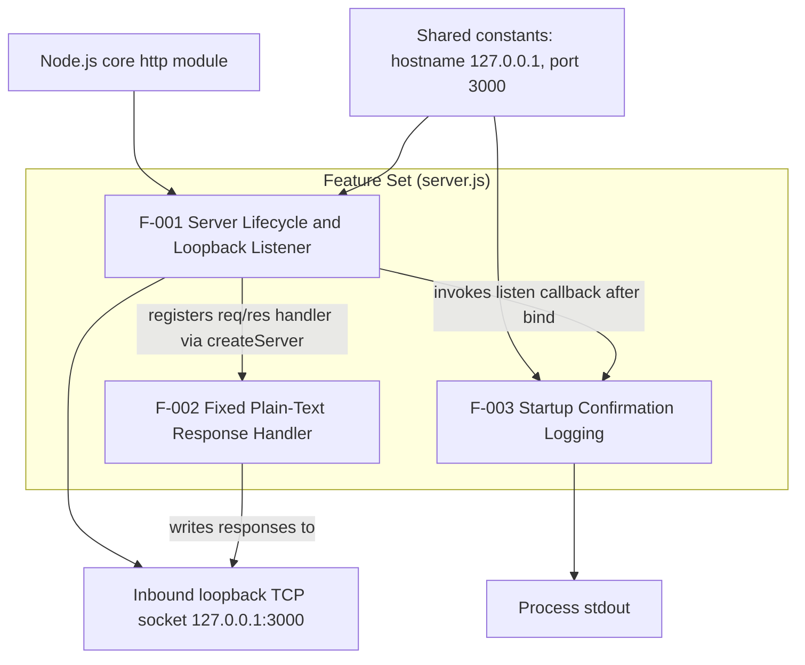
```mermaid
flowchart TD
    HTTP["Node.js core http module"]
    CONST["Shared constants: hostname 127.0.0.1, port 3000"]

    subgraph FeatureSet["Feature Set (server.js)"]
        F001["F-001 Server Lifecycle and Loopback Listener"]
        F002["F-002 Fixed Plain-Text Response Handler"]
        F003["F-003 Startup Confirmation Logging"]
    end

    HTTP --> F001
    CONST --> F001
    CONST --> F003
    F001 -->|"registers req/res handler via createServer"| F002
    F001 -->|"invokes listen callback after bind"| F003

    SOCK["Inbound loopback TCP socket 127.0.0.1:3000"]
    STDOUT["Process stdout"]
    F001 --> SOCK
    F002 -->|"writes responses to"| SOCK
    F003 --> STDOUT
```

**Feature dependencies (prerequisite relationships).**

| Feature | Depends On | Dependency Nature |
| --- | --- | --- |
| F-001 | None | Foundational — creates and starts the server |
| F-002 | F-001 | The `(req, res)` handler executes only within the server F-001 creates and starts |
| F-003 | F-001 | The log line fires only from F-001's `listen` callback, after binding succeeds |

**Integration points.** The system's only external interfaces are a single inbound network socket and the process's standard output; there are **no** outbound integrations.

| Integration Point | Direction | Feature(s) |
| --- | --- | --- |
| Loopback TCP socket `127.0.0.1:3000` | Inbound (HTTP requests in, responses out) | F-001, F-002 |
| Process `stdout` | Outbound (local stream) | F-003 |
| Node.js core `http` module | Internal library boundary | F-001, F-002 |

**Shared components.** The features share three concrete, code-level elements.

| Shared Component | Consumed By | Purpose |
| --- | --- | --- |
| Node.js core `http` module | F-001, F-002 | `createServer`/`listen` (F-001) and the `ServerResponse` API `res.statusCode`/`res.setHeader`/`res.end` (F-002) |
| `hostname` / `port` constants (`server.js` L3-4) | F-001, F-003 | The bind target (F-001) and the interpolated URL in the log line (F-003) |
| `server` object (`server.js` L6) | F-001, F-003 | Created by F-001; F-003's log runs from its `listen` callback |

**Common services.** The only common execution substrate is the **Node.js runtime and its single-threaded event loop**, which hosts all three features within one process. There are no application-level shared services — no database, cache, message broker, authentication service, or external configuration service exists in the repository (verified by the absence of any such artifacts and any third-party dependency). The `hostname`/`port` constants act as the single shared configuration source consumed by both F-001 and F-003.

## 2.4 Implementation Considerations

This subsection records implementation considerations per feature across five dimensions: technical constraints, performance requirements, scalability, security implications, and maintenance. Several considerations are system-wide and stem from the deliberately minimal design: the entire runtime is a single synchronous CommonJS file (`server.js`, 14 lines) that uses only the Node.js core `http` module, ships no build/test/deployment artifacts, and has no error handling or graceful shutdown. Where the repository defines no target (e.g., performance), that is stated explicitly rather than inferred.

### 2.4.1 F-001 — HTTP Server Lifecycle & Loopback Listener

| Consideration | Detail |
| --- | --- |
| Technical Constraints | Synchronous CommonJS; binds the loopback interface `127.0.0.1` only (not reachable remotely); host/port are hard-coded `const` values (no runtime reconfiguration); a single listener on a single port; no `'error'` event handler, so a bind failure (e.g., port `3000` already in use) would surface as an unhandled error rather than being caught, and there is no graceful shutdown |
| Performance Requirements | None defined in the repository; the listener runs on a single Node.js event loop with no tuning, keep-alive, or connection-limit configuration in code |
| Scalability | Single process only — no `cluster`, `worker_threads`, or load-balancing artifacts; scaling would be vertical and bounded by the single event loop; no horizontal-scaling or orchestration descriptors exist |
| Security Implications | Loopback-only binding confines exposure to the local host; transport is plain HTTP (no TLS); no authentication; port `3000` must be free (no fallback port logic) |
| Maintenance | Changing the bind target requires editing the `const` values in source and restarting; the 14-line file is trivial to maintain, but there are no automated tests or CI to guard against regressions |

### 2.4.2 F-002 — Fixed Plain-Text Response Handler

| Consideration | Detail |
| --- | --- |
| Technical Constraints | The response is a hard-coded literal with a fixed status (`200`), fixed header (`Content-Type: text/plain`), and fixed body (`Hello, World!\n`); there is no routing, request parsing, method/path branching, or content negotiation — a single response path serves every request |
| Performance Requirements | None defined in the repository; the handler performs constant-time work with no I/O, computation, or allocation beyond emitting the static string |
| Scalability | Statelessness makes the handler trivially safe under concurrency within the event loop, but overall throughput is bounded by the single process (no clustering) |
| Security Implications | Ignoring the request eliminates request-parsing/injection surface, but there is no authentication, authorization, rate limiting, or CORS handling, and transport remains plain HTTP; output is a fixed literal (no dynamic/user-influenced content) |
| Maintenance | Altering the response requires editing the three handler statements directly; there is no abstraction layer, so changes are simple but the design is not extensible (adding routes/behaviors would require refactoring) |

### 2.4.3 F-003 — Startup Confirmation Logging

| Consideration | Detail |
| --- | --- |
| Technical Constraints | A single `console.log` to `stdout` with no log levels, timestamps, structured formatting, or alternate destinations; it fires exactly once, in the `listen` callback; there is no request-level or error logging |
| Performance Requirements | None defined in the repository; a one-time synchronous write at startup |
| Scalability | Not applicable beyond per-process startup — each process instance emits exactly one line; there is no centralized or aggregated logging |
| Security Implications | The line contains only the non-sensitive bind URL (`http://127.0.0.1:3000/`); no secrets or request data are logged; output goes to `stdout` only |
| Maintenance | The logged URL is interpolated from the same `hostname`/`port` constants used for binding, so it remains consistent with the bind target automatically; no separate maintenance is needed unless logging is expanded |

## 2.5 Traceability Matrix

The matrix below provides bidirectional traceability from each functional requirement to (a) its parent feature, (b) the exact source evidence in `server.js`, and (c) the in-scope capability it satisfies in Section 1.3.1 (In-Scope). This links every requirement to both the implementation and the higher-level scope definition. All entries are baselined at requirement version **v1.0** (per Section 2.1).

| Requirement ID | Feature | Source Evidence | In-Scope Capability (§1.3.1) |
| --- | --- | --- | --- |
| F-001-RQ-001 | F-001 | `server.js` L1, L6 | #1 — HTTP listener |
| F-001-RQ-002 | F-001 | `server.js` L3-4, L12 | #1 — HTTP listener |
| F-001-RQ-003 | F-001 | `server.js` L3-4 | #1 — HTTP listener |
| F-002-RQ-001 | F-002 | `server.js` L7 | #2 — Fixed response |
| F-002-RQ-002 | F-002 | `server.js` L8 | #2 — Fixed response |
| F-002-RQ-003 | F-002 | `server.js` L9 | #2 — Fixed response |
| F-002-RQ-004 | F-002 | `server.js` L6-10 | #2 — Fixed response |
| F-003-RQ-001 | F-003 | `server.js` L12-14 | #3 — Startup log |

**Verification and cross-references.** Each requirement's acceptance criteria (Section 2.2) are verifiable against the **measurable objectives** table in Section 1.2.3, which maps the same behaviors (server starts/logs, status `200`, `Content-Type: text/plain`, body `Hello, World!\n`) to the same `server.js` lines. The end-to-end request/response flow that F-001 and F-002 realize is depicted in the process flowchart in Section 1.2.2 (High-Level Description → Core Technical Approach). The out-of-scope exclusions in Section 1.3.2 (routing, authentication, TLS, persistence, configuration management, tests/CI) explain why no additional features or requirements are cataloged here. Because the repository defines no roadmap or backlog (Section 1.4), the matrix is complete and stable at the v1.0 baseline with no pending or superseded requirements.

## 2.6 References

The following repository artifacts, verification steps, and specification sections were examined directly and cited as evidence for this Product Requirements section.

**Files**

- `server.js` - The sole runtime implementation (14 lines); the source of all three features and every functional requirement — HTTP server creation and loopback binding (F-001), the fixed `200`/`text/plain`/`Hello, World!\n` handler (F-002), and the startup log line (F-003). Confirmed use of only the Node.js core `http` module (`require('http')`), immutable `hostname`/`port` constants, and the absence of `process.env`, routing, error handling, and exports.
- `README.md` - Established the project name (`hao-backprop-test`) and its sole stated purpose ("test project for backprop integration"), used to frame each feature's business value.
- `app.py` - Confirmed to be a single non-functional prose line (not executable Python); no feature or requirement derives from it.

**Folders**

- `` (repository root) - Confirmed the complete file inventory (exactly `server.js`, `README.md`, `app.py`; no subfolders) and the absence of any manifest, configuration, dependency, test, or CI artifacts.

**Repository verification**

- Repository checkout inspection (terminal) - Confirmed there is no `package.json`, lockfile, `.env`, or `.gitignore`, and that `server.js` performs no `process.env` reads — grounding the "no external dependencies" and "no configuration management" statements throughout Sections 2.1–2.4.

**Cross-referenced technical specification sections**

- Section 1.1 Executive Summary - Value proposition (simplicity/reproducibility) and core-business-problem framing used in feature descriptions.
- Section 1.2 System Overview - The request/response process flowchart (1.2.2) referenced by the feature relationships and traceability matrix, and the success-criteria/measurable-objectives table (1.2.3) used to confirm requirement testability and the absence of KPIs/SLAs.
- Section 1.3 Scope - The three in-scope capabilities (1.3.1) that the feature set maps onto, and the out-of-scope exclusions (1.3.2) that bound the requirement set.
- Section 1.4 References - Git commit baseline (three commits dated 2026-07-20) supporting the v1.0 requirements baseline and the "no roadmap/backlog" statement.

No external or web sources were used; all findings derive from direct inspection of the repository and cross-references to Section 1 of this specification.

# 3. Technology Stack

## 3.1 Programming Languages

The `hao-backprop-test` repository uses a single programming language for its runtime behavior, a markup language for documentation, and contains one non-executable prose file. Every statement below is grounded in the three tracked files (`server.js`, `README.md`, `app.py`) and the confirmed absence of any language version manifest or pin.

**Languages by Component**

| Language | Component / File | Role | Evidence |
|---|---|---|---|
| JavaScript (ECMAScript, CommonJS) | `server.js` | Sole runtime implementation — the HTTP server | Uses `require('http')`, `const` bindings, an arrow-function request handler, and a template-literal log string |
| Markdown | `README.md` | Project documentation markup only | A `# hao-backprop-test` heading and a one-line description |
| None (misnamed `.py`) | `app.py` | Non-executable prose note; not an operative language | A single sentence beginning with a stray `U+201C` curly quotation mark; contains no Python statements, imports, or definitions |

> **Note on `app.py`:** Although the file carries a Python extension, Python is **not** an operative language of this system. `app.py` is a malformed prose note that would raise a `SyntaxError` if executed, and no Python runtime, module, package, or entry point exists anywhere in the repository. This is consistent with Section 1.2.2, which classifies `app.py` as non-functional.

**Language Version and Constraints**

| Item | Value | Source |
|---|---|---|
| JavaScript dialect | ES6+ features (`const` bindings, arrow functions, template literals) | `server.js` |
| Module system | CommonJS (`require`) | `server.js` line 1 |
| Execution runtime | Node.js v22.23.1 (npm 11.1.0), as reported by the inspection environment | `node --version` / `npm --version` |
| Version pinning | None — no `.nvmrc`, `.node-version`, `engines` field, or `package.json` exists | Repository file inventory |

**Selection Criteria and Justification.** The repository provides no prose rationale for its language choice, so the following reflects the observed engineering fit rather than a documented decision:

- JavaScript on Node.js expresses a complete HTTP server using only the runtime's standard library, requiring no compiler, no dependency installation, and no build step — an appropriate match for a minimal test fixture whose sole job is to answer any request with a fixed string.
- The single-file CommonJS form (`server.js`) launches directly with `node server.js`, keeping the operational surface limited to just the runtime.

**Constraints and Dependencies.**

- The code depends only on the Node.js runtime; it targets no explicitly pinned version, but its ES6 syntax requires any reasonably modern Node.js release (verified running under v22.23.1).
- Host (`127.0.0.1`) and port (`3000`) are hard-coded `const` values in `server.js`, so language-level configuration is immutable at runtime (cross-reference Section 2.4.1).
- `app.py` imposes no language constraint because nothing in the repository executes it.

**Technology Stack Overview.** The following diagram orients the entire Technology Stack section, showing the layers actually present in the repository alongside the technology categories that are verifiably absent.

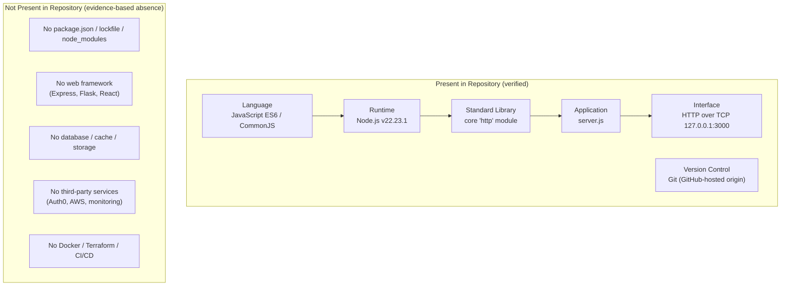
```mermaid
flowchart TB
    subgraph Present["Present in Repository (verified)"]
        Lang["Language<br/>JavaScript ES6 / CommonJS"]
        Runtime["Runtime<br/>Node.js v22.23.1"]
        Stdlib["Standard Library<br/>core 'http' module"]
        App["Application<br/>server.js"]
        Iface["Interface<br/>HTTP over TCP 127.0.0.1:3000"]
        VCS["Version Control<br/>Git (GitHub-hosted origin)"]
        Lang --> Runtime
        Runtime --> Stdlib
        Stdlib --> App
        App --> Iface
    end
    subgraph Absent["Not Present in Repository (evidence-based absence)"]
        NoDeps["No package.json / lockfile / node_modules"]
        NoFw["No web framework<br/>(Express, Flask, React)"]
        NoData["No database / cache / storage"]
        NoSvc["No third-party services<br/>(Auth0, AWS, monitoring)"]
        NoOps["No Docker / Terraform / CI/CD"]
    end
```


## 3.2 Frameworks & Libraries

The repository uses **no application framework and no third-party library**. The only framework-grade component in the runtime is the Node.js standard library, and within it a single module (`http`) is used. This is corroborated by Section 1.2.2, which states that the single external building block used by `server.js` is the Node.js standard-library `http` module and that "no third-party packages are involved."

**Core Framework / Runtime Library**

| Component | Type | Version | Role in the system |
|---|---|---|---|
| Node.js core `http` module | Standard-library module bundled with the runtime | Bound to the Node.js runtime (v22.23.1 observed) | Provides `http.createServer()` to create the listener and the `(req, res)` handler contract used to return the fixed response |

The `http` module is imported once (`const http = require('http')`, `server.js` line 1) and is the only building block beyond core language syntax. No other core modules (e.g., `fs`, `path`, `crypto`, `cluster`) are imported.

**Frameworks and Libraries Explicitly Not Present.** The following are commonly expected in a web/service stack but are verifiably absent here (no manifest declares them and no source imports them):

| Category | Examples checked | Status |
|---|---|---|
| Node.js web frameworks | Express, Koa, Fastify, Hapi, NestJS | Not present |
| Backend frameworks (other languages) | Flask, Django, FastAPI | Not present |
| Frontend / UI frameworks | React, React-Native, Vue, Angular | Not present |
| CSS frameworks | TailwindCSS | Not present |
| AI / orchestration frameworks | LangChain | Not present |
| Testing frameworks | Jest, Mocha, PyTest | Not present |

**Compatibility Requirements.** Because the sole dependency is the standard-library `http` module, the only compatibility contract is with the Node.js runtime itself — the `http` API surface is versioned together with the installed Node.js release. There are no inter-library version constraints, peer dependencies, or transitive compatibility concerns because no external libraries exist.

**Justification.** A fixed single-response HTTP endpoint requires only `http.createServer()` and `server.listen()`; a web framework (routing, middleware, templating) would add capability the fixture does not use. Relying solely on the core module keeps the project at zero installable dependencies and zero build steps, which is consistent with its role as a minimal test fixture (cross-reference Sections 1.3.1 and 2.4).

## 3.3 Open Source Dependencies

The repository declares, vendors, and locks **zero third-party open-source dependencies**. There is no package manifest, no lockfile, no installed dependency tree, and no evidence of any package-registry usage. This aligns with the Section 1.3.2 Out-of-Scope entry that records dependency management (`package.json`, lockfiles, `node_modules`) as "Not present."

**Dependency Inventory**

| Dependency-management aspect | Status | Evidence |
|---|---|---|
| Package manifest (`package.json`) | Absent | Repository file inventory (only `server.js`, `README.md`, `app.py`) |
| Lockfile (`package-lock.json`, `yarn.lock`, `pnpm-lock.yaml`, `npm-shrinkwrap.json`) | Absent | File inventory |
| Installed packages (`node_modules/`) | Absent | Directory check — no `node_modules` exists |
| Package registry usage (npm / other) | None referenced | No manifest, no install scripts, no registry configuration |
| Runtime-bundled dependency | Node.js standard library (open source, stewarded by the OpenJS Foundation) — used via `require('http')` | `server.js` line 1 |

**Registries and Versions.** No external package registry is referenced anywhere in the repository, so there are no registry-hosted package versions to enumerate. The only "dependency" is the Node.js standard library, whose version is that of the installed runtime (v22.23.1 observed in the inspection environment); it ships with the runtime rather than being resolved from a registry.

**Security Implications.** Carrying zero third-party dependencies means the project has **no external supply-chain attack surface**: there are no transitive packages that could introduce known vulnerabilities (CVEs), no lockfile to audit, and no dependency-update or scanning process required. The trade-off is that all functionality is limited to what the Node.js standard library provides, which is sufficient for this fixture's single fixed-response behavior.

## 3.4 Third-Party Services

The application integrates with **no third-party or external services**. `server.js` makes no outbound network calls, instantiates no service SDK or client, and reads no credentials or configuration. Section 1.2.1 characterizes the system as self-contained and isolated to the local host, and this subsection confirms that at the service-integration level.

**External Service Inventory**

| Category | Status in repository | Evidence |
|---|---|---|
| External APIs / integrations | None | No HTTP/REST client, no SDK import, no outbound request in `server.js`; the only network activity is the inbound loopback listener |
| Authentication services (e.g., Auth0) | None | No auth library, token verification, OAuth/OIDC configuration, or credentials |
| Monitoring / APM / observability services | None | No telemetry client or metrics exporter; the only output is a single startup `console.log` (cross-reference Section 2.4.3) |
| Cloud services (e.g., AWS) | None | No cloud SDK, service endpoint, region, or credential configuration |
| Messaging / brokers / email / other SaaS | None | Not present in code or configuration |

**Network Posture and Integration Requirements.** The server binds only to the loopback interface `127.0.0.1:3000` and answers inbound requests; it initiates no egress. Because no external services are integrated, there are **no integration requirements** (endpoints, API keys, service accounts, network egress rules) to satisfy in order to run the system. The only named integration context anywhere in the repository is the phrase "backprop integration" in `README.md`, for which — as Section 1.3.2 records — no implementing code, endpoints, credentials, or configuration exist.

**Security Implications.** With no external service dependencies, the application places no trust in, and transmits no data to, any third party. No application-level secrets or credentials are present in the tracked files (`server.js`, `README.md`, `app.py`). The only credential observed during inspection was an access token embedded in the local Git `origin` remote URL — a version-control transport credential rather than an application service integration; it lives in local Git configuration outside the tracked source, must be treated as a secret, and is deliberately not reproduced in this document.

## 3.5 Databases & Storage

The system is **entirely stateless** and uses no database or storage technology of any kind. Section 1.3.1 records the in-scope data domains as "None — no persistence and no request processing; the only datum is the static in-code string `Hello, World!\n`," and Section 1.3.2 lists persistence, databases, and external storage as "Not present." Direct inspection of `server.js` confirms this.

**Storage Inventory**

| Storage concern | Status in repository | Evidence |
|---|---|---|
| Primary database | None | No database driver, ORM, connection string, or query code (e.g., no MongoDB, PostgreSQL, MySQL) |
| Secondary database | None | Not applicable — no database layer exists at all |
| Caching layer | None | No cache client or in-memory cache library (e.g., no Redis, Memcached) |
| Object / file storage | None | No filesystem writes and no object-storage SDK; `fs` is not imported |
| Data persistence strategy | None (stateless) | The only datum served is the static literal `Hello, World!\n` (`server.js` line 9) |

**Data Persistence Strategy.** There is no persistence strategy because the application persists nothing. Every response is a hard-coded literal produced in constant time with no I/O beyond writing that string to the socket. No state survives a request, and no state survives process restart.

**Security Implications.** Because there is no data at rest, the system has no database or storage attack surface, stores no personally identifiable information (PII) or sensitive data, and has no associated concerns around encryption-at-rest, backups, access control, or data retention.

## 3.6 Development & Deployment

Development and deployment tooling is intentionally minimal: the runtime is executed directly, with no build, container, infrastructure, or automation layer. Sections 1.2.3 and 1.3.1 confirm there is "no build, install, or packaging step" required because there are no external dependencies.

**Development Tools**

| Tool | Purpose | Version / Evidence |
|---|---|---|
| Node.js | Executes `server.js` (the only runtime requirement) | v22.23.1 observed via `node --version` in the inspection environment |
| npm | Node package manager — present in the environment but **unused** (no manifest to install) | 11.1.0 observed via `npm --version` |
| Git | Version control | GitHub-hosted `origin` remote; branches `main` and `2007_test`; 3 commits |
| Linters / formatters | None | No `.eslintrc`, `.prettierrc`, `.editorconfig`, or `.babelrc` present |
| Test framework | None | No `test/`, `tests/`, `__tests__/`, or `spec/` directory and no test configuration |

**Build System.** None. `server.js` is executed as authored — there is no transpilation, bundling, or compilation step (no Babel, Webpack/Rollup/esbuild, or `tsc`) and no `Makefile`, `Procfile`, or npm build scripts. The launch procedure is simply `node server.js`.

**Containerization.** None. There is no `Dockerfile`, `docker-compose.yml`/`.yaml`, or `.dockerignore`; no container image is defined or referenced.

**CI/CD.** None. There is no `.github/workflows/` directory, `.gitlab-ci.yml`, or `.circleci/` configuration. Although the repository's `origin` remote is hosted on GitHub, no GitHub Actions (or other) pipelines are defined, so there is no automated build, test, or deployment workflow.

**Infrastructure as Code.** None. There is no Terraform (`.tf`), `infra/`, or other IaC artifact; no cloud or infrastructure resources are declared.

**Deployment / Runtime Procedure.** Deployment is manual and local: an operator runs `node server.js` on a host with a Node.js runtime, the process binds the loopback interface `127.0.0.1:3000`, and it logs `Server running at http://127.0.0.1:3000/`. Preconditions are a Node.js runtime and a free TCP port `3000`; there is no graceful shutdown or `'error'` handler, so a bind conflict surfaces as an unhandled error (cross-reference Section 2.4.1).

**Version Control Detail.** The project is tracked with Git and pushed to a GitHub-hosted `origin` remote. The history contains three commits — `Initial commit`, `Add files via upload` (`origin/main`), and `Create app.py` (`2007_test`, current `HEAD`) — with the `2007_test` branch differing from `main` only by the addition of `app.py`.

**Default Operational Stack — Absence Summary.** For completeness, the commonly expected operational technologies are verifiably absent from this repository:

| Technology | Status |
|---|---|
| Docker (containerization) | Not present |
| Terraform (infrastructure as code) | Not present |
| GitHub Actions (CI/CD) | Not present |
| AWS / cloud platform | Not present |

**Security Implications.** There is no CI/CD pipeline and therefore no pipeline secrets or automated deployment credentials to manage; conversely, there is also no automated dependency or security scanning. Deployment is manual and confined to the local host, which limits exposure but provides no built-in hardening, monitoring, or rollback mechanism.

## 3.7 References

The following repository artifacts and specification sections were examined as evidence for this Technology Stack section.

**Repository Files**

- `server.js` — The sole runtime implementation. Established the JavaScript (ES6/CommonJS) language, the exclusive use of the Node.js core `http` module, the absence of any external `require`/`import`, hard-coded `127.0.0.1:3000` binding, and the fixed HTTP 200 `text/plain` response.
- `README.md` — Project name (`hao-backprop-test`) and stated purpose ("test project for backprop integration"); Markdown documentation artifact.
- `app.py` — Confirmed to be a non-executable prose note (misnamed `.py`), establishing that Python is not an operative language of the system.

**Repository Structure and Configuration Checks**

- `/` (repository root) — Complete file inventory confirming only three tracked files and no subfolders; basis for the verified absence of manifests (`package.json`, lockfiles, `requirements.txt`, `pyproject.toml`, `tsconfig.json`), containerization (`Dockerfile`, `docker-compose.yml`), CI/CD (`.github/`, `.gitlab-ci.yml`, `.circleci/`), IaC (Terraform), linters/formatters, tests, `.env`, and `.nvmrc`/`.node-version`.
- `.git/` (Git metadata) — Version-control tooling evidence: GitHub-hosted `origin` remote, branches `main` and `2007_test`, and a three-commit history. (The access token embedded in the remote URL was treated as a secret and is not reproduced.)

**Runtime Environment (inspection environment)**

- `node --version` → Node.js **v22.23.1**; `npm --version` → npm **11.1.0** — Established the executing runtime version and that npm is present but unused (no manifest).

**Cross-Referenced Specification Sections**

- 1.2 System Overview — Confirmed the Node.js standard-library `http` module as the single external building block, the CommonJS approach, the Node.js v22.23.1 verification, and the "no build or packaging step" statement.
- 1.3 Scope — Out-of-Scope table enumerating dependency management, tests/CI, containerization/deployment, configuration management, persistence/databases, TLS, authentication, and monitoring as "Not present."
- 2.4 Implementation Considerations — Per-feature security, scalability, and maintenance considerations (loopback-only binding, plain HTTP, single event loop, no build/test/deployment artifacts).

# 4. Process Flowchart

## 4.1 System Workflows

This subsection documents the runtime workflows of `hao-backprop-test`. Because the entire runtime is the 15-line `server.js` — a single Node.js process that binds one loopback HTTP listener and returns one fixed response — the system exposes exactly **two** workflows: a one-time **startup / listener-initialization** workflow (features **F-001** and **F-003**) and a repeatable **request-handling** workflow (feature **F-002**). Every step, decision, and terminal state below is grounded in `server.js` and in behavior observed by running `node server.js` on Node.js v22.23.1. There is no routing, request parsing, conditional branching, persistence, or outbound call anywhere in the code, so the "core business process" is intentionally small, synchronous, and deterministic — a single request always follows a single path to a single response.

### 4.1.1 Workflow Actors and System Boundaries

The workflows involve three actors/systems, which are used as swim lanes in the diagrams that follow. The overall **system boundary** is one operating-system process hosting a single Node.js event loop (`server.js` line 6 creates the server; line 12 starts the listener). The process has only two external touchpoints: one inbound loopback TCP socket and the process's `stdout` stream.

| Actor / System (swim lane) | Role in the workflows | Boundary / touchpoint |
| --- | --- | --- |
| Operator (local host) | Starts the process via `node server.js`; the sole human touchpoint | Local shell &rarr; process `stdout` |
| Node.js Process (`server.js`) | Hosts the `http` listener (F-001), the fixed-response handler (F-002), and the startup log (F-003) inside one single-threaded event loop | Process boundary; owns listener + handler |
| Local HTTP Client | Issues HTTP requests to `127.0.0.1:3000` and consumes responses | Inbound loopback TCP socket `127.0.0.1:3000` |

There are **no other actors**. The repository contains no database, cache, message broker, authentication service, third-party API, or peer process (verified: the only `require` is `http`, and there is no `process.env`, `fs`, or outbound client code). Consequently, the workflows never cross the process boundary except to accept a request on the loopback socket and to write the single startup line to `stdout`.

### 4.1.2 High-Level System Workflow

The following high-level flowchart shows the end-to-end journey across all three swim lanes: the operator starts the process, the process initializes and either becomes ready or crashes, and thereafter each client request is dispatched to the fixed-response handler. Solid arrows are the primary flow; dashed arrows denote the repeatable, stateless request loop.

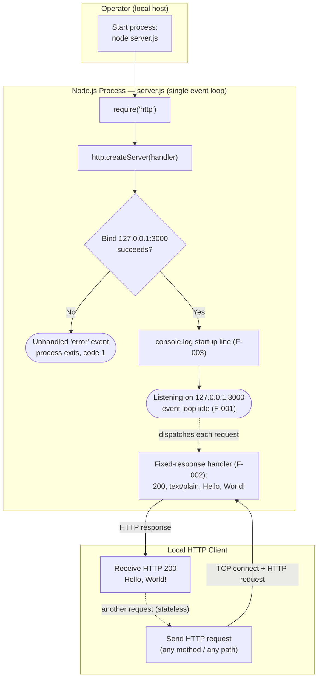
```mermaid
flowchart TD
    subgraph OPER["Operator (local host)"]
        A1["Start process:<br/>node server.js"]
    end
    subgraph PROC["Node.js Process — server.js (single event loop)"]
        B1["require('http')"]
        B2["http.createServer(handler)"]
        B3{"Bind 127.0.0.1:3000<br/>succeeds?"}
        B7(["Unhandled 'error' event<br/>process exits, code 1"])
        B4["console.log startup line (F-003)"]
        B5(["Listening on 127.0.0.1:3000<br/>event loop idle (F-001)"])
        B6["Fixed-response handler (F-002):<br/>200, text/plain, Hello, World!"]
    end
    subgraph CLIENT["Local HTTP Client"]
        C1["Send HTTP request<br/>(any method / any path)"]
        C2["Receive HTTP 200<br/>Hello, World!"]
    end
    A1 --> B1 --> B2 --> B3
    B3 -->|"No"| B7
    B3 -->|"Yes"| B4 --> B5
    C1 -->|"TCP connect + HTTP request"| B6
    B5 -.->|"dispatches each request"| B6
    B6 -->|"HTTP response"| C2
    C2 -.->|"another request (stateless)"| C1
```

**Reading the diagram.** The single decision point (`B3`) is the OS bind: on success the process logs its readiness line and enters the idle listening state; on failure it takes the only error path in the system (`B7`), an unhandled `'error'` event that terminates the process (detailed in Section 4.5). Once listening, the process is **event-driven and stateless** — every inbound request is dispatched to the same handler (`B6`) and produces the same response, so the client loop (`C1 → B6 → C2 → C1`) can repeat indefinitely with no shared state between iterations.

### 4.1.3 Core Business Process: Server Startup and Listener Initialization (F-001, F-003)

This is the one-time initialization workflow that must complete before any request can be served. It corresponds to feature **F-001** (server lifecycle / loopback listener) with its readiness log **F-003**, and executes synchronously top-to-bottom through `server.js`.

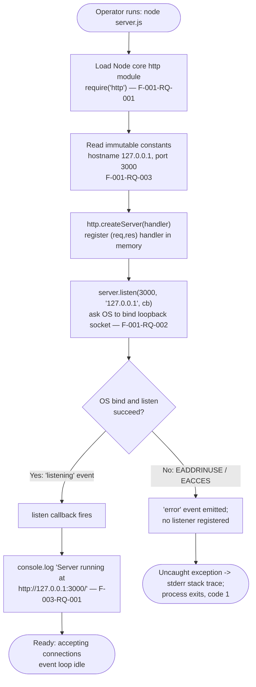
```mermaid
flowchart TD
    Start([Operator runs: node server.js]) --> Load["Load Node core http module<br/>require('http') — F-001-RQ-001"]
    Load --> Const["Read immutable constants<br/>hostname 127.0.0.1, port 3000<br/>F-001-RQ-003"]
    Const --> Create["http.createServer(handler)<br/>register (req,res) handler in memory"]
    Create --> Listen["server.listen(3000, '127.0.0.1', cb)<br/>ask OS to bind loopback socket — F-001-RQ-002"]
    Listen --> Bind{"OS bind and listen<br/>succeed?"}
    Bind -->|"Yes: 'listening' event"| Cb["listen callback fires"]
    Cb --> Log["console.log 'Server running at<br/>http://127.0.0.1:3000/' — F-003-RQ-001"]
    Log --> Ready([Ready: accepting connections<br/>event loop idle])
    Bind -->|"No: EADDRINUSE / EACCES"| Err["'error' event emitted;<br/>no listener registered"]
    Err --> Crash([Uncaught exception -> stderr stack trace;<br/>process exits, code 1])
```

**Start / end points.** The workflow **starts** when the operator runs `node server.js` and **ends** in one of two terminal states: `Ready` (listening) or `Crash` (process exit code 1).

**Process steps (grounded in `server.js`).** (1) Load the core `http` module (line 1); (2) resolve the immutable `hostname`/`port` constants (lines 3-4); (3) construct the server and register the request handler in memory (line 6); (4) call `server.listen(port, hostname, callback)` to request the OS binding (line 12).

**Decision point.** `Bind and listen succeed?` — the only startup decision. On success the runtime emits the internal `'listening'` event and invokes the `listen` callback, which logs the readiness line (lines 13-14); the logged URL is built from the same constants used to bind, so it always matches the bind target. On failure the runtime emits an `'error'` event.

**Error / recovery path.** `server.js` registers **no** `'error'` listener (verified: zero `.on(` calls), so a bind failure becomes an unhandled `'error'` event → uncaught exception. This was observed directly: launching a second instance on the busy port produced `Error: listen EADDRINUSE: address already in use 127.0.0.1:3000` and the process exited with code 1. There is no retry, backoff, or fallback — recovery requires operator intervention (free the port, then re-run). This path is expanded in Section 4.5.

**Timing / SLA considerations.** The repository defines **no** startup-time SLA or readiness timeout (consistent with Section 1.2.3 and Section 2.2, which record "None defined in repository"). Startup is a synchronous, dependency-free sequence with no build or install step; the readiness log fires exactly once, on the `'listening'` event.

### 4.1.4 Core Business Process: HTTP Request Handling (F-002)

This is the repeatable per-request workflow — the system's primary end-to-end user journey. It corresponds to feature **F-002** (fixed plain-text response handler) and runs once per inbound request after startup has reached the `Ready` state.

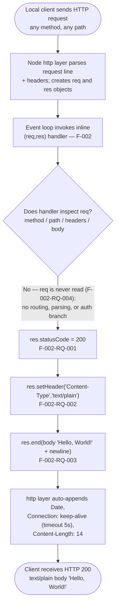
```mermaid
flowchart TD
    U([Local client sends HTTP request<br/>any method, any path]) --> Recv["Node http layer parses request line<br/>+ headers; creates req and res objects"]
    Recv --> Dispatch["Event loop invokes inline<br/>(req,res) handler — F-002"]
    Dispatch --> D1{"Does handler inspect req?<br/>method / path / headers / body"}
    D1 -->|"No — req is never read (F-002-RQ-004):<br/>no routing, parsing, or auth branch"| Set1["res.statusCode = 200<br/>F-002-RQ-001"]
    Set1 --> Set2["res.setHeader('Content-Type','text/plain')<br/>F-002-RQ-002"]
    Set2 --> EndS["res.end(body 'Hello, World!' + newline)<br/>F-002-RQ-003"]
    EndS --> Auto["http layer auto-appends Date,<br/>Connection: keep-alive (timeout 5s),<br/>Content-Length: 14"]
    Auto --> Resp([Client receives HTTP 200<br/>text/plain body 'Hello, World!'])
```

**Start / end points.** The workflow **starts** when a local client sends any HTTP request to `127.0.0.1:3000` and **ends** when the client receives the fixed `200` response.

**User touchpoint.** The single user touchpoint is the loopback endpoint `http://127.0.0.1:3000/`; any HTTP method and any path are accepted on it.

**Decision point.** `Does the handler inspect req?` — this is the only conceptual decision, and in the current code it always resolves to **No**: the handler never references `req` (verified: zero `req.` accesses; per **F-002-RQ-004** there is no routing, method/path branching, query/body parsing, or authorization branch). All requests therefore converge on one code path of three statements: set status `200` (line 7 / F-002-RQ-001), set `Content-Type: text/plain` (line 8 / F-002-RQ-002), and end the response with the body `Hello, World!\n` (line 9 / F-002-RQ-003).

**Observed behavior.** This single path was confirmed empirically: `GET /`, `POST /anything/else` (with a request body), and `DELETE /foo?bar=baz` each returned an identical `HTTP/1.1 200 OK`, `Content-Type: text/plain`, `Content-Length: 14`, body `Hello, World!\n`. The trailing 14th byte is the newline (`Hello, World!` is 13 characters). The Node `http` layer automatically appends the `Date`, `Connection: keep-alive`, and `Keep-Alive: timeout=5` headers; these are platform defaults, not set by application code.

**Timing / SLA considerations.** No latency, throughput, or availability target is defined in the repository. The handler performs no I/O or computation beyond writing a constant string, so response construction is synchronous and constant-size. The only observable timing value is Node's **default** HTTP keep-alive timeout of 5 seconds (`Keep-Alive: timeout=5`), a platform default rather than an application-configured SLA.

## 4.2 Integration Workflows

This subsection documents how data moves into and out of the system and how work is triggered. The integration surface is deliberately minimal: as established in Section 2.3, the system's only interfaces are **one inbound loopback TCP socket** (`127.0.0.1:3000`) and the process's **`stdout`/`stderr`** streams. `server.js` performs **no outbound network calls** and integrates with **no external system** (verified: the sole `require` is the Node core `http` module; there is no HTTP client, database driver, message-broker client, cloud SDK, or `process.env` usage). The workflows below therefore describe an inbound-only, self-contained integration model.

### 4.2.1 Data Flow and API Interactions

**Inbound data flow (request path).** A local HTTP client opens a TCP connection to the loopback socket; the Node `http` layer parses the request and dispatches it to the inline `(req, res)` handler. The handler **does not read the request** — no query string, body, or header is consumed (per **F-002-RQ-004**) — so no inbound data is transformed, validated, or persisted. The only data leaving the handler is the constant string `Hello, World!\n` plus the status line and headers.

**Outbound data flow (there is none to other systems).** The single non-network output is the startup line written once to `stdout` (**F-003**). No data is sent to any downstream system, file, queue, or API.

**API interactions.** The system's "API" is a single implicit HTTP endpoint that answers uniformly on every method and path; it is a **provider** of one response, never a **consumer** of any external API. There is no request/response serialization beyond writing the static text body, and no content negotiation.

The following integration sequence diagram traces both the startup exchange (including the failure branch) and the repeatable request exchange across the participant lanes (Operator, Node.js process, loopback socket, HTTP client, and console).

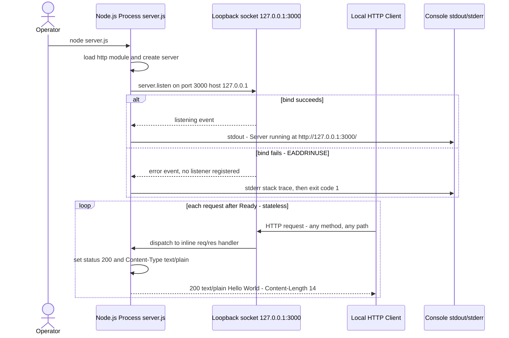
```mermaid
sequenceDiagram
    actor Operator
    participant Proc as Node.js Process server.js
    participant Sock as Loopback socket 127.0.0.1:3000
    participant Client as Local HTTP Client
    participant Con as Console stdout/stderr
    Operator->>Proc: node server.js
    Proc->>Proc: load http module and create server
    Proc->>Sock: server.listen on port 3000 host 127.0.0.1
    alt bind succeeds
        Sock-->>Proc: listening event
        Proc->>Con: stdout - Server running at http://127.0.0.1:3000/
    else bind fails - EADDRINUSE
        Sock-->>Proc: error event, no listener registered
        Proc->>Con: stderr stack trace, then exit code 1
    end
    loop each request after Ready - stateless
        Client->>Sock: HTTP request - any method, any path
        Sock->>Proc: dispatch to inline req/res handler
        Proc->>Proc: set status 200 and Content-Type text/plain
        Proc-->>Client: 200 text/plain Hello World - Content-Length 14
    end
```

The diagram makes the integration boundaries explicit: the only cross-boundary messages are (a) the operator's launch command, (b) the socket bind and its `listening`/`error` result, (c) the one `stdout` readiness line (or the `stderr` crash trace), and (d) the request/response pair on the loopback socket. No arrow ever leaves for an external host or service.

### 4.2.2 Event Processing and Batch Sequences

**Event processing.** The system's only "event processing" is the **Node.js event loop** dispatching the runtime's built-in events. `server.js` wires into exactly two of them implicitly: the `request` event (via the handler passed to `http.createServer`, `server.js` line 6) and the `listening` event (via the callback passed to `server.listen`, line 12). It registers **no** explicit event subscriptions — there are zero `.on(...)` / `addListener` calls — so there is no application-level event bus, pub/sub, streaming pipeline, or webhook processing. Notably, the `error` event is **not** subscribed, which is why a bind failure is unhandled (see Section 4.5).

**Batch and scheduled sequences.** There are **no batch or scheduled workflows** of any kind. The code contains no `setInterval`, `setTimeout`, timer, cron entry, job scheduler, worker thread, or CLI batch mode (verified: `setInterval`/`setTimeout` counts are zero, and there is no `package.json` script, queue consumer, or scheduler dependency). All work is reactive and single-shot per request; nothing is queued, buffered, or processed on a schedule.

| Integration / processing dimension | Status in repository | Evidence |
| --- | --- | --- |
| Inbound API endpoint | Present — one loopback HTTP endpoint (any method/path) | `server.js` lines 6-12 |
| Outbound API / service calls | None | No HTTP client, SDK, or `require` beyond `http` |
| Data transformation / serialization | None — static string response only | `server.js` line 9 |
| Event subscriptions (`.on`/listeners) | None explicit; two implicit callbacks (`request`, `listening`) | Zero `.on(` calls; lines 6, 12 |
| Message queue / pub-sub / streaming | None | No broker client or dependency |
| Batch / scheduled / cron jobs | None | No timers, scheduler, or `package.json` scripts |

## 4.3 Flowchart Requirements and Validation Rules

This subsection consolidates the standard flowchart elements for the two workflows defined in Section 4.1 and enumerates the validation, authorization, and compliance checkpoints that apply at each step. All entries reflect what is actually implemented in `server.js`; where a conventional element is absent, that absence is stated explicitly (consistent with the Validation Rules tables in Section 2.2), rather than inventing a control.

### 4.3.1 Workflow Element Coverage

The table maps each required flowchart element to the **Startup / Listener Initialization** workflow (Section 4.1.3, features F-001/F-003) and the **Request Handling** workflow (Section 4.1.4, feature F-002).

| Flowchart element | Startup workflow (F-001, F-003) | Request-handling workflow (F-002) |
| --- | --- | --- |
| Start point | Operator runs `node server.js` | Client sends any HTTP request to `127.0.0.1:3000` |
| End point(s) | `Ready` (listening) **or** `Crash` (exit code 1) | Client receives `200` + `Hello, World!\n` |
| Process steps | `require('http')` → read constants → `createServer` → `listen` (lines 1, 3-4, 6, 12) | parse request → dispatch to handler → set status → set header → `res.end` (lines 6-9) |
| Decision diamonds | One: "bind & listen succeed?" | One: "handler inspects `req`?" (always resolves **No**) |
| System boundaries | Single OS process / event loop; loopback socket bind | Same process; loopback socket in, response out |
| User touchpoints | Operator shell command; `stdout` readiness line | The endpoint `http://127.0.0.1:3000/` (any method/path) |
| Error states & recovery | Unhandled `'error'` → process exit; recovery = free port and re-run (Section 4.5) | None observed — handler ignores input and writes a constant response, so no application error branch exists |
| Timing / SLA | None defined; synchronous startup; readiness log fires once | None defined; synchronous constant-size response; Node default keep-alive `timeout=5s` |

### 4.3.2 Validation Rules, Authorization, and Compliance Checkpoints

The prompt calls for business rules, data-validation requirements, authorization checkpoints, and regulatory-compliance checks at each workflow step. Drawing directly on the Validation Rules already recorded per requirement in Section 2.2, the system implements only a small set of **implicit business rules** and **no** data validation, authorization, or compliance controls.

**Business rules (per step).**

- *Startup ordering (F-001):* the server must be listening before any request can be served; binding always targets the fixed loopback host/port (`127.0.0.1:3000`). (Section 2.2.1)
- *Readiness signalling (F-003):* the startup log fires **only after** `listen` succeeds, and the logged URL must match the bind target — guaranteed by reusing the same `hostname`/`port` constants. (Section 2.2.3)
- *Response determinism (F-002):* exactly one response shape is produced for all requests; the response is stateless and identical regardless of method, path, query, headers, or body. (Section 2.2.2)

**Data validation requirements.** None. The request is neither parsed nor validated — it is ignored by design (F-002-RQ-004). No startup input is accepted either (host/port are compile-time constants), so there is nothing to validate at initialization. This is reported as the observed posture per Section 2.2.

**Authorization checkpoints.** None. There is no authentication, authorization, session, API key, or rate-limiting check at any step. The only *de facto* access control is a network-reachability constraint: the listener binds to the loopback interface only, so it is not reachable from other hosts by default (Section 1.2.1, Section 2.2.1 Security Requirements). This is a consequence of the bind address, not an authorization control in code.

**Regulatory / compliance checks.** None defined in the repository. Sections 2.2.1-2.2.3 record "Compliance Requirements: None defined in repository" for every requirement, and there is no audit logging, data-retention, PII handling, or consent logic anywhere in `server.js` (the system processes no user data beyond a discarded, unread request).

| Checkpoint category | Requirement in this system | Evidence / status |
| --- | --- | --- |
| Business rules | Listen-before-serve; deterministic single response; readiness log after bind | Implicit in `server.js` lines 6-14 (Section 2.2) |
| Data validation | Not applicable — request ignored; no startup input | `req` never read; constants only (F-002-RQ-004) |
| Authorization | None in code; loopback-only reachability is the sole *de facto* limit | Bind to `127.0.0.1` (line 3, 12) |
| Regulatory compliance | None defined | Section 2.2.1-2.2.3 "None defined in repository" |

## 4.4 State Management

This subsection describes how the system manages state. The overriding fact is that `hao-backprop-test` is **stateless at the application level**: it holds no session, user, or business data, persists nothing, and caches nothing. The only meaningful "state" is the **process lifecycle** (which server object stage the process is in) and the **transient, per-request** `req`/`res` objects that Node creates and discards for each connection. All statements below are grounded in `server.js` and the runtime behavior observed on Node.js v22.23.1.

### 4.4.1 Process and Connection State Transitions

The process moves through a small, well-defined lifecycle. The following state transition diagram captures every state and transition, including the two terminal outcomes (crash on bind failure, and external termination). There is no graceful-shutdown state because `server.js` registers no signal handler and never calls `server.close()` (verified: zero `process.on`, `SIGINT`, `SIGTERM`, and `.close(` occurrences) — the `Terminated` state is therefore reached only by an external signal such as Ctrl-C or `kill`.

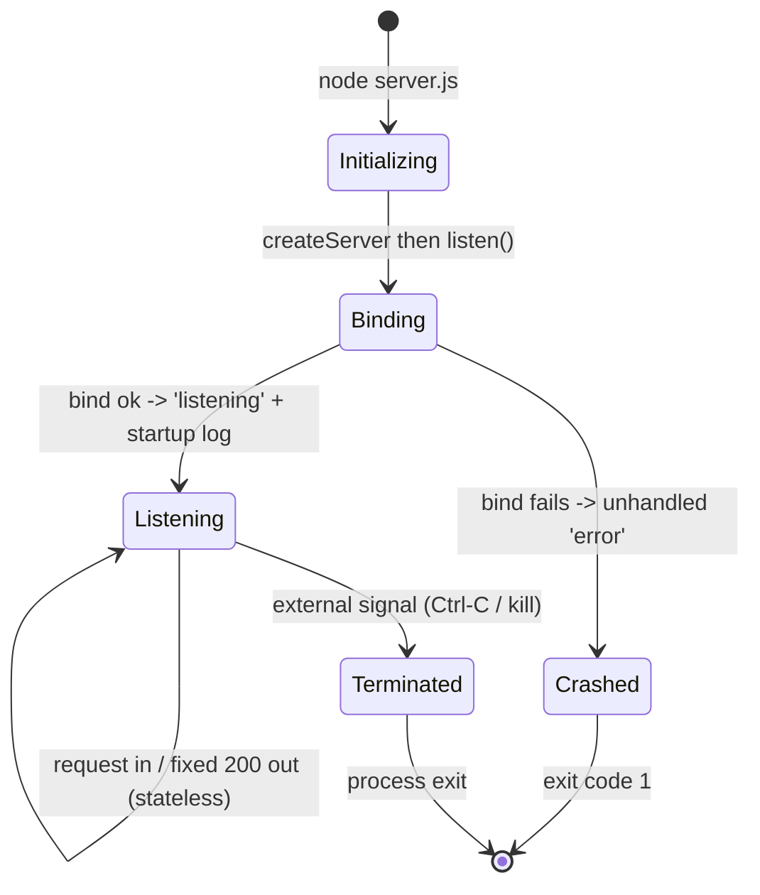
```mermaid
stateDiagram-v2
    [*] --> Initializing: node server.js
    Initializing --> Binding: createServer then listen()
    Binding --> Listening: bind ok -> 'listening' + startup log
    Binding --> Crashed: bind fails -> unhandled 'error'
    Listening --> Listening: request in / fixed 200 out (stateless)
    Listening --> Terminated: external signal (Ctrl-C / kill)
    Crashed --> [*]: exit code 1
    Terminated --> [*]: process exit
```

**State descriptions.**

- *Initializing* — the module loads (`require('http')`) and the server object is constructed with its handler (`server.js` lines 1, 6). No socket is bound yet.
- *Binding* — `server.listen(3000, '127.0.0.1', ...)` asks the OS to bind the loopback socket (line 12). This is a transient state with two possible outcomes.
- *Listening* — the bind succeeded, the `'listening'` event fired, the readiness line was logged (F-003), and the event loop is idle awaiting connections. Each inbound request is a **self-transition**: the process handles it and returns to the same `Listening` state with **no state carried over** between requests (stateless per-request processing).
- *Crashed* — the bind failed (e.g., `EADDRINUSE`), the unhandled `'error'` event propagated as an uncaught exception, and the process exited with code 1 (observed). Terminal.
- *Terminated* — the operator stopped the process via an external signal; the process exits. Terminal.

**Connection state.** At the connection level, state is owned entirely by the Node `http` layer, not by application code: for each request Node creates fresh `IncomingMessage` (`req`) and `ServerResponse` (`res`) objects, the handler writes the response and calls `res.end`, and those objects become eligible for garbage collection. Because the handler never stores anything, there is no cross-request or cross-connection state to manage.

### 4.4.2 Data Persistence, Caching, and Transaction Boundaries

**Data persistence points.** There are **none**. `server.js` performs no disk, database, or external writes (verified: no `fs`, no database driver, no `require` beyond `http`). The only in-memory state is the `server` object created on line 6; the response body is the compile-time constant string `Hello, World!\n` (line 9). Nothing survives process exit, and there is no data store to initialize, migrate, or back up.

**Caching requirements.** There is **no caching layer** and no cache-control behavior. The handler sets only `Content-Type` (line 8); it does **not** emit `Cache-Control`, `ETag`, `Last-Modified`, or any other cache-directive header. The fixed response is a hard-coded literal rather than a cached computation, so there is no cache to populate, invalidate, or expire.

**Transaction boundaries.** There are **no transactions**. With no database or multi-step unit of work, each request is an independent, synchronous, single-write operation (`res.statusCode` → `res.setHeader` → `res.end`) with no shared mutable state, no locking, and no rollback semantics. The effective "transaction boundary" is the single handler invocation, which either completes the three statements or does not run at all; there is no partial-commit or compensation logic to consider.

| State-management dimension | Status in repository | Evidence |
| --- | --- | --- |
| Persistent data store | None | No `fs`/DB driver; only `require('http')` |
| In-memory application state | Only the `server` object + transient per-request `req`/`res` | `server.js` line 6; Node-managed per request |
| Caching layer / cache headers | None; only `Content-Type` header set | `server.js` line 8 (no `Cache-Control`/`ETag`) |
| Transaction boundary | Single synchronous handler invocation; no DB transaction | `server.js` lines 7-9 |
| Graceful shutdown / drain | None — no signal handler, no `server.close()` | Zero `process.on`/`SIGINT`/`.close(` |

## 4.5 Error Handling

This subsection documents the system's error-handling behavior. The defining characteristic is that `server.js` contains **no application-level error handling** — there is no `try`/`catch`, no `'error'` or `'clientError'` listener, and no process-signal handler (verified: zero `try`, `catch`, and `.on(` occurrences). Error behavior is therefore whatever the Node.js `http` layer and runtime do by **default**. The scenarios below are grounded in behavior observed directly on Node.js v22.23.1.

### 4.5.1 Error Handling Flow

Three error scenarios are relevant, and the flowchart below shows how each is (or is not) handled. Only one path is fatal.

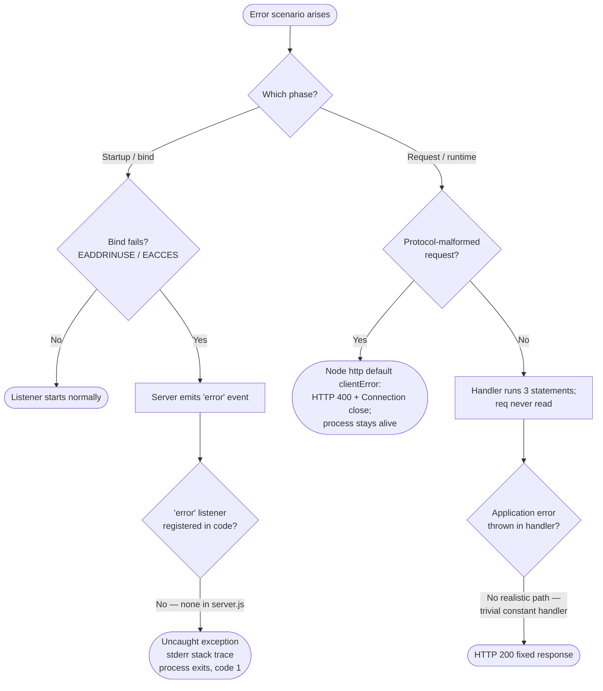
```mermaid
flowchart TD
    Start([Error scenario arises]) --> Q0{"Which phase?"}
    Q0 -->|"Startup / bind"| S1{"Bind fails?<br/>EADDRINUSE / EACCES"}
    S1 -->|"No"| Sok([Listener starts normally])
    S1 -->|"Yes"| S2["Server emits 'error' event"]
    S2 --> S3{"'error' listener<br/>registered in code?"}
    S3 -->|"No — none in server.js"| S4(["Uncaught exception<br/>stderr stack trace<br/>process exits, code 1"])
    Q0 -->|"Request / runtime"| R1{"Protocol-malformed<br/>request?"}
    R1 -->|"Yes"| R2(["Node http default clientError:<br/>HTTP 400 + Connection close;<br/>process stays alive"])
    R1 -->|"No"| R3["Handler runs 3 statements;<br/>req never read"]
    R3 --> R4{"Application error<br/>thrown in handler?"}
    R4 -->|"No realistic path —<br/>trivial constant handler"| R5([HTTP 200 fixed response])
```

**Scenario 1 — Startup bind failure (the only fatal path).** If the loopback socket cannot be bound (for example, port `3000` already in use), the server emits an `'error'` event. Because no `'error'` listener is registered, Node treats it as an unhandled `'error'` event and throws, producing an uncaught exception. Observed directly: a second instance on the busy port printed `Error: listen EADDRINUSE: address already in use 127.0.0.1:3000` to `stderr` and the process exited with code 1. No recovery is attempted.

**Scenario 2 — Protocol-malformed request (absorbed by Node default).** If a client sends a protocol-level malformed request, the Node `http` layer's default `clientError` handling responds and closes the connection. Observed directly: sending an illegal header line returned `HTTP/1.1 400 Bad Request` with `Connection: close`, and **the server remained alive** and continued serving. This is a platform default, not application logic, and it is non-fatal.

**Scenario 3 — Application error in the handler (no realistic path).** The handler executes only three synchronous statements and never reads `req`, performs I/O, or calls into other code, so there is no realistic condition under which it throws. The normal outcome is the fixed `HTTP 200` response.

### 4.5.2 Retry, Fallback, Notification, and Recovery Posture

Because there is no error-handling code, the mechanisms the prompt asks about are all **absent**; the table records the observed posture and the evidence for each.

| Mechanism | Status in repository | Observed behavior / evidence |
| --- | --- | --- |
| Retry / backoff | None | Bind failure is not retried — a single unhandled `'error'` terminates the process (Scenario 1) |
| Fallback / degraded mode | None | No alternate response, circuit breaker, or fallback branch; the handler has one code path (`server.js` lines 6-10) |
| Error notification | None beyond default streams | The only "notification" is Node's default crash stack trace on `stderr`; there is no alerting, error-log file, or monitoring hook |
| Recovery procedure | Manual / operator-driven | After a crash, the operator must remove the cause (e.g., free port `3000`) and re-run `node server.js`; there is no supervisor, restart policy, or health check in the repository |

**Retry mechanisms.** None. Neither the bind step nor the request path retries on failure; there is no backoff, timeout-and-retry, or attempt counter anywhere in the code.

**Fallback processes.** None. There is no secondary response, cached fallback, circuit breaker, or graceful-degradation branch — the request path is unconditional and singular.

**Error notification flows.** None are implemented. A startup failure surfaces only as Node's default uncaught-exception trace on `stderr` (Scenario 1); there is no structured error logging, no notification channel, and no metrics/monitoring emission (consistent with Section 1.3.2, which lists logging/monitoring frameworks and error handling as "Not present").

**Recovery procedures.** Recovery is entirely manual. The process does not self-heal or restart; there is no process supervisor (e.g., no `package.json` start script, systemd unit, container restart policy, or watchdog) in the repository. Operator recovery from the one fatal path is to resolve the underlying condition and start the process again.

## 4.6 References

This section was authored strictly from direct inspection of the repository, verification of runtime behavior, and cross-referencing of already-written Technical Specification sections. All evidence sources are listed below.

**Repository files and folders examined**

- `server.js` — the sole runtime implementation; source of every workflow step, decision point, state transition, and error path documented in Sections 4.1-4.5 (server creation line 6, listen/startup lines 12-14, fixed-response handler lines 6-10, constants lines 3-4).
- `README.md` — established the project identity (`hao-backprop-test`) and its stated purpose ("test project for backprop integration").
- `app.py` — confirmed to be a non-functional prose note contributing no runtime behavior; therefore not part of any workflow.
- Repository root (`/`) — confirmed the complete inventory of exactly three files with no subfolders, no manifests (`package.json`, lockfiles), and no CI/CD, container, or configuration artifacts, establishing the absence of integrations, persistence, and error-handling code.

**Technical Specification sections cross-referenced**

- `1.2 System Overview` — system framing and the existing high-level request/response flow; success criteria and "no KPIs/SLAs" basis.
- `1.3 Scope` — in-scope capabilities and the explicit out-of-scope list (no routing, auth, TLS, persistence, config management, logging/monitoring, error handling, graceful shutdown), used to state absences accurately.
- `2.1 Feature Catalog` — feature identifiers F-001 (HTTP Server Lifecycle & Loopback Listener), F-002 (Fixed Plain-Text Response Handler), and F-003 (Startup Confirmation Logging).
- `2.2 Functional Requirements` — requirement identifiers (`F-XXX-RQ-YYY`) and the per-requirement Validation Rules (business rules, data validation, security, compliance) underpinning Section 4.3.
- `2.3 Feature Relationships` — integration points (inbound loopback socket, `stdout`), shared components, and the confirmation of no outbound integrations.

**Runtime verification (observed behavior)**

- Direct execution of `server.js` on the Node.js v22.23.1 runtime present in the inspection environment established: the exact startup log line; identical `HTTP/1.1 200 OK`, `Content-Type: text/plain`, `Content-Length: 14`, body `Hello, World!\n` responses for `GET`, `POST`, and `DELETE` across different paths; the auto-appended `Date`/`Connection`/`Keep-Alive` headers; the `EADDRINUSE` unhandled-`'error'` crash with exit code 1; and the default `HTTP 400 Bad Request` (`Connection: close`, process survives) response to a protocol-malformed request. No external or web sources were used.

# 5. System Architecture

## 5.1 High-Level Architecture

Section 5 documents the architecture of `hao-backprop-test` as it actually exists in the repository. The entire runtime is a single-file Node.js HTTP server (`server.js`) that binds one loopback listener and returns one fixed response; there is no application framework, no persistence, no external integration, and no build step (cross-reference Sections 3.2, 3.4, and 3.5). Because the implementation is intentionally minimal, this section describes the architecture at the level of **logical components within one process** and the **platform layers** beneath them, and it explicitly records where common architectural concerns are **absent by design** rather than inventing structure the code does not contain. Every claim is grounded in `server.js` and, where behavioral, in runtime observations captured on Node.js v22.23.1.

### 5.1.1 System Overview

**Architectural style.** `hao-backprop-test` is a **single-process, single-threaded, event-driven server** implemented as one CommonJS module. All behavior lives in `server.js`, which imports one platform module (`http`), defines two configuration constants, binds one TCP socket, and serves one response. There is no service decomposition, no tiered/layered application code beyond the implicit application-over-platform split, and no inter-process, inter-service, or outbound network communication — the only ingress is the inbound HTTP endpoint (`server.js` lines 6, 12).

**Rationale.** The style follows directly from the project's stated purpose — a "test project for backprop integration" (`README.md`) — and its observed behavior as a fixed `Hello, World!` endpoint. A minimal, dependency-free program is the smallest artifact that can act as a running HTTP target: it launches with `node server.js`, requires no install or packaging step, and carries zero third-party supply-chain surface (cross-reference Section 3.3). The tradeoffs of this deliberately minimal choice are examined in Section 5.3.

**Key architectural principles and patterns (as observed):**

- **Reactor / event-loop pattern.** The Node.js event loop dispatches runtime events to callbacks. The application registers exactly two callbacks implicitly — the `(req, res)` request handler passed to `http.createServer` (line 6) and the `listen` callback (line 12) — and no explicit event listeners (verified: zero `.on(` calls).
- **Statelessness.** No state is carried between requests; every request is processed independently and yields an identical response (cross-reference Section 4.4).
- **Zero-dependency, standard-library-only composition.** The sole building block beyond core JavaScript is the Node core `http` module (`server.js` line 1).
- **Single, unconditional request path.** The handler never inspects `req`, so there is no routing, branching, or content negotiation — one code path serves all requests (`server.js` lines 6-10).
- **Compile-time configuration.** Host and port are immutable `const` values in source (lines 3-4) rather than externalized configuration; this is a deliberate departure from twelve-factor-style externalized config and is recorded as an assumption below.

**System boundaries and major interfaces.** The system boundary is exactly one operating-system process hosting one Node.js event loop (cross-reference Section 4.1.1). That boundary is crossed by only two interfaces:

- **Inbound HTTP interface** — a single TCP listener on the loopback address `127.0.0.1:3000` (`server.js` lines 3-4, 12). It accepts any HTTP method on any path and is not reachable from other hosts.
- **Console output interface** — the process `stdout`/`stderr` streams, used for the one-time startup readiness line on `stdout` and, on a fatal bind error, the default crash stack trace on `stderr`.

There are **no other interfaces**: no outbound network calls, no database or file I/O, no message bus, and no configuration or secrets inputs (cross-reference Sections 3.4 and 4.2).

**Architectural assumptions (documented explicitly):**

- Execution occurs on a single local host; the loopback bind assumes co-located client and server.
- A Node.js runtime is present (no version is pinned in the repository; v22.23.1 was observed). Because only Node core is used, no dependency installation is assumed.
- TCP port `3000` on the loopback interface is free at startup; there is no fallback port.
- The local environment is trusted — no authentication or transport security is applied, and exposure is confined to the local host.
- A single instance is sufficient; no concurrency, high-availability, or horizontal-scaling requirement is expressed anywhere in the repository.
- Nothing needs to persist; the system is stateless by design.

**Relevant standards and patterns referenced:** HTTP/1.1 message semantics (as implemented by the Node core `http` module), the CommonJS module system (`require`), and the Node.js reactor / single-event-loop concurrency model.

The following diagram gives the layered, high-level view: the local host actors, the logical components inside the single Node.js process, and the runtime/OS platform layers beneath them.

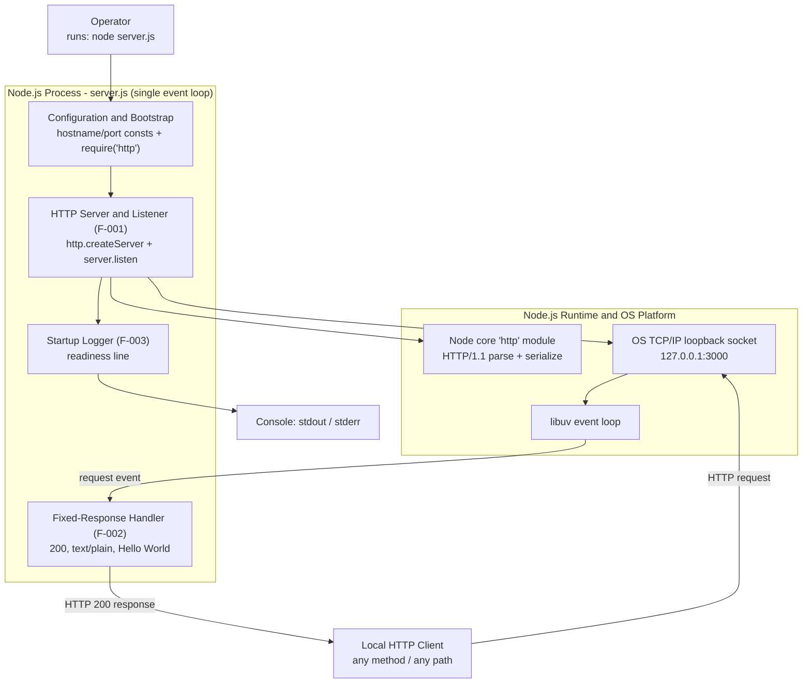
```mermaid
flowchart TB
    Operator["Operator<br/>runs: node server.js"]
    Client["Local HTTP Client<br/>any method / any path"]
    Stdout["Console: stdout / stderr"]
    subgraph Process["Node.js Process - server.js (single event loop)"]
        Bootstrap["Configuration and Bootstrap<br/>hostname/port consts + require('http')"]
        Listener["HTTP Server and Listener (F-001)<br/>http.createServer + server.listen"]
        Handler["Fixed-Response Handler (F-002)<br/>200, text/plain, Hello World"]
        Logger["Startup Logger (F-003)<br/>readiness line"]
    end
    subgraph Platform["Node.js Runtime and OS Platform"]
        HttpMod["Node core 'http' module<br/>HTTP/1.1 parse + serialize"]
        EventLoop["libuv event loop"]
        TcpStack["OS TCP/IP loopback socket<br/>127.0.0.1:3000"]
    end
    Operator --> Bootstrap
    Bootstrap --> Listener
    Listener --> HttpMod
    Listener --> TcpStack
    Listener --> Logger
    Logger --> Stdout
    Client -->|"HTTP request"| TcpStack
    TcpStack --> EventLoop
    EventLoop -->|"request event"| Handler
    Handler -->|"HTTP 200 response"| Client
```

### 5.1.2 Core Components

The system has no physically separate components; the "components" below are the **logical regions of `server.js`** plus the **platform building blocks** they depend on. Feature identifiers (F-001, F-002, F-003) are carried over from Section 2 for traceability. The first table records responsibility, dependencies, and integration points (limited to four columns per the documentation standard); the second table records the critical consideration for each component.

| Component | Primary Responsibility | Key Dependencies | Integration Points |
| --- | --- | --- | --- |
| Configuration & Bootstrap (`server.js` L1, L3-4) | Import the `http` module and define the immutable `hostname`/`port` constants that parameterize the listener | Node.js `require`; core `http` module | Supplies the bind address to the HTTP Server & Listener; takes no external input (no env vars or config files) |
| HTTP Server & Listener — F-001 (`server.js` L6, L12-14) | Create the server object and bind the loopback socket `127.0.0.1:3000`; enter the listening state | Configuration constants; core `http`; OS TCP/IP stack | Inbound loopback socket; registers the Fixed-Response Handler; invokes the Startup Logger callback |
| Fixed-Response Handler — F-002 (`server.js` L6-10) | Answer every request with status `200`, `Content-Type: text/plain`, body `Hello, World!\n`; the request is never read | `http` `ServerResponse` API; event-loop dispatch | Consumes the `request` event from the listener; emits the HTTP response to the client |
| Startup Logger — F-003 (`server.js` L12-14) | Emit the one-time readiness line once the socket is bound | `console.log`; the `listen` callback; `hostname`/`port` consts | Outbound to `stdout` only |
| Node core `http` module (platform) | Provide `createServer`/`ServerResponse`, HTTP/1.1 parsing and serialization, and default client-error handling | Node.js runtime | Underpins the Listener and Handler; parses inbound requests and serializes responses onto the socket |
| Node.js runtime & OS platform (event loop + TCP stack) | Run the single-threaded event loop, own connection state, and deliver `request`/`listening`/`error` events | Operating-system sockets | Hosts the process; bridges the OS loopback socket to application callbacks |

| Component | Critical Considerations |
| --- | --- |
| Configuration & Bootstrap | Host/port are compile-time `const`s — reconfiguration requires a source edit and restart; there is no environment/file override and no fallback port |
| HTTP Server & Listener — F-001 | Single listener on a single port, loopback-only (not remotely reachable); **no `'error'` listener is registered**, so a bind failure is fatal (process exit code 1); there is no graceful shutdown / `server.close()` |
| Fixed-Response Handler — F-002 | One unconditional, constant-time code path; no routing, validation, or authorization; stateless and safe under concurrency, but not extensible without refactoring |
| Startup Logger — F-003 | A single unstructured line to `stdout`; no timestamps, log levels, or request logging; it is the only observability signal the system emits |
| Node core `http` module | The sole runtime dependency; its API surface is versioned with the Node release, and it supplies platform defaults (keep-alive timeout 5 s; auto `Date`/`Content-Length` headers) |
| Node.js runtime & OS platform | A single process and single event loop imply vertical scaling only (no `cluster`/`worker_threads`); overall throughput is bounded by the one event loop |

### 5.1.3 Data Flow Description

**Primary data flows.** There is one request/response flow and one startup log flow, both within or emanating from the single process (cross-reference Section 4.2.1):

- *Inbound request path.* A local client opens a TCP connection to the loopback socket; the Node core `http` module parses the request line and headers and raises a `request` event; the event loop invokes the inline `(req, res)` handler. The handler **does not read `req`** (verified: zero `req.` accesses), so no inbound data — method, path, query, headers, or body — is consumed, transformed, validated, or persisted.
- *Outbound response path.* The handler sets status `200`, sets `Content-Type: text/plain`, and writes the constant body `Hello, World!\n`; the `http` module serializes the status line, headers, and body back onto the same socket.
- *Startup log flow.* Once the socket is bound, the `listen` callback writes exactly one readiness line to `stdout` (`server.js` lines 13-14). No data is ever sent to any downstream system, file, queue, or API.

**Integration patterns and protocols.** The externally visible protocol is **HTTP/1.1 over TCP** on the loopback interface, following a synchronous **request/response** pattern; the server is purely a *provider* of one response and never a *consumer* of any external API. Internally, the "components" communicate by **in-process function calls and closures** (the handler is a closure passed to `createServer`; the logger is a closure passed to `listen`) dispatched by the Node event loop — there are no internal network hops, queues, or serialization boundaries between components.

**Data transformation points.** There are effectively none at the application level. The response body is a compile-time string literal rather than a computed or templated value, so the only transformations are performed by the platform: the `http` module serializes the fixed status/headers/body onto the wire and auto-appends `Date`, `Connection: keep-alive`, `Keep-Alive: timeout=5`, and `Content-Length: 14` (the byte length of `Hello, World!\n`, verified). The startup URL string is the one interpolation in the code, built from the same `hostname`/`port` constants used to bind, so it always matches the bind target.

**Key data stores and caches.** There are **none**. The system is stateless: no database, no file storage, and no cache client exist (cross-reference Section 3.5). No cache-control semantics are emitted — the handler sets only `Content-Type` and never `Cache-Control`, `ETag`, or `Last-Modified` (cross-reference Section 4.4.2). The only in-memory state is the long-lived `server` object created on line 6 and the transient per-request `req`/`res` objects that Node creates and garbage-collects for each connection; nothing survives a process restart.

### 5.1.4 External Integration Points

The application integrates with **no external or third-party services** (cross-reference Section 3.4). It performs no outbound network calls, instantiates no SDK or client, and reads no credentials or configuration. Consequently, this subsection documents the system's two boundary touchpoints rather than any external system integrations, and records the external-service categories as verifiably absent. No SLA, latency, throughput, or availability target is defined anywhere in the repository; where a timing value appears it is a platform default, not an application-configured commitment.

| Touchpoint / System | Integration Type | Protocol / Format | SLA Requirements |
| --- | --- | --- | --- |
| Inbound endpoint `127.0.0.1:3000` | Inbound provider (server) — accepts any method/path | HTTP/1.1 over TCP; `text/plain` response body | None defined in repository; only platform default observed (keep-alive `timeout=5`) |
| Process `stdout` / `stderr` | Outbound console stream (local only) | Plain-text line(s); one startup line, plus default crash trace on fatal error | None defined in repository |
| External APIs / databases / auth / cloud / message brokers / APM | None — no egress of any kind | Not applicable (no client, SDK, or driver present) | Not applicable |

The only named integration context anywhere in the repository is the phrase **"backprop integration"** in `README.md`; the repository contains no code, endpoint, credential, or configuration that implements such an integration (cross-reference Sections 1.2.1 and 3.4).

## 5.2 Component Details

This subsection details each logical component introduced in Section 5.1.2 across five dimensions — purpose/responsibilities, technologies/frameworks, key interfaces/APIs, data persistence, and scaling considerations — followed by the required interaction, state-transition, and sequence diagrams. Because the whole system is one file, the components are code regions of `server.js` and the platform building blocks they call; none is independently deployable.

### 5.2.1 Configuration & Bootstrap Component

- **Purpose and responsibilities.** Load the single runtime dependency and establish the immutable bind parameters. It imports the `http` module and declares the `hostname` (`127.0.0.1`) and `port` (`3000`) constants that parameterize both the listener and the startup log (`server.js` lines 1, 3-4).
- **Technologies and frameworks.** Core JavaScript (`const`) and the CommonJS module system (`require`). No configuration framework, `dotenv`, or `process.env` usage exists (verified: zero `process.env` references).
- **Key interfaces and APIs.** `require('http')` (the only `require` in the program) and two module-scope constants consumed by `server.listen` (line 12) and the log template (line 13).
- **Data persistence requirements.** None. The values are source-code literals; there is no external configuration store, environment override, or file read.
- **Scaling considerations.** Configuration is fixed per process; changing the bind target requires a source edit and restart. There is no runtime reconfiguration and no fallback port, so each instance is pinned to `127.0.0.1:3000`.

### 5.2.2 HTTP Server & Listener Component (F-001)

- **Purpose and responsibilities.** Construct the HTTP server object with the request handler attached, bind the loopback TCP socket, and transition the process into the listening state. This component owns the server lifecycle (cross-reference Section 4.1.3).
- **Technologies and frameworks.** Node core `http` module (`http.createServer`, `server.listen`) over the operating-system TCP/IP stack. No web framework, router, or middleware is involved.
- **Key interfaces and APIs.** `http.createServer(handler)` (line 6) returns an `http.Server`; `server.listen(port, hostname, callback)` (line 12) requests the OS binding and registers the readiness callback. The server emits internal `listening` and `error` events; only `listening` is consumed (via the callback), and `error` is **not** subscribed.
- **Data persistence requirements.** None beyond the in-memory `server` object; the component reads no data store and writes none.
- **Scaling considerations.** A single listener on a single port in a single process — there is no `cluster`, `worker_threads`, or load-balancing artifact, so scaling is vertical and bounded by the one event loop (cross-reference Section 2.4.1). Because no `'error'` listener is registered, a bind failure (e.g., `EADDRINUSE`) is fatal; there is no graceful shutdown or connection draining (no `server.close()`).

### 5.2.3 Fixed-Response Handler Component (F-002)

- **Purpose and responsibilities.** Produce the system's single response for every inbound request, unconditionally and statelessly (`server.js` lines 6-10).
- **Technologies and frameworks.** The Node `http` `ServerResponse` API, invoked from the inline arrow function passed to `createServer`.
- **Key interfaces and APIs.** Handler signature `(req, res)`; the body uses `res.statusCode = 200` (line 7), `res.setHeader('Content-Type', 'text/plain')` (line 8), and `res.end('Hello, World!\n')` (line 9). The `req` parameter is never accessed (verified: zero `req.` reads; per F-002-RQ-004 there is no routing, parsing, or authorization branch).
- **Data persistence requirements.** None. The body is a compile-time string literal; the handler stores nothing across invocations.
- **Scaling considerations.** Being stateless and constant-time (no I/O or allocation beyond emitting the static string), the handler is trivially safe under concurrent connections within the event loop; however, total throughput remains bounded by the single process, and the design is not extensible — adding routes or behaviors would require refactoring the single code path.

### 5.2.4 Startup Logging Component (F-003)

- **Purpose and responsibilities.** Emit a one-time readiness signal after the socket is successfully bound (`server.js` lines 12-14).
- **Technologies and frameworks.** `console.log` writing to `stdout`, with an ES2015 template literal for the URL.
- **Key interfaces and APIs.** The `listen` callback, which fires on the `listening` event and writes `Server running at http://127.0.0.1:3000/`. The logged URL is interpolated from the same `hostname`/`port` constants used to bind, so it always matches the bind target.
- **Data persistence requirements.** None; the write to `stdout` is ephemeral and is not captured to any file by the application.
- **Scaling considerations.** Exactly one line per process instance at startup; there is no request-level logging, no log levels or timestamps, and no centralized/aggregated logging. It is the only application-emitted observability signal (cross-reference Section 2.4.3).

### 5.2.5 Runtime Platform Dependencies

- **Purpose and responsibilities.** Provide the execution substrate: HTTP/1.1 parsing and serialization, event-loop scheduling, socket binding, and default protocol-level error handling. The application delegates all of these to the platform.
- **Technologies and frameworks.** The Node.js runtime (v22.23.1 observed), its core `http` module, the libuv event loop, and the operating-system TCP/IP loopback stack.
- **Key interfaces and APIs.** The `http` module surface (`createServer`, `IncomingMessage`, `ServerResponse`), event-loop dispatch of the `request`/`listening`/`error` events, and the module's default `clientError` handling for protocol-malformed requests.
- **Data persistence requirements.** None at the application level; the platform owns transient per-connection state (the `req`/`res` objects it creates and garbage-collects for each request).
- **Scaling considerations.** The single-event-loop concurrency model determines the system's ceiling; platform defaults such as the 5-second keep-alive timeout apply. Horizontal scaling would require Node's `cluster` module or an external process manager — neither is present in the repository.

### 5.2.6 Component Interaction and Behavioral Diagrams

#### 5.2.6.1 Component Interaction Diagram

The diagram below shows how the components collaborate across the one-time bootstrap phase and the repeatable request-serving phase, annotated with the platform calls that connect them.

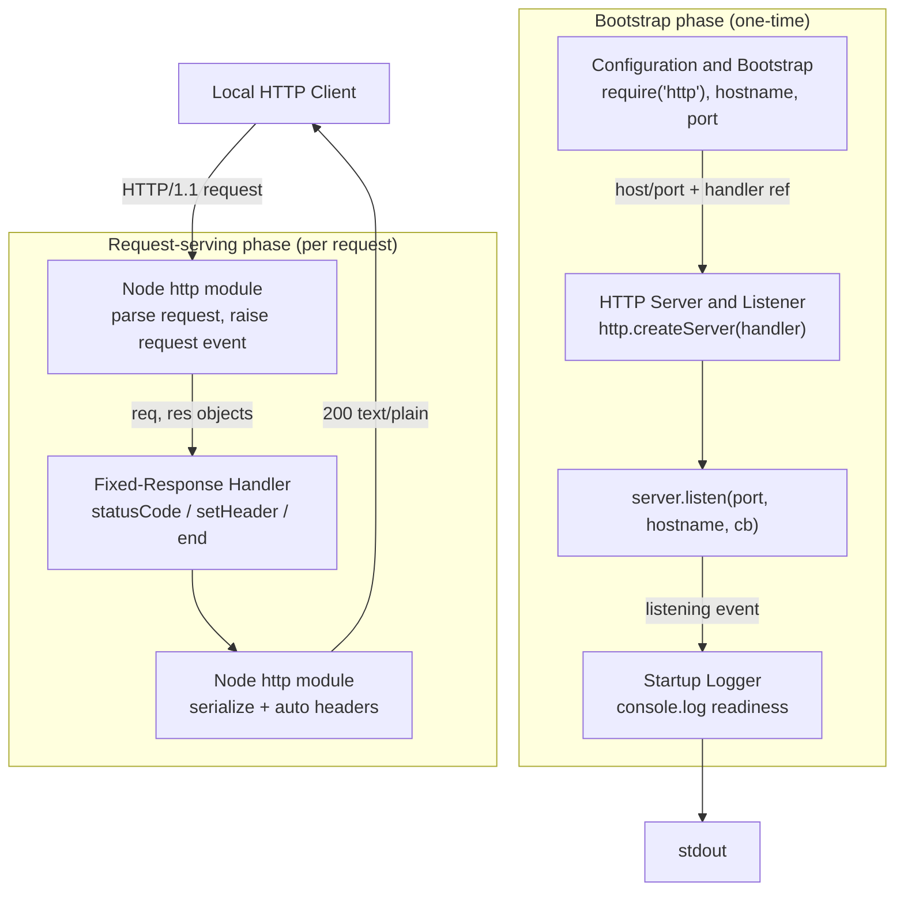
```mermaid
flowchart TD
    Client["Local HTTP Client"]
    Stdout["stdout"]
    subgraph Boot["Bootstrap phase (one-time)"]
        Cfg["Configuration and Bootstrap<br/>require('http'), hostname, port"]
        Create["HTTP Server and Listener<br/>http.createServer(handler)"]
        Listen["server.listen(port, hostname, cb)"]
        Log["Startup Logger<br/>console.log readiness"]
    end
    subgraph Serve["Request-serving phase (per request)"]
        Recv["Node http module<br/>parse request, raise request event"]
        Handle["Fixed-Response Handler<br/>statusCode / setHeader / end"]
        Serialize["Node http module<br/>serialize + auto headers"]
    end
    Cfg -->|"host/port + handler ref"| Create
    Create --> Listen
    Listen -->|"listening event"| Log
    Log --> Stdout
    Client -->|"HTTP/1.1 request"| Recv
    Recv -->|"req, res objects"| Handle
    Handle --> Serialize
    Serialize -->|"200 text/plain"| Client
```

#### 5.2.6.2 State Transition Diagram

The runtime moves through a small process lifecycle that underpins all components. Each inbound request is a self-transition on the `Listening` state because no state is carried between requests; the two terminal states are a fatal bind crash and external termination (there is no graceful-shutdown state — cross-reference Section 4.4.1).

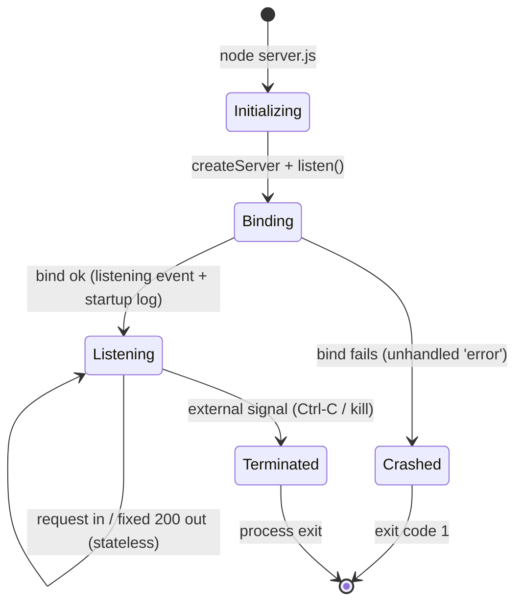
```mermaid
stateDiagram-v2
    [*] --> Initializing: node server.js
    Initializing --> Binding: createServer + listen()
    Binding --> Listening: bind ok (listening event + startup log)
    Binding --> Crashed: bind fails (unhandled 'error')
    Listening --> Listening: request in / fixed 200 out (stateless)
    Listening --> Terminated: external signal (Ctrl-C / kill)
    Crashed --> [*]: exit code 1
    Terminated --> [*]: process exit
```

#### 5.2.6.3 Sequence Diagram for Key Flows

The sequence diagram traces the startup exchange (including the fatal bind-failure branch) and the repeatable, stateless request exchange across the component participants.

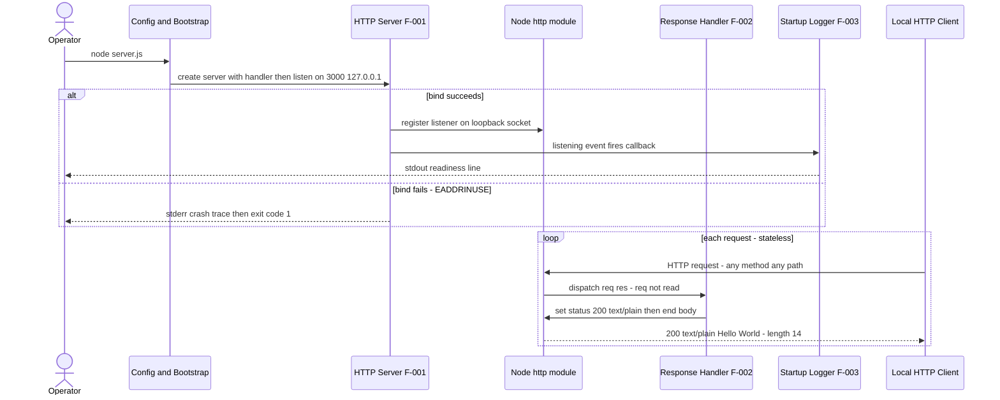
```mermaid
sequenceDiagram
    actor Operator
    participant Boot as Config and Bootstrap
    participant Srv as HTTP Server F-001
    participant Http as Node http module
    participant Hdl as Response Handler F-002
    participant Log as Startup Logger F-003
    participant Client as Local HTTP Client
    Operator->>Boot: node server.js
    Boot->>Srv: create server with handler then listen on 3000 127.0.0.1
    alt bind succeeds
        Srv->>Http: register listener on loopback socket
        Srv->>Log: listening event fires callback
        Log-->>Operator: stdout readiness line
    else bind fails - EADDRINUSE
        Srv-->>Operator: stderr crash trace then exit code 1
    end
    loop each request - stateless
        Client->>Http: HTTP request - any method any path
        Http->>Hdl: dispatch req res - req not read
        Hdl->>Http: set status 200 text/plain then end body
        Http-->>Client: 200 text/plain Hello World - length 14
    end
```

## 5.3 Technical Decisions

The repository contains **no design documents, rationale notes, or architecture decision records** — the only stated intent is the one-line purpose in `README.md` ("test project for backprop integration"). The decisions documented below are therefore **reconstructed from the observed implementation** and recorded here for traceability; each is tied to concrete evidence in `server.js`, and unstated rationale is presented as inference rather than as a claim the repository makes.

### 5.3.1 Architecture Style Decisions and Tradeoffs

The implementation reflects a decision to build the **smallest runnable HTTP target** rather than a framework-based or multi-tier application: a single CommonJS file, one standard-library dependency, one process, one endpoint. This is consistent with a test fixture whose job is simply to be reachable and to answer predictably. The principal tradeoffs are summarized below (four columns per the documentation standard).

| Decision Area | Choice Observed | Benefit | Tradeoff / Cost |
| --- | --- | --- | --- |
| Overall style | Single-file, single-process, event-driven server; no framework (`server.js`) | Zero install/build; minimal surface; trivial to read and run | No separation of concerns; not extensible without refactoring |
| Dependencies | Node standard-library `http` only; zero third-party (`server.js` line 1) | No supply-chain risk, no version drift, no lockfile needed (cross-reference Section 3.3) | No routing/middleware conveniences; any capability must be hand-coded |
| Process model | Single event loop; no `cluster`/`worker_threads` | Simple and deterministic; adequate for a local fixture | Throughput ceiling of one loop; no high availability or failover |
| Configuration | Hard-coded `const` host/port (`server.js` lines 3-4) | Simplicity; startup log always matches the bind target | No environment/runtime override; departs from twelve-factor config; edit-and-restart to change |

### 5.3.2 Communication Pattern Choices

The system uses a single **synchronous request/response** pattern over **HTTP/1.1 on loopback TCP**, and acts purely as a *provider* — it never initiates outbound communication (cross-reference Section 4.2.1). Internally, coordination is **event-driven**: the Node event loop dispatches the `request` and `listening` events to the two registered callbacks; there is no explicit event subscription, message queue, pub/sub, streaming pipeline, or webhook. This choice follows from the requirement to answer one fixed endpoint: asynchronous messaging or an outbound client would add machinery the fixture does not use. There is no content negotiation (the handler always emits `text/plain`), and connection reuse relies on Node's default keep-alive (`timeout=5`), a platform default rather than an application-configured behavior.

### 5.3.3 Data Storage and Caching Rationale

No datastore and no cache were adopted, and the rationale is intrinsic: the only datum the system serves is the static literal `Hello, World!\n`, so there is nothing to persist, query, or invalidate (cross-reference Sections 3.5 and 4.4.2). Statelessness deliberately eliminates entire concern areas — database selection, connection pooling, migrations, transactions, consistency, cache population/expiry, and encryption-at-rest — none of which apply to a fixed-response endpoint. Consistent with this, the handler emits **no cache-control semantics**: it sets only `Content-Type` and never `Cache-Control`, `ETag`, or `Last-Modified`, so responses are neither cacheable-by-contract nor cache-managed by the application.

### 5.3.4 Security Mechanism Selection

The system's security posture is achieved through **scope reduction rather than added mechanisms** (cross-reference Sections 2.4.1-2.4.2):

- **Loopback-only binding** (`127.0.0.1`) confines exposure to the local host, so the endpoint is not reachable from other machines by default.
- **Ignoring the request** removes the request-parsing and injection attack surface — there is no query/body/header parsing to exploit.
- **Zero third-party dependencies** removes supply-chain risk entirely (no packages to audit or patch).
- **Fixed literal output** means no user-influenced or dynamically generated content can be reflected.

Mechanisms explicitly **not** selected are, equally, part of the design: there is no TLS (transport is plain HTTP), no authentication or authorization, no rate limiting, and no CORS handling. This is appropriate for a local test fixture but would be inadequate for any non-loopback or production exposure — a limitation this document records rather than resolves. The only credential observed anywhere during inspection is a version-control transport token embedded in the local Git remote (outside the tracked source); it is a VCS concern, not an application security mechanism, and is deliberately not reproduced here (cross-reference Section 3.4).

### 5.3.5 Decision Tree

The following decision tree captures the reasoning consistent with the observed choices: a candidate capability is included only if it is required to serve the one fixed loopback response and can be satisfied without adding a third-party dependency. In the repository, only the Node core `http` module clears these gates.

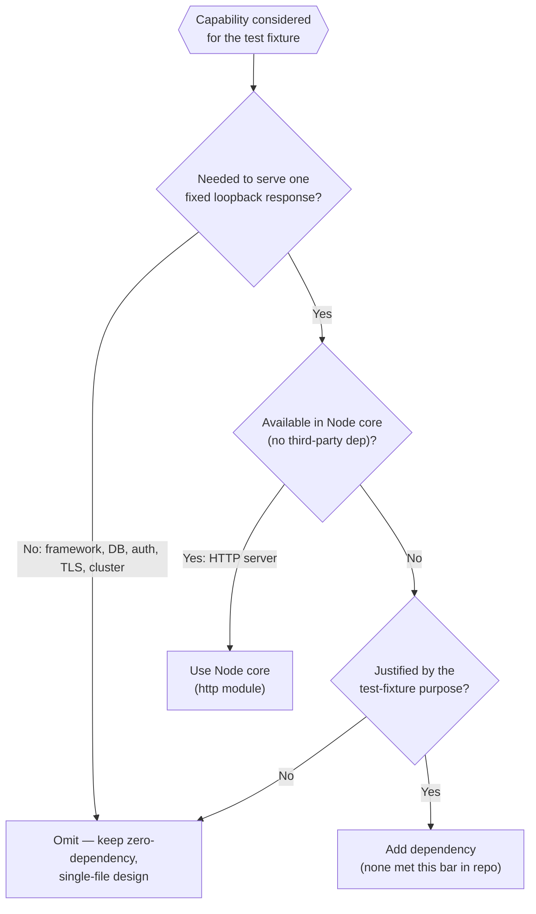
```mermaid
flowchart TD
    Start{{"Capability considered<br/>for the test fixture"}}
    Q1{"Needed to serve one<br/>fixed loopback response?"}
    Q2{"Available in Node core<br/>(no third-party dep)?"}
    Q3{"Justified by the<br/>test-fixture purpose?"}
    Omit["Omit — keep zero-dependency,<br/>single-file design"]
    UseCore["Use Node core<br/>(http module)"]
    Reconsider["Add dependency<br/>(none met this bar in repo)"]
    Start --> Q1
    Q1 -->|"No: framework, DB, auth, TLS, cluster"| Omit
    Q1 -->|"Yes"| Q2
    Q2 -->|"Yes: HTTP server"| UseCore
    Q2 -->|"No"| Q3
    Q3 -->|"No"| Omit
    Q3 -->|"Yes"| Reconsider
```

### 5.3.6 Architecture Decision Records (ADRs)

The records below reconstruct the decisions embodied in the code. Each is marked *Accepted* because it is realized in the current implementation; none was documented as a formal ADR in the repository.

| ADR | Decision | Status | Key Consequence |
| --- | --- | --- | --- |
| ADR-01 | Single-file, zero-dependency Node.js server (no framework) | Accepted (in code) | Minimal and instantly runnable; not extensible without refactoring |
| ADR-02 | Bind the loopback interface `127.0.0.1` only | Accepted | Not remotely reachable; safe local-only default |
| ADR-03 | Hard-code host/port as `const`s (no externalized config) | Accepted | Simple; requires source edit and restart to change |
| ADR-04 | Ignore the request; return one fixed response for all inputs | Accepted | Uniform behavior; no routing/validation surface |
| ADR-05 | No persistence or caching (fully stateless) | Accepted | No datastore/cache concerns; nothing survives a restart |
| ADR-06 | No application error handling or graceful shutdown | Accepted | Bind failure is fatal (exit code 1); recovery is manual |
| ADR-07 | Plain HTTP; no TLS, authentication, or rate limiting | Accepted | Adequate for a loopback fixture; unfit for network exposure |

**ADR-01 — Single-file, zero-dependency server.** *Context:* the project must present a running HTTP endpoint for integration testing with the least possible scaffolding. *Decision:* implement everything in one CommonJS file using only the Node core `http` module. *Consequences:* the program installs and builds in zero steps and has no supply-chain surface, at the cost of having no layering, tests, or extension points — any real feature would require restructuring.

**ADR-04 — Ignore the request; single fixed response.** *Context:* the fixture needs deterministic, easily assertable behavior. *Decision:* the handler never reads `req` and always writes `200`, `text/plain`, `Hello, World!\n`. *Consequences:* every method and path behaves identically, which simplifies testing and eliminates request-parsing vulnerabilities, but forecloses routing, validation, and content negotiation.

**ADR-06 — No error handling or graceful shutdown.** *Context:* minimizing code was prioritized over resilience. *Decision:* register no `'error'` listener and no signal handler; do not call `server.close()`. *Consequences:* a startup bind failure surfaces as an unhandled `'error'` and terminates the process with exit code 1, and shutdown is only via an external signal — recovery is entirely operator-driven (cross-reference Sections 4.4.1 and 4.5.2).

## 5.4 Cross-Cutting Concerns

Cross-cutting concerns are addressed minimally in this system: most are **absent by design**, which is consistent with a local test fixture. This subsection documents each concern's actual status with evidence rather than describing capabilities the code does not contain, and cross-references Section 4 for the full behavioral treatment. The table gives an at-a-glance summary; the subsections that follow expand each item.

| Concern | Status in Repository | Evidence |
| --- | --- | --- |
| Monitoring / observability | None built in (one startup log only) | No metrics or health endpoint; `server.js` line 13 |
| Logging | Single startup `console.log`; no request/structured logging | `server.js` line 13; no other log calls |
| Tracing | None | No tracing library, spans, or correlation IDs |
| Error handling | Platform defaults only; one fatal path | Zero `try`/`catch`/`.on(`; cross-reference Section 4.5 |
| Authentication / authorization | None | No auth code; loopback confinement only |
| Performance / SLAs | None defined | No targets in repo; cross-reference Sections 1.2.3, 2.2 |
| Disaster recovery | Manual restart; stateless | No supervisor/backup; cross-reference Section 4.5.2 |

### 5.4.1 Monitoring and Observability

The system has **no built-in monitoring or observability**. There is no metrics emission, no `/metrics` or health-check endpoint, no readiness/liveness probe, and no APM or telemetry client (cross-reference Section 3.4). The only signals the process produces are the single startup readiness line on `stdout` (F-003) and, on a fatal bind error, the default crash stack trace on `stderr`. Black-box monitoring is *possible* externally — any HTTP request to `127.0.0.1:3000` returns `200`, so an uptime probe could infer liveness — but nothing in the repository implements or configures such monitoring.

### 5.4.2 Logging and Tracing

**Logging.** The application emits exactly one log line — `Server running at http://127.0.0.1:3000/` — written once via `console.log` in the `listen` callback (`server.js` lines 13-14). There is no request logging, no log levels, no timestamps, no structured/JSON formatting, no log file, and no rotation (cross-reference Section 2.4.3). Application output goes only to `stdout`; the crash trace for the one fatal path goes to `stderr` as a Node default.

**Tracing.** There is **no distributed tracing** of any kind — no OpenTelemetry or tracing library, no span creation, and no correlation/trace-ID propagation. This is expected given that the system makes no outbound calls and has no downstream dependencies to correlate against (cross-reference Section 4.2).

### 5.4.3 Error Handling

Error handling is delegated entirely to the platform; `server.js` contains **no application-level error handling** (verified: zero `try`, `catch`, and `.on(` occurrences — no `'error'`/`'clientError'` listener and no process-signal handler). As established in Section 4.5, this yields exactly one fatal path and one platform-absorbed path:

- **Startup bind failure (fatal).** If the loopback socket cannot be bound (e.g., port `3000` already in use), the server emits an `'error'` event; with no listener registered, Node throws an uncaught exception and the process exits with code 1. There is no retry, backoff, or fallback.
- **Protocol-malformed request (non-fatal, platform default).** A malformed request triggers the Node `http` layer's default `clientError` handling, which responds `HTTP/1.1 400 Bad Request` with `Connection: close` and leaves the process running.
- **Handler exception (no realistic path).** The handler runs three synchronous statements and never reads `req` or performs I/O, so there is no realistic condition under which it throws; the normal outcome is the fixed `200` response.

The following diagram frames error handling by **layer** — where each condition is (or is not) handled — complementing the behavioral flowchart in Section 4.5.1.

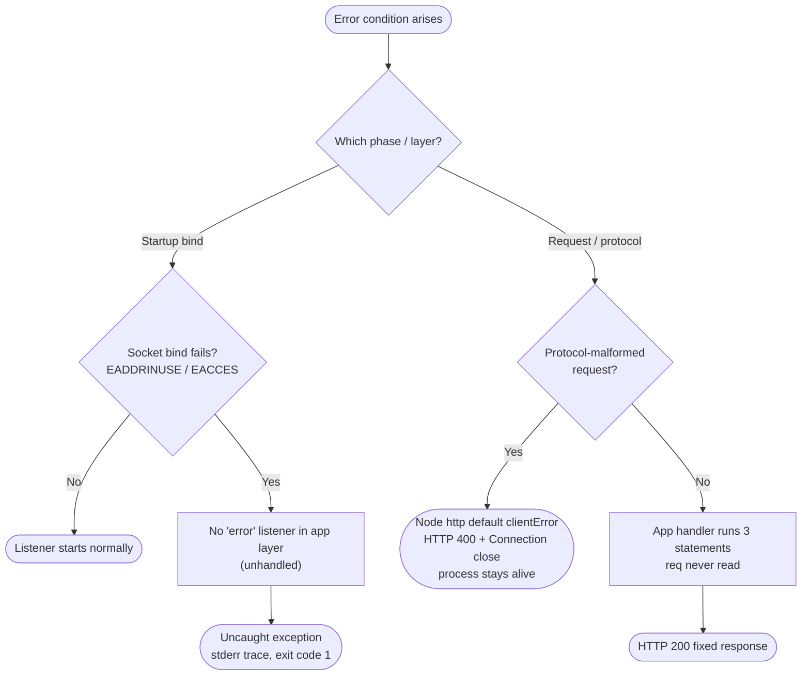
```mermaid
flowchart TD
    Start([Error condition arises]) --> Phase{"Which phase / layer?"}
    Phase -->|"Startup bind"| Bind{"Socket bind fails?<br/>EADDRINUSE / EACCES"}
    Bind -->|"No"| Ok([Listener starts normally])
    Bind -->|"Yes"| NoListener["No 'error' listener in app layer<br/>(unhandled)"]
    NoListener --> Fatal([Uncaught exception<br/>stderr trace, exit code 1])
    Phase -->|"Request / protocol"| Malformed{"Protocol-malformed<br/>request?"}
    Malformed -->|"Yes"| PlatformDefault([Node http default clientError<br/>HTTP 400 + Connection close<br/>process stays alive])
    Malformed -->|"No"| Handler["App handler runs 3 statements<br/>req never read"]
    Handler --> Normal([HTTP 200 fixed response])
```

### 5.4.4 Authentication and Authorization

There is **no authentication or authorization framework**. The system defines no identities, credentials, tokens, sessions, API keys, or role/permission model, and it integrates with no auth provider (cross-reference Section 3.4). Every request is served identically regardless of its origin, method, headers, or any credential it might carry (`server.js` lines 6-10). The only access control present is at the **network layer**: binding to `127.0.0.1` confines reachability to the local host. This is adequate for a local fixture but provides no application-level access control whatsoever.

### 5.4.5 Performance Requirements and SLAs

**No performance requirements, SLAs, or KPIs are defined anywhere in the repository** — there are no latency, throughput, availability, or error-budget targets (cross-reference Sections 1.2.3, 2.2, and 4.1.4). The observable performance characteristics are structural rather than specified:

- The request handler performs constant-time work — it writes a fixed 14-byte body (`Hello, World!\n`) with no I/O, computation, or allocation beyond the static string.
- Concurrency is bounded by the single Node.js event loop in one process; there is no clustering or horizontal scaling (cross-reference Section 2.4.1).
- The only observable timing value is Node's **default** keep-alive timeout of 5 seconds (`Keep-Alive: timeout=5`), a platform default and not an application-configured SLA.

This document asserts no numeric performance target, because none exists in the source.

### 5.4.6 Disaster Recovery

There are **no disaster-recovery provisions** in the repository: no process supervisor or restart policy (no `package.json` start script, systemd unit, or container restart directive), no health check, no redundancy or failover, no multi-instance deployment, and no orchestration descriptor. Two properties of the design shape the recovery posture:

- **Statelessness limits impact.** Because the system persists nothing (cross-reference Section 4.4.2), a crash or restart destroys no data — there is nothing to back up and effectively no data-loss exposure to recover from.
- **Recovery is manual.** The one fatal path (a startup bind failure) requires operator intervention: resolve the underlying cause (for example, free TCP port `3000`) and re-run `node server.js`. Because there is no state to rebuild and no dependency to reconnect, a successful restart restores full function immediately (cross-reference Section 4.5.2).

No recovery-time or recovery-point objectives (RTO/RPO) are defined in the repository; given the stateless design, an RPO is not applicable, and recovery time is bounded only by how quickly an operator restarts the process.

## 5.5 References

The following sources were cited as evidence for Section 5. All architectural claims derive from direct inspection of the repository files below and from runtime behavior observed on Node.js v22.23.1; no external/web sources were used.

**Repository files and folders inspected**

- `server.js` — the sole runtime implementation; primary evidence for every component, data flow, technical decision, and cross-cutting concern in this section (imports on line 1, host/port constants on lines 3-4, the server/handler on lines 6-10, and the listener/startup log on lines 12-14).
- `README.md` — established the project name (`hao-backprop-test`) and its one-line stated purpose ("test project for backprop integration"), the only integration context named anywhere in the repository.
- `app.py` — confirmed to be a non-functional prose note (not executable Python), establishing that there is no Python runtime component.
- `/` (repository root) — confirmed the complete inventory (three tracked files, no subfolders) and the absence of any manifest, lockfile, configuration, container, CI/CD, or test artifact; the `.git` metadata confirmed a three-commit history consistent with an early-stage test fixture.

**Cross-referenced Technical Specification sections**

- `1.2 System Overview` (incl. 1.2.1 Project Context, 1.2.3 Success Criteria) — system context, self-contained/isolated posture, and the absence of KPIs.
- `2.2 Functional Requirements` and `2.4 Implementation Considerations` (2.4.1-2.4.3) — per-feature technical constraints, scaling, security, and the "no performance target defined" position.
- `3.2 Frameworks & Libraries`, `3.3 Open Source Dependencies`, `3.4 Third-Party Services`, `3.5 Databases & Storage` — confirmation of the Node core `http`-only stack, zero third-party dependencies, no external services, and no persistence/caching.
- `4.1 System Workflows` (4.1.1, 4.1.3, 4.1.4), `4.2 Integration Workflows` (4.2.1), `4.4 State Management` (4.4.1, 4.4.2), `4.5 Error Handling` (4.5.1, 4.5.2) — the actor/boundary model, integration surface, process/connection state model, and error-handling behavior underpinning the diagrams and cross-cutting narrative in this section.

# 6. SYSTEM COMPONENTS DESIGN

## 6.1 Core Services Architecture

### 6.1.1 Applicability Assessment and Architectural Classification

**Core Services Architecture is not applicable for this system.**

`hao-backprop-test` is a single-process, single-threaded, event-driven Node.js HTTP server implemented entirely in one 14-line file, `server.js`. It runs as one operating-system process hosting one libuv event loop, exposes one inbound HTTP listener on the loopback address `127.0.0.1:3000`, and returns one fixed response to every request. There is no service decomposition, no second process or component, no inter-service or outbound network communication, and no orchestration, container, or infrastructure descriptor anywhere in the repository (cross-reference Sections 5.1.1 and 3.6). The concepts this section is meant to document — microservices, distributed service components, service discovery, load balancing, circuit breaking, auto-scaling, and failover — presuppose multiple cooperating services, none of which exist here.

The repository's only other files reinforce this classification: `README.md` describes a "test project for backprop integration," and `app.py` is a single non-functional prose line (not executable Python and not a second service). The sole runtime artifact is `server.js`.

**Evidence for the determination.** The table below lists the indicators that would characterize a core (multi-)services architecture and records each as absent, with the supporting evidence.

| Distributed-Architecture Indicator | Status | Evidence |
| --- | --- | --- |
| Multiple independent services / processes | Absent | One file `server.js`; one process; one event loop (Section 5.1.1) |
| Service decomposition / bounded contexts | Absent | Single inline `(req,res)` handler; no modules or exports (`server.js` L6-10) |
| Inter-service / outbound communication | Absent | Zero `http.request`, `fetch`, `grpc`, `amqp`, or `kafka` occurrences |
| Service discovery / registry | Absent | No Consul/etcd/DNS-SD; host and port are hard-coded consts (`server.js` L3-4) |
| Load balancer / API gateway / reverse proxy | Absent | No nginx/HAProxy config; a single loopback listener |
| Container / orchestration descriptor | Absent | No Dockerfile, Compose, Kubernetes, or Helm artifacts (Section 3.6) |

**Rationale.** The single-process design follows directly from the project's stated purpose as a minimal integration test fixture: the smallest artifact that can act as a running HTTP target requires no service topology, no network of collaborators, and no scaling apparatus. As Section 5.1.1 records, no concurrency, high-availability, or horizontal-scaling requirement is expressed anywhere in the repository, and the loopback bind confines the endpoint to a single local host. A core services architecture would add coordination, discovery, and failure-isolation machinery that the system neither has nor needs.

**How the rest of this section is organized.** Because the determination is "not applicable," Subsections 6.1.2 through 6.1.4 do not fabricate microservice mechanisms the code lacks. Instead, each topic area required by the section prompt — Service Components, Scalability Design, and Resilience Patterns — is addressed explicitly: the applicable single-process reality is documented with evidence, and every distributed-systems pattern that is absent is recorded together with the reason it is absent, so this section remains a complete and honest reference. The three required diagrams illustrate the degenerate (single-node) topology for each area.

**Diagram 6.1.1-1 — Service Interaction (single-service topology).** The diagram shows the one deployable unit, its single inbound interface, and the distributed-architecture elements that are not present.

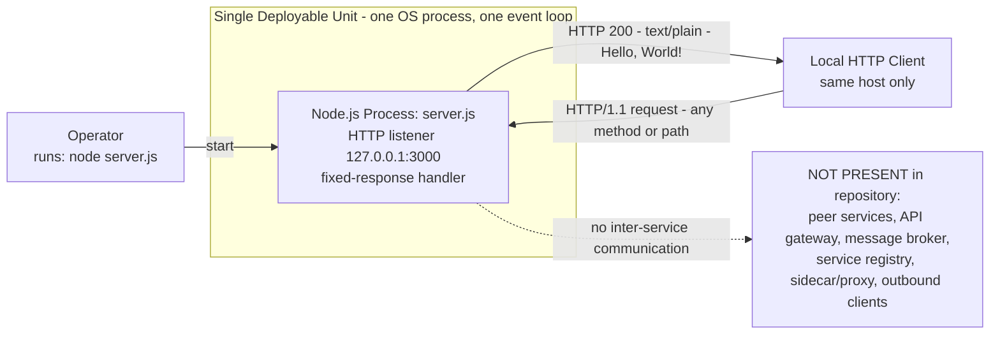
```mermaid
flowchart LR
    Operator["Operator<br/>runs: node server.js"]
    Client["Local HTTP Client<br/>same host only"]
    subgraph Unit["Single Deployable Unit - one OS process, one event loop"]
        Svc["Node.js Process: server.js<br/>HTTP listener 127.0.0.1:3000<br/>fixed-response handler"]
    end
    NotPresent["NOT PRESENT in repository:<br/>peer services, API gateway, message broker,<br/>service registry, sidecar/proxy, outbound clients"]
    Operator -->|"start"| Svc
    Client -->|"HTTP/1.1 request - any method or path"| Svc
    Svc -->|"HTTP 200 - text/plain - Hello, World!"| Client
    Svc -.->|"no inter-service communication"| NotPresent
```

### 6.1.2 Service Components

The system comprises exactly one logical service — the `server.js` process. Its internal structure is a set of logical regions within a single event loop rather than independently deployable service components; they communicate by in-process function calls and closures, not over a network (cross-reference Section 5.1.3). This subsection documents the one service's boundaries and responsibilities, then records the status of each distributed service-component concern named in the section prompt.

**Service boundaries and responsibilities.** The service boundary is one OS process hosting one Node.js event loop; it is crossed by only two interfaces — the inbound loopback HTTP listener and the process `stdout`/`stderr` streams (cross-reference Section 5.1.1). Within that single boundary, the logical regions and their responsibilities (feature identifiers F-001 through F-003 carried over from Section 2 for traceability) are:

| Logical Region (one service) | Responsibility | Source |
| --- | --- | --- |
| Configuration & Bootstrap | Import `http`; define immutable `hostname`/`port` constants | `server.js` L1, L3-4 |
| HTTP Server & Listener (F-001) | Create server; bind loopback `127.0.0.1:3000`; enter listening state | `server.js` L6, L12-14 |
| Fixed-Response Handler (F-002) | Return `200`, `text/plain`, `Hello, World!` for every request | `server.js` L6-10 |
| Startup Logger (F-003) | Emit one readiness line to `stdout` | `server.js` L12-14 |

**Distributed service-component concerns.** None of the following patterns are present, because there is only one service and no network of collaborators to coordinate. The table records each concern's applicability and the repository evidence; the notes beneath add detail.

| Service-Component Concern | Applicability | Repository Evidence |
| --- | --- | --- |
| Inter-service communication patterns | Not applicable | No second service; internal calls are in-process closures; zero outbound calls |
| Service discovery mechanisms | Not applicable | Host/port hard-coded consts (`server.js` L3-4); no registry/DNS-SD client |
| Load balancing strategy | Not applicable | One process, one listener; no `cluster`, proxy, or balancer |
| Circuit breaker patterns | Absent | No breaker library or state machine; single unconditional code path |
| Retry and fallback mechanisms | Absent | Zero `retry`/`backoff`/`fallback` constructs (Section 4.5.2) |

- **Inter-service communication patterns.** There is no service-to-service communication. The only ingress is the inbound HTTP request/response exchange; the request handler and startup logger are closures invoked by the event loop, not networked endpoints (cross-reference Section 5.1.3). The server is purely a *provider* of one response and never a *consumer* of any external API.
- **Service discovery mechanisms.** None. The bind address is fixed in source as immutable `const` values, and there is no environment-based configuration (`process.env` occurrences: zero), service registry, or DNS-based discovery client.
- **Load balancing strategy.** None. A single event loop in a single process serves all connections; there is no `cluster` module, worker pool, reverse proxy, or external load balancer across which to distribute load (cross-reference Section 5.1.2).
- **Circuit breaker patterns.** None. A circuit breaker isolates a failing downstream dependency; this system has no downstream dependency and one constant-time code path, so there is nothing for a breaker to trip against.
- **Retry and fallback mechanisms.** None. As documented in Section 4.5.2, neither the bind step nor the request path retries on failure, and there is no fallback branch, cached alternate response, or degraded mode.

### 6.1.3 Scalability Design

The repository contains no scalability engineering. Throughput and concurrency are bounded by the single Node.js event loop in one process, and the only scaling axis available without code or infrastructure changes is vertical (a larger host). No horizontal-scaling, auto-scaling, resource-allocation, or capacity-planning artifacts exist (cross-reference Sections 5.1.2 and 5.4.5). The table summarizes each scalability dimension required by the prompt; the notes and diagram that follow expand on them.

| Scalability Dimension | Approach in Repository | Evidence |
| --- | --- | --- |
| Vertical scaling | Only axis available (implicit) | One event loop; capacity limited by host CPU/RAM (Section 5.1.2) |
| Horizontal scaling | Not implemented | No `cluster`/`worker_threads`, replicas, or load balancer |
| Auto-scaling triggers/rules | None | No orchestrator, metrics, or scaling policy (Section 3.6) |
| Resource allocation strategy | None defined | No container limits/requests, cgroups, or process-manager config |
| Performance optimization | Structural only | Constant-time handler; no I/O; stateless (Section 5.4.5) |
| Capacity planning | None defined | No SLA/throughput/latency targets in repository |

**Horizontal / vertical scaling approach.** The process is single-threaded on one event loop; Section 5.1.2 records that a single process and single event loop imply vertical scaling only, with no `cluster` or `worker_threads`. Vertical scaling (faster CPU, more memory) is therefore the only lever available without modifying the code, and even that is neither configured nor documented. Horizontal scaling — running multiple instances behind a balancer — is not implemented and, given the loopback bind, is not reachable without changes.

**Auto-scaling triggers and rules.** None. Auto-scaling requires an orchestrator or process manager observing metrics against thresholds; the repository has no such component — no container, Kubernetes Horizontal Pod Autoscaler, cloud autoscaler, or process-manager (PM2) configuration (cross-reference Section 3.6) — so there are no triggers, cooldowns, or minimum/maximum-instance rules.

**Resource allocation strategy.** None is defined. The process consumes whatever CPU and memory the host grants it; there are no container resource requests/limits, cgroup constraints, Node heap flags (for example `--max-old-space-size`), or worker-pool sizing anywhere in the repository.

**Performance optimization techniques.** No optimization is engineered; the favorable performance characteristics are structural rather than tuned. The handler performs constant-time work — it writes a fixed 14-byte body with no I/O, computation, or per-request allocation beyond the static string — and the server is stateless, so there is no lock contention, cache, or connection pool to tune (cross-reference Section 5.4.5). The only timing value in play is Node's default keep-alive timeout of 5 seconds, a platform default rather than an applied optimization.

**Capacity planning guidelines.** None exist. No latency, throughput, availability, or concurrency targets are defined anywhere in the repository (cross-reference Section 5.4.5), so there is no basis or guideline for capacity provisioning beyond the structural ceiling of one event loop on one host.

**Diagram 6.1.3-1 — Scalability architecture (single event loop, vertical-only).** The diagram shows where scaling is bounded and which scaling axes are absent.

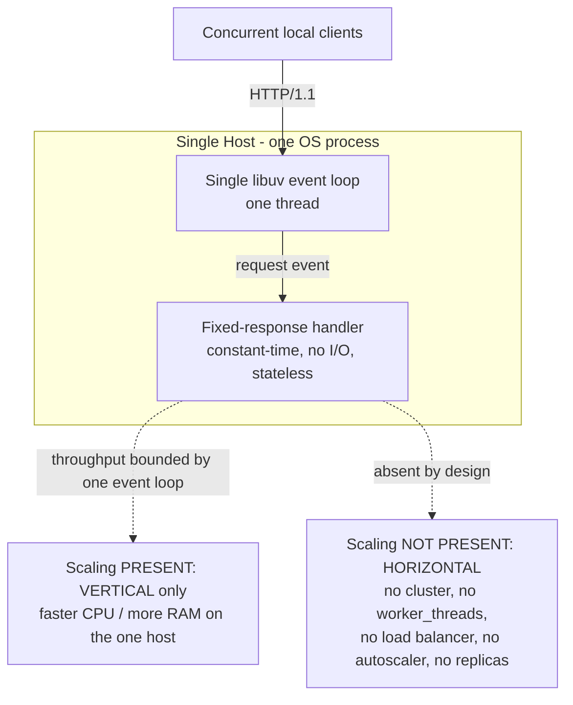
```mermaid
flowchart TB
    Clients["Concurrent local clients"]
    subgraph Host["Single Host - one OS process"]
        EL["Single libuv event loop<br/>one thread"]
        H["Fixed-response handler<br/>constant-time, no I/O, stateless"]
        EL -->|"request event"| H
    end
    Vert["Scaling PRESENT: VERTICAL only<br/>faster CPU / more RAM on the one host"]
    Horiz["Scaling NOT PRESENT: HORIZONTAL<br/>no cluster, no worker_threads,<br/>no load balancer, no autoscaler, no replicas"]
    Clients -->|"HTTP/1.1"| EL
    H -.->|"throughput bounded by one event loop"| Vert
    H -.->|"absent by design"| Horiz
```

### 6.1.4 Resilience Patterns

Resilience is delegated almost entirely to the platform; `server.js` contains no application-level fault-tolerance, failover, or degradation logic (verified: zero `try`/`catch`/`.on(` occurrences and no signal handlers). The system's resilience posture is characterized by one fatal failure path, one platform-absorbed failure path, and manual recovery, all documented in Sections 4.5 and 5.4.6. Because the system is stateless with no data store, several resilience concerns (data redundancy, recovery-point objective) are structurally not applicable. The table summarizes each concern; notes and the diagram follow.

| Resilience Concern | Status | Evidence |
| --- | --- | --- |
| Fault tolerance | Platform defaults only | Malformed request answered `400`; process stays alive (Section 4.5.1) |
| Disaster recovery | Manual restart; stateless | No supervisor/backup/RTO/RPO (Section 5.4.6) |
| Data redundancy | Not applicable | Stateless; no database or files to replicate (Section 5.1.3) |
| Failover configuration | None | Single instance; no standby/replica to fail over to |
| Service degradation policy | None | Single unconditional code path; no degraded mode (Section 4.5.2) |

**Fault tolerance mechanisms.** The only fault tolerance is what the Node `http` layer provides by default: a protocol-malformed request is answered with `HTTP/1.1 400 Bad Request` and `Connection: close` while the process stays alive (cross-reference Section 4.5.1). Conversely, the one application-relevant fault — a startup bind failure (for example, port `3000` already in use) — is not tolerated: with no `'error'` listener registered, Node throws an uncaught exception and the process exits with code 1. There is no retry, isolation, or bulkhead.

**Disaster recovery procedures.** Recovery is manual and operator-driven. As Section 5.4.6 records, there is no process supervisor, restart policy, health check, redundancy, or orchestration descriptor. After the one fatal path, an operator resolves the underlying cause (for example, frees TCP port `3000`) and re-runs `node server.js`; because nothing persists, a successful restart restores full function immediately. No recovery-time objective (RTO) is defined, and a recovery-point objective (RPO) is not applicable given the stateless design.

**Data redundancy approach.** Not applicable. The system is stateless and has no database, file storage, or cache (cross-reference Section 5.1.3); there is no data to replicate, mirror, or back up, so redundancy neither exists nor is needed.

**Failover configurations.** None. Failover requires at least one redundant instance or standby to switch to; the system runs as a single instance with no replica, no clustering, no virtual IP, and no health-checked pool, so there is nothing to fail over to.

**Service degradation policies.** None. The request path is a single unconditional code path with no circuit breaker, cached fallback, feature flag, or degraded-mode branch (cross-reference Section 4.5.2). The service either serves its fixed `200` response (or the platform `400` for malformed input) or, on the one fatal path, is not running at all — there is no intermediate degraded state.

**Diagram 6.1.4-1 — Resilience pattern implementations (single fatal path, manual recovery).** The diagram traces startup and request outcomes, highlighting the absence of automatic failover, retry, and degradation.

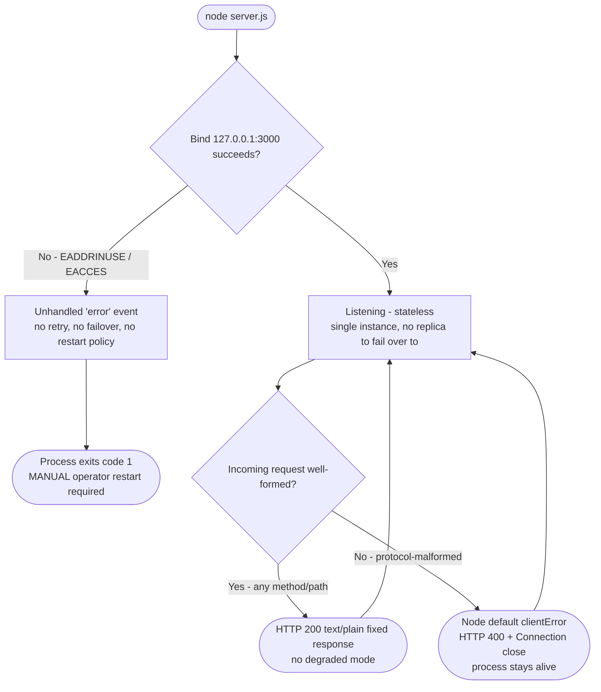
```mermaid
flowchart TD
    Start(["node server.js"]) --> Bind{"Bind 127.0.0.1:3000 succeeds?"}
    Bind -->|"No - EADDRINUSE / EACCES"| Crash["Unhandled 'error' event<br/>no retry, no failover, no restart policy"]
    Crash --> Manual(["Process exits code 1<br/>MANUAL operator restart required"])
    Bind -->|"Yes"| Listen["Listening - stateless<br/>single instance, no replica to fail over to"]
    Listen --> Req{"Incoming request well-formed?"}
    Req -->|"Yes - any method/path"| Ok(["HTTP 200 text/plain fixed response<br/>no degraded mode"])
    Req -->|"No - protocol-malformed"| Plat(["Node default clientError<br/>HTTP 400 + Connection close<br/>process stays alive"])
    Ok --> Listen
    Plat --> Listen
```

### 6.1.5 References

**Repository files and folders examined for this section:**

- `server.js` — the single runtime implementation; established the single-process/single-event-loop topology, the immutable loopback bind (`127.0.0.1:3000`), the one fixed-response handler, and the verified absence of clustering, outbound calls, retry/circuit-breaker/fallback constructs, signal handlers, and error listeners.
- `README.md` — project identity (`hao-backprop-test`, "test project for backprop integration"), confirming the minimal test-fixture scope that motivates the single-process design.
- `app.py` — confirmed to be non-functional prose (not executable Python and not a second service).
- Repository root (path `""`) — confirmed exactly three files and no subfolders, and the absence of any orchestration, container, or infrastructure descriptors (no Dockerfile, Compose, Kubernetes, Helm, Procfile, nginx/HAProxy, PM2, or Terraform artifacts).

**Cross-referenced Technical Specification sections:**

- Section 5.1 High-Level Architecture — single-process, single-threaded, event-driven architectural style; logical components (5.1.2); in-process data flow (5.1.3); vertical-scaling-only characterization and the statement that no high-availability or horizontal-scaling requirement is expressed in the repository.
- Section 5.4 Cross-Cutting Concerns — no performance requirements/SLAs (5.4.5); manual disaster recovery with no supervisor, redundancy, failover, or orchestration descriptor, and RPO not applicable given statelessness (5.4.6).
- Section 4.5 Error Handling — the one fatal startup-bind path and the platform-absorbed malformed-request path (4.5.1); the absence of retry, fallback, notification, and automatic recovery (4.5.2).
- Section 3.6 Development & Deployment — no build system, containerization, CI/CD, or infrastructure as code; manual local launch via `node server.js`.
- Section 2 (Product Requirements) — feature identifiers F-001 (HTTP server lifecycle & loopback listener), F-002 (fixed plain-text response handler), and F-003 (startup confirmation logging) reused for traceability of the single service's logical regions.

**External sources:** None. All determinations in this section are grounded in direct inspection of the repository and the cross-referenced sections above; no web sources were required.

## 6.2 Database Design

### 6.2.1 Applicability Assessment

**Database Design is not applicable to this system.**

`hao-backprop-test` is a stateless, single-file Node.js HTTP server (`server.js`) that persists nothing, reads from no data store, and writes to no data store. It uses only the Node.js built-in `http` module — the sole `require` in the codebase (`server.js` line 1) — and every request receives the same compile-time string constant, `Hello, World!` followed by a newline (`server.js` line 9, a 14-byte literal). There is no database, no object or file storage, no caching layer, no ORM or query builder, no database driver, no connection string, and no persistence of any kind anywhere in the repository. Consequently, none of the schema, data-management, compliance, or performance topics that a database-design section normally documents have any subject matter in this system.

This determination is consistent with Section 3.5 (Databases & Storage), which records that the system is entirely stateless and uses no database or storage technology of any kind, and with Section 4.4 (State Management), which confirms that there are no data-persistence points, no caching layer, and no transaction boundaries.

**Storage inventory.** Every storage category that a database design would address is absent, as summarized below and corroborated by Section 3.5.

| Storage / Persistence Concern | Status | Evidence |
| --- | --- | --- |
| Relational / primary database | None | No driver, ORM, connection string, or SQL anywhere; keyword scan matched none |
| Secondary / NoSQL database | None | No MongoDB, Redis, or DynamoDB client or configuration present |
| Caching layer | None | No cache client; handler sets only `Content-Type`, no `Cache-Control`/`ETag` (Section 4.4) |
| Object / file storage | None | `fs` is never imported; no filesystem writes; no storage SDK |
| Data persistence strategy | None (stateless) | Sole datum is the in-code literal on `server.js` line 9 |

**Evidence — direct inspection.** The repository contains exactly three tracked files — `server.js`, `README.md`, and `app.py` — and no subfolders. There is no `package.json` or lock file, no `.env` or configuration file, and no `migrations/`, `models/`, `schema/`, or `db/` directory. A case-insensitive scan of every tracked file for database, ORM, cache, connection, and filesystem identifiers returned a single match — the `require('http')` on line 1 — and no match for any persistence-related term. `app.py` is a non-functional prose note (not executable Python and not a data layer), and `README.md` identifies the project as `hao-backprop-test`, a "test project for backprop integration."

**Cross-reference corroboration.** Section 3.5 provides a storage inventory in which every category (primary database, secondary database, caching layer, object/file storage, and persistence strategy) is recorded as absent, and notes that because there is no data at rest the system has no encryption-at-rest, backup, access-control, or data-retention concerns. Section 1.3 records the in-scope data domains as "None" and lists persistence, databases, and external storage as "Not present." Section 6.1 independently classifies data redundancy as "Not applicable" because the stateless design has no database or files to replicate.

**Diagram 6.2.1-1 — Data flow (stateless request path, no persistence tier).** This diagram shows the only data movement in the system: an inbound request triggers the handler, which returns a compile-time constant held in process memory and touches no persistent store.

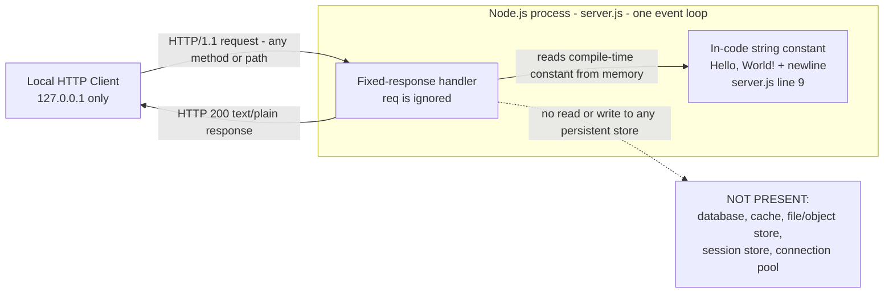
```mermaid
flowchart LR
    Client["Local HTTP Client<br/>127.0.0.1 only"]
    subgraph Proc["Node.js process - server.js - one event loop"]
        Handler["Fixed-response handler<br/>req is ignored"]
        Literal["In-code string constant<br/>Hello, World! + newline<br/>server.js line 9"]
        Handler -->|"reads compile-time constant from memory"| Literal
    end
    NoStore["NOT PRESENT:<br/>database, cache, file/object store,<br/>session store, connection pool"]
    Client -->|"HTTP/1.1 request - any method or path"| Handler
    Handler -->|"HTTP 200 text/plain response"| Client
    Handler -.->|"no read or write to any persistent store"| NoStore
```

**Scope of the remainder of this section.** Because the determination is "not applicable," Subsections 6.2.2 through 6.2.5 do not fabricate schema objects, migrations, or tuning mechanisms the system lacks. Each area required by the section prompt — Schema Design, Data Management, Compliance Considerations, and Performance Optimization — is addressed explicitly: the applicable stateless reality is documented, and every database concept that is absent is recorded together with the reason it is absent, so this section remains a complete and honest reference. The required schema (ERD) and replication diagrams are provided in Subsection 6.2.2 in the only truthful form available — degenerate diagrams that make the absence of any data model or replication topology explicit.

### 6.2.2 Schema Design

There is no database schema in this system, so there are no entities, relationships, data models, indexes, partitions, replicas, or backups to design. `server.js` defines no persistent data structures; its only data element is an immutable in-code string constant. Each Schema Design topic named in the section prompt is recorded below against the repository evidence.

| Schema Design Aspect | Status | Rationale / Evidence |
| --- | --- | --- |
| Entity relationships | Not applicable | No entities, tables, or collections exist; nothing to relate |
| Data models & structures | No persisted model | Sole data element is an in-code string constant (`server.js` line 9) |
| Indexing strategy | Not applicable | No tables or documents to index |
| Partitioning approach | Not applicable | No dataset to partition; sharding, range, and hash partitioning are all moot |
| Replication configuration | Not applicable | No data tier; single stateless process (Section 6.1.4) |
| Backup architecture | Not applicable | Nothing is persisted, so there is nothing to back up (Section 3.5) |

**Data models and structures.** The only data element in the running system is the response body — the UTF-8 string literal `Hello, World!` plus a trailing newline (14 bytes), hard-coded on `server.js` line 9. It is a compile-time constant, not a record in any store: it is created when the module is parsed, lives in process memory for the life of the process, and is discarded on exit. There is no schema, no field, no key, and no relationship associated with it. The only other structured in-code data are the immutable host and port configuration constants.

| Data Element | Type & Size | Location / Lifetime |
| --- | --- | --- |
| Response body literal | UTF-8 string constant, 14 bytes | `server.js` line 9; process memory; not persisted |
| Host / port configuration | Immutable string / number constants | `server.js` lines 3-4; process memory; not persisted |

**Indexes and constraints.** Because no database, table, or collection exists, there are no indexes and no integrity constraints of any kind. For completeness — and to satisfy the requirement to document all indexes and constraints — every category is recorded below as empty.

| Index / Constraint Category | Count | Evidence |
| --- | --- | --- |
| Primary key constraints | 0 | No tables exist |
| Foreign key constraints | 0 | No relationships exist |
| Unique constraints | 0 | No columns or attributes exist |
| Check / not-null constraints | 0 | No schema exists |
| Secondary (single-column) indexes | 0 | No tables to index |
| Composite / covering indexes | 0 | No tables to index |

**Diagram 6.2.2-1 — Data model / schema view (no persistent entities).** In place of an entity-relationship diagram, this diagram contrasts the system's single non-persistent datum with the schema constructs that a database design would define but that are absent here.

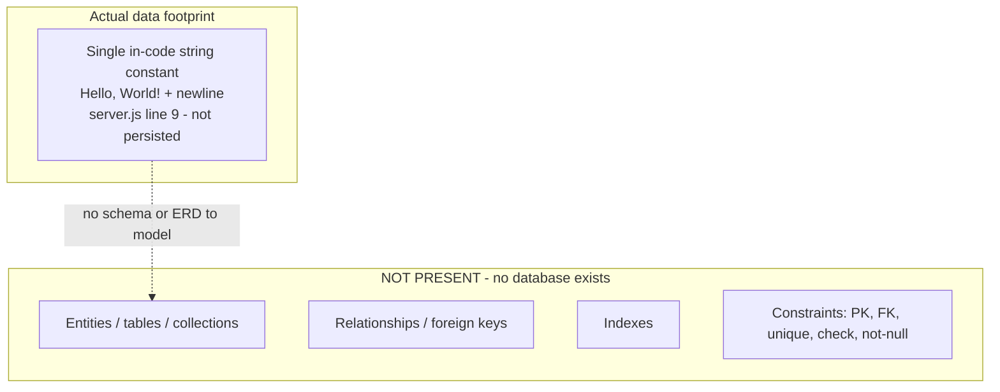
```mermaid
flowchart TB
    subgraph Actual["Actual data footprint"]
        Datum["Single in-code string constant<br/>Hello, World! + newline<br/>server.js line 9 - not persisted"]
    end
    subgraph Absent["NOT PRESENT - no database exists"]
        Entities["Entities / tables / collections"]
        Relationships["Relationships / foreign keys"]
        Indexes["Indexes"]
        Constraints["Constraints: PK, FK, unique, check, not-null"]
    end
    Datum -.->|"no schema or ERD to model"| Entities
```

**Diagram 6.2.2-2 — Replication architecture (single stateless instance, no data tier).** The system runs as one stateless process with no data tier, so there is no primary, no replica, and nothing to replicate.

```mermaid
flowchart LR
    subgraph Instance["Single runtime instance"]
        Proc["Node.js process - server.js<br/>stateless - holds no data"]
    end
    NoData["NOT PRESENT:<br/>primary / replica data nodes,<br/>WAL or oplog streaming, standby,<br/>quorum, automatic failover, backup targets"]
    Proc -.->|"no data tier to replicate"| NoData
```

### 6.2.3 Data Management

With no data store, there are no data-management processes to operate: there is nothing to migrate, version, archive, retrieve from disk, or cache. Each Data Management topic from the section prompt is recorded below against the evidence, with clarifying notes beneath.

| Data Management Aspect | Status | Rationale / Evidence |
| --- | --- | --- |
| Migration procedures | Not applicable | No schema exists; no Flyway/Liquibase/Prisma/knex tooling or `migrations/` directory |
| Versioning strategy | Not applicable (data) | No schema to version; only the source code is versioned, in Git |
| Archival policies | Not applicable | No data is stored, so none can be archived, tiered, or purged |
| Storage & retrieval mechanism | In-memory constant only | Handler returns the `server.js` line 9 literal; no store, query, or file read (Section 4.4) |
| Caching policies | None | No cache; only `Content-Type` is set, with no `Cache-Control`/`ETag` (Section 4.4) |

- **Migration and versioning.** There is no database schema, so there are no forward or rollback migration scripts and no schema-version table, and the repository contains no migration framework or migrations directory. The only versioning present is Git version control of the source files; there is no data-model version to evolve.
- **Storage and retrieval.** The single "retrieval" operation in the system is returning a constant that is compiled into the code; it involves no database read, file read, network fetch, or cache lookup. This is the path shown in Diagram 6.2.1-1: request in, in-memory constant out.
- **Archival.** Because nothing is written or retained, there is no hot/warm/cold tiering, no time-to-live expiry, and no archival or purge job to schedule.
- **Caching.** Section 4.4 confirms the handler emits only a `Content-Type` header and no cache-control directives; the fixed response is a hard-coded literal rather than a cached computation, so there is no cache to populate, invalidate, or expire.

### 6.2.4 Compliance Considerations

From a data-persistence standpoint the system has no compliance surface: it stores no data, collects no personal information, and maintains no data-access records. Section 3.5 notes that because there is no data at rest, the system has no concerns around encryption-at-rest, backups, access control, or data retention. Each compliance topic is recorded below, with clarifying notes beneath.

| Compliance Aspect | Status | Rationale / Evidence |
| --- | --- | --- |
| Data retention rules | Not applicable | Nothing is persisted; no datum survives process exit (Section 4.4) |
| Backup & fault-tolerance policy | No backups; manual restart | Nothing to back up; recovery is operator restart (Sections 3.5, 6.1.4) |
| Privacy controls | Not applicable | No PII is collected or stored; `req` is ignored (Section 3.5) |
| Audit mechanisms | None at data level | No access/audit log; only one startup `console.log` line (`server.js` line 13) |
| Access controls | None at data level | No database credentials or roles; loopback bind limits network reach (Section 6.1) |

- **Data retention and privacy.** The handler never reads the request (`req` is ignored) and writes nothing, so no user data, identifiers, or payloads are captured or stored. There is therefore no PII to protect, no retention schedule to enforce, and no right-to-erasure or subject-access workflow to implement.
- **Backup and fault tolerance.** There is no data store to back up. Fault tolerance is limited to the platform default — a protocol-malformed request is answered `400` and the process stays alive — and disaster recovery is a manual operator restart with no supervisor, redundancy, or failover (Sections 4.5 and 6.1.4). Because the design is stateless, a restart restores full function with no data loss and no recovery-point objective to meet.
- **Audit mechanisms.** The system produces a single startup readiness line on `stdout` (feature F-003, `server.js` lines 12-14) and no per-request or data-access audit trail; there is no audit store, tamper-evident log, or retention of audit events.
- **Access controls.** There is no database, so there are no database users, roles, grants, or row-level security. The only access boundary is the network: the server binds the loopback interface `127.0.0.1` (`server.js` line 3), confining reach to the local host, and applies no application-level authentication or authorization.

### 6.2.5 Performance Optimization

There is no database to optimize. Query optimization, caching, connection pooling, read/write splitting, and batch processing are all database-oriented techniques that have no subject matter in a stateless server that performs no data access. The favorable performance the system does exhibit is structural — a constant-time handler that performs no I/O — rather than the result of any storage tuning (Sections 6.1.3 and 4.4). Each optimization topic is recorded below, with clarifying notes beneath.

| Optimization Technique | Status | Rationale / Evidence |
| --- | --- | --- |
| Query optimization patterns | Not applicable | No database and no queries to profile or tune |
| Caching strategy | Not applicable | No cache layer; response is a hard-coded literal (Section 4.4) |
| Connection pooling | Not applicable | No database connections to pool or reuse |
| Read/write splitting | Not applicable | No reads or writes to any store; no primary/replica topology |
| Batch processing approach | Not applicable | No batch/ETL jobs; each request is handled individually in constant time |

- **Query optimization and read/write splitting.** With no data store there are no queries to profile, no execution plans to tune, no indexes to add, and no primary/replica topology across which to split reads and writes.
- **Connection pooling.** The system opens no outbound database or service connections, so there is no pool to size or reuse. The inbound HTTP layer uses Node's default keep-alive behavior (a platform default, not a database connection pool), as noted in Section 6.1.3.
- **Caching.** As documented in Section 4.4, no caching is performed and no cache-control headers are emitted; the fixed 14-byte response is produced directly from a compile-time constant.
- **Batch processing.** The server processes each request independently through a single synchronous code path; there is no queue, scheduler, bulk-insert, or ETL pipeline to optimize.

### 6.2.6 References

**Repository files and folders examined for this section:**

- `server.js` — the single runtime implementation; established the stateless design, the sole `require('http')` (line 1), the in-code response constant `Hello, World!` + newline (line 9), the immutable host/port constants (lines 3-4), and the verified absence of any database driver, ORM, connection, filesystem access, or caching.
- `README.md` — project identity (`hao-backprop-test`, "test project for backprop integration"), confirming the minimal test-fixture scope.
- `app.py` — confirmed to be non-functional prose, not a data layer or second service.
- Repository root (path `""`) — confirmed exactly three files and no subfolders, and the absence of any manifest, lock file, `.env`/configuration, `migrations/`, `models/`, `schema/`, or `db/` artifact that could declare or define persistence.

**Cross-referenced Technical Specification sections:**

- Section 3.5 Databases & Storage — the storage inventory recording every category as absent, and the statement that there is no data-at-rest attack surface, PII, encryption-at-rest, backup, access-control, or retention concern.
- Section 4.4 State Management — no data-persistence points, no caching layer, no cache-control headers, and no transaction boundaries; per-request `req`/`res` state is transient and Node-managed.
- Section 6.1 Core Services Architecture — data redundancy classified "Not applicable"; stateless single-process design; manual disaster recovery with recovery-point objective not applicable.
- Section 1.3 Scope — in-scope data domains recorded as "None"; persistence, databases, and external storage listed as "Not present."

**External sources:** None. All determinations in this section are grounded in direct inspection of the repository and the cross-referenced sections above; no web sources were required.

## 6.3 Integration Architecture

### 6.3.1 Integration Architecture Applicability Assessment

**Integration Architecture is not applicable for this system.**

`hao-backprop-test` neither exposes an integratable API contract nor communicates with any external system, service, message broker, or data store. Its entire runtime is one 14-line file, `server.js`, which imports a single Node.js core module (`http`), binds one inbound TCP listener to the loopback address `127.0.0.1:3000`, and returns one fixed response — `HTTP 200`, `Content-Type: text/plain`, body `Hello, World!` — to every request regardless of method, path, headers, or body (the request object is never read; cross-reference Sections 4.2.1 and 5.1.3). The process performs **no outbound network activity of any kind**: the sole `require` is Node core `http`, and there is no HTTP client, SDK, database driver, message-broker client, or `process.env` usage anywhere in the repository (verified by direct inspection of `server.js` and the complete file inventory). The concepts this section is meant to document — public or partner API design, authentication and authorization frameworks, rate limiting, API versioning, message queues, stream and batch processing, third-party integrations, legacy interfaces, and API gateways — all presuppose either an integratable interface or an external counterpart, none of which exist here.

Two structural facts make the determination decisive. First, the listener binds the **loopback interface only** (`127.0.0.1`, not `0.0.0.0`), so the endpoint is not reachable from any other host and cannot serve as an integration surface without a source change (`server.js` lines 3-4, 12). Second, the repository has **zero dependencies** — no `package.json`, lock file, or `node_modules` — so there is no third-party client, broker, gateway, or cloud SDK through which an integration could occur (cross-reference Section 3.4). The repository's other files reinforce this: `README.md` describes a "test project for backprop integration," and `app.py` is a single non-functional prose line (not executable Python and not a second service). The sole runtime artifact is `server.js`.

**Evidence for the determination.** The table records each capability that would characterize an integration architecture as absent, with the supporting repository evidence.

| Integration Capability Indicator | Status | Evidence |
| --- | --- | --- |
| Outbound calls to external systems/services | Absent | Zero `http.request`/`https`/`fetch`/`axios`/SDK; sole `require` is Node core `http` (`server.js` L1) |
| Differentiated inbound API contract (routes, methods, schemas) | Absent | Handler never reads `req`; identical `200` response for every method/path (`server.js` L6-10; F-002-RQ-004) |
| Authentication / authorization | Absent | No `jwt`/`oauth`/`Authorization`/token verification; no credentials or config present |
| Rate limiting / API gateway / reverse proxy | Absent | No gateway/nginx/HAProxy artifact; one loopback listener (`server.js` L3-4, L12) |
| Message broker / queue / stream / pub-sub | Absent | No `amqp`/`kafka`/broker client; zero `.on(` subscriptions; no dependency manifest |
| Batch / scheduled / event-driven jobs | Absent | Zero `setInterval`/`setTimeout`/cron/scheduler (cross-reference Section 4.2.2) |
| Third-party service SDK / cloud client | Absent | No SDK import; no `process.env`; no credentials (cross-reference Section 3.4) |
| Off-host reachability | Absent | Binds loopback `127.0.0.1` only, not `0.0.0.0` (`server.js` L3) |

**Rationale.** The self-contained design follows directly from the project's stated purpose as a minimal integration **test fixture** (`README.md`): the smallest artifact that can act as a running HTTP target requires no API contract to negotiate, no external collaborators to call, and no messaging or gateway apparatus. As Section 5.1.4 records, the system is purely a *provider* of one response and never a *consumer* of any external API, and no SLA, latency, throughput, or availability target is defined anywhere in the repository. Adding integration machinery would introduce interfaces and dependencies the system neither has nor needs.

**How the rest of this section is organized.** Because the determination is "not applicable," Subsections 6.3.2 through 6.3.4 do not fabricate integration mechanisms the code lacks. Instead, each topic area required by the section prompt — API Design (6.3.2), Message Processing (6.3.3), and External Systems (6.3.4) — is addressed explicitly: the minimal reality that does exist (one inbound loopback HTTP endpoint) is documented with evidence, and every integration pattern that is absent is recorded together with the reason it is absent, so this section remains a complete and honest reference. The required diagrams illustrate the closed, self-contained topology for each area.

**Diagram 6.3.1-1 — Integration flow (self-contained system boundary).** The diagram shows the one process, its single inbound loopback interface, and the integration elements that are not present.

```mermaid
flowchart LR
    Operator["Operator<br/>runs node server.js"]
    Client["Local HTTP Client<br/>same host only"]
    subgraph Boundary["Self-Contained System - one OS process, one event loop"]
        Listener["Inbound HTTP Listener - F-001<br/>127.0.0.1:3000 loopback"]
        Handler["Fixed-Response Handler - F-002<br/>HTTP 200 text/plain"]
        Listener --> Handler
    end
    Absent["NOT PRESENT in repository:<br/>external and third-party APIs, message brokers and queues,<br/>stream processors, batch jobs, API gateway or reverse proxy,<br/>authentication provider, outbound HTTP client or SDK, legacy adapters"]
    Operator -->|"start"| Listener
    Client -->|"HTTP/1.1 request - any method or path"| Listener
    Handler -->|"HTTP 200 - Hello, World!"| Client
    Handler -.->|"no outbound integration of any kind"| Absent
```


### 6.3.2 API Design

The system exposes **one implicit HTTP endpoint** and no designed API contract. The inline `(req, res)` handler in `server.js` (lines 6-10) answers uniformly on every method and every path, never reading the request, so there is no resource model, no route table, and no request/response schema to specify. The server is a **provider** of a single fixed response and never a **consumer** of any external API (cross-reference Section 5.1.4). This subsection documents the observable wire contract of that one endpoint, then records the status of each API-design concern named in the section prompt — protocol, authentication, authorization, rate limiting, versioning, and documentation standards — each of which is absent, with the supporting evidence.

**Observable endpoint specification.** The table captures the single endpoint's behavior as it exists in `server.js` and, for wire-level headers, as produced by the Node core `http` layer (cross-reference Section 5.1.3).

| Endpoint Attribute | Value | Source |
| --- | --- | --- |
| Endpoint / path scope | One implicit endpoint matching every path | `server.js` L6-10 |
| Methods accepted | All methods (method is never inspected) | Handler ignores `req.method` |
| Transport protocol | HTTP/1.1 over TCP via Node core `http` | `server.js` L1, L6 |
| Bind address | `127.0.0.1:3000` (loopback only) | `server.js` L3-4, L12 |
| Request parsing | None — query, body, and headers are never read | `server.js` L6-10; F-002-RQ-004 |
| Success response | `200`, `text/plain`, body `Hello, World!` (14 bytes) | `server.js` L7-9 |
| Application-set headers | `Content-Type: text/plain` only | `server.js` L8 |
| Platform-default headers | `Date`, `Connection: keep-alive`, `Keep-Alive: timeout=5`, `Content-Length: 14` | Node `http` defaults (cross-reference Section 5.1.3) |

**Protocol specifications.** The only protocol is **HTTP/1.1 over TCP**, implemented by the Node core `http` module (`server.js` line 1). There is no higher-level API style — no REST resource hierarchy, GraphQL schema, gRPC service definition, SOAP/WSDL, or WebSocket upgrade — because the handler serves one static `text/plain` body without inspecting or modeling any resource. The response is not serialized from a data structure; it is the compile-time string literal `Hello, World!\n` (cross-reference Section 4.2.1), so there is no content negotiation, no `Accept`/`Content-Type` request handling, and no media-type matrix to document.

**Authentication methods.** None. There is no authentication of any kind — no API keys, bearer/JWT tokens, OAuth 2.0/OIDC flow, Basic auth, mutual TLS, or session mechanism. Direct inspection confirms zero occurrences of `Authorization`, `jwt`, or `oauth` in `server.js`, and no credential material or identity-provider configuration exists anywhere in the repository (cross-reference Section 3.4). Every caller is treated identically and anonymously.

**Authorization framework.** None. Because there is no authenticated principal and the handler follows a single unconditional code path, there are no roles, scopes, permissions, ACLs, or policy checks. No request attribute influences the response, so there is nothing to authorize (`server.js` lines 6-10).

**Rate limiting strategy.** None. There is no rate limiter, quota, throttle, or concurrency cap — no limiter middleware, token-bucket/leaky-bucket logic, or `429 Too Many Requests` path — and no dependency that could provide one (there is no `package.json`). Throughput is bounded only structurally, by the single Node.js event loop (cross-reference Section 6.1.3), not by any deliberate limiting policy.

**Versioning approach.** None. There is no API versioning scheme: no URI-path versioning (for example `/v1`), no version request header, no media-type (content-type) versioning, and no deprecation policy. Since the handler ignores the request path entirely, a versioned path would be indistinguishable from any other path and would receive the same response.

**Documentation standards.** None. There is no machine-readable API description — no OpenAPI/Swagger, RAML, API Blueprint, or Postman collection — and no generated reference documentation. The only documentation in the repository is `README.md`, a two-line file that names the project and its purpose ("test project for backprop integration") without describing any endpoint, request, or response contract.

**API-design concern summary.** The table consolidates each prompt item and its status.

| API-Design Concern | Status | Evidence / Rationale |
| --- | --- | --- |
| Protocol specifications | HTTP/1.1 over TCP only; no REST/GraphQL/gRPC/SOAP contract | `server.js` L1, L6; single static response, no resource model |
| Authentication methods | None | No `Authorization`/`jwt`/`oauth`/token/credential (cross-reference Section 3.4) |
| Authorization framework | None | No roles/scopes/policy; one unconditional code path (`server.js` L6-10) |
| Rate limiting strategy | None | No limiter/quota/throttle/`429` path; no dependency manifest |
| Versioning approach | None | No path/header/media-type versioning; handler ignores the path |
| Documentation standards | None | No OpenAPI/Swagger/RAML/Blueprint; `README.md` is two lines |

**Diagram 6.3.2-1 — API architecture (single endpoint, no API-management layers).** The diagram shows the request path through the platform HTTP layer to the one handler and records the API-management layers that are not present.

```mermaid
flowchart TB
    Client["Local HTTP Client<br/>any method / any path"]
    subgraph Proc["Node.js Process - server.js (single event loop)"]
        HttpLayer["Node core http module<br/>HTTP/1.1 parse and serialize"]
        Handler["Fixed-Response Handler - F-002<br/>ignores req; returns 200 text/plain"]
        HttpLayer -->|"request event"| Handler
    end
    Absent["API-management layers NOT PRESENT:<br/>authentication and authorization, rate limiting and quota,<br/>router and API versioning and content negotiation,<br/>OpenAPI or Swagger contract, API gateway"]
    Client -->|"TCP 127.0.0.1:3000"| HttpLayer
    Handler -->|"HTTP 200 Hello, World!"| Client
    Handler -.->|"not implemented"| Absent
```

**Diagram 6.3.2-2 — Key request/response flow (sequence).** The diagram traces one request end to end, highlighting the API stages that do not occur (authentication, authorization, rate limiting, routing, versioning) because the request is never read.

```mermaid
sequenceDiagram
    participant Client as Local HTTP Client
    participant Sock as Loopback socket 127.0.0.1:3000
    participant Http as Node core http layer
    participant Handler as Fixed-Response Handler F-002
    Client->>Sock: HTTP/1.1 request - any method, any path
    Sock->>Http: deliver connection bytes
    Http->>Handler: request event with req and res
    Note over Handler: no auth, no authz, no rate limit,<br/>no routing, no versioning - req is never read
    Handler->>Handler: set status 200 and Content-Type text/plain
    Handler-->>Client: 200 text/plain body Hello, World! - Content-Length 14
```

### 6.3.3 Message Processing

The system performs **no asynchronous message processing**. It has no message broker, queue, topic, stream processor, or batch/scheduled job, and it exchanges no messages with any external party. The only "message" flow is the **synchronous HTTP request/response** on the loopback socket, driven by the Node.js event loop; work is reactive and single-shot per request, with nothing enqueued, buffered, streamed, or scheduled (cross-reference Section 4.2.2). This subsection documents that reality and records the status of each message-processing concern named in the section prompt.

**Event processing patterns.** The only event processing is the **Node.js event loop (reactor pattern)** dispatching the runtime's built-in events. `server.js` wires into exactly two of them **implicitly**: the `request` event (via the handler passed to `http.createServer`, line 6) and the `listening` event (via the callback passed to `server.listen`, line 12). It registers **no explicit event subscriptions** — there are zero `.on(...)`/`addListener` calls — so there is no application-level event bus, publish/subscribe topic, webhook processor, or event-sourcing pipeline (cross-reference Section 4.2.2). Notably, the server's `error` event is **not** subscribed, which is the root cause of the fatal startup path described below.

**Message queue architecture.** None. There is no message-queue or broker integration of any kind — no AMQP/RabbitMQ, Apache Kafka, AWS SQS/SNS, Redis Streams, NATS, or MQTT client — and therefore no producer, consumer, exchange, topic, partition, consumer group, or dead-letter queue. Direct inspection confirms zero broker-client references in `server.js`, and with no `package.json` there is no dependency that could supply one.

**Stream processing design.** None. There is no stream-processing framework (for example Kafka Streams, Apache Flink, or Spark Streaming) and no data-streaming pipeline. Although Node's `res` object is technically a writable stream, the handler performs a single `res.end('Hello, World!\n')` write of a static literal (`server.js` line 9) with no readable-stream source, `pipe()`, chunked/transform stage, or backpressure management, so no stream processing occurs.

**Batch processing flows.** None. There are no batch or scheduled workflows: no cron entry, job scheduler, worker thread, or CLI batch mode, and no timers (`setInterval`/`setTimeout` counts are zero) (cross-reference Section 4.2.2). Nothing is accumulated for periodic processing; every request is handled immediately and independently.

**Error handling strategy.** Because there is no messaging, there is no retry queue, dead-letter queue, or compensation/saga flow. Error handling exists only at the process-startup and HTTP-request boundaries and is delegated almost entirely to the platform (cross-reference Sections 4.5 and 6.1.4). Two paths exist, plus one that cannot realistically occur:

- **Startup bind failure (fatal).** If binding `127.0.0.1:3000` fails (for example `EADDRINUSE`/`EACCES`), the server emits an `error` event; because no `error` listener is registered, Node throws an uncaught exception and the process exits with code 1. There is **no retry, backoff, fallback, or notification** beyond the default stack trace on `stderr` (cross-reference Section 4.5.1).
- **Malformed request (absorbed by the platform).** A protocol-malformed request is answered by the Node `http` layer's default `clientError` handling with `HTTP/1.1 400 Bad Request` and `Connection: close`, and the process **stays alive**; no application code participates (cross-reference Section 4.5.1).
- **Handler execution (no realistic error branch).** The handler runs three synchronous statements and never reads `req` or performs I/O, so there is no application error path and no `try`/`catch` (counts are zero); the normal outcome is always `HTTP 200`.

**Message-processing concern summary.** The table consolidates each prompt item and its status.

| Message-Processing Concern | Status | Evidence / Rationale |
| --- | --- | --- |
| Event processing patterns | Node event loop only; two implicit callbacks (`request`, `listening`); no app event bus | `server.js` L6, L12; zero `.on(` (cross-reference Section 4.2.2) |
| Message queue architecture | None | No broker client (AMQP/Kafka/SQS/Redis/NATS/MQTT); no producer/consumer; no dependency |
| Stream processing design | None | Single static `res.end()` write; no readable source, pipe, or backpressure (`server.js` L9) |
| Batch processing flows | None | Zero `setInterval`/`setTimeout`/cron/scheduler (cross-reference Section 4.2.2) |
| Error handling strategy | Platform defaults only; one fatal startup path, one absorbed request path | Cross-reference Sections 4.5.1 and 6.1.4 |

**Diagram 6.3.3-1 — Message flow (synchronous request/response only).** The diagram shows the single synchronous flow through the event loop and records the asynchronous messaging pipeline that is not present.

```mermaid
flowchart LR
    Client["Local HTTP Client"]
    subgraph Proc["Node.js Process - server.js"]
        Loop["libuv event loop<br/>reactor: dispatches request and listening events"]
        Handler["Fixed-Response Handler - F-002<br/>synchronous, single res.end write"]
        Loop -->|"request event"| Handler
    end
    Absent["Asynchronous messaging NOT PRESENT:<br/>producers and consumers, message broker,<br/>queues and topics and exchanges, stream processor,<br/>batch and cron scheduler, dead-letter queue"]
    Client -->|"HTTP/1.1 request - synchronous"| Loop
    Handler -->|"HTTP 200 response - synchronous"| Client
    Handler -.->|"no async messaging"| Absent
```


### 6.3.4 External Systems

The system integrates with **no external systems**. It initiates no egress, holds no client or SDK for any remote service, and reads no endpoint, credential, or configuration for one (cross-reference Section 3.4). Its only boundary touchpoints are the **inbound loopback HTTP socket** (`127.0.0.1:3000`) and the process **`stdout`/`stderr`** streams (cross-reference Section 5.1.4). This subsection documents the complete external-dependency posture and records the status of each external-systems concern named in the section prompt.

**External dependency inventory.** The table documents every external-dependency category. All are absent except the underlying runtime platform, which is a hosting prerequisite rather than an integration.

| External Dependency Category | Status | Evidence |
| --- | --- | --- |
| Third-party / partner APIs | None | No HTTP client/SDK/outbound request (cross-reference Section 3.4) |
| Cloud service SDKs (AWS/GCP/Azure) | None | No cloud SDK, service endpoint, region, or credential |
| Authentication / identity providers | None | No Auth0/OIDC/OAuth client or token verification |
| Databases / caches / object storage | None | Stateless; no driver, ORM, or cache client (cross-reference Section 6.2) |
| Message brokers / messaging or email SaaS | None | No broker or SaaS client (cross-reference Section 6.3.3) |
| Monitoring / APM / observability services | None | No telemetry client; only a startup `console.log` |
| Runtime platform (prerequisite, not an integration) | Node.js runtime + core `http` module | `server.js` L1; Node v22.23.1 observed (cross-reference Section 3.1) |

**Third-party integration patterns.** None. No integration pattern is present — no synchronous REST/RPC client call, no asynchronous message exchange, no file/SFTP transfer, no outbound webhook, no ETL job, and no adapter/anti-corruption layer. The server never opens an outbound connection (the sole `require` is Node core `http`, used only to create the inbound listener), so there is no remote party with which a pattern could be established.

**Legacy system interfaces.** None. There is no legacy connector, screen-scraper, SOAP/WSDL client, database link, flat-file/EDI exchange, or mainframe bridge. The system has no interface to any system of any age because it has no external counterpart at all; it is a self-contained test fixture (`README.md`).

**API gateway configuration.** None. There is no API gateway, reverse proxy, ingress controller, or edge component (no nginx, HAProxy, Envoy, Kong, or managed API-gateway artifact anywhere in the repository). Clients connect directly to the single loopback listener created in `server.js`; there is no external routing, TLS termination, request transformation, response aggregation, or gateway-enforced policy layer in front of the process.

**External service contracts.** None. There are no external service contracts — no OpenAPI client stubs, no interface definition (IDL) or message schema, no consumer-driven contract, and no service-level agreement with a provider (no SLA/latency/throughput/availability target is defined anywhere in the repository; cross-reference Section 5.1.4). The only named integration context in the repository is the phrase **"backprop integration"** in `README.md`; the repository contains no code, endpoint, credential, or configuration that implements such an integration (cross-reference Sections 1.3.2 and 3.4), so it is a stated intent rather than a realized contract. For completeness and security hygiene: the only credential observed during inspection was an access token embedded in the local Git `origin` remote URL — a version-control **transport** credential, not an application service integration; it lives outside the tracked source and is deliberately not reproduced in this document (cross-reference Section 3.4).

**External-systems concern summary.** The table consolidates each prompt item and its status.

| External-Systems Concern | Status | Evidence / Rationale |
| --- | --- | --- |
| Third-party integration patterns | None | No outbound call/client/SDK; sole `require` is Node core `http` (`server.js` L1) |
| Legacy system interfaces | None | No connector/adapter/SOAP/EDI/mainframe bridge; no external counterpart |
| API gateway configuration | None | No gateway/proxy/ingress artifact; direct loopback listener (`server.js` L12) |
| External service contracts | None | No IDL/schema/SLA; "backprop integration" named in `README.md` but unimplemented |

**Diagram 6.3.4-1 — Integration flow (local touchpoints vs. absent external systems).** The diagram shows the two local boundary touchpoints that exist and the external systems that are not integrated.

```mermaid
flowchart LR
    subgraph Local["Local Host"]
        Client["Local HTTP Client"]
        Proc["Node.js Process - server.js<br/>inbound listener 127.0.0.1:3000"]
        Con["Console stdout / stderr"]
        Client -->|"HTTP/1.1 request"| Proc
        Proc -->|"HTTP 200 Hello, World!"| Client
        Proc -->|"startup log line"| Con
    end
    External["External systems NOT INTEGRATED:<br/>third-party and partner APIs, legacy systems,<br/>API gateway, cloud services, identity provider,<br/>databases and brokers, monitoring or APM SaaS"]
    Proc -.->|"no egress / no outbound connection"| External
```


### 6.3.5 References

**Repository files and folders examined for this section:**

- `server.js` — the single runtime implementation; established the loopback-only bind (`127.0.0.1:3000`), the one fixed-response handler (`200`, `text/plain`, `Hello, World!`), the fact that the request is never read, and the verified absence of any outbound client, message-broker/queue client, DB driver, authentication/authorization construct, rate limiter, API versioning, timers/schedulers, and event subscriptions (`require` = 1, being Node core `http`).
- `README.md` — project identity (`hao-backprop-test`, "test project for backprop integration"); the sole named integration context, confirmed to have no implementing code, endpoint, credential, or configuration.
- `app.py` — confirmed to be non-functional prose (not executable Python and not a second service or integration client).
- Repository root (path `""`) — confirmed exactly three files and no subfolders, and the absence of any dependency manifest (`package.json`/lock file/`node_modules`), API-description artifact (OpenAPI/Swagger/RAML/API Blueprint), or gateway/proxy/broker configuration.

**Cross-referenced Technical Specification sections:**

- Section 1.3 Scope — Subsection 1.3.2 records the "backprop integration" phrase as a named context with no implementing endpoints, credentials, or configuration.
- Section 3.1 Programming Languages — Node.js runtime, with v22.23.1 observed during inspection.
- Section 3.4 Third-Party Services — no external/third-party services, no egress, no credentials; and the note that the only observed credential is a version-control transport token in local Git configuration, not an application integration.
- Section 4.2 Integration Workflows — the inbound-only, self-contained integration model; the two implicit event callbacks (`request`, `listening`) with no explicit subscriptions; and the absence of message queue, pub/sub, streaming, and batch/scheduled workflows.
- Section 4.5 Error Handling — the one fatal startup-bind path (unhandled `error` event, process exit code 1) and the platform-absorbed malformed-request path (`HTTP 400` + `Connection: close`, process stays alive).
- Section 5.1 High-Level Architecture — the single-process, single-threaded, event-driven style; HTTP/1.1 over TCP on loopback; provider-only posture (never a consumer); platform-default response headers; and the statement that no SLA/latency/throughput/availability target is defined in the repository.
- Section 6.1 Core Services Architecture — the single deployable unit determination and the verified absence of API gateway, service registry, message broker, and outbound clients.
- Section 6.2 Database Design — the stateless design with no database, cache, or persistent storage.

**External sources:** None. All determinations in this section are grounded in direct inspection of the repository and the cross-referenced sections above; no web sources were required.

## 6.4 Security Architecture

### 6.4.1 Applicability Assessment and Security Posture

**Detailed Security Architecture is not applicable for this system.**

`hao-backprop-test` is a single-file, stateless, loopback-only Node.js HTTP server implemented in one 14-line file, `server.js`. It defines no identities, credentials, passwords, tokens, sessions, cookies, roles, permissions, encryption, key material, or secrets of any kind, and it integrates with no authentication provider, authorization service, database, or external system (cross-reference Sections 5.4.4, 6.2, and 6.3). A case-insensitive scan of every tracked file for the identifiers that would signal a security implementation — `auth`, `login`, `password`, `credential`, `secret`, `token`, `jwt`, `oauth`, `session`, `cookie`, `tls`, `https`, `ssl`, `crypto`, `encrypt`, `hash`, `rbac`, `role`, `permission`, `acl`, `policy`, `cors`, `csrf`, `rate`-limit, and `process.env` — returned **zero matches**. Every request is served identically and anonymously with a fixed `200 text/plain` response (`server.js` lines 6-10). The concepts a security-architecture section is meant to document — an authentication framework, an authorization system, and data-protection controls such as encryption and key management — all presuppose principals to authenticate, protected resources to authorize, or sensitive data to protect, none of which exist in this system.

**Evidence for the determination.** The table records each security domain that a full security architecture would document as absent, with the supporting repository evidence.

| Security Domain Indicator | Status | Evidence |
| --- | --- | --- |
| Authentication framework (identities, credentials, MFA) | Absent | Zero `auth`/`login`/`password`/`credential` matches; every caller anonymous (Section 5.4.4) |
| Authorization model (roles, permissions, ACL, policy) | Absent | Zero `rbac`/`role`/`permission`/`acl`/`policy` matches; one unconditional code path (`server.js` L6-10) |
| Session / token handling | Absent | Zero `session`/`cookie`/`jwt`/`token` matches; stateless (Section 6.2) |
| Cryptography / TLS / encryption | Absent | Zero `crypto`/`tls`/`https`/`encrypt`/`hash` matches; plain HTTP; sole `require` is Node core `http` |
| Secrets / key material in source | None | Zero `process.env`/`secret`/`apikey`; no credential in tracked files (Section 3.4) |
| Sensitive data at rest / in transit | None | Stateless; response is the fixed public string `Hello, World!` (Section 6.2) |

**Rationale.** The absence of security machinery follows directly from the project's stated purpose as a minimal integration **test fixture** (`README.md` — "test project for backprop integration"). The smallest artifact that can act as a running HTTP target has no user population to identify, no protected operation to gate, and no confidential data to safeguard, so it neither has nor needs an authentication framework, an authorization system, or a data-protection layer. Adding such machinery would introduce principals, policies, and key material the system does not use.

**Standard security practices followed instead.** Although no *bespoke* security architecture exists, the system's design nonetheless embodies several baseline, defense-in-depth practices — most of them achieved structurally (by what the code does *not* do) rather than through dedicated security code. These are the practices this system relies on in lieu of a detailed security architecture, each grounded in direct evidence.

| Standard Practice Followed | How It Is Realized | Evidence |
| --- | --- | --- |
| Network-layer isolation (least exposure) | Listener bound to loopback `127.0.0.1`, not `0.0.0.0` — unreachable from any other host | `server.js` L3, L12 |
| Minimal dependency attack surface | Zero third-party packages; only the Node core `http` module — no software supply-chain exposure | No `package.json`/lock/`node_modules` (Section 3.3) |
| No secrets in source control | No hard-coded credentials, keys, or tokens; `process.env` never used | Zero `process.env`; scan clean (Section 3.4) |
| Reduced input-handling surface | Request never parsed (no path/query/header/body read) — removes injection, traversal, and request-smuggling vectors in app code | No `req.`/`req[` access; `server.js` L6-10 |
| Stateless design | No sessions, cookies, or data at rest — no session-hijack or data-at-rest exposure | Sections 6.2 and 4.4 |
| Non-disclosing responses | Fixed `Hello, World!` body; no environment, stack, or user data leaked to clients | `server.js` L7-9 |
| Platform protocol hardening | Node `http` layer answers malformed requests `400` + `Connection: close` and stays alive | Section 4.5.1 |

**Residual exposure (not mitigated in the repository).** The practices above are adequate for a local fixture but are *not* a substitute for a production security architecture. If this fixture were ever exposed beyond the local host, several standard controls that the repository does **not** implement would become mandatory: transport encryption (TLS/HTTPS — the server speaks plain HTTP), authentication and authorization (every request is currently anonymous and unconditionally served), request validation, rate limiting, and security-relevant logging (cross-reference Sections 5.4.4 and 5.4.2). This document records these as *absent by design* for a loopback test fixture rather than as implemented controls; they are enumerated here so the security posture is complete and honest, not to imply the code provides them.

**Overall security control status matrix.** The three security domains required by the section prompt are summarized below and elaborated, each with its required diagram, in the subsections that follow.

| Security Domain | Status | Detailed In |
| --- | --- | --- |
| Authentication Framework | Not applicable — no identities, credentials, MFA, sessions, or tokens | Section 6.4.2 |
| Authorization System | Not applicable — network-layer loopback confinement is the only access control | Section 6.4.3 |
| Data Protection | Not applicable — stateless; plain-HTTP loopback; no sensitive data, keys, or PII | Section 6.4.4 |

**Diagram 6.4.1-1 — Security zone model (single loopback trust zone).** The diagram shows the one trust boundary that exists — the local host, with the listener confined to the loopback interface — the untrusted external network that cannot reach it, and the perimeter security constructs that are not present anywhere in the repository.

```mermaid
flowchart TB
    subgraph Untrusted["Untrusted Zone - External Network / Internet"]
        Remote["Remote hosts<br/>machines on any other network"]
    end
    subgraph LocalHost["Trust Boundary - Local Host (single security zone)"]
        subgraph Loopback["Loopback interface 127.0.0.1 - OS enforced"]
            Listener["TCP listener :3000 - F-001"]
            Proc["Node.js process - server.js<br/>fixed-response handler F-002"]
            Listener --> Proc
        end
        Client["Local HTTP Client<br/>same host only"]
        Client -->|"HTTP/1.1 request on loopback"| Listener
        Proc -->|"HTTP 200 Hello, World!"| Client
    end
    Remote -.->|"blocked: bind is 127.0.0.1 not 0.0.0.0<br/>no route to loopback from off-host"| Listener
    Absent["NOT PRESENT in repository:<br/>DMZ / public and private subnets, firewall or WAF,<br/>reverse proxy / TLS termination, network segmentation,<br/>bastion / VPN, IDS or IPS"]
    Proc -.->|"no additional zones or perimeter controls"| Absent
```

**How the rest of this section is organized.** Because the determination is "not applicable," Subsections 6.4.2 through 6.4.4 do not fabricate security mechanisms the code lacks. Instead, each area required by the section prompt — Authentication Framework (6.4.2), Authorization System (6.4.3), and Data Protection (6.4.4) — is addressed explicitly: the minimal reality that exists (network-layer loopback confinement) is documented with evidence, and every security control that is absent is recorded together with the reason it is absent and the standard practice that would apply, so this section remains a complete and honest reference. The three required diagrams — the security zone model above, the authentication flow (6.4.2), and the authorization flow (6.4.3) — illustrate the single-zone, no-principal reality.

### 6.4.2 Authentication Framework

There is **no authentication framework** in this system. The server establishes no notion of identity: it never reads the request (verified — no `req.`/`req[` access anywhere in `server.js`), so it inspects no `Authorization` header, cookie, API key, or credential, and it consults no user store or identity provider. Every caller is treated identically and anonymously, receiving the same fixed `200 text/plain` response (`server.js` lines 6-10; cross-reference Section 5.4.4, which independently records that the system defines no identities, credentials, tokens, sessions, or API keys). This subsection documents the status of each authentication concern named in the section prompt, records the standard practice that would apply if the system were productionized, and provides the required authentication flow diagram.

**Identity management.** None. There is no user directory, account registration or provisioning flow, identity store, or federation with an external identity provider (no OIDC, SAML, LDAP, or directory client — the scan for `login`/`auth`/`credential` returned zero matches). No principal is ever created, resolved, or referenced. Were an identity model required, the standard practice would be to delegate identity to a central identity provider (for example an OIDC-compliant IdP) rather than manage credentials in-process.

**Multi-factor authentication (MFA).** None, and structurally moot: because there is no first authentication factor, there is no second factor to enforce. No one-time-password (TOTP), push-approval, SMS, or WebAuthn/FIDO2 step-up exists in the repository. The standard practice for a protected system would be to layer a phishing-resistant second factor (WebAuthn or TOTP) as a step-up after primary authentication.

**Session management.** None. The system is stateless (cross-reference Sections 6.2 and 4.4): it maintains no server-side session store, issues no session cookie, and tracks no per-client state across requests. There is therefore no session lifecycle, idle/absolute timeout, fixation protection, or logout/invalidation to manage. The only transient state is the per-request `req`/`res` pair managed by the Node `http` layer, which is discarded when the response completes.

**Token handling.** None. The server neither issues nor validates tokens of any kind — no bearer tokens, JWTs, opaque access/refresh tokens, or signed cookies (zero `jwt`/`oauth`/`token`/`Authorization` matches; cross-reference Section 6.3.2). There is no signing key, token expiry, audience/issuer validation, introspection endpoint, or revocation list. If token-based access were introduced, the standard practice would be short-lived, signed tokens (asymmetric-signed JWT or opaque tokens with server-side introspection) plus rotation and revocation.

**Password policies.** None. No passwords are collected, stored, hashed, or verified anywhere in the system (zero `password`/`bcrypt`/`scrypt`/`argon`/`hash` matches). Consequently there are no rules governing complexity, length, rotation, reuse, lockout, or reset. Were password authentication ever added, the standard practice would be to store only salted, memory-hard hashes (bcrypt/scrypt/argon2), never plaintext, and to enforce complexity, rate-limited attempts, and lockout.

**Authentication control matrix.** The table consolidates each authentication concern, its status, the standard practice that would apply if the system required authentication, and the repository evidence.

| Authentication Control | Status | Standard Practice If Productionized | Evidence |
| --- | --- | --- | --- |
| Identity management | None — no user store, registration, or IdP | Delegate to central IdP / user directory (OIDC) | No `login`/`auth`/IdP code; scan clean |
| Multi-factor authentication | None — no first factor, so no second factor | WebAuthn / TOTP step-up after primary auth | No MFA/OTP code; every request anonymous |
| Session management | None — stateless; no session store or cookie | Server-side session or signed cookie with expiry | Zero `session`/`cookie`; stateless (Section 6.2) |
| Token handling | None — no token issuance or validation | Short-lived signed tokens + rotation/revocation | Zero `jwt`/`token`/`Authorization` (Section 6.3.2) |
| Password policies | None — no passwords stored or checked | Salted memory-hard hashing + complexity/lockout | Zero `password`/`bcrypt`/`hash` matches |

**Diagram 6.4.2-1 — Authentication flow (no authentication; anonymous pass-through).** The diagram traces one request from arrival to response, making explicit that the only gate is OS-level loopback reachability and that every authentication stage (identity extraction, credential validation, MFA) is absent, so the request reaches the handler anonymously.

```mermaid
flowchart TD
    Start(["Inbound HTTP request<br/>any method / any path"]) --> Reach{"Reachable on loopback<br/>127.0.0.1:3000?"}
    Reach -->|"No - remote / off-host"| Dropped(["OS drops connection<br/>listener not exposed off-host"])
    Reach -->|"Yes - local host"| Http["Node core http layer<br/>parses request line only"]
    Http --> NoIdentify["No identity extraction<br/>no cookie / session / token / API key read"]
    NoIdentify --> NoCred["No credential validation<br/>no password, no MFA, no IdP callout"]
    NoCred --> Handler["Fixed-response handler F-002<br/>req is never read"]
    Handler --> Resp(["HTTP 200 text/plain<br/>Hello, World! - served anonymously"])
```

### 6.4.3 Authorization System

There is **no application-level authorization system** in this system. Because no principal is ever authenticated (Section 6.4.2) and the request handler follows a single unconditional code path that never reads the request, no request attribute — method, path, header, or body — influences the outcome, so there is nothing to authorize (`server.js` lines 6-10; cross-reference Section 6.3.2). The **only** access-control mechanism present anywhere in the system operates at the network layer: binding the listener to the loopback interface `127.0.0.1` (`server.js` lines 3 and 12) causes the operating system to refuse connections that originate off-host, which confines reachability to the local machine. This subsection documents the status of each authorization concern named in the section prompt and provides the required authorization flow diagram.

**Role-based access control (RBAC).** None. There are no roles, role assignments, or role hierarchy, and no role-to-permission mapping (zero `role`/`rbac` matches). Every request follows the identical code path regardless of who (or what) issued it. A protected system would define roles, map them to permissions, and evaluate them on each request; none of that machinery exists here.

**Permission management.** None. No permissions, scopes, grants, or access-control lists (ACLs) are defined or evaluated (zero `permission`/`acl`/`scope` matches). There is no permission catalog, no grant/revoke workflow, and no least-privilege model, because there is no protected operation to gate — the server performs exactly one action (return a fixed string) for every caller.

**Resource authorization.** None. The server exposes a single implicit resource — an identical `200 text/plain` response for every method and every path — and serves it unconditionally (`server.js` lines 6-10; cross-reference Section 6.3.2). There is no per-resource ownership check, attribute-based (ABAC) rule, row/field-level restriction, or object-level authorization, because the system has neither multiple resources nor any user-supplied identifier to scope access against (the request is never read).

**Policy enforcement points (PEP).** Exactly one, and it lives outside the application code. The sole enforcement point is the **OS loopback network filter**: because the socket is bound to `127.0.0.1` rather than `0.0.0.0`, the host network stack does not route off-host connections to it (`server.js` lines 3, 12). There is no application-layer PEP — no authorization middleware, guard, filter chain, API gateway, or reverse-proxy policy layer in front of or inside the handler (cross-reference Sections 6.1 and 6.3.4). Once a connection is accepted on the loopback interface, no further policy is evaluated before the fixed response is returned.

**Audit logging.** None at the authorization or access level. The system writes no per-request, access-decision, or authorization audit trail; there is no audit store, tamper-evident log, or retention of security events (cross-reference Sections 5.4.1, 5.4.2, and 6.2.4). The process emits exactly one log line in its entire lifecycle — the startup readiness message `Server running at http://127.0.0.1:3000/` written once via `console.log` (feature F-003, `server.js` lines 12-14) — which records neither requests nor access decisions. A protected system would maintain a tamper-evident audit log of authentication and authorization events; this fixture maintains none.

**Authorization control matrix.** The table consolidates each authorization concern, its status, the standard practice that would apply if the system required authorization, and the repository evidence.

| Authorization Control | Status | Standard Practice If Productionized | Evidence |
| --- | --- | --- | --- |
| Role-based access control | None — no roles or assignments | Define roles; map to permissions; check per request | Zero `role`/`rbac` matches; one code path |
| Permission management | None — no permissions/scopes/ACLs | Central permission catalog + least-privilege grants | Zero `permission`/`acl`/`scope` matches |
| Resource authorization | None — one implicit resource, served unconditionally | Per-resource ownership / attribute (ABAC) checks | Handler ignores `req` (`server.js` L6-10) |
| Policy enforcement points | One — OS loopback network filter only | App-layer PEP (middleware/gateway) before handler | Bind `127.0.0.1` (L3, L12); no app PEP (Section 6.3.4) |
| Audit logging | None — no access/authorization audit trail | Tamper-evident audit log of access decisions | Only one startup `console.log` (Section 5.4.2) |

**Diagram 6.4.3-1 — Authorization flow (single network PEP; no application authorization).** The diagram shows the one enforcement point that exists — the OS loopback filter — and makes explicit that once a request is accepted locally, no role, permission, resource, or policy check occurs and no authorization event is recorded before the fixed response is granted.

```mermaid
flowchart TD
    Req(["Request accepted on loopback 127.0.0.1:3000"]) --> PEP{"Only enforcement point:<br/>OS loopback network filter"}
    PEP -->|"Off-host source"| Deny(["Not routed to listener<br/>connection never reaches app"])
    PEP -->|"Local-host source"| App["Application layer - server.js"]
    App --> NoRBAC["No role / permission lookup<br/>no RBAC, no ACL, no scopes"]
    NoRBAC --> NoResAuthz["No resource authorization<br/>single resource, one code path"]
    NoResAuthz --> Grant(["Access granted unconditionally<br/>fixed HTTP 200 for every caller"])
    NoResAuthz -.->|"no authorization event recorded"| NoAudit["No audit log<br/>only one startup console.log"]
```

### 6.4.4 Data Protection

There are **no data-protection controls** in this system, and — critically — **no sensitive data for them to protect**. The server collects no input (the request is never read), persists nothing (it is stateless, cross-reference Section 6.2), and returns a single fixed, public string, `Hello, World!` (`server.js` lines 6-10). It uses no cryptography: the sole `require` is the Node core `http` module (not `https`), and there are zero occurrences of `crypto`, `tls`, `encrypt`, `hash`, `key`, or `secret` in any tracked file. This subsection documents the status of each data-protection concern named in the section prompt and the associated compliance posture.

**Encryption standards.** None are applied, and most are not applicable. There is **no encryption at rest** because there is no data at rest to encrypt — the system persists nothing (cross-reference Sections 6.2 and 4.4). There is **no encryption in transit**: the server serves plain HTTP/1.1 with no TLS, since it uses Node's `http` module rather than `https` and configures no certificate, cipher suite, or protocol version (`server.js` line 1). No symmetric or asymmetric algorithm (AES, RSA, ECDSA) or hashing standard is invoked anywhere. If confidentiality or integrity of data in transit were required, the standard practice would be TLS 1.2 or higher with modern cipher suites.

**Key management.** None. There are no cryptographic keys, certificates, keystores, or secrets in the system, and therefore no key generation, storage, rotation, escrow, or destruction lifecycle, and no key-management service (KMS) or hardware security module (HSM) integration (zero `key`/`secret`/`crypto` matches; cross-reference Section 3.4). For completeness and security hygiene: the only credential observed anywhere during inspection was an access token embedded in the **local Git `origin` remote URL** — a version-control **transport** credential that lives outside the tracked source, is not an application secret, and is deliberately **not reproduced** in this document (cross-reference Sections 3.4 and 6.3.4). No key material of any kind exists in the tracked files.

**Data masking rules.** None, and not applicable. Data masking, redaction, and tokenization exist to obscure sensitive fields in logs, responses, or storage; this system handles no sensitive fields. It never reads request data (no `req.`/`req[` access), stores no records, and its only output is a static, non-sensitive literal, so there is nothing to mask, redact, or tokenize. The single log line the process emits (the startup readiness message, F-003) contains only the bind URL and no user or secret data (`server.js` line 13).

**Secure communication.** The system's transport is **plain HTTP over the loopback interface**. Confidentiality of the traffic is provided *structurally* rather than cryptographically: because the listener is bound to `127.0.0.1` (`server.js` lines 3, 12), request and response bytes never traverse a network link and remain within the local host (cross-reference the security zone model in Diagram 6.4.1-1). This is acceptable for a local test fixture but is not a substitute for transport encryption; if the endpoint were exposed beyond the loopback interface, TLS termination (and, for service-to-service calls, mutual TLS) would be the standard practice, as noted in Section 5.4.4.

**Compliance controls.** **No regulatory or attestation framework is referenced, configured, or implemented anywhere in the repository** — there is no artifact, control mapping, or configuration for GDPR, CCPA, HIPAA, PCI-DSS, SOC 2, or ISO 27001. Because the system collects, stores, and transmits no personal, health, or payment data, the data-centric obligations of those frameworks (data-subject rights, breach notification, cardholder-data protection, PHI safeguards, retention schedules) have **no subject matter** in this fixture (cross-reference Section 6.2.4, which records data retention, privacy controls, and audit mechanisms as not applicable). The one baseline gap relative to common security standards is the absence of transport encryption, which is a deliberate and acceptable choice for a loopback-only test fixture but would require remediation before any exposed deployment.

**Data-protection control matrix.** The table consolidates each data-protection control, its status, the standard practice that would apply if the system handled sensitive data, and the repository evidence.

| Data-Protection Control | Status | Standard Practice If Productionized | Evidence |
| --- | --- | --- | --- |
| Encryption at rest | Not applicable — no data at rest | AES-256 for stored data / encrypted volumes | Stateless; no store (Section 6.2) |
| Encryption in transit | None — plain HTTP, no TLS | TLS 1.2+ / HTTPS with modern ciphers | Sole `require` is `http`, not `https` (L1) |
| Key management | None — no keys or secrets | KMS/HSM with rotation; no keys in source | Zero `crypto`/`key`/`secret` (Section 3.4) |
| Data masking / redaction | Not applicable — no sensitive data handled | Field-level masking / tokenization of PII | `req` never read; fixed public body (L6-10) |
| Secure communication | Loopback confinement only (no encryption) | TLS termination + mTLS for service-to-service | Bind `127.0.0.1` (L3, L12); no TLS |

**Compliance requirements.** The table documents the compliance posture for each applicable domain. All data-centric obligations are recorded as not applicable because no regulated data is processed; the transport-encryption baseline and secrets-hygiene items reflect observed practice.

| Compliance Requirement | Applicability / Status | Rationale / Evidence |
| --- | --- | --- |
| Data privacy (GDPR / CCPA — PII processing) | Not applicable | No PII collected or stored; `req` never read (Section 6.2.4) |
| Payment data (PCI-DSS) | Not applicable | No cardholder data; no payment flow or storage |
| Health data (HIPAA) | Not applicable | No PHI collected, stored, or transmitted |
| Transport-encryption baseline | Not met (loopback-only mitigation) | Plain HTTP, no TLS; acceptable for local fixture (Section 5.4.4) |
| Audit & retention controls | None | No access/audit log or retention policy (Sections 5.4.2, 6.2.4) |
| Secrets-handling hygiene | Followed | No secrets in tracked source; VCS transport token kept out of source (Section 3.4) |

### 6.4.5 References

**Repository files and folders examined for this section:**

- `server.js` — the single runtime implementation; established the loopback-only bind (`127.0.0.1:3000`, lines 3 and 12) as the only deliberate security control, the fixed anonymous `200 text/plain` response (lines 6-10), the fact that the request object is never read (no `req.`/`req[` access), the plain-HTTP transport (sole `require` is Node core `http`, line 1 — not `https`), the single startup `console.log` (line 13), and the verified absence of any authentication, authorization, session/token, cryptography, key material, or `process.env` usage.
- `README.md` — project identity (`hao-backprop-test`, "test project for backprop integration"), confirming the minimal test-fixture scope that motivates the absence of a security architecture.
- `app.py` — confirmed to be non-functional prose (not executable Python and not a security component or second service).
- Repository root (path `""`) — confirmed exactly three tracked files and no subfolders, and the absence of any dependency manifest (`package.json`/lock file/`node_modules`), configuration or environment file (`.env`), certificate or key file (`*.pem`/`*.key`), or security middleware/policy artifact. A case-insensitive scan of all tracked files for security identifiers (`auth`, `login`, `password`, `credential`, `secret`, `token`, `jwt`, `oauth`, `session`, `cookie`, `tls`, `https`, `ssl`, `crypto`, `encrypt`, `hash`, `rbac`, `role`, `permission`, `acl`, `policy`, `cors`, `csrf`, rate-limit, `process.env`) returned zero matches.

**Cross-referenced Technical Specification sections:**

- Section 3.3 Open Source Dependencies — zero third-party dependencies, establishing the absence of a software supply-chain attack surface.
- Section 3.4 Third-Party Services — no external services, no egress, and no application credentials; the note that the only observed credential is a version-control transport token in local Git configuration (outside tracked source, deliberately not reproduced).
- Section 4.4 State Management — no data-persistence points, no caching, and no transaction boundaries; per-request `req`/`res` state is transient and Node-managed.
- Section 4.5 Error Handling — the platform-default handling of malformed requests (`HTTP 400` + `Connection: close`, process stays alive) that constitutes the system's only protocol hardening.
- Section 5.4 Cross-Cutting Concerns — Subsection 5.4.4 (no authentication or authorization framework; loopback confinement as the only access control) and Subsection 5.4.2 (single startup log line; no request, structured, or audit logging).
- Section 6.2 Database Design — the stateless design with no data at rest, and Subsection 6.2.4 recording data retention, privacy controls, audit mechanisms, and access controls as not applicable.
- Section 6.3 Integration Architecture — Subsection 6.3.2 (no authentication methods, authorization framework, or rate limiting on the single implicit endpoint) and Subsection 6.3.4 (no API gateway; the version-control transport token treated as security hygiene and not reproduced).
- Section 6.1 Core Services Architecture — the single-process, single-deployable-unit topology and the absence of any gateway, proxy, or perimeter component.
- Section 2 (Product Requirements) — feature identifiers F-001 (HTTP server lifecycle & loopback listener), F-002 (fixed plain-text response handler), and F-003 (startup confirmation logging) reused for traceability.

**External sources:** None. All determinations in this section are grounded in direct inspection of the repository and the cross-referenced sections above; no web sources were required.

## 6.5 Monitoring and Observability

### 6.5.1 Applicability Assessment and Observability Posture

**Detailed Monitoring Architecture is not applicable for this system.**

`hao-backprop-test` is a single-process, single-threaded Node.js HTTP server implemented in one 14-line file (`server.js`) that binds the loopback address `127.0.0.1:3000` and returns one fixed `200 text/plain` response to every request. The repository contains no metrics library, no telemetry/APM client, no tracing instrumentation, no log-shipping agent, no alerting configuration, and no dashboard definitions — and no manifest (`package.json`), container, or infrastructure descriptor through which such tooling could be wired in (cross-reference Sections 3.4, 3.6, and 5.4.1). A direct keyword scan of every tracked file for the common monitoring and observability ecosystems (Prometheus, Grafana, Datadog, New Relic, OpenTelemetry, Jaeger, Zipkin, Sentry, StatsD, Winston, Pino, ELK/Logstash/Kibana, Fluentd, CloudWatch, PagerDuty, Opsgenie, and the terms metric, trace, span, probe, alert, and dashboard) returned zero matches.

Following the section's guidance, this subsection records the system's actual observability posture with evidence rather than fabricating a monitoring stack the code does not contain. Subsections 6.5.2 through 6.5.4 then address every required topic explicitly — documenting the minimal reality that exists and recording each absent capability together with the reason it is absent — so the section remains a complete and honest reference.

**Evidence for the determination.** The table below lists each capability a monitoring architecture would provide and records it as absent, with the supporting evidence.

| Monitoring / Observability Capability | Status | Evidence |
| --- | --- | --- |
| Metrics collection / emission | Absent | No metrics client or `/metrics` endpoint; one code path (`server.js` L6-10) |
| Log aggregation / shipping | Absent | One `console.log` to `stdout` (`server.js` L13); no logger, file, or shipper |
| Distributed tracing | Absent | No tracing library, spans, or correlation IDs; no downstream calls to correlate |
| Alert management | Absent | No alert manager, rules, or notification channel in the repository |
| Dashboards | Absent | No dashboard definitions or visualization tooling |
| Health-check / probe endpoint | Implicit only | No `/health` route; every request returns the same `200` (`server.js` L6-10) |
| APM / telemetry service | Absent | No third-party monitoring SDK (cross-reference Section 3.4) |

**Rationale.** The absence follows directly from the project's stated purpose as a minimal integration test fixture (`README.md`: "test project for backprop integration"). The smallest artifact that can act as a running HTTP target needs no instrumentation, telemetry pipeline, or on-call apparatus; the loopback bind further confines the endpoint to a single local host where an operator observes the process directly. As Sections 1.2.3 and 5.4.5 record, no KPIs, SLAs, or latency/throughput/availability targets are defined anywhere in the repository, so there are no service-level objectives for a monitoring system to measure against.

**Observability signals that do exist.** Although nothing in the repository *implements* monitoring, the running process emits three observable signals that constitute its entire observability surface:

- **Startup readiness line (`stdout`).** On successful bind, the `listen` callback writes exactly one line — `Server running at http://127.0.0.1:3000/` — via `console.log` (`server.js` L12-14, feature F-003). This is the only application-emitted signal.
- **Crash stack trace (`stderr`).** On the single fatal path (a startup bind failure such as `EADDRINUSE`), Node prints a default uncaught-exception stack trace to `stderr` and the process exits with code 1 (cross-reference Section 4.5.1). This is a platform default, not application logging.
- **Black-box liveness (HTTP `200`).** Because every request returns `200 text/plain`, any HTTP request to `127.0.0.1:3000` doubles as a de facto liveness signal — an external probe can infer that the process is up without any in-process instrumentation.

**Basic monitoring practices that apply.** Given the implementation, the only monitoring practices available are external, black-box, and operator-driven; none are configured in the repository, and all operate from outside the process:

- **Process and port liveness** — observe that the `node server.js` process is running and that TCP port `3000` on the loopback interface is bound (via the operating system's process table or a socket check).
- **Synthetic HTTP liveness probe** — periodically issue `GET http://127.0.0.1:3000/` and treat a `200` response with body `Hello, World!\n` as healthy (see Section 6.5.3).
- **Console/stream capture** — capture the process `stdout` (the startup readiness line) and `stderr` (the crash trace) from the launching shell, which is where all diagnostic output goes (cross-reference Section 5.4.2).
- **Exit-code observation** — treat a process exit with code 1 as the sole automatic failure indicator (cross-reference Section 4.5.2).

These practices require no code change; they rely entirely on the three signals above. Any richer capability (metrics, structured logs, tracing, alerting, dashboards) would require adding instrumentation and a manifest/deployment layer that the repository does not currently contain.

**Diagram 6.5.1-1 — Monitoring architecture (actual observability surface).** The diagram shows the one process, the two output streams, the black-box liveness inference, and the monitoring components that are not present in the repository.

```mermaid
flowchart TB
    Operator["Operator / external observer"]
    Client["Local HTTP client<br/>127.0.0.1 only"]
    subgraph Proc["Single Node.js process (server.js)"]
        Listener["HTTP listener 127.0.0.1:3000<br/>fixed 200 handler (F-002)"]
        StartLog["Startup logger (F-003)<br/>one console.log line"]
    end
    subgraph Signals["Observability signals that EXIST"]
        Stdout["stdout: startup readiness line"]
        Stderr["stderr: crash stack trace<br/>(fatal bind only)"]
        Liveness["Black-box: HTTP 200 implies liveness"]
    end
    subgraph Absent["Monitoring NOT PRESENT in repository"]
        NoMetrics["No metrics / /metrics endpoint"]
        NoAgg["No log aggregation / shipping"]
        NoTrace["No distributed tracing"]
        NoAlert["No alert manager / rules"]
        NoDash["No dashboards"]
    end
    Client -->|"HTTP request (any method/path)"| Listener
    Listener -->|"HTTP 200 text/plain"| Client
    Listener -.->|"liveness inferred"| Liveness
    StartLog --> Stdout
    Listener -.->|"fatal bind error"| Stderr
    Liveness --> Operator
    Stdout --> Operator
    Stderr --> Operator
    Listener -.->|"absent by design"| NoMetrics
```


### 6.5.2 Monitoring Infrastructure

No monitoring infrastructure is present in the repository. This subsection documents each infrastructure area named by the section prompt, recording the minimal reality and the reason each capability is absent. The table summarizes the five areas; the subsections that follow expand each one.

| Infrastructure Area | Status | Repository Evidence |
| --- | --- | --- |
| Metrics collection | Absent | No metrics client/endpoint; single code path (`server.js` L6-10) |
| Log aggregation | Startup line only | One `console.log` to `stdout` (`server.js` L13); no shipper/rotation |
| Distributed tracing | Absent | No tracing library/spans; no outbound calls (Section 4.2) |
| Alert management | Absent | No alert manager/rules; only `stderr` crash trace (Section 4.5.2) |
| Dashboard design | Absent | No dashboard definitions; operator console only |

#### 6.5.2.1 Metrics Collection

No metrics are collected or emitted. `server.js` defines no counter, gauge, histogram, or timer; imports no metrics client (for example `prom-client`, `statsd`, or an OpenTelemetry meter); and exposes no `/metrics` scrape endpoint. The request handler is a single unconditional code path that executes three synchronous statements — `res.statusCode = 200`, `res.setHeader('Content-Type', 'text/plain')`, `res.end('Hello, World!\n')` (`server.js` L6-10) — and records nothing about request counts, latencies, error rates, or resource usage. The only structured value the process ever writes is the one startup readiness line (feature F-003), which is an event, not a metric (cross-reference Section 5.4.1). Collecting any metric would require adding both an instrumentation library and a manifest to declare it, neither of which exists.

#### 6.5.2.2 Log Aggregation

The application emits exactly one log line for its entire lifetime — `Server running at http://127.0.0.1:3000/` — written once via `console.log` in the `listen` callback (`server.js` L12-14). There is no request logging, no log levels, no timestamps, no structured or JSON formatting, no log file, and no rotation (cross-reference Section 5.4.2). Consequently there is nothing to aggregate and no aggregation pipeline: no log-shipping agent (Fluentd, Logstash, Vector), no centralized store (Elasticsearch/OpenSearch, CloudWatch Logs, Loki), and no `syslog` forwarding. Output is confined to the two standard streams of the single process:

- **`stdout`** carries the application's one startup line.
- **`stderr`** carries the platform default crash stack trace on the one fatal path (cross-reference Section 4.5.1).

The only "aggregation" available is whatever the launching shell, terminal, or an externally added process supervisor chooses to capture from those two streams; the repository itself neither redirects nor collects them.

#### 6.5.2.3 Distributed Tracing

There is no distributed tracing of any kind — no OpenTelemetry, Jaeger, or Zipkin integration, no span creation, and no trace-context or correlation-ID propagation. This is expected given the system's shape: it makes no outbound network calls and has no downstream dependencies to correlate against (cross-reference Sections 3.4 and 4.2), and each inbound request is served by a single synchronous handler that never branches or awaits, so there is no multi-hop or asynchronous path for a trace to span. Tracing would add value only if the fixture were extended to call collaborating services, which it does not.

#### 6.5.2.4 Alert Management

No alert management exists. There is no alert manager or paging service (Alertmanager, PagerDuty, Opsgenie), no alert rules or thresholds, and no notification channel (email, webhook, chat) configured anywhere in the repository. The only failure "notification" the system produces is Node's default uncaught-exception stack trace on `stderr`, emitted on the single fatal startup-bind path before the process exits with code 1 (cross-reference Section 4.5.2). Any alerting would have to be layered externally onto the black-box signals described in Section 6.5.1; the manual, operator-driven flow that stands in for alerting is documented in Section 6.5.4.

#### 6.5.2.5 Dashboard Design

No dashboards or visualization tooling are defined. The only operational "surface" is the operator console — the shell that launched `node server.js` plus any external probe the operator chooses to run. Diagram 6.5.2-1 depicts this conceptual layout: the panels that are actually available (the two standard streams, process/port status, and a black-box HTTP probe) alongside the rich dashboard panels that are not present in the repository.

**Diagram 6.5.2-1 — Dashboard layout (operator console vs. absent panels).**

```mermaid
flowchart TB
    Op["Operator (local host)"]
    subgraph Console["Operator Console - signals that EXIST"]
        P1["Panel A - stdout<br/>startup readiness line (F-003)"]
        P2["Panel B - stderr<br/>crash stack trace (fatal bind only)"]
        P3["Panel C - process and port status<br/>PID alive? TCP 3000 bound?"]
        P4["Panel D - black-box HTTP probe<br/>GET / expect 200 text/plain"]
    end
    subgraph Missing["Dashboard panels NOT PRESENT in repository"]
        M1["Request rate / latency graphs"]
        M2["Error-rate / status-code breakdown"]
        M3["Distributed trace explorer"]
        M4["Business KPIs / SLA burn-down"]
    end
    Op --> P1
    Op --> P2
    Op --> P3
    Op --> P4
    Op -.->|"unavailable"| M1
```


### 6.5.3 Observability Patterns

Observability in this system is limited to the black-box signals introduced in Section 6.5.1; there is no in-process instrumentation of any kind. This subsection addresses each observability pattern named by the prompt. Because the process emits no metrics, the table below defines the *de facto* observable signals that stand in for metrics — each is measured externally by an operator or probe, not emitted by the application.

**Metrics definitions (de facto observable signals).**

| Signal (de facto metric) | Source | Observable Value |
| --- | --- | --- |
| Startup readiness | `server.js` L13 `console.log` | one line: `Server running at http://127.0.0.1:3000/` |
| Process liveness | OS process table | process present / absent (PID up or down) |
| Listener bound | OS socket state | TCP `3000` on `127.0.0.1` bound / closed |
| HTTP reachability | `GET /` response | status `200` / non-200 / no response |
| Response correctness | `GET /` body | body equals `Hello, World!\n` / differs |
| Fatal exit | process exit code | `0` (clean) / `1` (unhandled bind error) |

#### 6.5.3.1 Health Checks

There is no dedicated health-check endpoint — no `/health`, `/healthz`, `/ready`, or `/live` route exists, because the handler ignores the request entirely and serves every path identically (`server.js` L6-10). As a result, the whole endpoint functions as one implicit liveness check: a well-formed `GET http://127.0.0.1:3000/` that returns `200` with body `Hello, World!\n` confirms both that the process is up and that its single event loop is responsive. There is no readiness-versus-liveness distinction and no dependency health to check (the system has no dependencies, per Section 3.4). The applicable health check is therefore the external synthetic probe described in Section 6.5.1. One caveat for probe design: a *protocol-malformed* request receives Node's default `400 Bad Request` and connection close (cross-reference Section 4.5.1), so a health probe must issue a well-formed request to observe the expected `200`.

#### 6.5.3.2 Performance Metrics

No performance metrics are captured or emitted. The request handler performs constant-time work — it writes a fixed 14-byte body with no I/O, computation, or per-request allocation beyond the static string — so end-to-end latency is dominated by Node's HTTP stack rather than by application logic (cross-reference Sections 5.4.5 and 6.1.3). No latency, throughput, CPU, memory, or event-loop-lag metric is measured. The only timing value observable on the wire is Node's default keep-alive timeout of 5 seconds (`Keep-Alive: timeout=5`), which is a platform default rather than an application-configured or measured metric. Any performance measurement would necessarily be external — for example, timing the round-trip of a synthetic probe from the client side.

#### 6.5.3.3 Business Metrics

No business metrics exist. As a minimal integration test fixture (`README.md`), the system defines no business domain, no transactions, no user or session concept, and no domain events to count (cross-reference Section 1.2.1). Because every request yields the same fixed response, there is no conversion, revenue, usage-tier, or funnel measure to track. The nearest thing to a business signal would be a raw count of successful `200` responses, which the system neither records nor imbues with any domain meaning.

#### 6.5.3.4 SLA Monitoring

No SLAs, SLOs, or error budgets are defined anywhere in the repository (cross-reference Sections 1.2.3 and 5.4.5). There is consequently nothing to monitor compliance against, and no availability calculation, latency percentile, or error-budget burn is computed. To satisfy the section's requirement to document SLA requirements, the table below records each conventional SLA dimension and its actual status here — every dimension is "None defined," with the observable structural reality noted so the entry is informative rather than fabricated.

**SLA requirements.**

| SLA / SLO Dimension | Defined in Repository? | Observable Reality |
| --- | --- | --- |
| Availability target | No | Single instance, manual restart; no HA/redundancy (Section 6.1.4) |
| Latency / response-time target | No | Constant-time handler; no measured or target latency (Section 5.4.5) |
| Throughput target | No | Bounded by one event loop; no target (Section 6.1.3) |
| Error-budget / error-rate target | No | One fatal path; no error accounting (Section 4.5.2) |
| Recovery objectives (RTO / RPO) | No | RTO undefined (manual restart); RPO not applicable — stateless (Section 5.4.6) |

Because no numeric target exists in the source, this document asserts none; the "Observable Reality" column reflects structural characteristics, not service commitments.

#### 6.5.3.5 Capacity Tracking

No capacity tracking or capacity planning exists. Throughput and concurrency are bounded by the single Node.js event loop in one process, and there is no scaling apparatus, no resource request/limit, and no metric that could feed a capacity model (cross-reference Sections 6.1.3 and 5.4.5). No concurrency ceiling, saturation point, or headroom figure is measured or documented, so there is no basis for capacity forecasting beyond the structural limit of one event loop on one host. Vertical scaling (a larger host) is the only lever available, and it is neither configured nor tracked.


### 6.5.4 Incident Response

Incident response for this system is manual and operator-driven; there is no automated alerting, on-call rotation, or incident-management tooling in the repository. The incident surface is intentionally small: the system has exactly one fatal failure path (a startup bind failure) and is stateless, so a crash destroys no data and recovery is a self-contained manual restart (cross-reference Sections 4.5 and 5.4.6). Each area named by the prompt is documented below.

#### 6.5.4.1 Alert Routing

There is no automated alert routing. The repository defines no alert manager, no routing or severity-dispatch rules, and no integration with a paging, chat, or email channel. The only path from a failure to a human is direct observation — an operator watching the launching terminal sees the `stderr` crash trace, or an external synthetic probe fails. The matrix below enumerates the real, observable failure conditions and records that no automated alert is configured for any of them. Triggers are expressed as the binary, observable conditions that actually exist; because no numeric SLO thresholds are defined in the repository (Section 6.5.3.4), none are invented here.

**Alert threshold matrix.**

| Condition | Observable Signal | Trigger (binary) | Automated Alert |
| --- | --- | --- | --- |
| Process not running | OS process table / probe | PID absent | None (manual) |
| Startup bind failure | `stderr` trace + exit code | exit code = 1 (e.g. EADDRINUSE) | None (manual) |
| Listener unreachable | `GET /` probe | connection refused / no response | None (manual) |
| Unexpected status or body | `GET /` probe | status != 200 or body != `Hello, World!\n` | None (manual) |
| Malformed request | Node default response | HTTP 400 + connection close (non-fatal) | None (by design) |

These conditions describe what an external observer could watch; none are wired to an alerting system in the repository. The malformed-request row is non-fatal — a platform default that leaves the process alive (cross-reference Section 4.5.1) — and warrants no alert.

**Diagram 6.5.4-1 — Alert flow (manual, operator-driven).** The diagram traces each failure condition to its observable signal, records that no automated alerting is configured, and shows the manual path to recovery.

```mermaid
flowchart TD
    Cond{"Failure condition arises"}
    Cond -->|"Startup bind fails (EADDRINUSE / EACCES)"| Fatal["Uncaught exception<br/>stderr trace + exit code 1"]
    Cond -->|"Process killed / stops"| Down["Process gone; TCP 3000 closed"]
    Cond -->|"Protocol-malformed request"| NonFatal["Node default HTTP 400<br/>process stays alive"]
    Fatal --> Signal["Observable signal:<br/>stderr trace, exit code, failed probe"]
    Down --> Signal
    Signal --> Q{"Automated alerting configured?"}
    Q -->|"No - none in repository"| Manual["Human operator observes<br/>terminal or failed probe"]
    Manual --> Recover["Manual recovery:<br/>resolve cause, re-run node server.js"]
    NonFatal --> NoAction["No alert; no operator action needed"]
    Q -.->|"absent: no PagerDuty/Opsgenie/email/webhook"| AbsentAlert["No routing, escalation, or on-call"]
```

#### 6.5.4.2 Escalation Procedures

No escalation procedures are defined. There is no on-call rotation, no severity tier, no escalation timer, and no secondary responder; the operational model is a single operator running the process on the local host (cross-reference Sections 3.6 and 5.4.6). Because there is exactly one fatal path and recovery is immediate and self-contained — no state to rebuild and no dependency to reconnect — there is no multi-tier escalation to define.

#### 6.5.4.3 Runbooks

The repository contains no runbook files. However, the one operational procedure the system actually requires is fully determined by its single fatal path and is documented here for completeness, grounded in the behavior established in Sections 4.5.1 and 5.4.6.

**Runbook R-1 — Recover from startup bind failure (the only fatal path).**

| Step | Action | Signal / Verification |
| --- | --- | --- |
| Detect | Observe exit code 1 with a `stderr` trace, or a refused probe | `Error: listen EADDRINUSE ... 127.0.0.1:3000` |
| Diagnose | Confirm TCP port `3000` on `127.0.0.1` is already in use (or `EACCES`) | port owned by another process |
| Resolve | Free port `3000` (stop the conflicting process), then re-run `node server.js` | command starts without error |
| Verify | Confirm the startup line, then probe the endpoint | `Server running at http://127.0.0.1:3000/`; `GET /` returns `200` and `Hello, World!\n` |

No other runbook applies: the malformed-request case is absorbed by the platform (`400`, process stays alive) and needs no operator action, and the request handler has no realistic failure path (cross-reference Section 4.5.1). There is no retry, backoff, or supervisor — recovery is a manual re-run (cross-reference Section 4.5.2).

#### 6.5.4.4 Post-Mortem Processes

No post-mortem process is defined. There is no incident log, no post-incident review template, and no root-cause or action-item tracking in the repository. Given the single, well-understood fatal path and the stateless design — a crash destroys no data (cross-reference Section 5.4.6) — no formal post-mortem practice has been established. The only durable record of change is the Git history (cross-reference Section 3.6).

#### 6.5.4.5 Improvement Tracking

No improvement- or action-tracking mechanism exists. There is no issue-tracker configuration, no `TODO`/`BACKLOG` artifact, and no CI/CD feedback loop in the repository (cross-reference Section 3.6). The sole record of the system's evolution is its three-commit Git history (`Initial commit`, `Add files via upload`, `Create app.py`), which documents file changes but tracks no monitoring-driven improvements or remediation items.


### 6.5.5 References

**Repository files examined for this section:**

- `server.js` — the single runtime implementation; established the sole application-emitted signal (one `console.log` startup readiness line at L13, feature F-003), the fixed `200 text/plain` response handler and its single unconditional code path (L6-10, feature F-002) that yields the implicit HTTP liveness signal, the loopback bind `127.0.0.1:3000` (L3-4, L12), and — by direct inspection — the verified absence of any metrics client, `/metrics` or health endpoint, logger/log-shipper, tracing instrumentation, alerting hook, or dashboard code.
- `README.md` — project identity (`hao-backprop-test`, "test project for backprop integration"), establishing the minimal test-fixture scope that motivates the absence of a monitoring architecture.
- `app.py` — confirmed to be non-functional prose (not executable Python and not a second service or monitored component).
- Repository root (path `""`) — confirmed exactly three files and no subfolders, and the absence of any manifest (`package.json`), container, CI/CD, or infrastructure descriptor through which monitoring tooling could be configured. A keyword scan across all tracked files for common monitoring/observability ecosystems (Prometheus, Grafana, Datadog, New Relic, OpenTelemetry, Jaeger, Zipkin, Sentry, StatsD, Winston, Pino, Fluentd, ELK, CloudWatch, PagerDuty, Opsgenie, and the terms metric/trace/span/probe/alert/dashboard) returned zero matches.

**Cross-referenced Technical Specification sections:**

- Section 1.2 System Overview — confirms no KPIs/SLAs/latency/throughput/availability targets are defined and that there is no instrumentation, metrics emission, or monitoring code (1.2.1, 1.2.3).
- Section 3.4 Third-Party Services — confirms no monitoring/APM/observability service, telemetry client, or metrics exporter is integrated; the only output is a single startup `console.log`.
- Section 3.6 Development & Deployment — manual local launch (`node server.js`); no build/container/CI-CD/IaC, and no process supervisor, restart policy, or health check.
- Section 4.2 Integration Workflows — no outbound calls or downstream dependencies, establishing why distributed tracing is not applicable.
- Section 4.5 Error Handling — the one fatal startup-bind path (`EADDRINUSE` → uncaught exception → `stderr` trace → exit code 1) and the platform-absorbed malformed-request path (`400` + connection close, process stays alive); no retry/fallback/notification/recovery (4.5.1, 4.5.2).
- Section 5.4 Cross-Cutting Concerns — no built-in monitoring or observability (5.4.1); logging is a single startup line to `stdout` with no request/structured logging or tracing (5.4.2); no performance requirements/SLAs, only the Node default keep-alive timeout of 5 s (5.4.5); manual, stateless disaster recovery with no supervisor and RPO not applicable (5.4.6).
- Section 6.1 Core Services Architecture — single-process, single-event-loop topology; vertical-scaling-only characterization; no auto-scaling, capacity planning, or failover (6.1.3, 6.1.4), underpinning the capacity-tracking and SLA determinations here.

**External sources:** None. All determinations in this section are grounded in direct inspection of the repository and the cross-referenced sections above; no web sources were required.


## 6.6 Testing Strategy

### 6.6.1 Testing Strategy Applicability and Overall Approach

**Detailed Testing Strategy is not applicable for this system.**

`hao-backprop-test` is a single-process Node.js HTTP server defined in one 14-line file (`server.js`) that binds the loopback address `127.0.0.1:3000` and returns one fixed `200 text/plain` response — `Hello, World!\n` — to every request regardless of method, path, headers, or body (features F-001 and F-002; cross-reference Sections 2.1 and 4.5). The repository contains no test suite, no test runner or assertion library, no mocking framework, no coverage configuration, no end-to-end or UI-automation tooling, and no CI/CD pipeline — and no manifest (`package.json`), container, or infrastructure descriptor through which any such tooling could be declared or wired in (cross-reference Sections 3.3 and 3.6). A direct scan of the entire checkout for test files (`*.test.*`, `*.spec.*`), test directories (`test/`, `__tests__/`, `spec/`), and CI configuration returned zero matches.

Following the section's guidance for a minimal system, this subsection records that determination with evidence and then documents the basic unit-testing approach that applies. Subsections 6.6.2 through 6.6.4 then address every topic named by the section prompt explicitly — describing the minimal testing reality that exists today, the smallest zero-dependency approach that fits the observed technology, and, where a capability is absent, the reason it is absent — so the section remains a complete and honest reference. Every tool, threshold, or workflow that is not present in the repository is labelled **proposed** or **forward-looking**; nothing in this section asserts a test asset the code does not contain.

**Evidence for the determination.** The table below lists each testing capability a comprehensive strategy would provide and records it as absent, with the supporting evidence.

| Testing Capability | Status | Evidence |
| --- | --- | --- |
| Unit test suite / test runner | Absent | No test files and no `node:test` usage anywhere; only `server.js` (14 LOC), `README.md`, `app.py` are tracked |
| Assertion / mocking library | Absent | No `package.json`/`devDependencies` and no `node_modules` (Section 3.3) |
| Integration / API test harness | Absent | No `test/` directory and no committed HTTP test client |
| End-to-end / UI automation | Absent | No Playwright/Cypress/Selenium config and no browser driver; the system exposes no UI |
| Code-coverage tooling / config | Absent | No `nyc`/`c8`/Istanbul artifact and no coverage configuration |
| CI/CD test automation | Absent | No `.github/workflows/`, `.gitlab-ci.yml`, or `Jenkinsfile` (Section 3.6) |

**Rationale.** The absence follows directly from the project's stated purpose as a minimal integration test fixture (`README.md`: "test project for backprop integration") and from four structural facts verified in the code:

- **Minimal, deterministic surface area.** The request handler (F-002) is a single unconditional code path of three synchronous statements that never inspects the request, so there is exactly one behavior to verify and no branches, edge cases, or nondeterminism to exercise (cross-reference Section 4.5.1).
- **Zero dependencies.** The program imports only the Node.js core `http` module; with no third-party packages there is no dependency surface to integration-test and nothing for a software-composition/vulnerability scanner to analyze (cross-reference Section 3.3).
- **No build, deploy, or CI layer.** There is no `package.json` `test` script, build step, container, or pipeline into which automated tests could be hooked (cross-reference Section 3.6).
- **Stateless, single-endpoint scope.** There is no database, cache, queue, authentication, or external service to integrate against, which removes the components that normally motivate integration, contract, and end-to-end suites (cross-reference Sections 3.4 and 3.5).

**Overall testing philosophy (proposed).** Given the constraints above, the appropriate approach is a small, **zero-dependency, black-box** verification set that runs on the runtime already required to execute the server. The recommended tooling is Node.js's **built-in** test runner (`node:test`) and assertion module (`node:assert`), both confirmed available on the observed runtime (Node.js v22.23.1), driving the built-in `http` client against a spawned instance of `server.js`. This keeps testing perfectly consistent with the documented technology choices — no new language, framework, or dependency is introduced, mirroring the repository's own "run it with just Node" design (cross-reference Sections 3.1 and 3.6). The conventional test pyramid effectively collapses to a thin layer: because the whole application is one endpoint, the "unit," "integration," and "end-to-end" levels largely converge on the same black-box check of the single request/response behavior.

**Test strategy matrix (proposed).** The matrix maps each component and error path to the behavior worth verifying, the most appropriate test level, and its feasibility against the code as it exists today.

| Component / Behavior | Observable behavior to verify | Primary test level | Feasibility today |
| --- | --- | --- | --- |
| F-001 Listener | Process binds `127.0.0.1:3000` and accepts connections | Integration / E2E (black-box) | Feasible by spawning `node server.js` (verified) |
| F-002 Response handler | Any method/path → `200`, `Content-Type: text/plain`, body `Hello, World!\n` | Unit (needs export) / Integration | Integration feasible; true unit isolation needs a refactor (below) |
| F-003 Startup log | `stdout` emits `Server running at http://127.0.0.1:3000/` | E2E (capture `stdout`) | Feasible by reading child-process `stdout` |
| Error: startup bind failure | `EADDRINUSE` → uncaught exception → exit code 1 | Integration (negative) | Feasible by occupying port `3000` first (Section 4.5.1) |
| Error: malformed request | Node default `400 Bad Request` + connection close, process stays alive | Integration (negative) | Feasible via a raw socket (Section 4.5.1) |

**Structural constraint on unit testing.** `server.js` declares no `module.exports` and calls `server.listen(...)` at top level, so `require()`-ing the file starts the listener as a side effect and never exposes the handler for in-isolation invocation (verified by direct inspection). Consequently, the only **zero-modification** way to test the running behavior is black-box, process-level testing (spawn the process, issue a real HTTP request). Testing the handler as a true isolated unit — or measuring in-process code coverage of `server.js` — would require a minimal, non-behavioral refactor to export the handler or a server-factory function; this is noted throughout as a prerequisite, not asserted as present.

**Test environment architecture (proposed).** The test environment is intentionally trivial: a single host runs a Node.js test process that spawns the server as a child process and exchanges HTTP over the loopback interface. No database, message broker, browser grid, or container is involved.

```mermaid
flowchart TB
    Dev["Developer or CI runner<br/>invokes: node --test"]
    Absent["NOT present in repository:<br/>no test framework, no CI runner,<br/>no fixture DB, no browser grid, no container"]
    subgraph Host["Single host — developer laptop or CI worker"]
        subgraph Runner["Node.js test process (node --test)"]
            TestFiles["Test files (*.test.js)<br/>node:test + node:assert (built-in)"]
            Client["Built-in http client<br/>issues real HTTP requests"]
        end
        Loopback(["Loopback TCP<br/>127.0.0.1:3000"])
        subgraph SUT["System under test"]
            Server["Child process: node server.js<br/>F-001 listener + F-002 handler"]
        end
    end
    Dev --> TestFiles
    TestFiles --> Client
    Client -->|"HTTP request (any method/path)"| Loopback
    Loopback --> Server
    Server -->|"200 text/plain 'Hello, World!'"| Loopback
    Loopback --> Client
    Server -.->|"stdout startup line / stderr crash trace"| TestFiles
```

**Test environment needs and resource requirements.** Because the suite depends only on the runtime already needed to run the server, its footprint is minimal. The values below were observed while running a two-test black-box suite against the actual `server.js` on Node.js v22.23.1.

| Resource | Requirement | Note |
| --- | --- | --- |
| Runtime | Node.js (v22.23.1 observed) | Supplies built-in `node:test`, `node:assert`, and `http`; no install step (Section 3.1) |
| Network | One free TCP port `3000` on the loopback interface | The same port the server binds (F-001); tests must ensure it is free before spawning |
| External dependencies | None | Zero-dependency; there is nothing to `npm install` (Section 3.3) |
| Compute / time | ~1 CPU core; sub-second wall time | Measured ~47–51 ms per black-box test; ~186 ms for the full two-test run |

### 6.6.2 Testing Approach

This subsection addresses each testing level named by the section prompt — unit, integration, and end-to-end. Because the entire application is a single loopback endpoint with one deterministic response (F-002), the three levels largely converge on the same black-box check; each level below documents the small approach that fits, the components it touches, and — where a capability does not apply — the reason it is absent. All tooling described is Node.js built-in and therefore consistent with the repository's zero-dependency design (Sections 3.1, 3.3); no test asset described below currently exists in the repository, so each is **proposed** unless explicitly marked as empirically verified.

#### 6.6.2.1 Unit Testing

**Testing frameworks and tools.** The recommended runner is Node.js's built-in test runner **`node:test`** with the built-in **`node:assert`** (strict) assertion module — both confirmed available on the observed runtime (Node.js v22.23.1). This choice adds **no** dependency, needs no `package.json`, and executes with the same `node` binary already required to run the server, keeping the test tooling consistent with the technology stack (Sections 3.1, 3.6). Heavier third-party frameworks (Jest, Mocha, Vitest) are deliberately **not** recommended here: each would introduce a dependency tree, a `package.json`, and a `node_modules` directory that the project does not currently have and does not need for a 14-line server.

**Test organization structure (proposed).** With no tests present today, the smallest convention that the built-in runner discovers automatically is either a co-located `server.test.js` beside `server.js` or a top-level `test/` directory; `node --test` auto-detects files matching `*.test.js`, `*-test.js`, and files under `test/`. A single test file is sufficient given the single behavior under test.

**Mocking strategy.** Mocking is largely unnecessary because the handler has no collaborators: it never reads `req`, performs no I/O, calls no external service, uses no timers, and touches no database or clock (verified — Section 4.5.1). The realistic options are therefore:

| Mocking Need | Applicability | Approach (proposed) |
| --- | --- | --- |
| HTTP request/response objects | Only if the handler is exported for isolation | Pass stub `req` and a fake `res` capturing `statusCode`/`setHeader`/`end`; `node:test` provides `mock.fn()` |
| External services / network | Not applicable | No outbound calls or third-party SDKs to stub (Sections 3.4, 4.2) |
| Database / cache | Not applicable | No database or cache exists (Section 3.5) |
| Time / timers / randomness | Not applicable | Handler is synchronous and deterministic; no timers or randomness (Section 4.5.1) |

**Code coverage requirements.** The built-in runner supports coverage via `node --experimental-test-coverage` (confirmed present, alongside `--test-coverage-branches` and `--test-coverage-exclude`), which prints a per-file table of line %, branch %, function %, and uncovered lines. A key caveat verified during investigation: because the only zero-modification test approach spawns `server.js` as a **child process**, built-in coverage measures the **test-runner** process rather than the spawned child — so meaningful in-process coverage of `server.js` requires the minimal export refactor described in Section 6.6.1. Specific numeric targets are defined in Section 6.6.4.

**Test naming conventions (proposed).** Test descriptions should state the observable contract in plain language, e.g. `test('any request returns 200 text/plain "Hello, World!\n"')` and `test('startup logs the running URL to stdout')`; negative cases should name the condition, e.g. `test('second instance on port 3000 exits with code 1')`. Test files use the `*.test.js` suffix.

**Test data management.** Test data is trivial and requires no fixtures, factories, or seeding: the inputs are a handful of request shapes (method, path, optional body) expressed as inline literals, and the sole expected output is the constant string `Hello, World!\n` with status `200` and `Content-Type: text/plain`. There is no persistent state to reset between tests because the server is stateless (Section 5.4.6).

**Example test pattern (built-in runner).**

```js
const test = require('node:test');
const assert = require('node:assert/strict');
test('any request -> 200 / text-plain / "Hello, World!\\n"', async () => { /* spawn server, GET /, assert */ });
```

#### 6.6.2.2 Integration Testing

**Service integration test approach (empirically verified).** The one integration seam is the HTTP boundary itself. The feasible, zero-modification approach — verified during investigation on Node.js v22.23.1 — is black-box, process-level: spawn `node server.js` as a child process, wait for the `Server running at http://127.0.0.1:3000/` readiness line on `stdout` (F-003), issue real HTTP requests over the loopback socket, assert on the response, then terminate the child. A running two-test suite of exactly this shape passed (`GET /` and `POST /anything` each returned `200` with body `Hello, World!\n`).

```js
const child = spawn('node', ['server.js']);                    // Arrange: start the SUT
child.stdout.on('data', d => /Server running/.test(d) && run()); // gate requests on readiness (F-003)
```

**API testing strategy.** API testing verifies the HTTP contract and the system's defining invariant — that every request yields the identical response irrespective of method, path, headers, or body (F-002). A representative matrix drives the endpoint with varied inputs and asserts one fixed outcome:

| Test Target | Request (input) | Expected result |
| --- | --- | --- |
| Response invariant (GET) | `GET /` | `200`, `Content-Type: text/plain`, body `Hello, World!\n` |
| No-routing invariant | `POST /anything` with a body | Identical `200` response (verified) |
| Method/path independence | `DELETE /foo?bar=baz` | Identical `200` response |
| Malformed-request handling | Protocol-invalid header via raw socket | Node default `400 Bad Request` + connection close; process stays alive (Section 4.5.1) |

**Database integration testing.** Not applicable. The system has no database, ORM, cache, or persistent store of any kind (Section 3.5), so there is no schema, migration, or data-access layer to integration-test. This capability is recorded as absent by design, not omitted.

**External service mocking.** Not applicable. `server.js` makes no outbound network calls and integrates with no third-party service, SDK, or API (Sections 3.4, 4.2). There is nothing to stub, and tools such as `nock` or WireMock have no target; the only "external" actor is the test's own HTTP client acting as the caller.

**Test environment management.** The environment is ephemeral and self-contained (see the architecture diagram in Section 6.6.1): each test run manages only (1) a free TCP port `3000` on the loopback interface and (2) the lifecycle of the spawned child process. There is no shared test database, container, or staging environment to provision or clean. The suite must confirm the port is free before spawning and must reliably kill the child on completion to release it.

**Test data flow (proposed).** The following diagram traces test data through a single integration test — arrange, act, assert, teardown — and shows the fixed response returning from the F-002 handler.

```mermaid
flowchart LR
    subgraph Arrange["Arrange"]
        Spawn["Spawn: node server.js<br/>await 'Server running' line"]
        Input["Test input:<br/>method + path + optional body"]
    end
    subgraph Act["Act"]
        Send["Issue HTTP request<br/>over 127.0.0.1:3000"]
        Handler["F-002 handler:<br/>ignores req; 3 statements"]
    end
    subgraph Verify["Assert"]
        Capture["Capture status + headers + body"]
        Check["assert.strictEqual:<br/>200, text/plain, 'Hello, World!'"]
    end
    Teardown["Teardown:<br/>kill child, release port 3000"]
    Spawn --> Send
    Input --> Send
    Send --> Handler
    Handler -->|"fixed 200 response"| Capture
    Capture --> Check
    Check --> Teardown
```

#### 6.6.2.3 End-to-End Testing

**E2E test scenarios.** For this system the end-to-end path is short — start the process and confirm the externally observable behavior — so E2E scenarios overlap heavily with the integration checks above. The core scenarios are:

| Scenario | Setup -> Act -> Assert | Expected result |
| --- | --- | --- |
| Cold start readiness (F-003) | Spawn `node server.js` -> read `stdout` | Line `Server running at http://127.0.0.1:3000/` appears once |
| Happy-path request (F-001/F-002) | Server up -> `GET /` | `200`, `text/plain`, body `Hello, World!\n` (verified) |
| Port-conflict failure (Section 4.5.1) | Occupy `3000` -> spawn a second instance | Second process prints `EADDRINUSE` trace to `stderr` and exits with code 1 |

**UI automation approach.** Not applicable. The system serves a single `text/plain` string and ships no HTML, CSS, client-side JavaScript, or any front-end asset (Sections 3.1, 5.1); there is no user interface to drive. Browser-automation frameworks (Playwright, Cypress, Selenium) have no page to render or elements to interact with, so none are recommended.

**Test data setup / teardown.** Setup and teardown are process-lifecycle operations expressed with the built-in runner's `before`/`after` (or `beforeEach`/`afterEach`) hooks: **setup** confirms port `3000` is free and spawns the server, gating on the F-003 readiness line; **teardown** kills the child process and confirms the port is released. Because the server holds no state, no data cleanup, database reset, or cache flush is needed between scenarios (Section 5.4.6).

**Performance testing requirements.** No performance testing is required to validate a contract, because the repository defines **no** latency, throughput, or availability SLA/SLO anywhere (Sections 1.2.3, 5.4.5, 6.5.3.4). Any performance exercise would be forward-looking only: a simple client-side smoke measurement (for example, timing a batch of `GET /` round-trips, or a lightweight load generator) could characterize the constant-time handler, but there is no threshold in the source to assert against. Relevant structural facts to interpret any such measurement are the single-event-loop, single-process model (no clustering) and Node's default keep-alive timeout of 5 seconds — a platform default, not an application setting (Sections 6.1.3, 5.4.5). Threshold guidance is consolidated in Section 6.6.4.

**Cross-browser testing strategy.** Not applicable. With no browser-executed code and no UI (see above), there is nothing that varies across browsers or rendering engines; a cross-browser matrix would have no meaningful dimension to vary. This is recorded as absent by design.

### 6.6.3 Test Automation

No test automation exists in the repository today: there is no CI/CD pipeline, no automated trigger, no reporting configuration, and no `package.json` `test` script through which a runner could be invoked (verified — Section 3.6). This subsection documents that reality and then specifies a **proposed** automation setup that is consistent with the observed stack — Git already pushes to a GitHub-hosted `origin`, and the built-in `node:test` runner needs no dependency installation, so automation can be added without changing the application. The summary table is expanded in the paragraphs that follow.

| Automation Aspect | Status | Approach (proposed) |
| --- | --- | --- |
| CI/CD integration | Absent | GitHub Actions workflow running `node --test` |
| Automated triggers | Absent | On `push` and `pull_request`; optional manual dispatch |
| Parallel execution | Not configured | `node --test` parallelizes across files; serialize the shared port |
| Reporting | Absent | Built-in `spec` locally, `junit` + `lcov` in CI |
| Failed-test handling | Absent | Non-zero exit fails the job and blocks merge |
| Flaky-test management | Not applicable yet | Gate on readiness, manage port lifecycle; no auto-retry |

**CI/CD integration (proposed).** The natural home for automation is a GitHub Actions workflow (for example `.github/workflows/test.yml`), since the repository's remote is GitHub-hosted (Section 3.6). A minimal job checks out the three files, provisions a Node.js runtime with `actions/setup-node`, and runs `node --test`. Notably, there is **no** `npm ci`/`npm install` step because the project declares zero dependencies (Section 3.3) — the workflow depends only on the Node.js runtime, mirroring the local `node server.js` launch procedure.

**Automated test triggers (proposed).** No triggers exist today. The recommended triggers are `on: [push, pull_request]` scoped to the active branches (`main` and `2007_test`, per Section 3.6), with an optional `workflow_dispatch` for manual runs. Because the suite is sub-second (Section 6.6.1), running it on every push and PR is inexpensive.

**Parallel test execution.** The built-in runner parallelizes at the **file** level — `node --test` executes each test file in its own child process, up to a concurrency limit governed by `--test-concurrency` (default derived from available CPU cores); tests **within** a single file run sequentially unless explicitly marked concurrent. A design-specific caveat applies: because `server.js` hard-codes the immutable port `3000` (Section 2.4), two test files that each spawn the server in parallel would contend for that single port and one would fail with `EADDRINUSE` (Section 4.5.1). The safe options are therefore to keep the black-box tests in one file (sequential), constrain `--test-concurrency=1` for the spawning tests, or apply the forward-looking export refactor so an ephemeral port (`port 0`) can be injected. For the current single-behavior suite, a single sequential file is simplest and sufficient.

**Test reporting requirements.** The built-in runner ships the reporters verified available in this Node build — `spec`, `tap`, `dot`, `junit`, and `lcov` — selectable with `--test-reporter` and directed with `--test-reporter-destination`. The recommended configuration is the human-readable `spec` reporter for local runs and machine-readable `junit` (XML test results, confirmed to emit a `<testsuites>` document) plus `lcov` (for coverage upload) as CI artifacts, with coverage collected via `--experimental-test-coverage` (see Sections 6.6.2.1 and 6.6.4).

**Failed-test handling.** `node --test` returns a **non-zero exit code** when any test fails; in a CI job that non-zero exit fails the build, and — wired to branch protection — blocks the merge (the quality gate in Section 6.6.4). The active reporter prints the failing test's name and the assertion diff so the cause is visible in the job log. There is no automatic re-run or fallback; a failure surfaces immediately and stops the pipeline.

**Flaky-test management.** The application under test is deterministic — every request yields the identical constant response and the handler has no timing, concurrency, I/O, or randomness (Section 4.5.1) — so any flakiness would originate in the **test harness**, not the system. The two realistic sources are timing and port lifecycle: (1) issuing a request before the F-003 readiness line has been observed, and (2) spawning a new instance before the previous child has fully released port `3000`. Both are avoided by design rather than by retries: gate requests on the observed `Server running` line (never a fixed sleep), enforce a bounded startup timeout, and in teardown kill the child and wait for the socket to close before the next spawn. `node:test` provides no built-in automatic retry; a quarantine/retry wrapper would be a manual, forward-looking addition and is unnecessary for a deterministic single-endpoint fixture.

**Security testing requirements.** Security testing is scoped by the system's deliberately small attack surface; the table records each conventional security-test type with its applicability and rationale, grounded in the observed code.

| Security Test Type | Applicability | Rationale |
| --- | --- | --- |
| Dependency / SCA scanning (`npm audit`, etc.) | Not applicable | Zero third-party dependencies and no `package.json` — nothing to scan; no supply-chain surface (Section 3.3) |
| AuthN / AuthZ testing | Not applicable | No authentication, authorization, session, or token logic exists (Section 6.4 / Section 2.1) |
| Input validation / injection (SAST/DAST) | Not applicable | The handler never reads `req` — no parsing, routing, query, or body handling to attack (F-002, Section 4.5.1) |
| Transport security (TLS) testing | Not applicable | Plain HTTP only; no TLS to validate (Section 3.1) |
| Network exposure / surface | Verifiable (black-box) | Bind is loopback `127.0.0.1` only, so the port is not remotely reachable by default (F-001) — a test can assert non-loopback interfaces are not served |
| Malformed-request resilience | Verifiable (black-box) | Node default returns `400` + connection close and stays alive (Section 4.5.1) — a negative test can confirm the process survives |
| Secret scanning | Passes trivially | No secrets or credentials are stored in the three tracked source files |

Should the fixture ever be extended (bound to a non-loopback interface, given routing or request parsing, or given third-party dependencies), the "Not applicable" rows above would become relevant and would warrant input-validation, TLS, authorization, and dependency-vulnerability testing at that time.

**Test execution flow (proposed).** The diagram traces an automated run from trigger to the pass/fail quality gate.

```mermaid
flowchart TD
    Trigger["Trigger:<br/>git push / pull request / manual dispatch"]
    Checkout["Checkout repository (3 files)"]
    Setup["Provision Node.js runtime<br/>(no npm install: zero dependencies)"]
    Run["Run: node --test<br/>(built-in runner)"]
    subgraph Suite["Test suite execution"]
        Unit["Unit checks<br/>(handler contract)"]
        Integ["Integration checks<br/>(spawn + HTTP request)"]
        E2E["E2E checks<br/>(startup + smoke + negative)"]
    end
    Report["Emit report + coverage<br/>(spec / TAP / JUnit / lcov)"]
    Gate{"All tests passed<br/>and exit code 0?"}
    Pass["Build green:<br/>allow merge / proceed"]
    Fail["Build red:<br/>non-zero exit, surface failing test, block merge"]
    Trigger --> Checkout --> Setup --> Run
    Run --> Unit
    Run --> Integ
    Run --> E2E
    Unit --> Report
    Integ --> Report
    E2E --> Report
    Report --> Gate
    Gate -->|"Yes"| Pass
    Gate -->|"No"| Fail
```

### 6.6.4 Quality Metrics

No quality metrics, coverage thresholds, or quality gates are defined anywhere in the repository today — there is no coverage configuration, no CI policy, and no documented pass-rate or performance target (Sections 3.6, 5.4.5, 6.5.3.4). This subsection records that fact and then proposes targets calibrated to the system's actual shape: a single deterministic code path with no branches, no dependencies, and no service-level objectives. Because the source asserts no numeric SLA/SLO, none is invented here; every target below is a **proposed** engineering standard, and each is annotated with its current status. The overview table is expanded in the paragraphs that follow.

| Quality Dimension | Defined in Repo? | Proposed Target / Requirement |
| --- | --- | --- |
| Code coverage | No | 100% line/branch/function of `server.js` (in-process measurement needs an export refactor) |
| Test success rate | No | 100% pass — `node --test` exit code `0`, zero failing tests |
| Performance thresholds | No | None — no latency/throughput/availability SLO exists in source |
| Quality gates | No | Pass-rate gate (required) + coverage gate (once measurable) in CI |
| Documentation | Minimal | Add a README "Testing" note; test names double as behavior specs |

**Code coverage targets (proposed).** Because the request handler is a single unconditional path of three statements with no application-level branches (F-002, Section 4.5.1), high coverage is trivially attainable: one black-box request plus one startup assertion exercises the handler, the `listen` callback, and the module top level. The targets are therefore set at the achievable ceiling.

| Coverage Metric | Proposed Target | Note |
| --- | --- | --- |
| Statement / line coverage of `server.js` | 100% | One unconditional path; reachable by a single request test — requires the export refactor to measure in-process (Section 6.6.2.1) |
| Branch coverage | 100% (trivial) | `server.js` contains no application conditionals to branch on (Section 4.5.1) |
| Function coverage | 100% | The lone handler and the `listen` callback are both covered by a start-and-request test |

The measurement caveat is material: with the current black-box approach the server runs as a **child process**, so the built-in `--experimental-test-coverage` (or the `lcov` reporter) reports on the test-runner process, not on `server.js`. Meeting the coverage targets as stated presupposes the minimal, non-behavioral refactor to export the handler/server factory so it can be required in-process (Section 6.6.1).

**Test success rate requirements (proposed).** The system under test is fully deterministic — identical input always yields the identical fixed response (F-002) — so the required success rate is **100%**: every test must pass on every run, and `node --test` must exit with code `0`. There is no acceptable-failure allowance; a single failure indicates either a genuine regression in the response contract or a harness/environment issue (port contention or a missed readiness gate, per Section 6.6.3), both of which must be resolved rather than tolerated.

**Performance test thresholds.** None are defined, and none are asserted. The repository specifies no latency, throughput, or availability target of any kind (Sections 1.2.3, 5.4.5, 6.5.3.4), so there is no threshold for a performance test to check against. The relevant structural facts — a constant-time handler, a single-process/single-event-loop model with no clustering, and Node's default keep-alive timeout of 5 seconds (a platform default, not an application setting) — describe behavior, not a service commitment (Sections 6.1.3, 5.4.5). Any future performance threshold would first require an explicit SLO to be defined in the source; documenting one here would fabricate a commitment the system does not make.

**Quality gates (proposed).** The gates below express the pass/fail conditions an automated run (Section 6.6.3) would enforce; only the first is achievable with the code exactly as it stands today.

| Quality Gate | Pass Condition | Action on Failure |
| --- | --- | --- |
| Test pass rate | Zero failing tests; `node --test` exit code `0` | Fail the CI job and block merge (Section 6.6.3) |
| Coverage threshold | Meets the coverage targets above | Fail or warn per policy — requires the export refactor to measure |
| Startup readiness | F-003 line observed before any request assertion | Fail the affected test (guards against timing flakiness) |
| Zero-dependency invariant | No runtime dependency added without manifest review | Flag in code review to preserve the zero-dependency design (Section 3.3) |

**Documentation requirements (proposed).** Test documentation is currently minimal — `README.md` is two lines and says nothing about testing (Section 3.6). Three lightweight practices keep documentation adequate for a fixture of this size: (1) add a short "Testing" note to `README.md` describing the one command needed to run the suite (`node --test`) and its zero-dependency prerequisite; (2) write test names as executable behavior specifications so the suite reads as living documentation of the single contract (Section 6.6.2.1); and (3) treat this Technical Specification section (6.6) as the authoritative reference for the testing approach. No separate test plan, coverage report archive, or QA sign-off artifact is warranted given the scope.

### 6.6.5 References

**Repository files and folders examined for this section:**

- `server.js` — the single runtime implementation; established the one deterministic request/response path to test (F-002: any request → `200`, `text/plain`, `Hello, World!\n`), the loopback listener to spawn (F-001: `127.0.0.1:3000`), and the startup readiness line to gate tests on (F-003). Direct inspection established the two facts that shape the whole approach: the code has **no** `module.exports` (so black-box process-level testing is the only zero-modification path) and **no** error handling (defining the negative test cases).
- `README.md` — project identity and purpose (`hao-backprop-test`, "test project for backprop integration"), the minimal-fixture scope that grounds the "Detailed Testing Strategy is not applicable" determination and the note that no testing documentation currently exists.
- `app.py` — confirmed to be non-functional prose, not executable code and not a second testable component.
- Repository root (path `""`) — confirmed exactly three tracked files and no subfolders, and the absence of every testing artifact: no `package.json`/lockfile/`node_modules`, no `*.test.*`/`*.spec.*` files, no `test/`/`__tests__/`/`spec/` directory, no coverage configuration, and no CI/CD configuration.

**Empirical verification performed (Node.js v22.23.1 inspection environment):**

- Confirmed the built-in `node:test` runner and `node:assert` module are available (zero-dependency).
- Authored and ran a two-test black-box suite against the actual `server.js` via `child_process.spawn` + the built-in `http` client: `GET /` and `POST /anything` each returned `200`, `Content-Type: text/plain`, body `Hello, World!\n` — 2 passed, 0 failed (~186 ms total).
- Confirmed built-in reporters `spec`, `tap`, `dot`, `junit`, `lcov`; verified JUnit XML emits a `<testsuites>` document; confirmed the flags `--experimental-test-coverage`, `--test-coverage-branches`, `--test-coverage-exclude`, `--test-concurrency`, `--test-reporter`, `--test-reporter-destination`, `--test-name-pattern`, and `--test-only`.
- Confirmed the built-in coverage report format (`file | line % | branch % | funcs % | uncovered lines`) and that it measures the runner process, not a spawned child.

**Cross-referenced Technical Specification sections:**

- Section 2.1 Feature Catalog — feature identifiers and behaviors under test (F-001 listener, F-002 fixed response handler, F-003 startup log); confirms the feature set contains no security/auth components.
- Section 2.4 Implementation Considerations — the immutable hard-coded port `3000` (basis for the parallel-execution port-contention caveat) and single-event-loop model.
- Section 3.1 Programming Languages — JavaScript/CommonJS on Node.js v22.23.1; the runtime that supplies the built-in test tooling.
- Section 3.3 Open Source Dependencies — zero third-party dependencies (nothing for SCA/`npm audit` to scan; no install step for CI).
- Section 3.4 Third-Party Services — no external services (nothing to mock in integration tests).
- Section 3.5 Databases & Storage — no database/cache (no database integration testing applies).
- Section 3.6 Development & Deployment — no build/test framework/CI-CD/IaC; GitHub-hosted `origin`; branches `main` and `2007_test`.
- Section 4.5 Error Handling — the three error scenarios that define negative tests (fatal startup bind `EADDRINUSE` → exit code 1; Node-default `400` on malformed request; no realistic handler error).
- Section 5.4 Cross-Cutting Concerns — no performance SLAs (performance thresholds documented as none), stateless design (no data teardown needed), and the Node default keep-alive timeout.
- Section 6.1 Core Services Architecture — single-process/single-event-loop topology, informing parallelism and performance context.
- Section 6.4 Security Architecture — home section for the authentication/authorization/TLS posture that scopes security testing to a black-box network-exposure and malformed-request surface.
- Section 6.5 Monitoring and Observability — confirms no KPIs/SLAs and the loopback liveness signal; also the structural and tonal model for documenting a "not applicable" determination with evidence.

**External sources:** None. All determinations are grounded in direct inspection of the repository, empirical verification against the observed Node.js runtime, and the cross-referenced sections above.

# 7. User Interface Design

## 7.1 User Interface Assessment

**No user interface required.**

The `hao-backprop-test` repository does not define, contain, or depend on any user interface. Its entire runtime is the single-file Node.js HTTP service `server.js`, whose request handler ignores the incoming request and returns one fixed, non-rendered plain-text response for every call:

```javascript
res.statusCode = 200;
res.setHeader('Content-Type', 'text/plain');
res.end('Hello, World!\n');
```

Because the response is served as `Content-Type: text/plain` (not `text/html`) with no markup, document structure, styling, scripting, or interactivity, it is a programmatic HTTP payload rather than a rendered screen. The only other process output is a single one-way startup log line written to `stdout` (`Server running at http://127.0.0.1:3000/`), which is operational logging rather than an interactive console/TUI. Consistent with this, Section 5.1.4 (External Integration Points) documents the system's only two boundary touchpoints as the inbound HTTP endpoint and the process `stdout`/`stderr` streams — neither of which is a user interface — and Section 2.1 (Feature Catalog) enumerates only three non-UI features (F-001 listener, F-002 fixed-response handler, F-003 startup logging).

**Verification performed.** A complete inventory of the repository (three files — `server.js`, `README.md`, `app.py` — and no subfolders) was searched exhaustively for any front-end, template, or client artifact. Every check returned zero results:

| UI / front-end artifact searched | Result | Evidence |
| --- | --- | --- |
| Markup / stylesheet / component files (`*.html`, `*.htm`, `*.css`, `*.scss`, `*.jsx`, `*.tsx`, `*.vue`, `*.svelte`) | None found | Full-tree file search |
| Server-side templates (`*.ejs`, `*.pug`, `*.hbs`) or a template engine | None found | Full-tree file search; `server.js` uses only the Node core `http` module |
| Front-end framework / library dependency (React, Vue, Angular, Svelte, etc.) | None found | No `package.json` or lockfile exists in the repository |
| UI asset / view directories (`views/`, `templates/`, `public/`, `static/`, `client/`, `frontend/`, `ui/`, `components/`, `pages/`, `assets/`) | None found | Repository contains no subfolders |
| Mobile, desktop, or interactive CLI/TUI client | None found | `server.js` is a headless HTTP server; no client code present |
| Rendered (HTML) HTTP response | None found | Handler emits `Content-Type: text/plain` only (`server.js`) |

**Applicability of the standard UI documentation dimensions.** Because no user interface exists, each dimension the section would normally document is not applicable:

| UI documentation dimension | Applicability |
| --- | --- |
| Core UI technologies | Not applicable — no front-end technologies are present |
| UI use cases | Not applicable — there is no UI to serve any use case |
| UI / backend interaction boundaries | Not applicable — the sole boundary is a programmatic HTTP endpoint (see Section 5.1.4) |
| UI schemas | Not applicable — no forms, view models, or client-side types exist |
| Screens required | Not applicable — no screens, pages, or views exist in the repository |
| User interactions | Not applicable — no interactive elements exist |
| Visual design considerations | Not applicable — no layout, styling, theming, or design system exists |

Should a user interface be introduced in a future revision of the project, this section would be expanded to document its technologies, screens, interaction boundaries, schemas, user interactions, and visual design considerations.

## 7.2 References

Repository files examined to reach the "No user interface required" determination:

- `server.js` - the sole runtime implementation; confirmed to be a headless Node.js `http` server that returns a fixed `Content-Type: text/plain` "Hello, World!" response with no HTML/markup, templating, or client-side code
- `README.md` - project identity and stated purpose ("hao-backprop-test — test project for backprop integration"); contains no UI documentation
- `app.py` - a single non-functional prose line (not executable Python); contains no UI code
- Repository root (no subfolders) - full-tree inventory confirming the absence of any front-end, template, static-asset, or UI-component/view files or directories

Technical Specification sections cross-referenced for consistency:

- `1.2 System Overview` - confirmed the system is a headless, single-endpoint HTTP service returning `text/plain`
- `2.1 Feature Catalog` - confirmed the only three features (F-001, F-002, F-003) are non-UI
- `5.1 High-Level Architecture` - Section 5.1.4 confirmed the only two boundary touchpoints (inbound HTTP endpoint; process `stdout`/`stderr`), neither of which is a user interface

# 8. Infrastructure

## 8.1 Infrastructure Applicability Assessment

**Detailed Infrastructure Architecture is not applicable for this system.**

`hao-backprop-test` is a standalone, single-file Node.js application that requires no deployment infrastructure. The entire runtime is one CommonJS module, `server.js`, that imports only the Node.js built-in `http` module (zero third-party dependencies), binds a single listener to the loopback address `127.0.0.1:3000`, and returns one fixed `200 text/plain` `Hello, World!` response to every request. It is launched directly with `node server.js` and is intended, per `README.md`, as a "test project for backprop integration" — a minimal local fixture rather than a deployable service (cross-reference Sections 1.3 and 5.1).

A direct inspection of every tracked file (`git ls-files`) confirms the repository contains exactly three files — `server.js`, `README.md`, and `app.py` — and no subfolders. There is no manifest, container, orchestration, cloud, or automation artifact of any kind through which infrastructure could be provisioned or configured. Following the section's guidance for standalone applications, this section records the actual (minimal) build and runtime reality with evidence rather than fabricating a deployment topology the repository does not contain; the minimal build and distribution requirements are documented in Section 8.8.

**Evidence for the determination.** The table below lists each infrastructure capability this section would normally document and records it as absent, with the supporting repository evidence.

| Infrastructure Capability | Status | Evidence |
| --- | --- | --- |
| Cloud provider / account | Absent | No cloud SDK, credentials, or service config; no outbound calls (Section 5.1.4) |
| Containerization | Absent | No `Dockerfile`, `docker-compose.yml`, or `.dockerignore` (Section 3.6) |
| Orchestration | Absent | No Kubernetes/Helm/Swarm/Nomad manifests; one process (Section 6.1) |
| Infrastructure as Code | Absent | No Terraform (`.tf`), CloudFormation, `infra/`, or Ansible artifacts |
| CI/CD pipeline | Absent | No `.github/workflows/`, `.gitlab-ci.yml`, or `.circleci/` (Section 3.6) |
| Configuration management | Absent | Host/port are compile-time `const`s; zero `process.env` reads (Section 5.1.1) |
| Load balancer / reverse proxy | Absent | Single loopback listener; no nginx/HAProxy config (Section 6.1.2) |

**Rationale.** The absence follows directly from the project's stated purpose and observed behavior. The smallest artifact that can act as a running HTTP target needs no provisioning, packaging, or orchestration: it has zero dependencies to install, no build step to run, and no state to persist (cross-reference Sections 3.3 and 5.1). The loopback bind (`127.0.0.1`) further confines the endpoint to a single local host and makes it unreachable from other machines, so no network, geographic, or high-availability infrastructure is required or expressed anywhere in the repository (cross-reference Sections 1.3.1 and 6.1.3).

**How the rest of this section is organized.** Because the determination is "not applicable," Subsections 8.2 through 8.7 do not invent a deployment stack. Instead, each area named by the section prompt — Deployment Environment, Cloud Services, Containerization, Orchestration, CI/CD Pipeline, and Infrastructure Monitoring — is addressed explicitly: the minimal reality that exists is documented with evidence, and every capability that is absent is recorded together with the reason it is absent. Section 8.8 then documents the minimal build, distribution, and resource requirements (with sizing guidelines and cost estimates), and Section 8.9 lists all references. This keeps the section a complete and honest reference.

**Diagram 8.1-1 — Infrastructure architecture (actual footprint).** The diagram shows the entire infrastructure footprint — a single Node.js process on one local host, sourced from a Git working copy — alongside the infrastructure components that are not present in the repository.

```mermaid
flowchart TB
    Dev["Developer / Operator<br/>single local host"]
    GitHub["GitHub origin remote<br/>source distribution only"]
    Repo["Local working copy<br/>server.js = source artifact"]
    Client["Local HTTP client<br/>127.0.0.1 only"]
    subgraph Host["Local Host Runtime - the entire infrastructure footprint"]
        Node["Node.js runtime<br/>launched via: node server.js"]
        Proc["Single Node.js process<br/>one libuv event loop"]
        Loop["Loopback HTTP listener<br/>127.0.0.1:3000"]
        Node --> Proc
        Proc --> Loop
    end
    subgraph Absent["Infrastructure NOT PRESENT in repository"]
        NoCloud["No cloud provider / account"]
        NoContainer["No container image / registry"]
        NoOrch["No orchestrator (Kubernetes / Swarm)"]
        NoCICD["No CI/CD pipeline"]
        NoIaC["No Infrastructure as Code"]
        NoLB["No load balancer / reverse proxy"]
    end
    GitHub -->|"git clone / pull"| Repo
    Repo --> Node
    Dev -->|"runs node server.js"| Node
    Client -->|"HTTP/1.1 request"| Loop
    Loop -->|"HTTP 200 text/plain"| Client
    Proc -.->|"absent by design"| NoCloud
```

## 8.2 Deployment Environment

The "deployment environment" for `hao-backprop-test` is a single local host on which an operator runs `node server.js`; there is no server, cloud, or managed environment to provision. This subsection assesses that environment and its management with evidence, and records each environment-management capability that is absent together with the reason.

### 8.2.1 Target Environment Assessment

**Environment type.** The target environment is a **local developer/operator workstation** — a single host with a Node.js runtime — not on-premises server infrastructure, not cloud, not hybrid, and not multi-cloud. The process is started manually and binds the loopback interface only, so it is not exposed as a network service (cross-reference Sections 3.6 and 5.1.1). The repository declares no deployment target of any kind.

**Geographic distribution.** None. The listener binds `127.0.0.1:3000` and is reachable only from the same host, so there is no region, availability zone, edge location, or geographic footprint. Section 1.3.1 records geographic/market coverage as "Not applicable — the server is reachable only on `127.0.0.1`; no deployment target or geographic footprint is defined."

**Resource requirements.** The workload is a constant-time, stateless handler that writes a fixed 14-byte body with no I/O, so its resource needs are minimal and dominated by the Node.js runtime baseline rather than by application logic. The figures below are observed values (Node.js v22.23.1) and derived minimums, not requirements or limits declared in the repository — none are (cross-reference Sections 6.1.3 and 5.4.5).

| Resource | Requirement (observed / derived) | Evidence / Notes |
| --- | --- | --- |
| Compute (CPU) | 1 vCPU/core is sufficient; single-threaded event loop | One libuv loop; vertical-scaling only (Section 6.1.3) |
| Memory (RAM) | ~48 MB resident observed (Node baseline); app adds negligible | Measured `VmRSS` of the running process on Node v22.23.1 |
| Storage (disk) | <1 KB of source (503 bytes total) plus the Node.js runtime | `wc -c` of tracked files; nothing is persisted at runtime |
| Network | One loopback TCP port (`127.0.0.1:3000`); no egress | `server.js` L3-4, L12; no outbound calls (Section 5.1.4) |

**Compliance and regulatory requirements.** None are defined anywhere in the repository. There are no policy files, data-classification markers, audit configuration, or regulatory artifacts, and the system stores and transmits no user or personal data — the only datum is the static in-code string `Hello, World!\n` (cross-reference Sections 1.3.1 and 5.1.3). Because exposure is confined to the local loopback and no data is persisted or transmitted off-host, no data-residency, encryption-at-rest, or regulatory control is expressed or required by the code as it stands.

**Diagram 8.2.1-1 — Network architecture (loopback-only).** The diagram shows the single-host network topology: a local client reaching the listener over the loopback interface, and the explicit unreachability of any other host.

```mermaid
flowchart LR
    subgraph HostBoundary["Single Local Host - OS network stack"]
        ClientApp["Local HTTP client<br/>browser / curl"]
        LoopIf["Loopback interface<br/>127.0.0.1 (lo)"]
        Listener["Node.js listener<br/>TCP 127.0.0.1:3000"]
        ClientApp -->|"HTTP/1.1 over TCP"| LoopIf
        LoopIf --> Listener
        Listener -->|"HTTP 200 text/plain"| LoopIf
        LoopIf --> ClientApp
    end
    External["Other hosts / LAN / Internet"]
    External -.->|"NOT reachable: no 0.0.0.0 bind,<br/>no port forwarding, no firewall rule"| LoopIf
```

### 8.2.2 Environment Management

No environment-management tooling is present in the repository. The table summarizes each capability named by the section prompt; the notes and diagram that follow expand on them.

| Management Capability | Status in Repository | Evidence |
| --- | --- | --- |
| Infrastructure as Code (IaC) | Absent | No Terraform/CloudFormation/Pulumi/Ansible; no `infra/` (Section 3.6) |
| Configuration management | Compile-time constants only | Host/port `const`s; zero `process.env`/config files (Section 5.1.1) |
| Environment promotion (dev/staging/prod) | Absent | No distinct environments; only Git branches on GitHub (Section 3.6) |
| Backup & disaster recovery | Stateless; Git is the only durable copy | No data store; manual restart (Sections 5.4.6, 6.1.4) |

**Infrastructure as Code (IaC) approach.** There is none. The repository contains no Terraform (`.tf`), CloudFormation, Pulumi, or Ansible artifacts and no `infra/` directory; no infrastructure resources are declared because none exist to declare (cross-reference Section 3.6). Provisioning the environment consists solely of installing a Node.js runtime on a host by whatever means the operator chooses — a step that is outside the repository.

**Configuration management strategy.** Configuration is embedded in source as two immutable `const` values — `hostname = '127.0.0.1'` and `port = 3000` (`server.js` L3-4) — rather than externalized. There are no environment variables (`process.env` occurrences: zero), configuration files, feature flags, or secrets, and there is no fallback port. Consequently, "reconfiguration" means editing the source and restarting the process; there is nothing to manage with a configuration tool, and no secret material to store (cross-reference Sections 5.1.1 and 3.6).

**Environment promotion strategy (dev/staging/prod).** No dev/staging/prod promotion path exists because there are no distinct deployment environments — the system runs in exactly one place, a local host. The only change-management structure present is Git version control: the GitHub-hosted `origin` remote carries two branches — `main` (`README.md`, `server.js`) and `2007_test` (the current `HEAD`, which adds `app.py`) — and the `2007_test` branch differs from `main` only by the addition of `app.py` (cross-reference Section 3.6). "Promotion," to the extent it exists, is a Git merge/push followed by a manual `node server.js` re-run on whichever host an operator chooses; it is not a gated pipeline across tiered environments.

**Backup and disaster recovery plans.** The system is stateless, so there is no runtime data to back up: no database, file storage, or cache exists (cross-reference Section 5.1.3), which makes a recovery-point objective (RPO) not applicable. The only durable artifact is the source itself, which is versioned in Git and pushed to the GitHub `origin` remote — that repository is the effective "backup." Disaster recovery is manual and operator-driven: after the one fatal path (a startup bind failure such as `EADDRINUSE`, which exits the process with code 1), an operator resolves the cause and re-runs `node server.js`; because nothing persists, a successful restart restores full function immediately. No recovery-time objective (RTO), process supervisor, restart policy, or redundancy is defined (cross-reference Sections 5.4.6 and 6.1.4).

**Diagram 8.2.2-1 — Environment promotion flow (Git-branch reality, no tiered environments).** The diagram traces the actual change path from a local edit through Git/GitHub to a manual run, and records the absence of dedicated dev/staging/prod environments.

```mermaid
flowchart LR
    Edit["Edit server.js<br/>on local host"]
    Commit["git commit"]
    Branch2007["Branch: 2007_test<br/>current HEAD (+ app.py)"]
    Main["Branch: main<br/>origin/main"]
    GitHub["GitHub origin remote<br/>source of truth / backup"]
    Run["Manual run:<br/>node server.js on a local host"]
    subgraph AbsentEnvs["Deployment environments NOT PRESENT"]
        Stg["No staging environment"]
        Prod["No production environment"]
    end
    Edit --> Commit
    Commit --> Branch2007
    Branch2007 -->|"git push"| GitHub
    Main -->|"git push"| GitHub
    GitHub -->|"git clone / pull"| Run
    Run -.->|"no promotion pipeline"| Stg
```

## 8.3 Cloud Services

**Cloud services are not used by this system.** Per the section's guidance, this subsection states why and is otherwise skipped.

`hao-backprop-test` integrates with no cloud provider and consumes no managed cloud service. `server.js` imports only the Node.js built-in `http` module and makes no outbound network calls, so there is no cloud SDK, client, credential, region, endpoint, or service configuration anywhere in the repository (cross-reference Sections 3.4 and 5.1.4). The process binds the loopback interface and runs on a single local host launched with `node server.js` (cross-reference Section 3.6). There is also no manifest or Infrastructure-as-Code artifact through which a cloud resource could be declared, so cloud provider selection, service versions, high-availability design, cost optimization, and cloud security/compliance are all not applicable.

| Cloud Concern | Status | Evidence |
| --- | --- | --- |
| Provider (AWS/GCP/Azure/other) | None | No cloud SDK/credentials; no outbound calls (Section 5.1.4) |
| Managed services (compute/DB/queue/storage) | None | Stateless; no DB/cache/broker/storage client (Section 5.1.3) |
| High-availability design | Not applicable | Single local process; no HA requirement expressed (Section 6.1.4) |
| Cost optimization | Not applicable | No billable cloud resources; runs on existing workstation (Section 8.8) |

**Rationale.** As a minimal, dependency-free local test fixture (`README.md`), the system has nothing that would benefit from a cloud service: no state to store, no traffic to distribute, and no component to scale (cross-reference Sections 1.3.1, 5.1.3, and 6.1.3). Introducing a cloud provider would require first externalizing the loopback bind and adding a packaging/provisioning layer that the repository deliberately does not contain; that is out of scope for what the code delivers (cross-reference Section 1.3.2).

## 8.4 Containerization

**Containerization is not used by this system.** Per the section's guidance, this subsection states why and is otherwise skipped.

The repository contains no container artifacts of any kind: there is no `Dockerfile`, `docker-compose.yml`/`.yaml`, `.dockerignore`, or referenced container image, and no container registry is configured (cross-reference Section 3.6). No container image is built, versioned, or run; the application is executed directly as source with `node server.js`.

| Containerization Concern | Status | Evidence |
| --- | --- | --- |
| Container platform (Docker/Podman) | None | No `Dockerfile`/Compose/`.dockerignore` (Section 3.6) |
| Base image strategy | Not applicable | No image is defined; app runs from source directly |
| Image versioning / registry | Not applicable | No image tags, digests, or registry configured |
| Build optimization & security scanning | Not applicable | No image build to optimize or scan |

**Rationale.** Containerization primarily packages an application together with its dependencies and runtime for reproducible deployment. This system has zero third-party dependencies (only the Node.js standard library), no build step, and a single 342-byte source file, so a container would add operational overhead without solving a packaging problem the project has (cross-reference Sections 3.3 and 5.1.1). The one external prerequisite — a Node.js runtime — is satisfied on the host directly. Consequently, base-image selection, image versioning, layer/build optimization, and image security scanning have nothing to act upon here. Section 1.3.2 explicitly records containerization and deployment manifests as out of scope for the repository.

## 8.5 Orchestration

**Orchestration is not required by this system.** Per the section's guidance, this subsection states why and is otherwise skipped.

The repository contains no orchestration artifacts: there are no Kubernetes manifests, Helm charts, Docker Swarm/Compose stacks, Nomad jobs, or process-manager (for example PM2) configurations (cross-reference Sections 3.6 and 6.1.2). The system runs as exactly one operating-system process hosting one libuv event loop; there is no second service, replica, or worker to coordinate (cross-reference Section 6.1.1).

| Orchestration Concern | Status | Evidence |
| --- | --- | --- |
| Orchestration platform | None | No Kubernetes/Helm/Swarm/Nomad/PM2 artifacts (Section 3.6) |
| Cluster architecture | Not applicable | Single process on one host; no cluster (Section 6.1.1) |
| Service deployment / auto-scaling | Not applicable | Manual `node server.js`; no `cluster`/autoscaler (Section 6.1.3) |
| Resource allocation policies | None | No container requests/limits, cgroups, or heap flags (Section 6.1.3) |

**Rationale.** Orchestration platforms schedule, scale, heal, and network **multiple** containers or service instances. This system is a single stateless process with no horizontal-scaling, high-availability, or service-discovery requirement expressed anywhere in the repository, and the loopback bind confines it to one host (cross-reference Sections 5.1.1 and 6.1.3). There is therefore no cluster to architect, no service-deployment strategy to schedule, no auto-scaling policy to tune, and no resource-allocation (requests/limits) policy to enforce — the process simply consumes whatever CPU and memory the host grants it. Should the fixture ever be extended into a scaled service, orchestration would become relevant only after multiple instances and a non-loopback bind were introduced, neither of which the code currently contains.

## 8.6 CI/CD Pipeline

**No automated CI/CD pipeline exists in this repository.** Although the `origin` remote is hosted on GitHub, there is no `.github/workflows/` directory, `.gitlab-ci.yml`, `.circleci/` configuration, `Jenkinsfile`, or any other pipeline definition, so there is no automated build, test, or deployment workflow (cross-reference Section 3.6). This subsection documents the required Build Pipeline and Deployment Pipeline topics by recording the absent automation together with the minimal manual reality that stands in for each.

### 8.6.1 Build Pipeline

There is no build pipeline. The table records each build-pipeline concern named by the prompt and its status; the notes follow.

| Build Pipeline Concern | Status | Evidence / Minimal Reality |
| --- | --- | --- |
| Source control triggers | None | No workflow/webhook configured; Git on GitHub only (Section 3.6) |
| Build environment requirements | None (no build) | Executed as authored; only a Node.js runtime is needed |
| Dependency management | None | No `package.json`/lockfile; zero third-party deps (Section 3.3) |
| Artifact generation & storage | None | Source is the artifact; no compiled/bundled output or registry |
| Quality gates | None | No tests, linters, formatters, coverage, or scanning (Section 3.6) |

- **Source control triggers.** None are configured. No push, pull-request, tag, or scheduled trigger invokes any automation, because no pipeline definition exists in the repository.
- **Build environment requirements.** There is no build step to host. `server.js` is run exactly as authored — there is no transpilation, bundling, or compilation (no Babel, Webpack/Rollup/esbuild, or `tsc`) and no `Makefile`, `Procfile`, or npm build script (cross-reference Section 3.6). The only environmental requirement is the presence of a Node.js runtime.
- **Dependency management.** None. There is no `package.json`, lockfile, or `node_modules` directory; the sole dependency is the Node.js standard-library `http` module, so there is nothing to resolve, install, pin, or cache (cross-reference Sections 3.3 and 5.1.1).
- **Artifact generation and storage.** None. No build artifact (image, bundle, archive, or package) is produced, so there is no artifact registry, versioned store, or retention policy. The Git-tracked source is itself the deliverable.
- **Quality gates.** None. There are no automated tests, linters, formatters, type checks, coverage thresholds, or security/dependency scans configured anywhere in the repository (cross-reference Section 3.6), so no gate can pass or fail a change.

### 8.6.2 Deployment Pipeline

There is no deployment pipeline; deployment is a single manual command on a local host. The table records each deployment-pipeline concern and its status; the notes and diagram follow.

| Deployment Pipeline Concern | Status | Evidence / Minimal Reality |
| --- | --- | --- |
| Deployment strategy (blue-green/canary/rolling) | None | Single manual `node server.js`; one instance (Section 6.1.4) |
| Environment promotion workflow | None | No tiered environments; Git branches only (Section 8.2.2) |
| Rollback procedure | Manual (Git) | `git checkout`/revert prior commit, then re-run |
| Post-deployment validation | Manual (black-box) | Startup line + `GET /` probe for `200`/`Hello, World!\n` |
| Release management | Git history only | No version tags/releases; no `package.json` version |

- **Deployment strategy.** None of blue-green, canary, or rolling applies. There is one instance started by hand; there is no second instance, load balancer, or traffic-shifting mechanism to enable a progressive rollout (cross-reference Section 6.1.4).
- **Environment promotion workflow.** As documented in Section 8.2.2, there are no dev/staging/prod tiers to promote across; the only change-management structure is Git branching (`main` and `2007_test`) on the GitHub `origin` remote.
- **Rollback procedures.** Rollback is manual and Git-based: because the source is the deliverable and the process is stateless, reverting is `git checkout`/`git revert` to a prior commit followed by re-running `node server.js`. No automated rollback, versioned deployment, or state migration is involved (cross-reference Sections 5.4.6 and 6.1.4).
- **Post-deployment validation.** Validation is manual and black-box: confirm the single startup line `Server running at http://127.0.0.1:3000/` on `stdout`, then issue a well-formed `GET http://127.0.0.1:3000/` and verify a `200` response with body `Hello, World!\n` (cross-reference Section 6.5.3.1). A protocol-malformed request instead receives Node's default `400`, so a validation probe must be well-formed.
- **Release management process.** The only release record is the three-commit Git history (`Initial commit`, `Add files via upload`, `Create app.py`). There is no semantic version, Git tag, GitHub Release, or `package.json` `version` field; changes are tracked solely as commits (cross-reference Section 3.6).

**Diagram 8.6.2-1 — Deployment workflow (manual, single instance).** The diagram traces the manual deploy path from obtaining source through the bind decision, post-deployment validation, and the Git-based rollback loop.

```mermaid
flowchart TD
    Start(["Operator obtains source<br/>git clone / pull"]) --> Pre{"Node.js runtime present<br/>and TCP 3000 free?"}
    Pre -->|"No"| Fix["Install Node.js / free port 3000"]
    Fix --> Pre
    Pre -->|"Yes"| Run["Run: node server.js"]
    Run --> Bind{"Bind 127.0.0.1:3000 succeeds?"}
    Bind -->|"No - EADDRINUSE / EACCES"| Crash["Uncaught error -> exit code 1<br/>no auto-retry"]
    Crash --> Rollback["Manual remediation:<br/>free port or git checkout prior commit"]
    Rollback --> Run
    Bind -->|"Yes"| Listen["Startup line on stdout:<br/>Server running at http://127.0.0.1:3000/"]
    Listen --> Validate{"Probe GET / returns<br/>200 + Hello, World! ?"}
    Validate -->|"Yes"| Done(["Serving - single instance"])
    Validate -->|"No"| Rollback
```

## 8.7 Infrastructure Monitoring

No infrastructure monitoring is configured in the repository. Because there is no infrastructure to monitor (no cloud account, container, orchestrator, or server fleet) and no in-process instrumentation, monitoring is limited to external, operator-driven, black-box observation of the single local process. Section 6.5 (Monitoring and Observability) documents the application-level observability posture in full; this subsection addresses the five infrastructure-monitoring areas named by the section prompt and records the minimal reality and the reason each capability is absent.

| Monitoring Area | Status | Approach / Evidence |
| --- | --- | --- |
| Resource monitoring | External OS-level only | No agent; watch PID/RSS/port via OS tools (Section 6.5.2) |
| Performance metrics collection | None | No metrics client/endpoint; constant-time handler (Section 6.5.3.2) |
| Cost monitoring & optimization | Not applicable | No billable infrastructure; ~$0 (Section 8.8) |
| Security monitoring | None | No IDS/auditd/scanner; loopback confinement (Section 5.1.1) |
| Compliance auditing | None | No audit logging or policy; Git history is the only record |

- **Resource monitoring approach.** Nothing in the repository monitors resources; there is no metrics agent, exporter, or `/metrics` endpoint (cross-reference Section 6.5.2.1). The only available approach is external and OS-level: observe that the `node server.js` process is alive (its PID), that TCP port `3000` on the loopback interface is bound, and that its resident memory (observed at ~48 MB baseline on Node v22.23.1) and CPU remain nominal. These are read from the operating system, not emitted by the application.
- **Performance metrics collection.** None is collected. The handler performs constant-time work with no I/O, and the process emits no latency, throughput, CPU, memory, or event-loop-lag metric (cross-reference Section 6.5.3.2). Any performance measurement must be external — for example, timing the round-trip of a synthetic `GET /` probe from the client side. The only timing value on the wire is Node's default keep-alive timeout of 5 seconds, a platform default rather than a measured metric.
- **Cost monitoring and optimization.** Not applicable. There are no billable infrastructure resources to monitor or optimize: no cloud spend, container-registry storage, CI/CD build minutes, or managed-service charges. The system runs on an existing developer workstation using the free, open-source Node.js runtime, so the effective infrastructure cost is ~$0 (cross-reference Section 8.8).
- **Security monitoring.** None is configured. There is no intrusion-detection system, audit daemon, file-integrity monitor, or vulnerability scanner in the repository. The system's security posture rests on structural confinement rather than monitoring: the loopback bind makes the endpoint unreachable from other hosts, there are zero third-party dependencies (no supply-chain attack surface), and no secrets are stored in the tracked files (cross-reference Sections 5.1.1 and 3.6). There is correspondingly no automated dependency or security scanning, and the handler ignores the request, which removes request-parsing attack surface.
- **Compliance auditing.** None exists. There is no audit log, access log, retention policy, or compliance-reporting artifact; the application writes only a single startup line to `stdout` (cross-reference Section 6.5.2.2). The sole durable audit trail of change is the Git commit history on the GitHub `origin` remote, which records file changes but no runtime or access events.

## 8.8 Build, Distribution, and Resource Requirements

Because detailed infrastructure architecture is not applicable (Section 8.1), this subsection documents the minimal build, distribution, and resource requirements that the system actually has — the complete set of what an operator needs to obtain, run, and maintain it.

**Build requirements.** There are none. `server.js` is executed as authored with no transpilation, bundling, compilation, or packaging step, and there is no `Makefile`, `Procfile`, or npm build script (cross-reference Section 3.6). Section 1.3.1 records that "No build, install, or packaging step is required because there are no external dependencies."

**Distribution and runtime prerequisites.** Distribution is source-based via Git: the repository is cloned or pulled from the GitHub `origin` remote, and the source file is the deliverable — there is no published package, image, or binary. The runtime procedure is a single command, `node server.js`, which binds `127.0.0.1:3000` and prints `Server running at http://127.0.0.1:3000/`. The only preconditions are a Node.js runtime and a free TCP port `3000` on the loopback interface (cross-reference Sections 3.6 and 5.1.1).

**External dependencies.** The system has effectively one external prerequisite — the Node.js runtime — and no third-party libraries.

| Dependency | Type | Version / Source |
| --- | --- | --- |
| Node.js runtime | Host prerequisite (not bundled) | v22.23.1 observed; any modern release; not pinned in repo |
| Node core `http` module | Standard library (ships with Node.js) | Versioned with the Node.js release; sole runtime import |
| Third-party packages (npm) | None | No `package.json`/lockfile; zero third-party deps (Section 3.3) |

**Resource sizing guidelines.** The figures below are minimum guidelines derived from observed behavior on Node.js v22.23.1; the repository declares no resource requirements or limits (cross-reference Sections 6.1.3 and 8.2.1).

| Resource | Minimum Guideline | Basis |
| --- | --- | --- |
| CPU | 1 vCPU / core | Single-threaded event loop; vertical scaling only (Section 6.1.3) |
| Memory | ~64 MB (≈48 MB observed baseline + headroom) | Measured resident memory (`VmRSS`) on Node v22.23.1 |
| Disk | Node.js runtime install + <1 KB source (503 bytes) | `wc -c` of tracked files; nothing persisted at runtime |
| Network | 1 loopback TCP port (`127.0.0.1:3000`); no egress | `server.js` L3-4, L12; no outbound calls (Section 5.1.4) |

**Infrastructure cost estimates.** Because no infrastructure is provisioned, the incremental infrastructure cost is effectively zero; the system runs on an operator's existing workstation using free, open-source tooling.

| Cost Category | Estimated Cost | Basis |
| --- | --- | --- |
| Cloud / hosting infrastructure | $0 | No cloud or hosting resources provisioned (Section 8.3) |
| Containers / registry / CI-CD minutes | $0 | No containers, registry, or pipeline (Sections 8.4, 8.6) |
| Software licensing | $0 | Node.js is open-source; no paid dependencies or services |
| Runtime host | No incremental cost | Runs on an existing workstation (~1 core, ~48 MB RAM) |

**Maintenance procedures.** Maintenance is manual and minimal, reflecting the stateless, dependency-free design.

| Procedure | Action | Verification / Note |
| --- | --- | --- |
| Start | `node server.js` | Startup line prints; `GET /` returns `200` `Hello, World!\n` |
| Stop | Terminate the process (`Ctrl+C` / `kill` PID) | No graceful-shutdown handler is registered (Section 5.1.2) |
| Restart after crash | Free port `3000`, then re-run | Only fatal path is a startup bind failure (Section 6.5.4.3) |
| Reconfigure host/port | Edit the `const`s in `server.js`, restart | No env/config override or fallback port (Section 5.1.1) |
| Update source | `git pull` from `origin` | No dependency patching cadence — zero third-party deps |

**Scalability, disaster recovery, and security notes.** Scalability is bounded by one event loop on one host, with vertical scaling the only available lever and no horizontal-scaling apparatus present (cross-reference Section 6.1.3). Disaster recovery is a manual restart with the Git repository serving as the only durable copy; the stateless design makes a recovery-point objective (RPO) not applicable and destroys no data on crash (cross-reference Sections 5.4.6 and 8.2.2). Security rests on structural confinement — loopback-only reachability, zero third-party dependency attack surface, and no stored secrets — rather than on any monitored or hardened infrastructure (cross-reference Sections 5.1.1 and 8.7).

## 8.9 References

**Repository files and folders examined for this section:**

- `server.js` — the single runtime implementation; established the standalone, single-process design, the immutable loopback bind (`127.0.0.1:3000`, L3-4, L12), the compile-time `const` configuration with zero `process.env` reads, the fixed `200 text/plain` response handler, the single startup log line, and the verified absence of any build, container, cloud, IaC, or automation artifact. Direct execution on Node.js v22.23.1 confirmed the startup line, the wire response headers (`Content-Type: text/plain`, `Content-Length: 14`, default `Date`/`Connection: keep-alive`/`Keep-Alive: timeout=5`), and the resident-memory baseline (~48 MB) used for the resource-sizing guidance.
- `README.md` — project identity (`hao-backprop-test`, "test project for backprop integration"), establishing the minimal local test-fixture scope that motivates the "not applicable" infrastructure determination.
- `app.py` — confirmed to be non-functional prose (not executable Python and not a second deployable service or component).
- Repository root (path `""`) — confirmed exactly three tracked files and no subfolders (via `git ls-files`), and the absence of every infrastructure descriptor: no `package.json`/lockfile, `Dockerfile`/Compose, `.yml`/`.yaml`, Terraform (`.tf`)/CloudFormation, Kubernetes/Helm, `Makefile`/`Procfile`, `.env`/`.nvmrc`, shell scripts, or `.github`/`.gitlab`/`.circleci` CI configuration. Git inspection confirmed a GitHub-hosted `origin` remote, branches `main` and `2007_test`, and three commits (`Initial commit`, `Add files via upload`, `Create app.py`).

**Cross-referenced Technical Specification sections:**

- Section 1.3 Scope — local-only, loopback reachability; no deployment target or geographic footprint; production deployment, remote exposure, containerization/deployment manifests, configuration management, dependency management, and CI all out of scope (1.3.1, 1.3.2).
- Section 3.3 Open Source Dependencies — zero third-party dependencies; the Node.js standard library is the only building block.
- Section 3.4 Third-Party Services — no external/cloud/monitoring services integrated; no outbound calls.
- Section 3.6 Development & Deployment — Node.js v22.23.1 and npm 11.1.0 (present but unused); no build system, containerization, CI/CD, or IaC; manual local launch via `node server.js`; Git/GitHub version control and absence-summary table.
- Section 5.1 High-Level Architecture — single-process, single-threaded, event-driven style; loopback bind not reachable from other hosts; compile-time configuration with no override or fallback port; no graceful shutdown; stateless data flow with no data stores; platform-default headers (5.1.1–5.1.4).
- Section 5.4 Cross-Cutting Concerns — manual, stateless disaster recovery with no supervisor or redundancy, and RPO not applicable (5.4.6).
- Section 6.1 Core Services Architecture — "not applicable" determination; vertical-scaling-only characterization; single instance with no cluster, autoscaler, resource requests/limits, or failover; manual recovery from the single fatal bind-failure path (6.1.1–6.1.4).
- Section 6.5 Monitoring and Observability — the external, black-box, operator-driven observability posture; the observable signals that exist (startup line, crash trace, HTTP-200 liveness); and Runbook R-1 for recovery from a startup bind failure (6.5.2–6.5.4).

**External sources:** None. All determinations in this section are grounded in direct inspection and execution of the repository and in the cross-referenced sections above; no web sources were required.

# 9. Appendices

## 9.1 Additional Technical Information

This appendix consolidates supplementary, cross-cutting technical reference material for the `hao-backprop-test` project and records documentation caveats that are distributed across — or only implied by — earlier sections. Every value below was verified by direct inspection of the three tracked repository files (`server.js`, `README.md`, `app.py`) and by running `server.js` in the inspection environment (Node.js v22.23.1). Where a topic is already documented in full elsewhere, this appendix cross-references the owning section rather than restating it.

### 9.1.1 Runtime and Environment Reference

The repository pins no runtime version and declares no dependency manifest. The values below were observed empirically in the inspection environment and are provided as a baseline reference only — they are **not** configured requirements or limits, because the repository defines none. See Section 3.6 (Development & Deployment) and Section 8.8 (Build, Distribution, and Resource Requirements) for the authoritative treatment.

| Item | Observed Value | Notes |
|---|---|---|
| Node.js runtime | v22.23.1 | Sole runtime requirement; not pinned in-repo (no `.nvmrc`, `.node-version`, or `engines`) |
| npm | 11.1.0 | Present in the environment but **unused** — there is no `package.json` to install |
| Launch command | `node server.js` | No build, install, or packaging step |
| Bind target | `127.0.0.1:3000` (loopback, TCP) | Hardcoded immutable constants (`server.js` lines 3–4) |
| Tracked source size | 503 bytes total | `server.js` 342 + `app.py` 103 + `README.md` 58 |

### 9.1.2 Consolidated HTTP Response Reference

Every request — regardless of HTTP method, path, headers, or body — produces the identical response documented below. This was confirmed with `curl -i` for both `GET /` and `POST /anything/path` (with a request body), which returned byte-for-byte identical responses, corroborating the absence of any routing. Only the status code and `Content-Type` are set by application code (`server.js` lines 7–9); the remaining response metadata is emitted automatically by the Node.js `http` module and is therefore a platform default, not an application configuration.

| Response Element | Value | Origin |
|---|---|---|
| Status line | `HTTP/1.1 200 OK` | Application (`res.statusCode = 200`) |
| `Content-Type` | `text/plain` | Application (`res.setHeader(...)`) |
| Body | `Hello, World!\n` (14 bytes) | Application (`res.end(...)`) |
| `Date` | RFC 1123 GMT timestamp | Platform (Node.js `http`) |
| `Connection` | `keep-alive` | Platform (Node.js `http`) |
| `Keep-Alive` | `timeout=5` | Platform (5-second idle keep-alive) |
| `Content-Length` | `14` | Platform (derived from the 14-byte body) |

### 9.1.3 Repository and Version-Control Topology Reference

The tracked source consists of exactly three root-level files (no subfolders). The Git history contains three commits across two branches; the working branch `2007_test` differs from `main` only by the addition of `app.py` (`git diff origin/main..HEAD` reports a single `A app.py`).

| File | Size (bytes) | Role |
|---|---|---|
| `server.js` | 342 | Sole runtime implementation (Node.js `http` server) |
| `app.py` | 103 | Non-functional prose note — see Section 9.1.4 |
| `README.md` | 58 | Project name and stated purpose |

| Commit | Ref(s) | Summary |
|---|---|---|
| `65da539` | root | Initial commit |
| `a5cd9e1` | `origin/main`, `main` | Add files via upload (`README.md` + `server.js`) |
| `76da3f7` | `HEAD`, `2007_test` | Create `app.py` |

```mermaid
flowchart LR
    C1["65da539<br/>Initial commit"] --> C2["a5cd9e1<br/>Add files via upload<br/>main / origin/main"]
    C2 --> C3["76da3f7<br/>Create app.py<br/>HEAD / 2007_test"]
```

*Diagram 9.1.3-1 — Linear Git commit/branch topology (three commits; `2007_test` is one commit ahead of `main`).*

### 9.1.4 Documented Discrepancies and Reconciliation Notes

The following are consolidated here because they represent cross-cutting caveats, naming conventions, and minor descriptive variances that recur throughout the specification. They are recorded once, authoritatively, in this appendix.

- **Mislabeled, non-functional `app.py`.** Despite its `.py` extension, `app.py` contains no executable Python. It is a single prose line that begins with a UTF-8 *left double quotation mark* (U+201C; bytes `0xE2 0x80 0x9C`) and reads, in substance, that it is a tutorial of a Node.js server hosting one endpoint returning "Hello world". Executed by a Python interpreter it would raise a `SyntaxError`. Consequently, **Python is not part of the system's runtime**; `app.py` is a documentation artifact only and contributes no behavior (cross-reference Section 3.1).
- **"Backprop integration" is a named but unimplemented context.** `README.md` states the project is a "test project for backprop integration," yet no file defines, configures, or implements any "backprop" endpoint, dependency, credential, or behavior. The term is retained throughout this specification strictly as the project's *stated purpose*, never as an observed capability (cross-reference Sections 1.1–1.2).
- **`server.js` line-count reconciliation.** The file is 342 bytes. `wc -l` reports `14` because it counts newline characters — i.e., 14 lines of code terminated by a trailing newline. Some sections describe the file as "15-line" because a text viewer renders the trailing newline as an empty 15th line. Both refer to the same artifact; the authoritative figure is **14 lines of code (plus a trailing newline), 342 bytes**.
- **Version-control credential handling.** The local Git `origin` remote URL embeds an access token used solely as a transport credential for the GitHub-hosted remote. It is not part of the tracked application source (`server.js` uses `process.env` zero times and contains no secrets) and is **deliberately not reproduced** anywhere in this specification (cross-reference Sections 3.4 and 6.4).

### 9.1.5 Local Run and Verification Quick Reference

The complete operational procedure for the system is captured below for convenience; Sections 3.6, 6.6 (Testing Strategy), and 8.6 (CI/CD Pipeline) provide the authoritative detail.

| Step | Command / Action | Expected Result |
|---|---|---|
| Prerequisites | Node.js runtime + free TCP port `3000` | No dependency install required |
| Start | `node server.js` | stdout logs `Server running at http://127.0.0.1:3000/` |
| Verify (black-box) | `curl -i http://127.0.0.1:3000/` | `HTTP/1.1 200 OK`, body `Hello, World!\n` |
| Stop | Terminate the process (e.g., Ctrl-C) | Immediate exit; no graceful-shutdown handler |

A second instance started while port `3000` is occupied triggers an unhandled `EADDRINUSE` error that terminates the process with exit code `1` — the system's only fatal path (cross-reference Section 4.5).

## 9.2 Glossary

The following terms appear throughout this Technical Specification. Definitions are stated generally and, where relevant, annotated with how the term applies to the `hao-backprop-test` system.

| Term | Definition |
|---|---|
| Backprop / Backpropagation | The integration context named in `README.md` ("test project for backprop integration"). It is not defined or implemented anywhere in the repository; in this document the term denotes only the project's stated purpose. (The name commonly refers to "backpropagation," a neural-network training algorithm, but the repository provides no evidence of that meaning.) |
| Bind (binding) | Associating a server socket with a specific network interface and port so it can accept connections. Here, `server.listen(port, hostname, ...)` binds the loopback interface on TCP port 3000. |
| Black-box testing | Exercising a component only through its external interface, without access to internal implementation. It is the only zero-modification test approach for `server.js`, which exports nothing (see Section 6.6). |
| Circuit breaker | A resilience pattern that halts calls to a failing dependency to prevent cascading failure. Not present in this single-process, dependency-free system. |
| CommonJS | Node.js's traditional module system based on `require()` and `module.exports`. `server.js` is a CommonJS module (`const http = require('http')`). |
| Deterministic (fixed) response | A response identical for every invocation. The handler returns the same HTTP 200 `text/plain` body `Hello, World!\n` for all requests, mutating no state. |
| Event loop | The single-threaded scheduling mechanism by which Node.js processes asynchronous I/O and callbacks. This system runs on one event loop in one process. |
| Event-driven architecture | A design in which execution is driven by events and callbacks (e.g., an incoming request, the `listening` event) rather than a linear script. The Node.js `http` server is inherently event-driven. |
| Graceful shutdown | Orderly termination that stops accepting new work and releases resources (e.g., handling `SIGTERM`/`SIGINT`, calling `server.close()`). Not implemented — the process exits abruptly. |
| "Hello, World!" | A minimal program whose only behavior is to emit a fixed greeting. Here it is the exact 14-byte response body `Hello, World!\n`. |
| Health check (liveness / readiness probe) | A dedicated endpoint or signal used to determine whether a service is alive or ready to serve. None is implemented; a successful HTTP 200 response acts only as a de facto liveness indicator (see Section 6.5). |
| Horizontal scaling | Increasing capacity by adding more instances or processes. Not implemented — there is no clustering, load balancer, or orchestration. |
| Immutable configuration | Configuration fixed at author time and unchangeable at runtime. `hostname` and `port` are hardcoded `const` values with no environment override. |
| Keep-Alive | An HTTP mechanism that reuses a single TCP connection for multiple requests. Node.js applies a default idle timeout of 5 seconds (`Keep-Alive: timeout=5`), a platform default not set by the application. |
| Load balancing | Distributing incoming traffic across multiple instances. Not applicable — there is a single process serving a single endpoint. |
| Loopback address (loopback interface) | The `127.0.0.1` address that routes traffic only within the local host. The server binds it exclusively, so it is not reachable from other hosts. |
| Middleware | Chained functions that process a request/response in sequence (common in frameworks such as Express). None exist — the single inline handler runs directly. |
| Node.js | A server-side JavaScript runtime built on the V8 engine. It executes `server.js` and provides the built-in `http` module (v22.23.1 observed). |
| Provider (vs. consumer) | A provider exposes a service others call; a consumer calls external services. This system is provider-only: it serves an inbound HTTP endpoint and makes no outbound calls. |
| Request handler | The `(req, res)` callback passed to `http.createServer` that produces the response. Here it ignores `req` and always writes the fixed response. |
| Scaffold (test fixture) | A minimal starter/sample project used as a baseline or integration target rather than a production application. `README.md` frames this repository as such. |
| Service discovery | A mechanism by which services locate one another dynamically. Not applicable to a single-process system with no inter-service communication. |
| Single-process (monolithic) application | An application deployed and run as a single, indivisible unit/process. This system is one Node.js process with no service decomposition. |
| Standard library (built-in module) | Modules shipped with the runtime that require no installation. `server.js` depends only on Node's built-in `http` module. |
| Stateless | Retaining no client- or session-specific data between requests. Each request is handled independently with no persisted state. |
| Supply-chain attack surface | Security exposure introduced by third-party dependencies. Effectively zero here because the project declares no external dependencies (see Section 3.3). |
| Swim lane | A visual lane in a process or sequence diagram that groups steps by the actor or system performing them. Used in the workflow diagrams of Section 4. |
| Transpilation / bundling | Build steps that convert source to another form (e.g., TypeScript to JavaScript) or combine modules into fewer files. Neither is used — `server.js` runs as authored. |
| Uncaught exception | An error that propagates without a handler and terminates the Node.js process. The only realistic occurrence is an unhandled `'error'` event on a failed bind (see Section 4.5). |
| Vertical scaling | Increasing capacity by giving a single instance more resources (CPU/memory). It is the only scaling mode available to this single-process design. |

## 9.3 Acronyms

The acronyms and abbreviations below appear across this Technical Specification. Many name technologies or patterns that are documented as **not present** in this minimal system (for example, in the "not applicable" assessments of Sections 6.1–6.4 and 8.3–8.5); they are listed here for completeness because the acronym itself is used in the text.

| Acronym | Expanded Form |
|---|---|
| ACL | Access Control List |
| ADR | Architecture Decision Record |
| AMQP | Advanced Message Queuing Protocol |
| API | Application Programming Interface |
| APM | Application Performance Monitoring |
| AWS | Amazon Web Services |
| CI/CD | Continuous Integration / Continuous Delivery (or Deployment) |
| CLI | Command-Line Interface |
| CORS | Cross-Origin Resource Sharing |
| CSRF | Cross-Site Request Forgery |
| DOM | Document Object Model |
| DR | Disaster Recovery |
| E2E | End-to-End |
| EACCES | Error code: permission denied (Node.js / system) |
| EADDRINUSE | Error code: address already in use (Node.js / system) |
| ERD | Entity-Relationship Diagram |
| FK | Foreign Key |
| GMT | Greenwich Mean Time |
| gRPC | gRPC Remote Procedure Call |
| HTML | HyperText Markup Language |
| HTTP | HyperText Transfer Protocol |
| HTTPS | HyperText Transfer Protocol Secure |
| IaC | Infrastructure as Code |
| ID | Identifier |
| JSON | JavaScript Object Notation |
| JWT | JSON Web Token |
| KPI | Key Performance Indicator |
| LOC | Lines of Code |
| MFA | Multi-Factor Authentication |
| npm | Node Package Manager |
| ORM | Object-Relational Mapping |
| OS | Operating System |
| PII | Personally Identifiable Information |
| PK | Primary Key |
| PM2 | Process Manager 2 (Node.js process manager) |
| RBAC | Role-Based Access Control |
| RFC | Request for Comments |
| RPO | Recovery Point Objective |
| RQ | Requirement (identifier segment, e.g., `F-001-RQ-001`) |
| SCA | Software Composition Analysis |
| SDK | Software Development Kit |
| SLA | Service Level Agreement |
| TCP | Transmission Control Protocol |
| TLS | Transport Layer Security |
| TUI | Text-based User Interface |
| UI | User Interface |
| URL | Uniform Resource Locator |
| UTF-8 | 8-bit Unicode Transformation Format |
| VCS | Version Control System |
| WAL | Write-Ahead Log |

**Identifier scheme.** The specification uses structured identifiers derived from the acronyms above: `F-<n>` denotes a **F**eature (e.g., `F-001`), and `F-<n>-RQ-<m>` denotes a **R**e**q**uirement within that feature (e.g., `F-001-RQ-001`). The three features referenced throughout are `F-001` (HTTP Server Lifecycle & Loopback Listener), `F-002` (Fixed Plain-Text Response Handler), and `F-003` (Startup Confirmation Logging).

## 9.4 References

The following repository artifacts and specification sections were examined directly and cited as evidence for this Appendices section.

**Files**

- `server.js` - Established the runtime and environment facts (loopback binding `127.0.0.1:3000`, launch via `node server.js`), the consolidated HTTP response reference (application-set `200` status and `Content-Type: text/plain`; 14-byte body `Hello, World!\n`), the 342-byte / 14-line reconciliation, and the absence of `process.env` usage or embedded secrets.
- `README.md` - Established the project name `hao-backprop-test` and the "backprop integration" naming context recorded as a documented caveat (58 bytes).
- `app.py` - Established the mislabeled, non-functional file caveat: a single prose line beginning with a UTF-8 left double quotation mark (U+201C), not executable Python, contributing no runtime behavior (103 bytes).

**Folder**

- `` (repository root) - Confirmed the complete three-file inventory with no subfolders and the 503-byte total tracked source size.

**Repository metadata**

- Git history and branch inspection - Established the commit and branch topology: commits `65da539` (Initial commit), `a5cd9e1` (`origin/main`, `main`), and `76da3f7` (`HEAD`, `2007_test`); the branches differ only by the addition of `app.py`.
- Runtime verification - Established Node.js v22.23.1 and npm 11.1.0, the exact response headers observed via `curl -i` (`Date`, `Connection: keep-alive`, `Keep-Alive: timeout=5`, `Content-Length: 14`), and the startup log line `Server running at http://127.0.0.1:3000/`.

**Cross-referenced specification sections**

- Sections 1.1 Executive Summary and 1.2 System Overview - The "backprop integration" naming context.
- Section 1.4 References - The reference-formatting convention mirrored here.
- Section 3.1 Programming Languages - That `app.py`/Python is not part of the runtime.
- Section 3.3 Open Source Dependencies - The zero third-party dependency (supply-chain) posture.
- Sections 3.4 Third-Party Services and 6.4 Security Architecture - Version-control credential handling and absence of runtime secrets.
- Section 3.6 Development & Deployment - Runtime, tooling, and observed versions.
- Section 4.5 Error Handling - The `EADDRINUSE` startup-bind fatal path.
- Sections 6.1 Core Services Architecture, 6.2 Database Design, 6.3 Integration Architecture, and 8.3–8.5 Cloud Services / Containerization / Orchestration - The "not applicable" assessments that name many of the acronyms listed in Section 9.3.
- Section 6.5 Monitoring and Observability - The de facto liveness signal (no dedicated health check).
- Section 6.6 Testing Strategy - The black-box testing approach for the non-exporting `server.js`.
- Sections 8.6 CI/CD Pipeline and 8.8 Build, Distribution, and Resource Requirements - The manual run procedure and resource baseline.

No external or web sources were consulted; all findings derive from direct inspection of the repository and cross-references to other sections of this specification.

